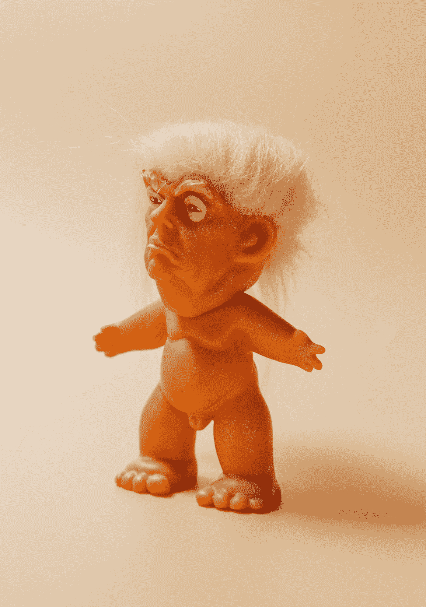

# 击败特朗普将会很容易

> 原文：<https://medium.datadriveninvestor.com/beating-trump-will-be-easy-57cdc2e78929?source=collection_archive---------18----------------------->

这是成为下一任美国总统的路线图。

Photo by [Charles Deluvio](https://unsplash.com/@charlesdeluvio?utm_source=medium&utm_medium=referral) on [Unsplash](https://unsplash.com?utm_source=medium&utm_medium=referral)

乔·拜登面临着选举史上最容易的挑战之一。他所要做的就是击败唐纳德·特朗普。你需要意识到的第一件事是特朗普不是一个聪明人。他是个失败者。除了当真人秀主持人，他尝试过的所有事情都失败了。他的大部分收入来自于把他的名字放在物品上。

他的姓有什么特别的？它也是一个动词。当单词“ [trump](https://www.merriam-webster.com/dictionary/trump) ”被用作动词时，它的意思是“胜过或超越。”当这个词用作名词时，它可以表示“一个可靠的模范人物”重点是，这个词听起来不错。出于这个原因，人们想要建筑物上的字。既然这个词与唐纳德联系在一起，人们会认为他一定带有它的好的属性。他没有。

大多数标有特朗普名字的建筑都不是特朗普建造的。他只是授权了这个名字。特朗普建造的建筑是他父亲弗雷德·特朗普在世时的。正是弗雷德努力积累了唐纳德至今仍赖以为生的财富。

当唐纳德在其他方面都失败后，他转向了真人秀。唐纳德擅长的一件事是推销自己。说到这项技能，他做得很好。另一方面，做生意不是他的专长。关于他的商业技巧的例子，请看特朗普班车(他的航空公司)、他的赌场、特朗普牛排、特朗普冰和特朗普大学。请看这篇[帖子](http://labor411.org/411-blog/here-are-all-of-trump-s-bankruptcies-and-failed-businesses)，了解川普众多失败和破产的更完整列表。参见我的故事， [*特朗普金融成功的真相*](https://medium.com/swlh/the-truth-about-trumps-financial-success-b7892896fa72) 证明了特朗普作为商人的失败。关于特朗普的商业技能，我的理由到此为止。

# 这场运动

如果你是乔·拜登，你意识到你的对手一生都是个失败者，那么事情看起来一定非常好。没那么快。特朗普一直很擅长推销自己。那你是做什么的？很简单。

首先，呆在家里。通过视频链接每周做一次或两次演讲。你的演讲应该集中在你提议的政策上。将你的提议与共和党的涓滴式提议进行比较。在这些演讲中，不要把时间浪费在特朗普不断的愚蠢上。将你本该如何做的事情与现任政府所做的事情进行比较。播放电视和社交媒体广告，指出特朗普的许多失败之处。特别指出他对冠状病毒的灾难性反应。指出他对美国军队的背叛，在俄罗斯慷慨解囊的故事出现后，他没有站出来对抗俄罗斯。尽管《T2 华盛顿邮报》关于俄罗斯支付赏金的指控引起了轩然大波，但川普对普京保持沉默。

忽略特朗普的推文。当被问及推文时，笑一笑，说:“你又来了。”是的，那曾经是里根的回应。无论如何都要做。对许多里根派民主党人和跨党派共和党人来说，这听起来不错。一定要笑。嘲笑特朗普。贬低他，不尊重他。骂他幼稚的行为。这会激怒特朗普。特朗普有一段愤怒时做最愚蠢事情的历史。让他失去平衡。不要和他争吵。你想打你的仗，而不是他的。如果他说了一些必须回应的关于你的事情，列出一个与这个问题相关的关于特朗普的事实。如果你需要帮助列出清单，请看我的故事， [*特朗普不适合当总统的 36 个理由*](https://medium.com/datadriveninvestor/36-reasons-trump-is-not-fit-to-be-president-bf151aadd0d0) 。这个故事发表于 2019 年 8 月，所以它已经过时了。特朗普在过去一年里加快了他的低能行为。如果我今天列出这样一个清单，会有一百多项。我根本没有那种时间。

何时回应的一个例子是，如果特朗普攻击你支持犯罪法案的历史。这里有一个很好的回应:“你是说你要对犯罪手软？如果我 77 岁的记忆没错的话，你告诉警察不要对他们逮捕的人太好。你对和平抗议者使用催泪瓦斯，这样你就可以在教堂前拍照了。”然后，谈谈你对刑事司法的新建议。

竞选工作人员和我们选出的民主党领导人需要全天候出现在所有新闻频道上。他们需要提醒这个国家特朗普总统任期的许多失败。应该强调最近的失败。最重要的是，这些代理人需要提醒美国人民，特朗普的四年任期会有多可怕。需要提醒人们特朗普对美国构成了多大的威胁。我们不希望我们的国家重蹈特朗普许多失败企业的覆辙。

每月在一家主要报纸上写一两次专栏文章。写一写当前政府的政策和失败。

# 副总统

拜登竞选成功的最重要因素是选择合适的竞选伙伴。这个职位的一名候选人遥遥领先于其他人。最好的选择是卡玛拉·哈里斯。我这么说是因为我看了她在参议院委员会对比尔·巴尔的质询。她打败了比尔·巴尔。请看来自 Youtube 的视频。

我是伊丽莎白·沃伦竞选总统的支持者。由于时代精神，我认为她不是竞选伙伴的最佳人选。别误会，伊丽莎白·沃伦一定在内阁。她需要站在一个能为消费者和中产阶级辩护的位置上。她要么是财政部长，要么是司法部长。她甚至可以成为一名优秀的国务卿。她对外交政策的看法是正确的。

哈里斯参议员符合优秀副总统候选人的另一个要求。美国人民对她有信心。他们认识她。这在这场竞选中很重要，因为副总统离总统职位只有一步之遥。你认为美国人民会选择迈克·彭斯而不是卡玛拉·哈里斯吗？我不这么认为。

参议员哈里斯是竞选伙伴的绝佳选择，因为她将非常擅长攻击特朗普。这是竞选伙伴的常见角色。她会摧毁任何对你的攻击。看起来会很有趣。

# 辩论

辩论可能会给特朗普的竞选带来潜在的致命打击。在第一场辩论前大约五天，要求特朗普在辩论前立即进行药物测试。让某人在测试和辩论之间看着他，以确保他没有服用任何药物。一个可笑的想法，对吗？不。记住，我们说的是唐纳德·特朗普。在解读特朗普的行为时正确的解释是最荒谬的解释。

在 2016 年竞选期间，特朗普表示，希拉里·克林顿应该在辩论前进行药物测试，因为他认为她在服用某种药物。听起来很可笑吗？请记住，唐纳德·特朗普通常会转移话题，指责他人的行为与他的行为一模一样。他的主要伎俩是试图把别人降低到他的水平。对川普来说，其他人都和他一样坏。这开始有意义了吗？如果不是，考虑一下一些人站出来声称看到唐纳德·特朗普吸食安得乐。见[汤姆·阿诺德声称唐纳德·川普在*新闻周刊*的《学徒》片场](https://www.newsweek.com/donald-trump-snorted-adderall-apprentice-tom-arnold-noel-casler-1257787)吸食了阿德拉。有视频显示特朗普在一些更疯狂的演讲中抽鼻子。见[推特上有理论解释为什么川普在伊朗演讲](https://www.frontpagelive.com/2020/01/09/trump-slurred-words-and-sniffed-58-times-in-four-minutes-during-iran-address-twitter-was-counting/)中口齿不清并且“四分钟内嗅了 58 次”。在那篇文章中，特朗普滥用 Adderall 的一名目击者表示，他通常会在阅读前服用，因为阅读会让他紧张。我们不应该关心美国总统拿的是什么吗？最重要的是，记住特朗普一直在利用你无法集中注意力的问题大做文章。他说你老糊涂了。他想在你和他之间做个对比。他想让你退出比赛，他想成为一个警觉的人。如果他已经滥用兴奋剂几十年了，你认为他不会在现场辩论前服用兴奋剂吗？你需要挫败他利用药物成功的企图。

 [## 不是数据驱动的政治辩论投资者

### 《纽约时报》在 2020 年 6 月 3 日在线发表了阿肯色州参议员汤姆…

www.datadriveninvestor.com](https://www.datadriveninvestor.com/2020/06/08/the-political-debate-that-has-not-been/) 

我看过特朗普用提词器朗读。他在挣扎。大多数人说他很少读书。我怀疑他有两种残疾。诵读困难和多动症。这两种都是用兴奋剂治疗的。事实上，许多拥有其中一种的人都拥有另一种。参见 [*阅读障碍和多动症:到底是哪个还是两者都有？*](https://www.healthline.com/health/adhd/dyslexia-and-adhd#having-both) 来自 Healthline。如果特朗普受到药物测试的威胁，他可能会服用药物，但测试失败。这对特朗普来说将是一场灾难。或者，他不会服用药物并在辩论中磕磕绊绊。你应该向特朗普展示任何其他患有阅读障碍和多动症的人应该展示的同情心吗？不。记住，这是特朗普。他对美国是个威胁。你的职责是摧毁他和他所代表的一切。别忘了还有一个傻逼世界领袖，他吹嘘自己从不喝酒，却被查出滥用兴奋剂。那个领导人带来了世界历史上最大的灾难。参见[希特勒和他的毒品:纳粹的秘密速度狂热](https://www.rollingstone.com/culture/culture-news/hitler-and-his-drugs-inside-the-nazis-secret-speed-craze-113396/)来自*滚石*。

在辩论中，嘲笑他幼稚的行为。说，“你又来了。”然后，列出他在自己提出的特定主题上的失败。该生气的地方就生气吧。一个很好的例子就是他拙劣的冠状病毒反应。成千上万的美国人因为他的无能而死去。如果你不生气，你应该生气。

在辩论之前，确保人们明白，如果候选人违反了社交距离准则，安保人员将会介入。我们不需要像特朗普对希拉里·克林顿那样的身体恐吓。她应该扇他一巴掌。她本可以逃脱的。你不会侥幸逃脱，所以你必须事先确保不会发生这样的事件。如果你不信任特勤局，就带上你自己的安保人员。尽管听起来很荒谬，但如果特朗普再次做出这样的行为，美国人民会希望你让他残废。你不会想在国家电视台上面对一个在任的总统。提前制定好规则，如果规则被打破，要有一个计划。我相信你可以鞭打他的屁股，但这样的事件应该不惜一切代价避免。

体罚川普证明不了什么。我肯定鲁思·巴德·金斯堡会踢他的屁股。想想吧。金斯伯格大法官足够坚强，多次战胜癌症，在治疗期间没有耽误工作。唐纳德·特朗普不能为国家效力，因为他的脚受伤了。由于缺乏更好的词，特朗普是一个“娘娘腔”。

副总统辩论将会很重要。你已经七十七岁了。你从脑癌中活了下来。人们想知道，如果你在担任总统期间去世，新总统将能够接任并领导这个国家。如果卡玛拉·哈里斯是你的竞选伙伴，几乎可以肯定她会在辩论中大败彭斯。

我记得哈里斯参议员和其他人一样也会犯错。在与你的一次辩论中，我认为她在反对你的部分论点上犯了一个可怕的错误。但是她提出了另一个真正的问题。当我考虑到参议员的全部工作时，我可以对她另眼相看。她会给你的竞选带来难以置信的价值。

# 结论

击败特朗普很容易。你要做的就是嘲笑他，骂他，不尊重他，嘲讽他。换句话说，像对待孩子一样对待他。不要和他陷入泥淖，也不要进行骂人的比赛。当他表现得像个校园恶霸时，你需要表现得像个总统。让特朗普保持原位。他是一个冒名顶替者和骗子。不断提醒美国人民这一点。

考虑到所有这些因素，你可以给他起一个绰号。但是只说几次。你应该有机会在辩论中使用这个昵称。叫他本尼迪克特·唐纳德。他一直在利用一切机会出卖美国人民。最近的一次出卖是美国士兵的赏金。如果他说一个故事是骗局，你就说，“伙计，关于你的骗局比关于大脚怪的还多。”贬低他。就这么简单。他甚至会帮你。特朗普每天都在贬低自己。让白痴成为白痴，你就会成为总统。就这么简单。

**进入专家视角—** [**订阅 DDI 英特尔**](https://datadriveninvestor.com/ddi-intel)