# CNN 美女评委:你和斯嘉丽·约翰逊相比如何？

> 原文：<https://medium.datadriveninvestor.com/beauty-evaluator-with-cnn-how-do-you-compare-to-scarlett-johansson-d4f4cddce010?source=collection_archive---------2----------------------->

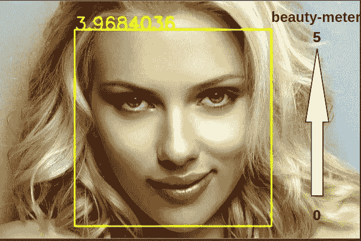

(rights: [source](https://lemagcinema.fr/forum/index.php?topic=56274.0))

> 对自己的造型自信吗？你可以试试我们的模型。

这篇文章提供了一种评估你面部外貌的方法。在整篇文章中，我们将解释使用了什么度量、数据集(标签)。我们还将展示训练后得到的不同滤镜，看看构成美(至少在这个特定标准内)的不同成分是什么。可以找到源代码让你自己尝试对自己的吸引力进行评估，所以一定要通读这篇文章，以免错过任何潜在的重要信息。

## 1]数据集分析

首先，数据集是在一篇论文中找到的(文章末尾的链接)。这里有几个标注，供你掌握标注的标准。

数据的分布/样本如下(图 1):

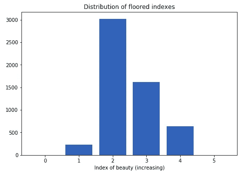

fig.1 (rights: own)

首先对于男性来说:

*   这是相对有吸引力的第一个数据点

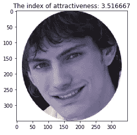

(rights: paper)

*   这是第二个数据点，关于一个稍微不那么有吸引力的人

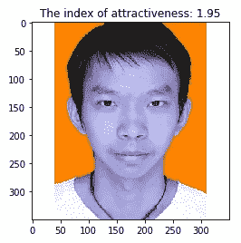

(rights: paper)

现在对女性来说:

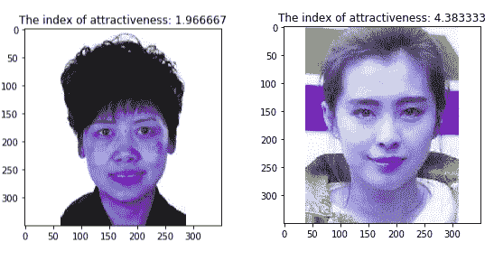

(rights: paper)

请注意，数据集中的大部分图片都是亚洲人种的。这意味着吸引力的特征最有可能是亚洲人的特征(美丽标准)。此外，面部是在侧面位置拍摄的，这意味着面部对称等因素可能会发挥作用。

## CNN 的架构

我们决定采用以下架构来完成我们的任务:

*   六个 2d 卷积层，填充相同(因为不用担心边界)，一层最多 512 个过滤器
*   六个 2d 最大池
*   两个 FC 层
*   我们使用 MSE 作为损失函数

注意，在最后的卷积层中，过滤器的尺寸下降到 5×5，因此所捕获的不同类型的特征将具有 5×5 像素的尺寸。

在 40 个时期之后，我们达到了验证损失 **0.4086** (MSE 损失)，这是训练历史。(图 2)

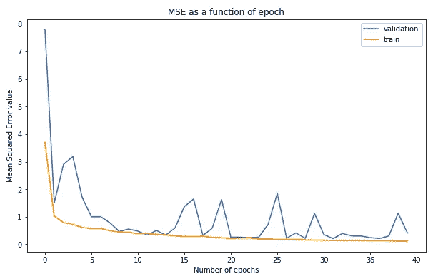

fig.2 (rights: own image)

## 3]申请结果

以下是模型的一些推论结果

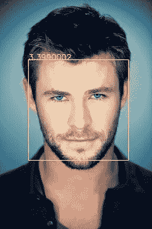

Chris Hemsworth

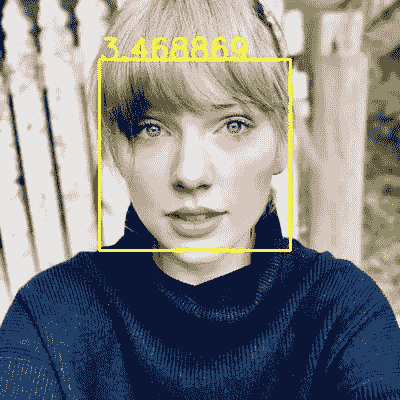

Taylor Swift

同样，源代码可以在我的 [Github](https://github.com/miki998/beauty_evaluate) 上找到，这样你也可以尝试一下。

代码简单如下:

```
python3 use.py path_to_image
```

会有 README.md 供你跟随。

## 4]用于美容的功能？

让我们来看看在这 40 个时代之后训练出了什么样的过滤器。以下是在最后一个卷积层中找到的一些过滤器/权重。(图 4)

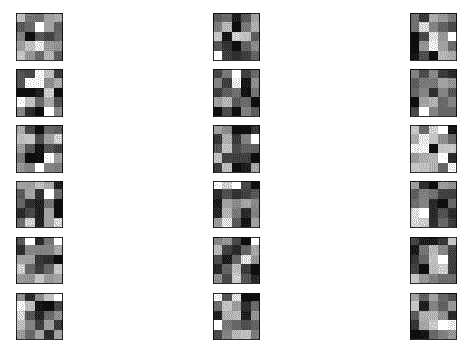

fig.3 (rights: own)

在这张特定的图像上(图 4)，我们给出了第 10 层(图 5)和第 15 层(图 6)的输出。

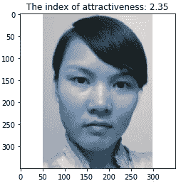

fig.4 (rights: paper)

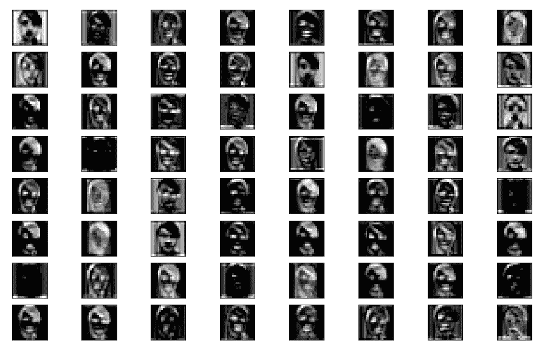

layer 10 conv2d fig.5 (rights: own)


layer15 conv2d fig.5 (rights: own)

第 10 层和第 15 层过滤图像的一些注释:

*   颜色的对比是我们需要注意的(因为我们不知道 FC 层如何加权这些特征)
*   我们看到，在那些过滤器中考虑了诸如眼睛、嘴、下颚线等特征
*   根据该模型，发型也可能在美容特征方面发挥作用。
*   然而，一些过滤器不是有用的/信息载体，因为我们可以看到一些几乎黑暗的输出图像。在这种情况下，我们可以去掉这些神经元来加快推理时间(例如通过修剪)

图片来源，文件来源:

*   [https://arxiv.org/pdf/1511.02459.pdf](https://arxiv.org/pdf/1511.02459.pdf)

非常感谢您的阅读，请考虑关注我们的[网站](https://aitechfordummies.com/#) +我的[媒体](https://medium.com/@michaelchan_2146) +我的 [Github](https://github.com/miki998) 以获取更多文章和源代码！