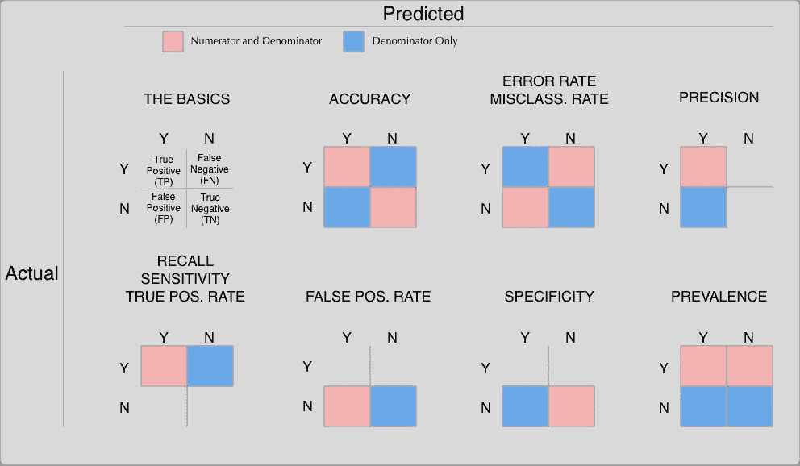

# 因为我每次都会忘记

> 原文：<https://medium.datadriveninvestor.com/because-i-forget-every-time-73a49874da98?source=collection_archive---------30----------------------->

## 混淆矩阵的简要指南

你知道那个你总是忘记名字的熟人吗？然后你在街上看到他们，不得不弄清楚你和他们的关系，以及你自己个人的冷静程度，是否能支撑起一个“*嘿你！*”，一个“*嘿朋友！”看看这只猫拖进了什么！*”。

> 我向所有读到这篇文章的人道歉，我以前曾以这种方式问候过他们。

las，有三个亲爱的朋友，他们的名字我永远也不会记得，这是一种深深的耻辱。精确度，回忆，特异性。所有的记忆术、词典和死记硬背都白费了——我根本记不住哪个是哪个。我甚至承认有时会被真实的阳性率弄得不知所措。

也许这不是你所遭受的痛苦。在这种情况下，笑一笑，然后离开。但是，我们都知道混淆矩阵这么叫是有原因的。如果你和我一样，你会想把下面的图表加入书签，开始一个漫长而缓慢的过程，在工作会议上听起来好像你了解自己的模型。

If you’re like me, you’ll want to bookmark this so you can refer to it at least once a week.

请让我知道我是否犯了任何错误，或者如果你想看到额外的分数添加到这个图表。