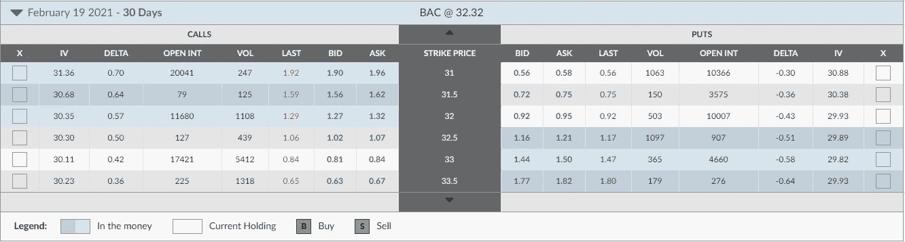
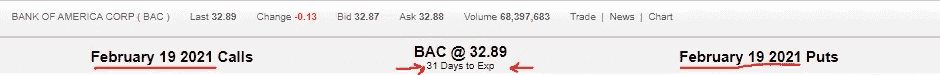
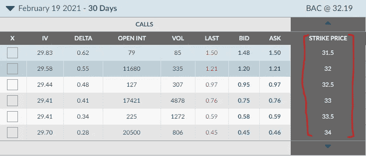
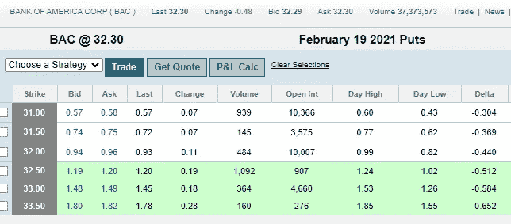
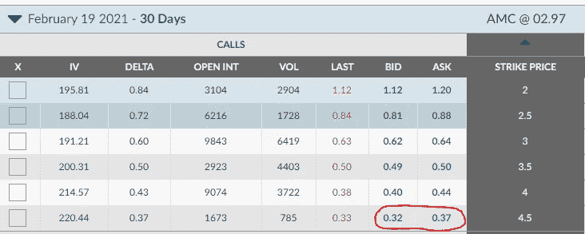
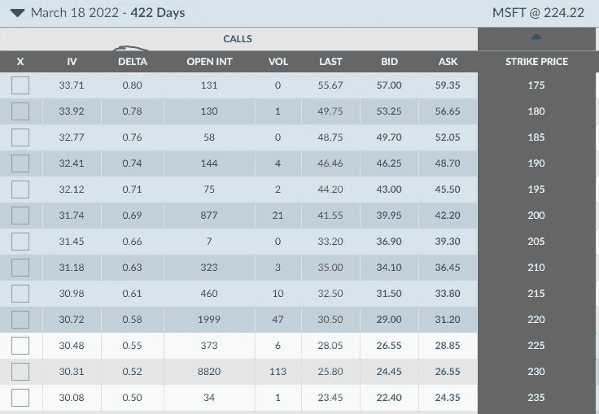
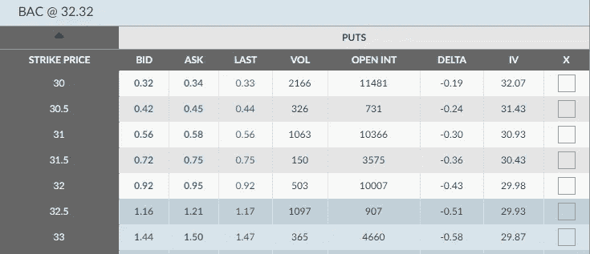

# 成为持续盈利的交易者——使用期权掌握 3 种交易策略

> 原文：<https://medium.datadriveninvestor.com/become-a-consistent-and-profitable-trader-3-trade-strategies-to-master-using-options-7f5b9d31c22e?source=collection_archive---------2----------------------->

## 期权介绍和 3 种利用期权获利的方法

Photo by [Thought Catalog](https://unsplash.com/@thoughtcatalog?utm_source=medium&utm_medium=referral) on [Unsplash](https://unsplash.com?utm_source=medium&utm_medium=referral)

# 积累你的财富

积累财富需要一致性。当然，你可以凭借一些运气、技能和/或知识快速致富，但对我们大多数人来说，这需要耐心、自律和时间。往往是一场马拉松，需要几年到几十年才能完成。在之前的一篇文章中，我分享了我如何开始发现股票和期权交易的一致性。虽然我肯定不是最优秀的交易者，但我已经坚持多年了，尽可能多地从别人那里吸取经验，运用适合我风险承受能力的策略。不管这意味着尽早止损，还是花几天时间坐以待毙，看着事情找到一个范围，我已经更好地坚持我的交易计划了。

今年，我决定在 2021 年掌握这三种交易，尽可能从市场和我的股票头寸中榨取更多的利润:

*   覆盖呼叫
*   穷人的预约电话
*   看跌信用利差

**如果你以前从未使用过期权，这篇文章将开始解释它们是什么，并向你展示一些使用它们的简单策略。**

**免责声明**:本文涵盖的所有三种技术都使用股票期权来获得额外的市场灵活性，而不仅仅是买卖股票。在深入讨论之前，让我先说一下**选项可能是不稳定的，会给你带来额外的风险。它们并不符合每个交易者的风险承受能力。在交易期权之前，要明白你将进入什么样的境地，并做好你的尽职调查。文章中的例子不是贸易建议。它们是为了教育。**

**如果需要理财建议，寻求专业人士。**

# 什么是股票期权？

Options Chain ([ally.com](https://investor.tradeking.com/Modules/Research/OptionChain/optionChain.php))

期权对新手来说很吓人，因为有很多术语和数字。从一个简单的定义开始，股票期权是一份赋予投资者权利*而非义务*的合同，以约定的**价格**和**日期**买卖股票。你可能会看到/听到人们交替使用术语 ***合同*** 和 ***期权*** 。例如，“我有 10 份美国银行的合同”可能意味着我有 10 份期权。

一份期权合约占标的股票的 100 股。当你看一个期权的价格时，你看到的是每股的*溢价，需要将这个价格乘以 100。例如，定价为 0.50 的期权将花费 50 美元，因为 0.5x 100 = 50。[期权定价模型](https://www.investopedia.com/terms/o/optionpricingtheory.asp#:~:text=Option%20pricing%20theory%20uses%20variables,their%20strategies%20to%20maximize%20profits.)通常很复杂，要考虑几个因素。*

期权合约有两种， ***称为*** 和 ***称为看跌期权。*** 后面我会单独多讲讲。现在，只要记住一个*看涨期权*就是押注股票会上涨。看跌期权是对股票会下跌的押注。在讨论合同类型的具体细节之前，要理解，选项比我在本文中所能解释的要多得多，但是我将向您介绍它的要点，以便您稍后能够掌握这些策略。让我们从两个**关键术语**开始:

*   到期日期
*   执行价格

## 到期日期

Options Expiration ([ally.com](https://investor.tradeking.com/Modules/Research/OptionChain/optionChain.php))

期权有风险的原因之一是它们是在特定日期到期的合同。这就是所谓的[截止日期](https://www.investopedia.com/terms/e/expiration-date.asp)。例如，从今天，01/19，我可以去我的经纪人那里买一个 2021 年 2 月 19 日到期的期权。在某些情况下，有效期会持续几年。

如果你买了期权合约，时间对你不利。如果你卖空期权合约，时间会对你有利。了解到期日很重要，因为它有助于交易者通过[时间价值](https://www.investopedia.com/terms/t/timevalue.asp)对合约定价。时间影响期权的价格。这意味着购买一个有很多时间(远未到期)的合同将比购买一个即将到期的合同更昂贵。当你思考这个问题时，它是有意义的，因为当它有更多的时间支持时，基础股票有更多的机会向你想要的方向移动。时间价值用于各种期权定价模型，如[布莱克-斯科尔斯模型](https://www.investopedia.com/terms/b/blackscholes.asp)。

## 执行价格

BAC Call Options Strikes([ally.com](https://investor.tradeking.com/Modules/Research/OptionChain/optionChain.php))

记住，期权让你在约定的价格和日期买入或卖出。 ***成交价格*** 为约定价格。它决定了一个期权是否应该被执行**。它是交易者预计股票在到期日之前高于(当交易看涨时)或低于(当交易看跌时)的价格。例如，如果我认为 BAC 的股票到 2019 年 2 月将超过 34 美元，我将购买一个行使价为 34 的 ***看涨*** 期权。如果 BAC 的价格在 2019 年 2 月高于每股 34 美元，我的看涨期权是 [*价内*](https://www.investopedia.com/terms/i/inthemoney.asp) ，我可以行使它以每股 34 美元的价格购买 100 股股票。假设股价是 35 美元，我的罢工是 34。我刚刚赚了 100 美元，减去我购买期权时支付的溢价。**

**使用上面的图片，假设我在 0.45 买入 2/19 看涨期权，价格为 34。这意味着我今天要支付 45 美元(100 x 0.45)。如果股价在 2 月 19 日是 35 美元，我就可以行使合约以每股 34 美元的价格购买 100 股股票。然后我可以以 35 美元持有或出售它们，从交易中获得 100 美元(3500–3400 = 100)。但由于我最初支付了 45 美元，我实际上只赚了 55 美元(100–45 = 55)。**

**[**注意，美式期权可以在到期日**](https://www.investopedia.com/terms/a/americanoption.asp) **之前的任何时候行权。****

**如果股价在 2 月 19 日低于 34 美元，我的看涨期权就失效了**一文不值**。它没有价值，因为对我来说，以市价购买股票比行使期权以每股 34 美元购买 100 股股票要便宜。例如，如果 BAC 在 2 月 19 日是 33.50，而我在 34 的时候拥有一个看涨期权，如果我想买 100 股，我将简单地通过我的期权支付 33.50 的市价而不是 34。行使以 34 英镑而不是 33.50 英镑购买 100 股股票的期权是给某人免费的钱！**

**如果你不想真的买股票，就试着以高于你支付的溢价卖出期权合约，就像你卖出股票一样。记住你没有义务履行合同。价内合同总会有一些内在价值。**

# **什么是看跌期权？**

****

**BAC Put Options ([ally.com](https://investor.tradeking.com/Modules/Research/OptionChain/optionChain.php))**

**在前面的例子中，我谈到了使用*调用*。记住，看涨期权给予合同持有者在特定日期以特定价格购买标的资产的权利。购买看涨期权实质上是押注标的股票会升值。**

**与之相对的是一个 ***放*** 。看跌期权合同赋予合同持有者在特定日期以特定价格卖出标的资产的权利。购买看跌期权实质上是押注标的股票会贬值。**

**如果股票价格低于执行价，看跌期权就有效。注意图像中的 BAC 是 32.30。由于这低于 32.50 的执行价，32.50 的看跌期权是*价内*期权，可以行使以 32.50 的价格卖出 100 股，潜在地保护交易免受损失。例如，假设我拥有 100 股 BAC 股票，每股 32 美元。如果我认为价格会在 2019 年 2 月跌至 32 美元以下，我可以在到期日买入一份行权价为 32 的看跌合约。那叫做[防护放](https://www.investopedia.com/terms/p/protective-put.asp)。使用上面的图像，让我们说我在 32 罢工时为看跌合同支付 95 (100 x 0.95 = 95)美元。**

**在 2 月 19 日，价格是 30 美元。我可以行使我的看跌合约，以 32 美元卖出我的 100 股股票，保护自己免受 200 美元的损失。当然，由于我在购买合同时支付了 95 美元的溢价，在这种情况下，我只为自己节省了 105(200–95 = 105)美元。看跌期权有点像保险。**

> **现在你已经知道了一些关于期权的基本术语，让我们来谈谈策略。**

# **覆盖呼叫**

**如果你认为一只股票将在一段时间内区间交易，备兑买入策略是有用的。这是我已经开始使用的策略，以从我的股票头寸中获得额外收入。由于期权合约占 100 股，所以在尝试这种策略之前，你需要 100 股标的股票。如果你有一个小账户，看看有期权的便宜股票，比如 AMC，来学习这个策略。**

**在备兑看涨期权策略中，我不是买入看涨期权，而是针对我持有的股票卖出看涨期权。由于我拥有这些股票，如果我卖出的看涨期权在价内到期，我就没有责任供应我不拥有的股票，因此它是*覆盖的*。如果我没有持有这些股份，这就叫做*卖出裸期权*。**

**我举个例子。假设我以每股 3 美元的价格持有 100 股 AMC 股票，我认为价格将在 2021 年 2 月 19 日低于每股 4.50 美元。我可以针对我的股票卖出一个看涨期权(也称为卖出开仓期权)，以获取期权合约的溢价。**

****

**AMC Call Options ([ally.com](https://investor.tradeking.com/Modules/Research/OptionChain/optionChain.php))**

**看上面的图片，假设我今天以 35 美元的价格卖出一个 4.50 美元的看涨期权。02/19，股价只有 3.50。这意味着合同到期后一文不值，我保留所有 35 美元。**

**如果到期时 AMC 的价格是 5 美元，而我还没有退出卖空交易，那么谁拥有我卖出的合约，谁就可以行使合约，以 450 美元的价格买入我的 100 股股票。这意味着我的收益是有限的。然而，在到期前的任何时候，我都可以 ***买入并关闭*** 我*写的*合约，这样我就不会冒失去 100 股的风险。**

## **尝试这个策略之前要考虑什么？**

**在销售备兑看涨期权之前，我会考虑几件事情:**

**首先，我以执行价卖出，无论如何我都会卖掉股票。就像在这个例子中，如果当我的合同到期时，AMC 等于或高于 4.50，我不会对失去我的 100 股股票感到不安，因为我决定在购买 AMC 股票之前卖掉它。**

**第二，我试图在隐含波动率(IV) 高的时候卖出。在尝试任何期权策略之前，你必须了解 IV，否则你更容易亏损。隐含波动率本质上是市场对证券价格变动的预测。通常情况下，当股票预期会大幅波动或目前正在大幅波动时，IV 会飙升。注意上图中 4.50 罢工的 IV 为 220.44。这是一个很高的 IV，部分原因是 AMC 在两天内从 2.20 升至 3.30 以上。**

**了解 IV 很重要，因为高 IV 会抬高期权的价格。在 IV 高的时候买期权是不明智的。如果股票价格不像预期的那样变动，IV 就会下降，期权价格也会随之下降。这被称为 IV Crush，在收益方面经常发生。常见的是看到期权价格和 IV 围绕收益增加，因为市场预期会有大的变动。即使标的股票上涨，如果涨幅没有预期的大，IV 也会下跌。反过来，期权的价格受到挤压，因此 *IV 受到挤压*。即使基础价格朝着预期的方向移动，你也会亏损！IV 高时卖出；IV 低的时候买。**

# **穷人的预约电话**

**这是另一种获取期权溢价的策略。就像备兑买入一样，[穷人的备兑买入](https://www.tastytrade.com/definitions/poor-man-covered-call)包括卖出溢价买入。除了在这种情况下，不要拥有 100 股，使用 LEAPS。LEAPS 代表 ***长期股权预期证券*** ( **LEAPS** )。它们是到期日超过一年的期权合同。**

## **为什么要用 LEAPS 而不是 100 股？**

**如果我想在像微软(MSFT)这样昂贵的股票上做长期投资，我需要以目前的价格为 100 股支付 22，434 美元。我没有多余的 23000 美元。通过使用 LEAPS 而不是股票，我拥有了控制 100 股的杠杆，而实际上并不需要购买 100 股。因此得名，*穷人的盖叫法*。**

****

**MSFT Call Options ([a](https://live.invest.ally.com/research/stocks/BAC/options)lly.com)**

**如果我相信 MSFT 的股价不会随着时间的推移而大幅下跌和上涨，我可以获得 5500-6000 美元的内部跳跃，这取决于[想要的](https://www.investopedia.com/terms/d/delta.asp)**。这比我买 100 股要花 23，000 英镑要便宜得多！****

****为了完成交易，一旦我拥有 LEAPS，我会在条件合适时卖出即将到期的看涨期权，就像我卖出备兑看涨期权一样。这实际上造成了看涨期权的价差，因为我同时做多看涨期权和做空看涨期权。理想的情况是，卖空期权到期时将变得一文不值，这样我就可以获得为它支付的所有溢价。****

## ****尝试这个策略之前要考虑什么？****

****在尝试穷人的备兑买入之前，您需要理解选项 delta(以及我在本文中介绍的所有其他内容)。我通常买德尔塔在 0.80 左右的 LEAPS。Delta 是比较资产价格变化与其衍生产品[价格变化的比率。**看涨期权的 delta 为正，看跌期权的 Delta 为负**。例如，当期权的 delta 为 0.80 时，假设所有其他因素保持不变，则标的股票每移动 1 美元，期权价格将变化 0.80 x 100 美元。按照这种逻辑，一只股票的 delta 为 1.0。](https://www.investopedia.com/terms/d/derivative.asp)****

****当一个期权在钱的深处时，delta 接近 1.0。当期权离开货币时，delta 越来越接近 0。这意味着随着股价的上涨，LEAPS 价格的上涨速度将快于卖空的价外看涨期权。例如，如果我以 0.80 的 delta 买入 MSFT leaps，并以 0.30 的 delta 卖出本周到期的看涨期权，MSFT 1 美元的波动将使我的 leaps 增加 80 美元，我的空头看涨期权仅增加 30 美元。****

****请记住，delta 会随着基础股票价格的变化而增加或减少。如果 MSFT 的价格明天涨到 175，而不是 0.80，我的跳跃将会有 0.55 左右的 delta。****

# ****看跌信用利差****

****我想讨论的最后一个策略是看跌信用利差。这种策略是一种看涨策略，旨在捕捉你认为会上涨的股票的期权溢价。与其买看涨期权，让时间与你作对，不如开一个看跌信用价差，让时间站在你这边。****

********

****BAC Put Options ([a](https://live.invest.ally.com/research/stocks/BAC/options)lly.com)****

****例如，我认为 BAC 将达到每股 34 美元。我可以在 31 点卖出一份看跌期权，在 30 点买入一份看跌期权，获得 24 美元的信用(57–33 = 24)来打开价差。理想情况下，这两笔钱都将到期，这样我就可以保留 24 美元的信用额度。****

## ****尝试这个策略之前要考虑什么？****

****除了考虑隐含波动率、delta 和到期日之外，了解做空看跌期权的风险也很重要。做空看跌期权时，如果合约得到执行，我需要支付 100 股股票的价格。这意味着最好只对我实际想持有的股票进行看跌期权信用价差交易，以防我的合约被执行。****

****此外，我只卖执行价，实际上我愿意支付。继续这个例子，我打开 BAC 上的 31/30 看跌期权信用利差，价格下跌到 30.50，在到期日将我的 31 看跌期权*置于价内*。如果这份合同得到执行，我就可以以每股 31 美元的价格购买 100 股股票。因为我认为每股 31 美元是一个公平的价格，我想拥有 BAC，我可以买得起 100 股，我愿意冒这个险。****

****如果价格下跌足够多，使 31 和 30 的价格都上涨，我可以行使 30 美元的保护性看跌期权来弥补交易的损失。例如，假设当我的差价到期时，BAC 的股价是 28。我会在 31 买入 100 股，在 30 卖出。****

> ****恭喜你学会了三种选择策略！****

# ****最后的想法****

****记住学习这些策略需要时间，就像积累财富需要时间一样。虽然期权可能有风险，但了解如何使用它们可以增加你在股市中利润的一致性。希望这篇文章可以作为一个起点，让你开始研究选择。无论你是想尝试备兑买入，穷人的备兑买入，还是看跌信用价差，确保你遵循你的交易计划，并根据你的风险承受能力采取行动。和我一起度过 2021 年，专注于做得更好！****

****今天就开始在 investopedia 上学习期权交易吧！****

**** [## 期权如何为买卖双方服务

### 期权是基于股票等基础证券价值的衍生金融工具。安…

www.investopedia.com](https://www.investopedia.com/terms/o/option.asp) 

**免责声明**:本文中使用的所有例子都不是交易建议，都具有严格的教育意义。使用金融市场风险自担。如果你需要财务建议，寻求专业认证。交易对我来说只是一种爱好，不是我的职业。

# 谢谢大家！

*   *如果你喜欢我的作品，* [*关注我的《中》*](https://medium.com/@erickleppen) *了解更多！*
*   [*通过订阅*](https://erickleppen.medium.com/membership) 获得对我的内容的完全访问和帮助支持！
*   *我们连线上* [*LinkedIn*](https://www.linkedin.com/in/erickleppen01/)
*   *用 Python 分析数据？查看我的* [*网站*](https://pythondashboards.com/) ！

[**—埃里克·克莱本**](http://pythondashboards.com/)

 [## 埃里克文章的终极指南

### 我的所有内容按主题组织…

erickleppen.medium.com](https://erickleppen.medium.com/the-ultimate-guide-to-erics-articles-d32df8241353)****