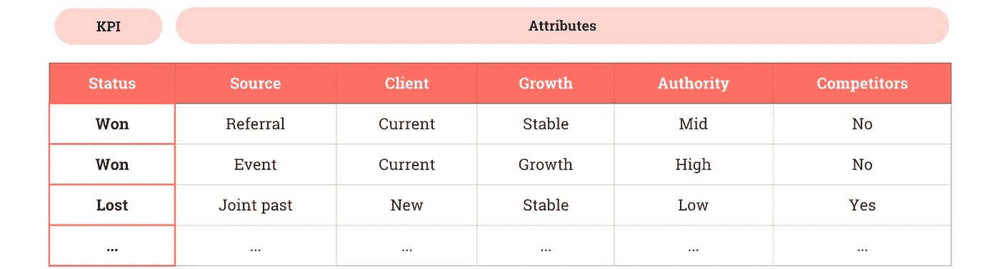
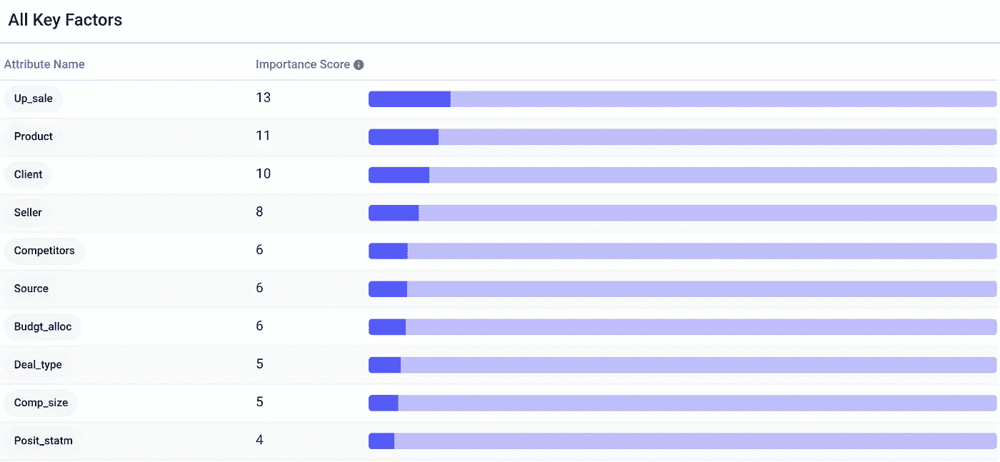
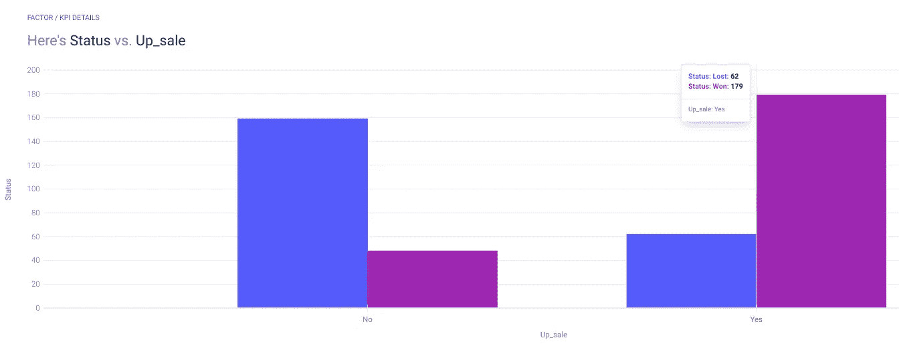
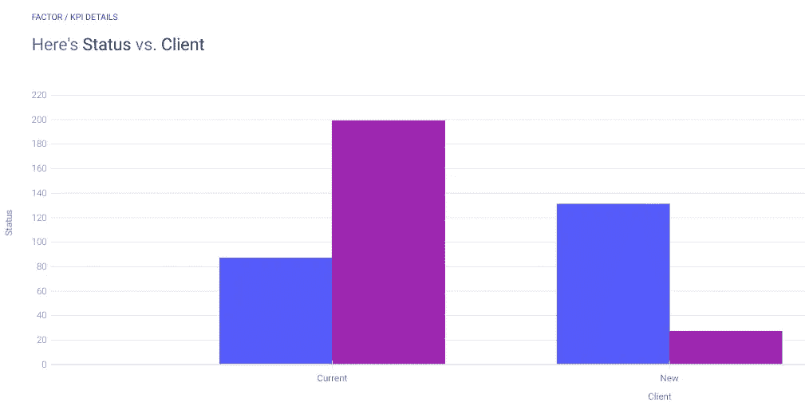
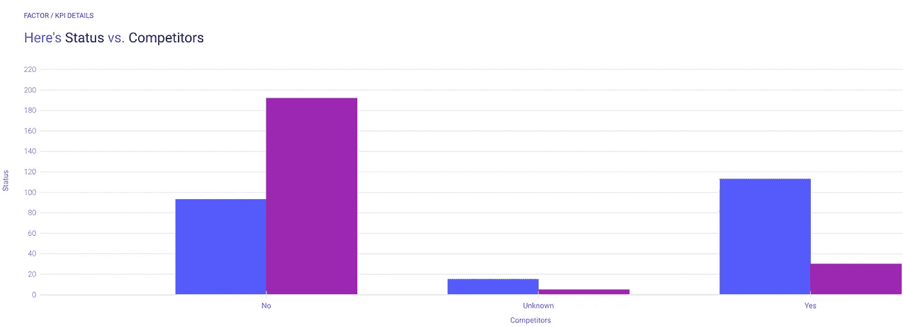
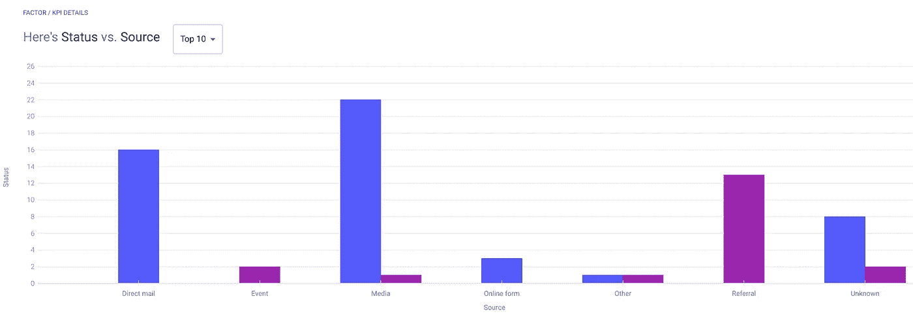
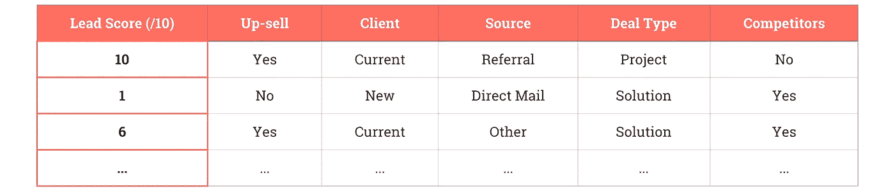

# 成为数据销售精英

> 原文：<https://medium.datadriveninvestor.com/become-an-elite-sales-closer-with-data-73331d23ebf3?source=collection_archive---------24----------------------->

## 数据的艺术。


Photo by [Joshua Rawson-Harris](https://unsplash.com/@joshrh19?utm_source=medium&utm_medium=referral) on [Unsplash](https://unsplash.com?utm_source=medium&utm_medium=referral)

我以前探索过如何采用一种[数据驱动的方法来达成销售交易](https://medium.com/datadriveninvestor/optimizing-conversions-by-finding-insights-in-sales-data-e018933cee57)，给定城市、销售媒介、机会大小和销售迭代等属性。

在本文中，我将采用类似的方法来优化 B2B 销售，这次使用的数据来自一家拥有 448 个实例的软件公司，由 22 个属性描述，包括对客户的关注、范围清晰度、战略价值等等。

俗话说:“条条大路通罗马。”您的销售数据可能看起来完全不同，但这表明可以使用各种数据源来实现相同的结果，并建立准确的模型来预测销售。

# 数据

实际上，我们的[数据](http://www.salvirt.com/b2bdataset/)是用分号分隔的，而不是逗号(就像在标准 CSV 文件中一样——或者是逗号分隔的值文件)。我们可以用 Python 一行程序来解决这个问题:

```
import pandas, csv; pandas.read_csv('[http://www.salvirt.com/wp-content/uploads/2016/08/Salvirt_B2B_ML_dataset.csv'](http://www.salvirt.com/wp-content/uploads/2016/08/Salvirt_B2B_ML_dataset.csv'), sep=';').to_csv('data.csv', index=False,quoting=csv.QUOTE_NONE)
```

除此之外，我们的数据采用了正确的格式，用属性描述了一个 KPI，`Status`。这里有一个小的数据样本:



# 分析

现在，我们可以将数据上传到 [Apteo](http://apteo.co) 进行分析。首先，让我们看看“关键因素”，或者说对我们的 KPI 影响最大的属性。



最重要的因素是`Up_sale`，它描述了销售是否是现有产品的升级。直觉上，这是有道理的。说服一个你已经卖给他东西(比如软件的基本版本)的人升级要比说服一个你从未见过面的人购买东西容易得多。

[](https://www.datadriveninvestor.com/2020/09/21/data-apocalypse-later/) [## 数据启示录后期|数据驱动的投资者

### 思考一个不可知的未来并在其中运作是很困难的。但是数据驱动确实有助于解决这个问题。数据是…

www.datadriveninvestor.com](https://www.datadriveninvestor.com/2020/09/21/data-apocalypse-later/) 

点击`Up_sale`，我们可以看到事实确实如此，这就是为什么追加销售是如此伟大的战略:它比结束一个“更冷”的线索更有可能奏效。



另一个关键因素是`Product`。深究细节，我们可以看到有些产品的转化率比其他产品高，这也有直观的道理。事实上，在任何一家拥有大量产品的公司，有些产品会受到很多人的喜爱和推荐，而另一些则不会。

据说，一个好的销售人员可以“把冰卖给爱斯基摩人”，但如果产品只是一个很好的报价，那就更好了。

下一个最重要的因素是`Client`，或者简单地说，客户是新客户还是当前客户。这与`Up_sale`相似，因为与你有关系的潜在客户更有可能转化。



`Seller`指售货员。更有经验、更了解产品、更多行业关系或更有才华的销售人员更有可能达成交易。除了雇佣优秀的销售人员之外，从这些具体的销售人员数据中并没有什么普遍的见解。

`Competitors`是否存在与该销售线索相关的已知竞争对手。正如你可能已经猜到的，没有竞争对手的线索更有可能转化，但这种差异是惊人的。有竞争对手的交易胜率约为 20%，而没有竞争对手的交易胜率约为 67%。



最后，让我们看看`Source`(我不会详细讨论所有 22 个属性，所以通过将数据上传到 [Apteo](http://apteo.co) 来检查其余的属性)。



请注意，因为有许多不同的来源，每个类别的实例并不多，所以我们不一定能根据这些数据做出强有力的判断。

但是，我们可以看到，`direct mail`来源的销售线索失败率为 100%，有 16 次失败，而`referral`来源的销售线索成功率为 100%，有 13 次成功。如果你不得不在两者之间区分优先次序，选择是显而易见的。

# 实践中的洞察力

有了这些见解，是时候将它们付诸实践，创建一个数据驱动的销售引擎了。

首先，我们可以轻松预测一笔新交易是赢是输，并据此对交易进行优先级排序。然后，我们可以根据赢得交易的可能性来分配“销售线索得分”。



例如，我们知道，没有竞争对手的向上销售当前客户，以及最初通过推荐获得的客户，被关闭的可能性非常高，而有竞争对手的、通过直邮获得的、项目类型为“解决方案”的新销售线索被关闭的可能性很低。

销售人员的时间和精力现在可以相应地进行优先排序。

有关数据驱动的销售和营销的更多信息，请查看我关于[商业分析数据挖掘](https://medium.com/dataseries/data-mining-for-business-analytics-6a291098b825)和[转化率优化](https://medium.com/datadriveninvestor/optimizing-conversions-by-finding-insights-in-sales-data-e018933cee57)的文章。

**进入专家视角—** [**订阅 DDI 英特尔**](https://datadriveninvestor.com/ddi-intel)