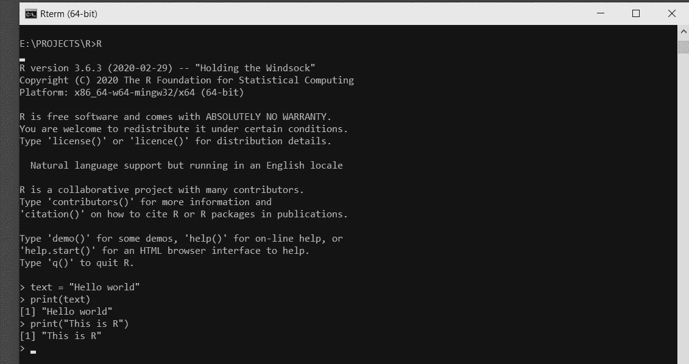
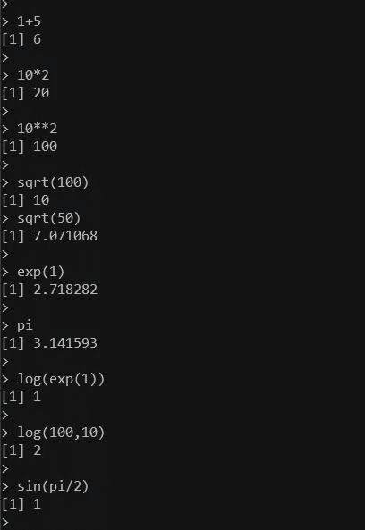
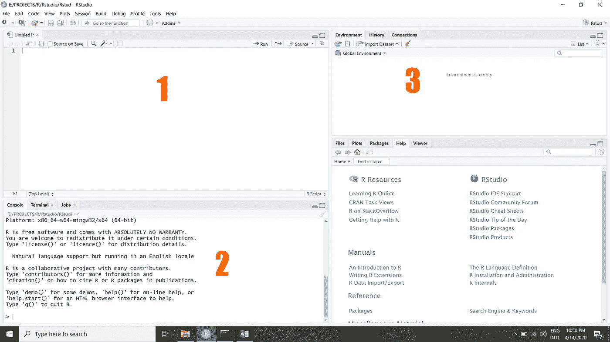
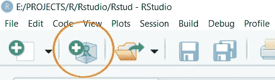
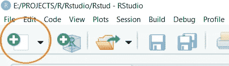
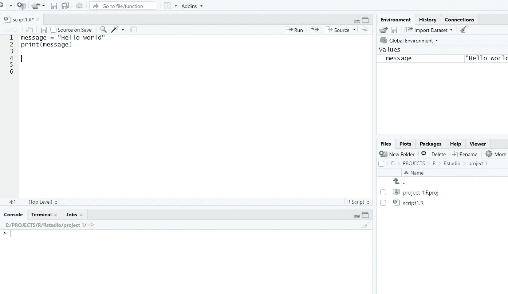

# R 和 Rstudio 初学者指南

> 原文：<https://medium.datadriveninvestor.com/beginner-guide-to-r-and-rstudio-27d9b65475e9?source=collection_archive---------3----------------------->

# R 简介

r 是一种编程语言，用于分析统计信息，使用图形表示将其可视化，**报告**，以及**模型数据。**这种编程语言根据两位作者(Robert Gentleman 和 Ross Ihaka)的名字字母命名为 R。

r 还允许与用 C、C++、.Net、Python 和 FORTRAN 语言来提高效率。

r 是研究人员、数据分析师、统计学家和营销人员用来检索、清理、分析、可视化和呈现数据的最重要的工具之一。

r 提供了各种各样的统计分析，包括:

线性和非线性建模，

经典的统计测试，

时间序列分析，

分类，

聚类，

大数据分析，

数据挖掘技术

# R 的安装

r 是开源的，它有所有主流操作系统的版本。要安装 R，我们可以从 https://cloud.r-project.org 的网站[获得，或者从终端使用命令。](https://cloud.r-project.org/)

我很确定你可以根据你正在使用的操作系统来管理这个安装，我不打算描述它，因为它只是一个简单的修复。甚至你可以在网上找到许多指导方针。但是，如果您将程序安装到自定义位置，而不是操作系统的默认安装位置，请确保在安装后将 bin 文件夹的路径添加到系统 path 变量中，以便在命令提示符下使用 R。

## 入门指南

一旦你在你的计算机上安装了 R，有几种方法可以让你掌握 R 编程。

1.您可以使用开始菜单中的默认快捷方式获得 R 控制台，并开始 R 交互编码。

2.您可以进入命令提示符，键入 R 并获得控制台和启动。

3.你可以用。r 扩展名，并在命令提示符下使用**Rscript<filename>命令运行它。**

4.您可以安装 R studio IDE 并在那里开始编码。

R 是一种解释语言，所以当你在 R 控制台中使用 R 时，它基本上是通过问答模型工作的。你输入一行命令，然后按“回车”键。然后程序执行那一行，打印结果(如果有的话),如果需要的话，要求更多的输入。

这意味着您可以在编写完一行代码后立即看到输出，并转到下一行。这是一个优势，因为这样你就不太可能在程序中间出错。

使用 Rstudio IDE 时，您可以使用 **ctrl+Enter** 来运行您的脚本

如果一个命令太长，无法放在一行中，则使用“+”作为继续提示。

要退出控制台，您可以使用 **q()** 命令

r 区分大小写。

R 中的默认提示字符是>

如果你在命令行上看到，这意味着它已经准备好接受指令了。

如果由于任何原因您丢失了提示，尝试 **ctrl + z** 恢复就绪状态。

在 R 中评论

您可以使用 **#** 在 R 脚本中注释一行

r 不支持多行注释，但是有一种方法可以解决这个问题。人们经常使用一个永远不会满足的 if 条件，在脚本中输入多行注释

**例如**

```
class(x)If (FALSE)
{ThisIsA comment,}
```

## R 中一些有用的函数

**q()**-退出程序

**print()**-用于打印字符串和变量值。但是只有一个变量可以用函数打印。

```
message = “Hello”
print(message)
>"Hello"
```

**猫()**

可以打印多个变量和字符串。

```
cat (message, “ User ”)>"Hello User"
```

**getwd()**

获取工作目录命令显示当前操作正在进行的位置

**setwd()**

设置当前工作目录

**ls()**

显示在工作空间中创建的对象。

即变量、数组等

在控制台中工作时，如果需要保存工作环境，可以使用保存。

**save . image(' file path/filename。rdata’)**

该命令将保存您在程序中使用的所有变量和数据结构，以便您以后可以使用它们。

当您需要再次开始在那个环境中工作时，您可以使用

**加载('文件名。rdata’)**

但是请注意，使用 save.image()函数保存的文件不像使用文本编辑器编写的文件那样可读。

如果你使用文本编辑器打开这个图像文件，你会看到一个混乱的字符列表，这意味着它不是一个文本支持格式。仅当您在控制台中保存环境对象时，此文件才有用。

现在让我们看看 R 中的 hello world



Hello world In R

作为赋值运算符，

But I prefer using = because I don’t see a reason to use a language specific symbol when I can perfectly use the standard symbol and get the same thing done.

Another useful function in R console is to save your command history and being able to load it back. Then without having to type the same old command again and again by hand, you can select previous commands by pressing the arrow up and down keys of the keyboard. The history is usually saved automatically in the working directory and loaded back when u load the .Rdata file, but if its not the case for any reason, or if you need your history to save into a separate file, these two commands will be useful.

```
savehistory(‘/path/filename.Rhistory’)loadhistory(‘/path/filename.Rhistory’)
```

and also, you can use the following commands to view the history.

```
 history () #last 25 commandshistory(max.show=Inf) #all commands
```

## Help

If you know a particular command, but don’t know the correct syntax then use this method to view its details.

**帮助("命令")**

例如:

```
>help(“ls”)    # or  >  ?ls
```

如果你不知道这个命令，但是知道一个关键字，那么使用这个方法。

help.search("关键词")

例如:

```
> help.search(“ls”)
```

## R 中的简单数学运算

看看下面的例子，理解如何使用 R 来执行基本的算术运算。



从现在开始，我将使用 Rstudio 继续这方面的工作，因为将来当您必须处理更复杂的工作时，尤其是在分析领域，使用控制台将不是理想的选择。用 Rstudio，熟悉它，肯定会有优势。

所以让我们从[](https://rstudio.com/products/rstudio/download/)**下载并安装它**

**根据你的操作系统和 CPU 的架构。**

**但是，要使用 Rstudio，您需要在计算机中安装 R，这一点非常重要。默认不包括 R。Rstudio 只是一个运行在 r 之上的高级 IDE。**

**一旦你安装并打开 R，它看起来会像这样**

****

****区域 1** 是你写脚本的编码区域。如果你还没有看到这个区域，不要担心，我们会在几秒钟内知道如何让它到达那里。**

**区域 2 是控制台区域，当您执行脚本时，可以在这里看到脚本的结果。**

****区域 3** 是您可以看到您在脚本中创建的变量和数据结构等对象的地方。**

**首先，单击 create a project 并按照指南开始一个新项目。**

****

**在那里，您可以创建一个新文件夹或选择一个现有文件夹来保存您的项目详细信息。当您在 Rstudio 中创建新项目时，基本上会改变环境的工作目录并创建必要的文件。**

**完成后，单击添加新文件并选择 Rscript。**

****

**现在，您已经准备好用 r 编写脚本了。让我们试试这里的 hello world。**

****

**现在请记住，您应该首先保存脚本文件，然后您可以执行/运行这个文件。**

**但是你也应该记住，当你点击脚本文件右上方的**运行**命令按钮或者当你使用快捷键 **ctrl+Enter** 时，只有你放置光标的那一行代码会被执行。**

**不会一次执行所有的行。所以您需要适当地逐行执行它们。**

**一旦一行被执行，它对环境的影响就会自动产生。例如，如果您在一行中创建了一个变量，然后如果您需要在随后的另一行中使用该变量，那么该变量将在那里是可访问的，因为它已经在您执行前一行时被创建了。您可以在区域 3 看到这些变量和您正在创建的其他对象及其值。**

**脚本右上方的" **Source** "命令用于将脚本中创建的所有变量和对象导入到我们的环境中，而无需专门执行它们。**

**如果您需要清除该环境中的值，可以使用命令**

```
list = ls()remove(list)#orremove(list = ls())
```

# **R 中的变量**

**即使在计算器上，也需要存储中间结果。为此，与其他计算机语言一样，R 中也有符号变量。(可用于表示值的名称。)**

**与其他编程语言(如 C 和 R 中的 java)相比，变量并不与某种数据类型一起声明。变量被立即分配给 R 对象，R 对象的数据类型成为变量的数据类型。**

**一个变量可以存储一个数字，一个对象，一个统计结果，一个向量，一个数据集，一个模型预测或者基本上任何 R 输出。我们稍后可以简单地通过调用变量的名称来使用该变量。**

**要声明一个变量，我们需要指定一个变量名。变量名可以包含字母和数字，也可以包含下划线和句点。但必须以字母开头。**

**该名称不应有空格。我们可以用 _ or。连接两个单词。**

**系统保留的关键字不能用作变量名**

**例如:c，q，T，D，F，I，T，diff，df，pt**

**给变量赋值，=或者【https://www.datamentor.io/r-programming/operator/】**

```
A <-5 or 5 ->A ( as < implies the assigning direction )OrA = 5
```

**And to view their values, just typing the variable name and executing the line is enough. Print command is not necessary.**

# **R Data Types**

**1\. Numeric {Ex: 3, 4.098, 1234}**

**2\. Character {Ex: Andrew, today, RRR}**

**3\. Logical{Ex: TRUE, FALSE}**

**We can check the type of a variable with the class function**

```
>x = 28>class(x)[1] "numeric">y = "R is Fantastic">class(y)[1] "character">z = TRUE>class(z)[1] "logical"
```

**To perform basic arithmetic and logical operations on the elements in R , we can use the following symbols**

```
+ addition- subtraction/ deviation* multiplication** or ^ exponential!= not equals**isTRUE( x )** check whether x statement is True& AND operation| OR operation
```

**To know in more details about the operators used in R please refer this Page**

**[T3](https://www.datamentor.io/r-programming/operator/)**

# **r 对象类型**

**我们将在数据分析中遇到的大多数操作不仅仅是单个元素可管理的，我们需要更复杂的设施来处理我们的数据集。所以让我们看看在 r 中可以使用的不同类型的对象。**

## **向量**

**向量是一维数组，它是最简单的对象。它是相同基本类型的数据元素序列。我们可以为之前学过的所有基本数据类型创建一个向量。在 R 中构建向量最简单的方法是使用 **c()** 函数，这意味着将元素组合成一个向量。**

```
>numbers = c(1,2,3,4,5)
>numbers[1] 1 2 3 4 5
```

**如果需要单独处理元素，可以使用该元素的索引，如下所示。这里你必须记住，R 中的索引是从 1 开始的，而不是像大多数其他编程语言那样从 0 开始。**

```
> numbers[3][1] 3> numbers[1:3]      #1:3 means 1 through 3 range inclusively (1,2,3)[1] 1 2 3
```

## **字符向量**

**字符向量是文本字符串的向量。在定义这样的 vector 时，我们应该提到在双引号或单引号中指定的元素，在打印它们时，R 也是这样做的。**

```
> words = c(“my”, “name”,”is”,”Mad”)> words[1] “my” “name” “is” “Mad”
```

**现在检查这个东西，如果你检查 2>5，你会得到错误的答案**

**你可以用一个变量做同样的事情，也可以用一个数值向量。**

```
> numbers[3] > 5[1] FALSE> numbers>3[1] FALSE FALSE FALSE TRUE TRUE
```

**在最后一行，你得到的输出是一个逻辑值的向量。您甚至可以在需要手动构建的时候使用 F 和 T 字母来定义它们。**

```
> logic = c(T,T,F,F,F,T)> logic[1] TRUE TRUE FALSE FALSE FALSE TRUE
```

**在 R 环境中，如果无论何时你得到 **NA** 而不是输出，这意味着**不可用****

**无论何时你得到作为输出的 **Nan** ，这意味着该值是**而不是数字**，或者它是一个不可能的数字**

**并且 **Inf** 表示**无穷大****

```
> numbers[100][1] NA> 0/0[1] NaN> 1/0[1] Inf
```

# **矩阵**

**在 R 编程中，矩阵是一种二维同质数据结构。**

**矩阵类似于向量，但还包含多维特征。**

> **注意**

**可使用`attributes()`功能检查对象的所有属性**

**也可以用`dim()`功能直接检查尺寸。**

**我们可以用`class()`函数检查一个对象是否是矩阵。**

**创建一个矩阵可以用很多方法，但是基本上所有这些方法都做同样的事情，就像下面的语法中提到的。**

****Matrix_name = matrix( <元素>，维度)****

**为了提供这些信息、元素和维度，我们可以根据应用场景使用几种不同的方式。**

```
myvector = c (1,2,3,4,5,6) # or c(1:6)A = matrix(myvector,nrow = 3,ncol=2) # providing only one dimension     #is enough> A [,1]  [,2][1,] 1    4[2,] 2    5[3,] 3    6
```

**向语法中加入元素可以通过许多其他方式完成，如下所示**

```
matrix(1:9, nrow = 3) [,1] [,2] [,3][1,] 1   4   7[2,] 2   5   8[3,] 3   6   9
```

**在矩阵构造中还有另一个重要的关键术语，byrow 属性。**

```
> matrix(1:15,3, byrow=T)         # T stantds for True [,1] [,2] [,3] [,4] [,5][1,] 1     2    3   4    5[2,] 6     7    8   9    10[3,] 11    12   13  14   15
```

**这只是指示使用给定的元素构建矩阵，因为每行包含 3 个元素，并继续按行排列。如果你检查前面的例子，你会看到元素已经被默认地插入到矩阵的列中。**

**这是我们改变它的方式。要么插入 byrow = F，要么根本不提及它，元素将以列方式插入。**

**— — — — — — — — — — — — — — — — — — — — — — — — — — — — —**

**我希望这是一个很好的开始，但这还远远不够。所以让我很快回到第二部分。当它准备好了，我会在这里发布它的链接。**