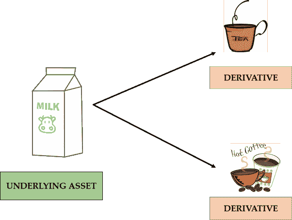

# “期货和期权”入门指南

> 原文：<https://medium.datadriveninvestor.com/beginners-guide-to-futures-and-options-5a6c06d5d8ad?source=collection_archive---------2----------------------->

你有没有想过，在股票市场从事期货和期权交易的人，是如何用较少的资金快速地将钱翻倍的？或者你一定也看到过一些人是如何在股票市场上接连输钱的。

让我们理解衍生品市场的运作。

“衍生产品”只是指衍生自或依赖于某种资产的产品。该资产称为*‘基础资产’*。

让我用这个例子来简化一下。

*'* 咖啡 *'* 和 *'* 茶 *'* 都需要 *'* 牛奶来制作*(当然假设你是那样喝的)*。因此，如果“牛奶”价格上涨，“茶”和“咖啡”的价格也会上涨。总而言之:

1.  “牛奶”是独立的产品。因此，将被视为**‘基础资产’**。
2.  “茶”和“咖啡”的价格来源于“牛奶”的价格。所以，这些都是牛奶的**【衍生品】**。

因此，一家公司的衍生品将从该公司的股票价格中得出其价格。因此，公司的股份就是**‘基础资产’**。

**衍生工具的种类(最受欢迎的种类):**

**1】远期及期货合约:**

拉朱是一个卖棉花的农民。Raju 担心由于某种原因，棉花价格会在一个月后下跌。因此，他走近“维韦克”。

“Raju”与“Vivek”签订**“远期合同”**，并将棉花价格定为每包 100 卢比。

现在，拉朱通过这份远期合同保护了自己。这是因为，即使一个月后棉花价格跌至每包 100 卢比以下，Raju 仍会以每包 100 卢比的价格出售棉花。不用说，Vivek 将有义务以每包 100 卢比的价格购买棉花，即使一个月后价格低于 100 卢比。这样拉朱就能规避风险。

这里会发生两件事:

1.  如果一个月后，棉花价格跌至 100 卢比以下，比如 80 卢比，那么“Raju”将获得 20 卢比的利润，因为他可以以每包 100 卢比的价格出售棉花，而一个月后的市场价格仅为 80 卢比
2.  但是，如果一个月后棉花价格没有下跌，而是上涨到每包 150 卢比，在这种情况下，“Vivek”将获得 50 卢比的利润。这是因为他将以 100 卢比的预定价格购买棉花，现在一个月后，他可以以每包 150 卢比的价格出售。

然而，这个故事有一个转折。可能发生的情况是:

1.  当价格低于 100 卢比时，“Vivek”拒绝购买并违反合同或
2.  当价格超过 100 卢比时，“Raju”拒绝出售，违反了合同。

这些不履行合同的风险出现在远期交易中，在这种交易中，交易是在场外进行的，不涉及任何中间人。因此，*期货*合约优先于*远期*合约。

将基础资产从“棉花”替换为“股票”，并增加一个中间人(股票交易所)来监管合约，这将是一个**“期货合约”**在股票市场中的具体运作方式。

**2】期权合约:**

选择，从这个词本身来看，意味着有一个选择，没有强迫。

期权工具给人以一个被称为**执行价格**的预定价格“购买”或“出售”资产的选择权。

期权合约有两种类型。

1.  **看涨期权:**它给人一个选择**以称为**‘执行价格’**的预定价格购买**资产。对价格上涨持乐观态度的人(多头)购买看涨期权。但为此他需要支付一笔叫做“溢价”的费用。
2.  **看跌期权:**它给人以一个称为**‘执行价格’**的预定价格**出售**资产的期权。悲观并预期价格下跌(看跌)的人购买看跌期权。同样，没有免费的午餐，为此他需要支付一笔叫做“额外费用”的费用。

考虑这些例子来理解这些概念:

“看涨期权”是如何运作的？

继续“Raju”和“Vivek”。Raju 拥有棉花，Vivek 预计棉花价格会上涨。

因此，“Vivek”对价格上涨持乐观态度。因此，他购买棉花的看涨期权，而不是购买棉花本身。他只愿意交易差价，兑现利润。

比如说，一个月后购买棉花的固定价格是 100 卢比，这就是所谓的执行价格。为此，假设“Vivek”向“Raju”支付 10 卢比的溢价。让我们在此讨论各种可能性:

1.  如果一个月后棉花价格上涨到 150 卢比。在这里，“Vivek”可以 100 卢比买入，150 卢比卖出。因此，这里的利润应为 50 卢比。但是，他也支付了 10 卢比的溢价。因此，简而言之，他将获得 40 卢比的净利润。
2.  如果一个月后棉花价格下跌到 80 卢比，那么看涨期权就没有用了。请注意，Vivek 没有义务购买。记住，这是一个选项！因此，他支付的 10 卢比保费将是他的损失。

这就是看涨期权在股市中的运作方式。

“看跌期权”是如何运作的？

比方说，“Vivek”和“Amit”是两个棉花交易商。维维克认为棉花价格可能在一个月后下跌。

因此,“Vivek”从“Amit”处购买看跌期权，该期权赋予他以每包 100 卢比的预定价格出售棉花的选择权。这是成交价格。“Amit”收取 10 卢比的额外费用。让我们在这里讨论一下可能性:

1.  如果棉花价格跌破 100 卢比至 60 卢比，那么‘Vivek’仍能以 100 卢比出售，他的净利润应为 30 卢比(100-60-10 卢比)。
2.  如果棉花价格从 100 卢比上涨到 150 卢比，那么‘Vivek’将损失支付的溢价。

这就是看跌期权在股票市场的运作方式。

 [## 使用谷歌搜索趋势预测首次申请失业救济人数|数据驱动的投资者

### 几年来，我的重点一直是使用多种替代数据来预测宏观经济统计数据…

www.datadriveninvestor.com](https://www.datadriveninvestor.com/2020/03/25/using-google-search-trends-to-predict-initial-jobless-claims/) 

**进入专家视角—** [**订阅 DDI 英特尔**](https://datadriveninvestor.com/ddi-intel)