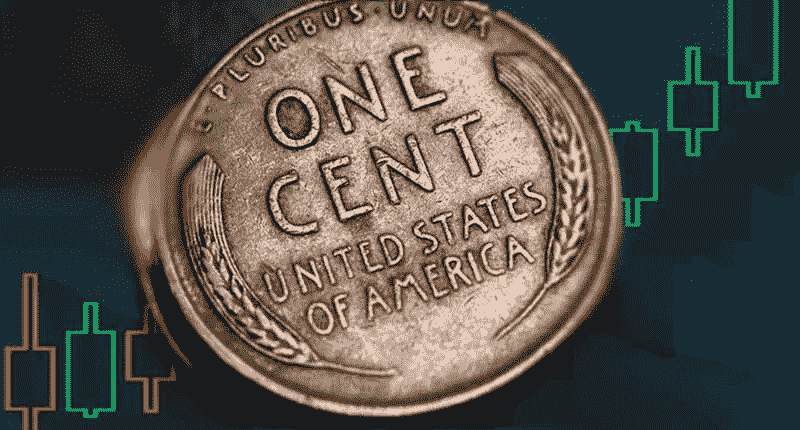

# 2020 年交易细价股初学者指南

> 原文：<https://medium.datadriveninvestor.com/beginners-guide-to-trading-penny-stocks-in-2020-140d32640cc?source=collection_archive---------15----------------------->

# 学习用细价股赚钱的基本知识

[投资仙股](https://pennystocks.com/featured/2019/04/25/investing-in-penny-stocks-explained/)并没有人们想象的那么难。有了一点帮助和正确的方向，弄清楚如何正确交易或投资细价股可以是一个有趣，容易，有利可图的过程。

这种介绍交易细价股票已开发专门为初学者细价股票交易。这篇文章将教你一些购买和出售细价股的基本知识。

# 本文将涵盖以下基础知识:

1.  [*什么是仙股？*](https://pennystocks.com/featured/2020/06/19/trading-penny-stocks-beginners-guide-2020/#section1)
2.  [*在哪里开立交易账户*](https://pennystocks.com/featured/2020/06/19/trading-penny-stocks-beginners-guide-2020/#section2)
3.  [*如何开立交易账户*](https://pennystocks.com/featured/2020/06/19/trading-penny-stocks-beginners-guide-2020/#section3)
4.  [*一个交易账户平均有多少资金*](https://pennystocks.com/featured/2020/06/19/trading-penny-stocks-beginners-guide-2020/#section4)
5.  [*可以下什么类型的基本订单*](https://pennystocks.com/featured/2020/06/19/trading-penny-stocks-beginners-guide-2020/#section5)

# 什么是仙股？

要真正深入这个介绍，你应该了解什么是细价股。根据美国证券交易委员会的规定，细价股的定义通常是指由一家非常小的公司发行的证券，每股价格低于 5 美元。细价股通常在场外报价，例如在 OTC 公告板(这是 FINRA 的一项设施)或 OTC Link LLC(由 OTC Markets Group，Inc .所有，前身为 Pink OTC Markets Inc .)；然而，细价股也可以在证券交易所交易，包括外国证券交易所。此外，细价股的定义可以包括没有活跃交易市场的某些私营公司的证券。”

通常情况下，这些股票具有高度的投机性，许多公司并没有重要的业务。根据交易所的不同——纳斯达克、纽约证券交易所、场外交易市场——可能很少或没有报告标准。然而，由于投机性质，这通常会带来较高的波动性。因此，与“[蓝筹股](https://pennystocks.com/learn-to-trade-penny-stocks/2019/09/21/penny-stocks-basics-of-blue-chip-companies/)”相比，它为在很短的时间内获得更大的收益提供了机会。

# 我可以在哪里开一个股票交易账户？

既然我们已经把客套话说完了，你也知道了细价股的风险/回报，如果你还想交易，你需要开一个账户。确保是和一个有能力购买细价股的经纪人。对于这一点，我们发现与传统的经纪公司相比，在网上经纪公司开户要容易得多。这有两个原因。

 [## 利用股市相关性的最佳方式|数据驱动的投资者

### 当阿尔弗雷德·温斯洛·琼斯开创了世界上第一个“对冲”基金(后来“d”被去掉了)时，他让其他投资者大吃一惊…

www.datadriveninvestor.com](https://www.datadriveninvestor.com/2020/02/02/the-best-way-to-use-stock-market-correlations/) 

首先，许多传统经纪人不接受日交易细价股的请求。其次，拿起电话、联系在线经纪人、下订单然后执行的时间，远比与在线经纪人进行交易的时间要长。

这里有几个[顶级细价股票经纪人](https://pennystocks.com/featured/2020/02/04/best-penny-stock-brokers-2020/)(排名不分先后)可以让你交易 5 美元以下的股票:

*   互动经纪人
*   WeBull
*   光速
*   ETrade.com
*   Scottrade.com
*   TDAmeritrade.com
*   罗宾汉

# 你如何开一个股票交易账户？

在大多数情况下，注册过程是相似的。这些网站会要求您填写一份包含个人财务信息和风险评估的安全表格，以验证您的帐户。一旦获得批准，你就离交易细价股更近了一步。

# 我应该给我的股票交易账户注入多少资金？

融资金额各不相同，但大多数经纪商不再要求设定最低金额。例如，你可以用几百美元开一个互动经纪人或 WeBull 账户。然而，根据法律，平均来说，一个人被定义为具有日内交易能力的典型开仓金额是 25，000 美元。现在，你可能会说，“我想交易，但我没有多余的 25，000 美元！”

在这种情况下，仍然会有经纪人允许你买卖细价股，但是你的交易数量是有限的。具体来说，你将被限制单日交易(通常在同一天买入和卖出一种证券)。如果你没有最低 25，000 美元，你只能在 5 天内进行 3 次“往返交易”。如果你在这段时间内做了 3 次以上的往返交易，你就可以被认为是模式日交易者。

**了解更多信息**

*   [低价股交易入门&赚钱](https://pennystocks.com/featured/2020/06/18/a-beginners-guide-to-trading-penny-stocks-making-money/)
*   [仙股&增加利润的热门技术指标](https://pennystocks.com/featured/2019/12/10/penny-stocks-technical-indicators-increasing-profits/)

在这种情况下，你的经纪人可能会限制你在 90 天内进行日内交易。往返意味着买卖同一只股票将算作一笔交易。如果你“今天”买入细价股，然后“明天”卖出，这不算是日内交易。

# 用较小的账户交易细价股票

这就是为什么一些账户较小的交易者选择在一天快结束的时候买入低价股，第二天早上根据趋势卖出。另一方面，你也可以做一个“现金账户”。虽然你不能用保证金进行大额交易，但大多数经纪人不会限制你的日交易。这意味着理论上你可以在一天内进行 4 次往返交易。唯一限制你的是你账户里的结算资金量。

例如，假设您的账户中有 5000 美元，而您“今天”有 3000 美元的头寸。稍后“今天”你以 4000 美元卖出那个头寸。通常情况下，股票交易的收益在所谓的“T+2”结算，这意味着在你卖出后，你可以在“交易”日起的 2 天内用这笔现金进行交易。回到我们的例子，“今天”你基本上赚了 1000 美元(3000 美元的本金，以 4000 美元的价格卖出，净赚 1000 美元)。但是“明天”你只能交易 2000 美元，因为你的初始金额是 5000 美元。

有很多方法可以在不“倾家荡产”的情况下进行交易，只要知道每个经纪人会允许你做不同的事情。你应该单独咨询经纪人，以了解他们提供的小额账户。

# 我可以下什么类型的基本订单？

你已经弄清楚了什么是细价股，你已经挑选出了最好的细价股经纪人，你已经获得了你的账户批准和资金，现在你准备好进行你的第一笔交易。你是怎么做到的？在细价股票市场，大多数经纪人会要求你下一个所谓的“限价单”这是通过设定你愿意为给定证券支付的最高价格，然后等待有人来满足你的订单。当然，这种情况可能会发生，也可能不会每次都发生。

如果一只细价股上涨很快，当股票暴涨时，下限订单可能很快被忽略。因此，在这种情况下，可能需要设置一个更高的上限，以便有机会以最佳价格购买细价股。

另一方面，如果有一个持续的市场交易细价股，限价订单可以在最低的要价，或者你可以选择提供最高的出价，等待有人卖给你股票。这类似于标准的拍卖。

# 我可以买细价股；销售呢？

当谈到出售，你可以使用上述相同的意识形态出售限价订单或一些经纪人也提供能力，细价股出售使用市价订单。在下市价单的情况下，你基本上是在向市场的最佳价格敞开心扉。这可能会让你更容易退出，但不一定会带来最高的利润。在做任何买卖订单之前，咨询你的个人经纪人，询问他们为细价股提供的订单处理类型。

这只是你的细价股票交易之旅的开始。希望这能帮助你开始找到正确的方向，弄清楚你对细价股的喜好。我们将提供更多的文章来帮助你进入这个市场，更重要的是，帮助你了解细价股的来龙去脉。所以一定要订阅这个网站，[下载 60 多页的电子书](https://pennystocks.com/featured/2020/06/19/trading-penny-stocks-beginners-guide-2020/#ex1)，关注[推特](https://twitter.com/1pennystocks)，[脸书](https://www.facebook.com/realpennystocks) & [Instagram](https://www.instagram.com/realpennystocks/) ，这样你就不会错过我们任何重要的信息丰富的文章。

*原载于 2020 年 6 月 19 日 https://pennystocks.com**的* [*。*](https://pennystocks.com/featured/2020/06/19/trading-penny-stocks-beginners-guide-2020/)

**进入专家视角—** [**订阅 DDI 英特尔**](https://datadriveninvestor.com/ddi-intel)