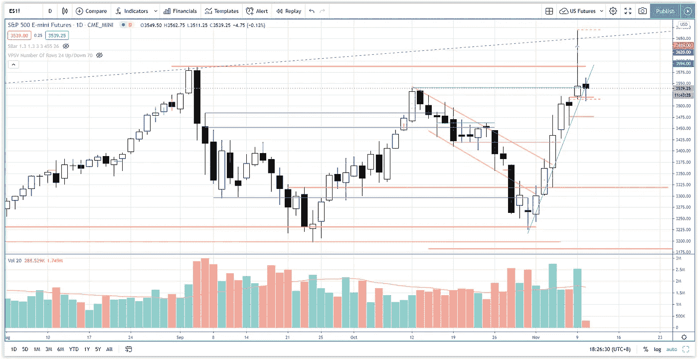

# 用这个简单的方法区分市场抛售和获利回吐

> 原文：<https://medium.datadriveninvestor.com/beginning-of-market-sell-off-or-profit-taking-s-p-500-day-trading-aff27cf3b415?source=collection_archive---------26----------------------->

关注市场展望部分，了解如何区分市场抛售的开始与标准普尔 500 期货投资者的简单获利回吐。

观看视频，了解 2020 年 11 月 10 日交易时段标准普尔 500 指数期货的**每日市场分析。在这个视频中，你将看到最后一节的市场回顾和三分钟内的交易回顾(包括进场、出场和背后的原理)。展望未来，我将涵盖偏见，要注意的关键水平，我稍后的交易计划。**

## 时间戳

*   [1:15](https://www.youtube.com/watch?v=F1_is0HNVoE&t=75s) 市场回顾
*   [4:15](https://www.youtube.com/watch?v=F1_is0HNVoE&t=255s) 贸易回顾
*   随着供应量的增加，发现市场疲软
*   威科夫的努力与结果
*   [8:25](https://www.youtube.com/watch?v=F1_is0HNVoE&t=505s) 交易回调反转
*   [6:45](https://www.youtube.com/watch?v=F1_is0HNVoE&t=405s) 日交易失误
*   [10:05](https://www.youtube.com/watch?v=F1_is0HNVoE&t=605s) 当前股票市场展望——纳斯达克的获利回吐和轮换

如果你还没有看我的[每日市场分析视频](https://www.youtube.com/watch?v=G1CUqRXVVVk)，为了更好地了解市场回顾和交易回顾。

**偏向** —中性(日内交易)；看涨(长期)

**关键点位** —阻力:3587，3560；支持:3500，3480-3500

**潜在设置** —在关键级别寻找潜在反转。

# 资源

**每周市场展望&最佳交易建议**直达您的收件箱:[https://www.tradeprecise.com/](https://www.tradeprecise.com/)

**职业免费**制图平台:创建账户→[www.TradingView.com](https://bit.ly/2U2Femd)

**非美国居民？** ( **、新加波**、澳洲、纽西兰、欧洲等……):[点击此处，存款 2000 新币](https://ji.hn/sgtiger)即可获得**免费股票(价值 100++ &美元)老虎经纪公司的欢迎礼物**

美国居民？[点击此处，当您存入 1500 美元](https://ji.hn/ustradeup)时，就有机会在 TradeUP 上获得一份**免费的 AMZN 股票(价值 3000++美元** ) & **欢迎礼物**

**无限制访问媒体文章** —加入以下:[https://priceactiontrading.medium.com/membership](https://priceactiontrading.medium.com/membership)

# 进一步阅读

 [## 苹果(AAPL)收益前创历史新高——买还是卖？

### 苹果打破了杯子和把手的模式，在昨天 Q1 财报发布前跃升至历史新高。什么是…

medium.com](https://medium.com/datadriveninvestor/apple-aapl-at-record-highs-ahead-of-earnings-buy-or-sell-726c7989daeb)  [## 2021 年这些绿色能源股会涨 400%-1300%吗？

### 2021 年第 3 周市场回顾

medium.com](https://medium.com/datadriveninvestor/will-these-green-energy-stocks-gained-400-1300-in-2021-3f7288227c76)  [## ARK Invest 的 Cathie Wood 预测基因组股表现优于特斯拉？

### 方舟投资公司的首席执行官凯西·伍德预测，最大的上涨惊喜可能来自基因组股票，尤其是…

medium.com](https://medium.com/datadriveninvestor/ark-invests-cathie-wood-predicts-genomic-stocks-outperform-tesla-b67f3c4bbc68) 

Photo by Author — Ming Jong Tey

Photo by Author — Ming Jong Tey

披露:如果您点击本文中的链接进行购买或开立账户，并将所需金额存入推荐的经纪人账户，我们将免费为您赚取佣金。

免责声明:本演示中的信息仅用于教育目的，不应作为投资建议。