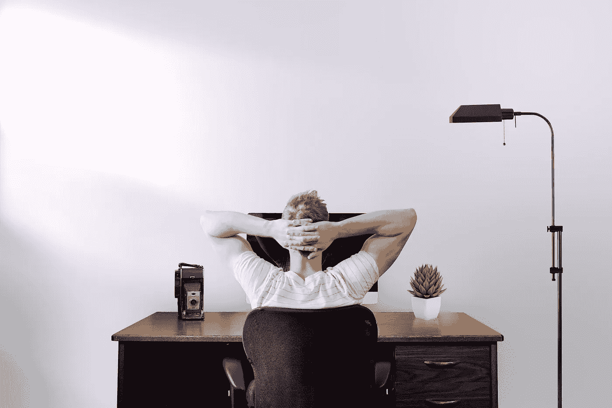

# 成为一名创造者是一项令人疲惫的工作

> 原文：<https://medium.datadriveninvestor.com/being-a-creator-is-exhausting-work-af863d5707f7?source=collection_archive---------15----------------------->

## 这不是一条容易的路，这是最有纪律的人成功的方式。

Photo by [Jason Strull](https://unsplash.com/@jasonstrull?utm_source=unsplash&utm_medium=referral&utm_content=creditCopyText) on [Unsplash](https://unsplash.com/s/photos/creating?utm_source=unsplash&utm_medium=referral&utm_content=creditCopyText)

“热爱你所做的事情，做你热爱的事情”是人们在提到快乐的方法时常说的一句话。我发现，在一个令人疲惫的创造内容的世界里，我最快乐的方式是有一份工作和一份兼职。

在我大学二年级的时候，我会在上课前每天早上 6:30 遛狗，一周五天，赚 36 美元。

# 小心你的时间

这份苦差事是真实的，因为我还有其他的副业要做，但这是一份轻松有趣的工作。有限的钱迫使我在获得收入的方式上变得有创造性。

经过 7 个月的现役军人生涯，我已经能够看到一份稳定的工作加上各种副业和爱好是如何让我快乐的。

自从我承诺创建更多的博客后，我更加小心地度过了我的空闲时间。更多的博客，我的意思是从每周写 2 到 3 篇变成每天写一篇新的内容。

不要误会我的意思，我喜欢它，但创意果汁肯定正在接受考验！

你最关心你的观众。他们最想阅读的内容类型。因为我的受众，我每天都在同一时间愉快地开始写稿子。

 [## 良好的生活是习惯的形成|数据驱动的投资者

### 过度思考是过度紧张。仅仅几个简单的习惯就会在一天中产生巨大的影响。那是…

www.datadriveninvestor.com](https://www.datadriveninvestor.com/2020/01/17/a-good-life-is-habit-forming/) 

在我的博客上，我希望尽可能地透明，因为和任何新的努力一样，我在不断地学习新的东西。

通过我看过的媒体文章和 YouTube 视频，我一直在学习如何组织一篇博文以获得最佳效果。

## 我采纳的一些关键建议

*   使用高质量图像
*   用主动语态写作
*   多讲故事
*   参与社区活动
*   大量阅读
*   相信这个过程

在我的旅途中，我发现我已经筋疲力尽了。但是，我有动力继续写下去。我相信我可以帮助那些和我一样每天都在挣扎的人。

我从阅读率百分比的增加中获得的满足感意味着我正在逐步提高，这绝对是一种激励。

# 敬新作家

我鼓励你不要太关注统计数据，因为它们会对你产生负面影响。你可能会像我一样每天早上做的第一件事和睡前做的最后一件事一样关注数字。这种强迫性的行为不会让你为了正确的理由而写作。相反，你可能会写些东西，希望能像病毒一样传播开来。

我在股市博客上达到 1.8k 阅读量的那一天，我感觉自己获得了重生，与写作世界息息相关。在那个里程碑之后的日子里，我谦卑下来，回到了现实。

庆祝高潮并没有错，但同样重要的是不要太沉迷于低谷。

我看的 YouTube 视频告诉我要为自己感到骄傲，但不要在只有 30 人阅读我的文章的日子里感到沮丧。要有耐心，像任何伟大的竞争者一样每天出现。

关注者的增加给了我一种团体感，我想珍惜这种感觉，并在未来发展壮大。同样，我希望我的读者相信我写在他们面前的文字。

出于这个原因，我永远不会尝试给出任何我没有从经验中学到的建议，因为那里的可信度在哪里？

我在一个中型帖子上收到的一个重要建议是，拥有 1000 名积极参与的粉丝比拥有 10000 名不那么投入的粉丝更重要。

在我让我的追随者了解我的同时，我也想了解他们。

# 选择合适的位置

我想尽我最大的能力帮助我的观众，如果你对你想看到更多的东西发表评论，我会很乐意朝那个方向努力！

加里·维纳查克告诉观众，你做的或谈论的所有事情都是你的专长，所以不要太执着于一个专长。这种专注可能不会让你成为最快乐的创造者，但肯定会让你有所帮助。

加里一生中做了太多事情，车库拍卖和与美国顶级首席执行官合作可能没有直接关系，但它们是他品牌的两个部分。

作为早期创作者，这并没有让我因为没有坚持自己的位置而感到内疚，但它确实让我可以开发出“前 3 名”的主题，这样我就可以投入更多的时间。

在海外使用普通或低于标准的互联网让我的 YouTube 频道暂停，但却激发了我对写博客的新的、更可持续的热情。

# 任何人都可以做

你想做什么就做什么！想写作吗？然后写博客。一直想开一个 YouTube 频道？去吧！你喜欢聊天吗？开始播客。

有比以往更多的方式让你的声音在互联网上被听到，有这么多的媒介让你不必筋疲力尽地把所有的鸡蛋放在一个篮子里。关键的一点是，做任何事情都要保持平衡，让创作不会损害你个人生活的一部分，也不会打击你的自信。

> "创造力是发明、实验、成长、冒险、打破规则、犯错和享受乐趣."请记住:)