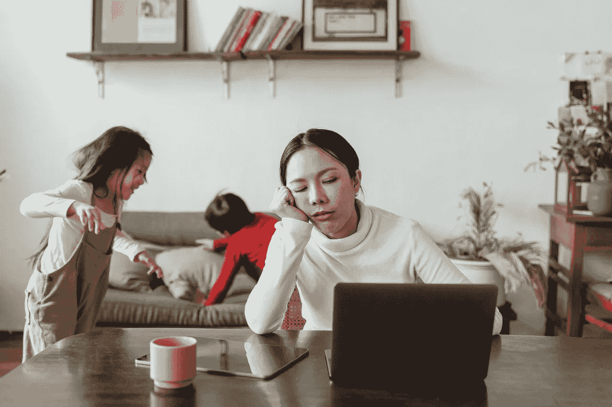

# 被禁锢和坐立不安会让你去冒新的风险

> 原文：<https://medium.datadriveninvestor.com/being-cooped-up-and-antsy-is-leading-you-to-take-new-risks-216edac0e968?source=collection_archive---------17----------------------->

## 你厌倦了被困在里面

Photo by [Ketut Subiyanto](https://www.pexels.com/@ketut-subiyanto?utm_content=attributionCopyText&utm_medium=referral&utm_source=pexels) from [Pexels](https://www.pexels.com/photo/tired-ethnic-working-mother-at-home-with-playing-kids-4474029/?utm_content=attributionCopyText&utm_medium=referral&utm_source=pexels)

我们家渴望正常生活，所以我们都盛装打扮。所谓*打扮，*我的意思是所有人都穿上街头服装，做好准备。“今天没有睡衣。穿上你在生活变得疯狂之前穿过的衣服，”我们告诉孩子们。当我们挤进车里时，我们看起来很好，希望我们能在当地的农业旅游场所享受一点户外时光。

我们开了一小段路到了一个偏僻的地方，在那里我们认为我们可以正常一会儿，吸收一些阳光和良好的互动。当我们拐进停车场时，女孩们坐在后座上*【啊】*。“这是很多人，”他们说。希望仍然很高，我们同意开车四处转转。“看看他们有多亲密。没有人戴面具。嗯——我再也不想去了，”孩子们说。这是来自[已经生病的孩子](https://medium.com/publishous/my-whole-family-is-sick-with-coronavirus-and-its-all-my-fault-fd2e2e6ebc6a)。很难说他们的担心是出于那些可能会得病的人，还是因为他们直接知道当有人得病时会发生什么。也许他们的担心两者都有一点。

没有人能责怪你对现状感到恶心和厌倦。感觉和情绪无处不在，你厌倦了被告知该做什么和何时该做。《纽约时报》称，你抵制新的和持续的限制，因此愿意承担新的风险。

好像你还不够害怕似的，冬天即将来临的想法让你更加烦躁。一想到你会在寒冷的天气，也许是冰天雪地里被困在室内，你就感到恐慌。人们似乎愿意冒额外的风险来防止自己发疯。公众的耐心正在消退，人们在呼唤正常，他们准备冒险去感受正常。

# 人们渴望行动自由

我们理所当然地认为一个潜在的原则，很少有人认为我们必须谈论它。我们的宪法中没有提到移动性。可能没有人想到我们必须解决我们是否可以四处走动或何时可以走动的问题。

你可能从来没有想象过，如果你想去某个地方做某件事，你可以仅仅因为你想做就去做。我们做梦也没想到我们的政府会为了我们自己的安全和整个社会的保护而限制我们的行动。除了渴望移动，我们还希望在旅途中有安全感。

 [## 从新冠肺炎学到的 8 个教训，但它们不会持久|数据驱动的投资者

### 由于新冠肺炎，生活在 2020 年 3 月初几乎一夜之间发生了巨大的变化，越来越多的人认为…

www.datadriveninvestor.com](https://www.datadriveninvestor.com/2020/05/20/the-8-lessons-learned-from-covid-19-but-they-wont-last/) 

# 安全事项

你想要安全感。你希望你的家人安全。安全感的重要性对你的心理健康有着深远的影响。日常生活的一个潜在前提是在做我们想做和需要做的事情时感到安全。关于什么是安全以及谁来决定对大群人采取什么样的标准，人们意见不一。

你可能从未想过面具会成为安全话题。戴面具参加社交活动是万圣节派对或新年派对的话题，但不是去医生办公室或杂货店的话题。

当你移动时，希望是安全的，你可以合理地去任何开放的地方。也许你会考虑去你最喜欢的零售商或者你最喜欢的餐馆。

# 企业为开业或继续营业而战

你喜欢去的商店和你花钱去的商店保持着经济的繁荣。经济和你经常光顾的企业的健康都取决于钱的花费。我家乡的许多企业家和小企业就是开不起门。当地的小夫妻店已经关门，再也不会开门营业了。

[华盛顿邮报](https://www.washingtonpost.com/business/on-small-business/small-businesses-are-dying-by-the-thousands--and-no-one-is-tracking-the-carnage/2020/08/11/660f9f52-dbda-11ea-b4f1-25b762cdbbf4_story.html)称成千上万的小企业正在消亡，其中许多是餐馆。你最喜欢的商店能够长期坚持下去吗？很有可能，你最喜欢的地方之一已经永久关闭了。

# 最后的想法

底线是，如果不做你喜欢的事情会让你疲惫不堪，那么你可能与你的邻居或朋友没有什么不同。你身心俱疲，厌倦了别人告诉你什么能做什么不能做。你准备好冒一些风险去享受你认为不言而喻的基本自由。

即使你冒着生病的风险，你也愿意有点急躁，如果这是必要的话，因为冬天即将来临，而你已经有了幽居病。如果疾病没有影响你，很可能是错过了你珍惜的事情，没有看到你喜欢的人一起做这些事情，这让你感到害怕。你怀念搬家，怀念自由，怀念曾经热爱的生活。你渴望旧的方式和你以前知道的生活—

为了感觉正常，你愿意冒什么风险？随着时间的推移，你对冒险的舒适程度有所改变吗？

## 获得专家视图— [订阅 DDI 英特尔](https://datadriveninvestor.com/ddi-intel)