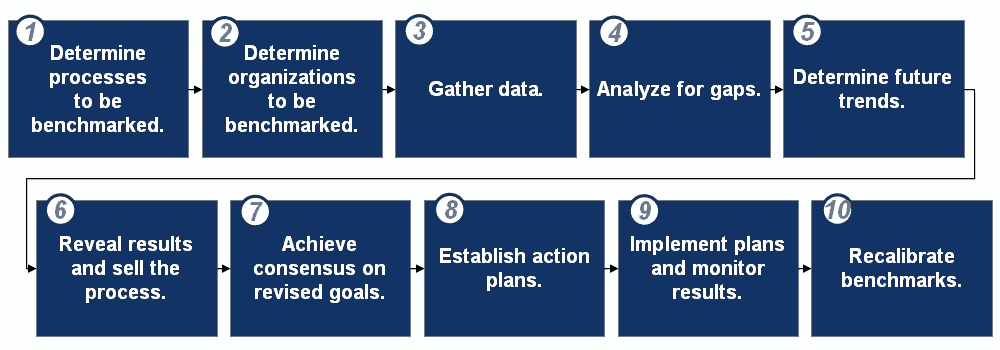

# 基准测试基础。这是什么，你是怎么做到的？

> 原文：<https://medium.datadriveninvestor.com/benchmarking-basics-what-is-it-and-how-do-you-do-it-d51382ea1d1f?source=collection_archive---------13----------------------->

*注:本文由我的同事***原创发布。**

**

*[基准测试](https://flevy.com/business-toolkit/benchmarking)是一个非常强大的工具，许多组织不仅用它来衡量和评估他们在竞争中的表现，还用它来推动自己成为同类最佳。标杆管理是竞争优势和持续改进的源泉。*

*维基百科对基准的定义是:*

> **标杆管理是将一个人的业务流程和绩效指标与其他公司的行业最佳和最佳实践进行比较的过程。通常衡量的维度是质量、时间和成本。在最佳实践标杆管理过程中，管理层确定其行业或存在类似流程的其他行业中的最佳公司，并将被研究公司的结果和流程(“目标”)与自己的结果和流程进行比较。通过这种方式，他们了解目标公司的表现如何，更重要的是，了解解释这些公司为什么成功的业务流程。**
> 
> **也被称为“最佳实践标杆管理”或“流程标杆管理”，该流程用于管理，尤其是战略管理，其中组织评估与最佳实践公司流程相关的流程的各个方面，通常在为比较目的而定义的对等组内。这样，组织就可以制定如何进行改进或采用特定最佳实践的计划，目的通常是提高绩效的某个方面。标杆管理可能是一次性事件，但通常被视为一个持续的过程，在这个过程中，组织不断地寻求改进他们的实践。**

*基准测试过程的关键是获得相关的、准确的基准测试数据。那么，你从哪里得到这些数据呢？这取决于你想做的基准测试的类型。有 5 种类型的基准测试。*

# *基准类别*

***内部标杆***

*这是将我们组织内的一个特定操作与另一个操作进行比较。内部基准测试是最容易的——无论是研究还是实施。这种类型的生产率提高通常为 10%左右。*

***竞争基准***

*这是我们与直接竞争对手的经营情况的比较。这是最难成功实施的基准测试类型，必须始终牢记法律考虑。生产率通常提高 20%左右。*

***功能基准测试***

*将一项作业与我们行业内的类似作业进行比较的过程(例如，将铜矿开采技术与煤矿开采技术进行比较)。实现的生产率提高类型可能是 35%或更高。*

***通用标杆***

*这比较了不相关行业的运营情况。这样做的好处是不存在竞争问题，从而增加了获取信息的机会，减少了出现法律问题的可能性。生产率可能提高 35%以上。*

***协同标杆***

*这是由公司集团(如跨国公司在不同国家的子公司或行业组织)合作进行的。许多公司同意互相分享内部基准数据。*

*大型咨询公司之所以被聘用，往往是因为它们能够获得竞争基准信息，这些信息是通过与大量公司合作获得的。*

# *标杆管理方法*

*那么，如何进行基准测试呢？首先，重要的是要注意，与其他一些框架不同，对于基准测试，没有一个单一的过程被普遍采用。以下是基准测试的 10 个步骤。*

**

***第一步。确定要进行基准测试的流程。***

*第一步包括尽可能准确地定义要进行基准测试的流程。它是整个基准测试过程的基石。在这个阶段不正确的识别可能导致在后面的步骤中浪费宝贵的资源。*

*最后，我们将有一个重点突出、定义明确的过程，告诉管理层需要改变什么，在给定的限制内可以实现多少改变，以及如何根据他人的过程和我们自己的未来规划来准确地衡量我们的过程。*

***第二步。确定要进行基准测试的组织。***

*这一步通过识别其实践可以适应我们的需求的最佳组织来确定应该研究哪些组织。不正确的选择可能导致选出的合作伙伴不是所选进程的真正基准，不合作，或者其做法与我们的需求不相容或不相关。*

*在第 2 步结束时，我们将编制一个大型列表，根据流程的卓越质量，从中选择作为潜在合作伙伴联系的组织。*

***第三步。收集数据。***

*第三步包括创建一个从选定目标收集数据的计划，进行现场访问，并创建一个现场访问报告。完成第 3 步后，我们的组织将拥有完整、准确和相关的数据，可以用这些数据将自己的流程与“最好的流程”进行比较*

***第四步。分析差距。***

*这一步包括分析收集的数据，发现当前绩效在每个领域落后于最佳绩效的程度，并将最佳实践中的最佳特征整合到理想流程中。完成后，每个最佳实践的相关特征将组合成一个理想的实践，可以在我们组织的预算和其他限制内实施。*

***第五步。确定未来趋势。***

*在这一步中，我们将检查我们组织相对于竞争对手的过去绩效，预测我们行业的潜在变化，并预测未来绩效，包括有无建议的基准变化。在这一步结束时，我们将已经确定了实施建议的基准变更的量化收益。*

***第六步。揭示结果，推销过程。***

*这一步包括向组织中的重要受众传达基准结果及其含义，并激励他们进行变革。这一步骤将确保向所涉各方和利益攸关方解释变革的好处，以激励他们实施变革。*

***第七步。达成共识并修改目标。***

*这一步包括修改目标以缩小第 5 步中确定的绩效差距，并就这些目标达成共识。第 7 步建立明确的目标，这些目标已经得到我们管理层的批准，并且所有员工都理解。*

***第八步。制定行动计划。***

*此步骤建立了旨在实现步骤 7 中创建和批准的目标的分步计划。完成第 8 步后，管理人员已经批准了计划的细节，适当的个人已经被授权执行该计划，并且每个人都知道他或她的工作程序中预期的变化。*

***第九步。实施计划并监控结果。***

*在这一步中，我们执行批准的最佳实践程序，并对变更进行日常监控。第 9 步制定程序，以便能够密切监测变化和跟踪结果，这样，随着时间的推移，新实践的成功要素可以保留，不太成功的要素可以淘汰。*

*你是管理顾问吗？你可以从 FlevyPro 图书馆下载这个和数百个其他的[咨询框架](https://flevy.com/pro/library/frameworks)和[咨询培训指南](https://flevy.com/pro/library/consulting)。*

***第十步。重新校准基准。***

*我们必须持续评估基准实践，并在必要时重新建立基准过程。在步骤 10(和这个基准方法的结论)之后，组织将理解何时以及如何需要重新校准基准，并且永远不会因为自满而将自己置于风险之中。*

*您可以在此下载[基准测试流程的可编辑 PowerPoint。本文档包含更深入的讨论，包括深入研究基准测试方法的 10 个步骤。](https://flevy.com/browse/flevypro/benchmarking-primer-1976)*

# *想在绩效管理方面取得卓越成就吗？*

*获取知识并发展专业技能，成为绩效管理专家。我们的框架基于领先的咨询公司、学者和公认的主题专家的思想领导力。[点击此处了解全部详情。](https://flevy.com/browse/stream/performance-management)*

*绩效管理(也称为战略绩效管理、绩效衡量、业务绩效管理、企业绩效管理或公司绩效管理)是一种用于监控企业绩效的战略管理方法。它描述了用于监控和管理组织的业务绩效的方法、度量、流程、系统和软件。*

*正如彼得·德鲁克的名言，“如果你不能衡量它，你就不能改进它。”*

*拥有一个结构化和稳健的战略绩效管理系统(如平衡计分卡)对任何组织的可持续成功都至关重要；并影响到我们组织的所有领域。*

*[在此了解我们的**绩效管理最佳实践框架**。](https://flevy.com/browse/stream/performance-management)*

*在 [**管理和企业咨询**](https://app.ddichat.com/category/management-and-corporate-consulting) **:** 中安排一次 DDIChat 会议*

* [## 专家-管理和企业咨询- DDIChat

### DDIChat 允许个人和企业直接与主题专家交流。它使咨询变得快速…

app.ddichat.com](https://app.ddichat.com/category/management-and-corporate-consulting) 

在此申请成为 DDIChat 专家[。
与 DDI 合作:](https://app.ddichat.com/expertsignup)[https://datadriveninvestor.com/collaborate](https://datadriveninvestor.com/collaborate)在此订阅 DDIntel [。](https://ddintel.datadriveninvestor.com/)*