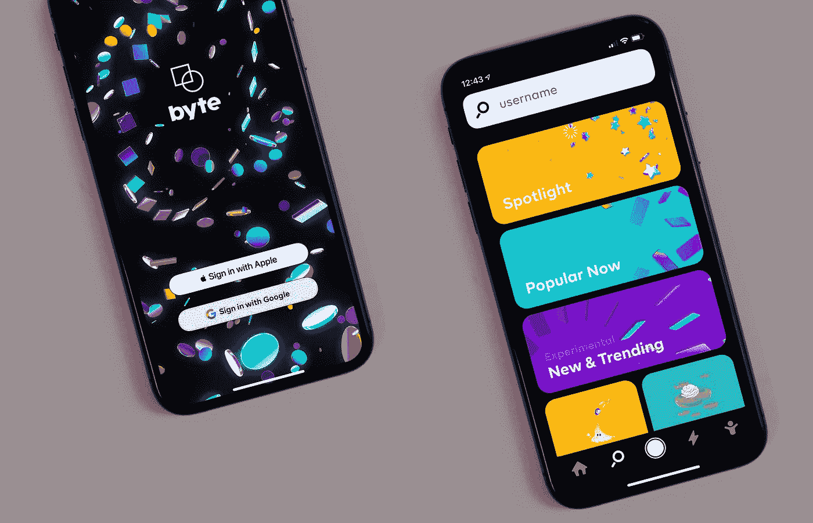

# 应用程序开发未来趋势的好处

> 原文：<https://medium.datadriveninvestor.com/benefits-of-future-trends-in-app-development-83286428ded?source=collection_archive---------16----------------------->

Photo by [Charles Deluvio](https://unsplash.com/@charlesdeluvio?utm_source=medium&utm_medium=referral) on [Unsplash](https://unsplash.com?utm_source=medium&utm_medium=referral)

移动应用程序的使用正在快速增长，并在全世界获得巨大的普及。在目前的情况下，初创企业到大型企业都推出了自己的应用程序，以扩大业务。

然而，基于 Android 和 iOS 的移动应用程序有助于公司在全球范围内推广其服务并增加收入。现在，所有公司都推出了自己的基于企业的应用程序来与客户互动。此外，现在只启动移动应用程序是不够的，因为在谷歌和苹果商店有几个应用程序可用。

重要的是，您的移动应用程序应该具有所有基本功能和高级特性，以便为您的用户提供独特的体验。为了在市场中保持领先，对于企业主来说，重要的是整合最新的趋势，这可以帮助他们在市场竞争中保持领先。聊天机器人、虚拟助手等是移动应用程序的最新趋势，开发过程也比以往得到了增强。编程语言已经升级，甚至开源软件也已经成为科技行业的趋势平台。

在这篇博客中，我们预测了未来几年我们将会经历的移动应用开发的趋势。为了利用移动应用的所有优势，与一家移动应用开发公司合作。

 [## 隐私指南，关于应用开发|数据驱动投资者

### 挪威隐私机构 DPA 对当地的一个现实处以 20 万欧元的罚款，原因是…

www.datadriveninvestor.com](https://www.datadriveninvestor.com/2020/04/29/privacy-guidelines-about-app-development/) 

# 移动应用开发的未来趋势

## 物联网和云。

物联网与云开发的融合将是未来 app 开发的需求。[根据 Statista](https://www.statista.com/topics/2637/internet-of-things/) 的数据，到 2023 年，全球物联网支出预计将达到 1.1 万亿美元，市场分布在许多垂直领域，如可穿戴设备、家电和智能汽车。

这两种趋势都有助于增强数据记录过程以及实时连接设备，这有助于增加通信过程。在未来，预计这两种技术将是应用的主要趋势。除此之外，它将减少人力，这将有助于满足用户的期望。

## 人工智能

人工智能已经在应用程序开发中发挥着至关重要的作用。这项技术为用户提供了几个创新趋势，如语音识别、机器人等等。在未来几年，预计人工智能将增长更多，并将有助于吸引用户。通过使用预测分析和机器学习算法，人工智能将扩展其功能，这将有助于提供更高层次的个性化体验，并将应用程序变得更加智能和先进。

在未来几年，功能将会扩展，这也是应用程序开发过程的一个趋势。全球科技市场咨询公司 ABI 研究公司预测，人工智能设备的总安装量将从 2019 年的 27 亿增长到 2024 年的 45 亿。

[ABI 研究公司估计](https://www.abiresearch.com/press/multimodal-learning-rewriting-rules-ai-data-collection/)装有多模态学习应用程序的设备总数将从 2017 年的 390 万台增长到 2023 年的 5.14 亿台。

## 斯威夫特和科特林

Swift 和 Kotlin 将是未来 Android 和 iOS 平台的应用开发语言。毫无疑问，Objective C 可以换成 Swift，Java 会和 Kotlin 在一起。它们将被称为两个平台的官方语言。Swift 和 Kotlin 都被认为是应用程序开发行业的未来。这些语言有助于简化开发过程，并轻松快速地启动应用程序。

它们都被称为现代语言，支持高级功能并减少编码工作。

## 跨平台开发

现在非常期待 app 开发过程采用跨平台开发。所有者将更愿意选择源代码，这将能够支持多个其他平台，包括黑莓，Android，Web 和 iOS。目前，开发人员必须精通不同的平台，但在未来几年，被称为现代开发过程的跨平台将成为开发行业的主要部分。

> [娱乐技术解决方案的未来](https://medium.com/@lenac1884/future-of-the-entertainment-technology-solutions-25d9ac25554c?sk=0e8e64468259d74cba07ea173ecc94ed)

## 5G 技术

5G 技术是当代人的需求。现在，用户开始依赖他们的智能手机。从订票到点餐，他们更喜欢在手机上搜索服务。为了满足用户需求，重要的是他们应该拥有高速互联网，未来的应用程序必须满足 5G 技术的速度。

**结论**

通过见证应用程序开发的需求，可以预计在未来，用户将能够体验到广泛的功能和先进的数字体验。在应用程序开发行业，未来几年，应用程序开发人员的编码过程将变得轻松而高效。

## 获得专家观点— [订阅 DDI 英特尔](https://datadriveninvestor.com/ddi-intel)