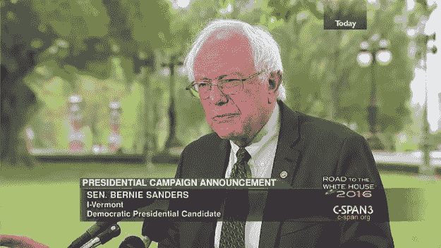
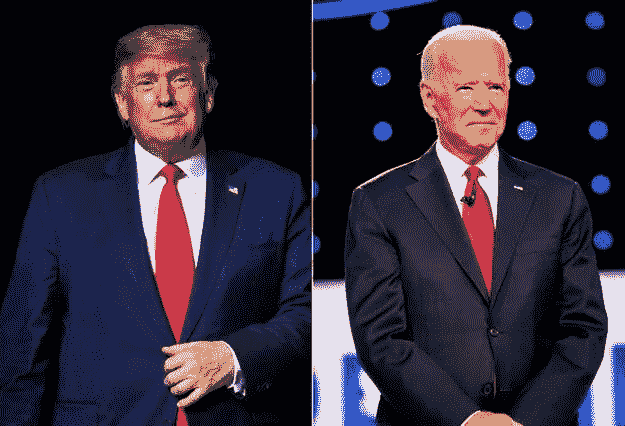

# 政治革命者伯尼·桑德斯的颂歌

> 原文：<https://medium.datadriveninvestor.com/bernie-sanders-has-revolutionised-progressive-politics-f41a91b79d69?source=collection_archive---------13----------------------->

## 他可能不会成为总统，但他的政治遗产将永存

[Bernie Sanders Announcing His 2016 Primary Campaign](https://www.c-span.org/video/?325700-1/senator-bernie-sanders-i-vt-news-conference)

2015 年 4 月 30 日，伯尼·桑德斯，一个非常不知名的佛蒙特州参议员[站在三个麦克风和几个记者](https://www.c-span.org/video/?325700-1/senator-bernie-sanders-i-vt-news-conference)面前，带着他典型的“我被那百分之一惹恼了”的情绪，首先警告记者们，*“让我做一些评论，我很乐意回答几个问题，我们没有无尽的时间，我必须回去。”*

然后，他宣布他将竞选美国总统。在他宣布的前 24 小时内，他已经筹集了大约[150 万美元](https://www.opensecrets.org/pres16/candidate.php?id=N00000528)，到 2015 年 7 月[这个数字是 15 20 万美元](https://www.opensecrets.org/pres16/candidate.php?id=N00000528)，到 9 月[30 日大约是 26 00 万美元](https://www.opensecrets.org/pres16/candidate.php?id=N00000528)。相比之下，他的主要对手希拉里·克林顿是一个知名度更高的候选人，她身后有一个经验更丰富的政治团队，她已经筹集了大约 28 00 万美元。到 2016 年初，他的级别超过了她。

他通过一次又一次地重复同样广泛的信息来进行更左派的民粹主义运动来做到这一点。事情大概是这样的，美国是历史上最富有的国家，大部分财富都集中到了 1%的富人手中，通过提高最低工资、降低学费和有保障的全民医疗保健体系，将这些财富稍微分配一下是公平的。他的竞选活动针对的是他们归类为 99%的人，这是美国人口中感到被忽视、代表不足并靠薪水生活的大部分人。在竞选过程中，他在 18 至 44 岁(包括白人和非白人)选民中的支持率稳步上升。

 [## 保护主义、政治和经济动荡|数据驱动的投资者

### 美国股市昨日出现 400 多点的大幅反转，为未来的事情发出了警告信号。市场…

www.datadriveninvestor.com](https://www.datadriveninvestor.com/2018/06/28/protectionism-politics-economic-turmoil/) 

然而，他对“民主社会主义者”标签的接受，他的政策成本问题以及希拉里·克林顿的可识别性使桑德斯在 45 岁以上的民主党选民中的支持率很低。桑德斯的另一个不利因素是他在民主党内的地位——他什么也没有。他当时正在竞选一个他甚至不属于的政党的提名。他是“局外人”的定义。与希拉里·克林顿相比，他没有任何软支持——这些支持包括背书、接触竞选工作人员、组织支持和超级代表的支持。

[The r/SandersForPresident subreddit](https://www.reddit.com/r/SandersForPresident/)

他继续失去提名。然而，他已经建立了一个强大的政治组织。他在网上创造了一个迷人的形象。例如，仅在 reddit 上，r/SandersForPresident 就有超过 50 万的支持者和大约 17 000 多名志愿者帮助他开展竞选活动。截至 2016 年底，何润已经筹集了 230，673，854 美元，其中 134，669，942 美元或 57.70%的捐款少于 200 美元。他还获得了大约 1300 万民主党选民的支持。

这种支持甚至在选举周期结束后依然存在。这导致了一个名为“我们的革命”的政治行动组织的形成，该组织继续为未来的选举准备和帮助候选人。在 2018 年的选举周期中，这种组织支持帮助了许多候选人。这是[他在 2018 年选举周期的成功率](https://ballotpedia.org/Endorsements_by_Bernie_Sanders):

**参议院:** 2/2，**国会:** 5/15，**州长选举:** 2/8，**上尉州长:** 2/4，**州检察长:** 1/2。在支持的 26 项投票措施中，17 项获得通过；在反对的 7 项投票措施中，有 3 项被否决。请注意，被认可的候选人必须赢得初选和大选。因此，他们中的许多人不得不击败来自同一个(民主党)政党的现任成员。这是一个几年前在国家政治中相对不知名的候选人的影响。

难怪他会在 2020 年的选举周期中再次竞选提名。这一次，一大批候选人出现在提名场上。由于民主党的意识形态方向存在重大权力真空，每个参选的候选人都有现实的机会成为总统。两个主要的候选人，伊丽莎白·沃伦和伯尼·桑德斯，代表了民主党的左翼。其余的人倒向了该党的温和派。随着初选的进行，投票开始偏向前副总统乔·拜登。今天，2020 年 3 月 8 日[，他意识到桑德斯没有成为候选人的现实机会，于是退出](https://www.cbsnews.com/news/bernie-sanders-drops-out-suspending-campaign/)。

在这个相对快速的总结中，一定不能错过的事实是，桑德斯在 2020 年的竞选活动中，在他宣布的第一周内就获得了 100 万志愿者。他筹集了【54.18，211，792 美元，在这个选举周期中民主党人筹集的资金最多，其中【54.18，336，593 美元或 54.18%的捐款不足 200 美元。然而，选举因素和桑德斯仍然是党外人士的事实伤害了他。

他的意识形态影响令人震惊。他的全民医保政策在 2016 年被认为是激进的，现在非常受欢迎。他的其他政策，如超过 50 万亿美元的联邦支出，全国租金控制，禁止原油出口，支持绿色新政和其他一些政策还有很长的路要走。

他在 2016 年和 2020 年的竞选风格将被证明是未来几年政治组织中的一项重要研究。拥抱“民主社会主义者”的头衔并呼吁政治“革命”可能对他没有帮助，但是，它将在未来帮助某人——这将是由于伯尼·桑德斯的影响。

对民主党人来说，这让他们的政治运作处于不稳定状态。首先，乔·拜登(推定提名人)将面临特朗普的巨大挑战。特朗普总统是现任总统，他已经为连任筹集了 268，895，298 美元。与 2016 年选举周期不同，他的竞选活动不再主要靠自筹资金，大约[115，827，766 美元或 49.72%](https://www.opensecrets.org/2020-presidential-race/candidate?id=N00023864) 的资金来自不到 200 美元的捐款。乔·拜登也有一系列问题，从说话时语无伦次到性侵犯指控，对于一些在 2016 年出于类似原因称特朗普为不合适的候选人的人来说，在 2020 年与他竞选似乎非常虚伪。

[Donald Trump (Left) Joe Biden (Right)](https://www.usatoday.com/story/news/politics/elections/2020/04/08/joe-biden-leads-donald-trump-8-points-new-quinnipiac-poll-finds/2971678001/)

毫无疑问，民主党将在大选中全力支持拜登，然而，党内有越来越多的左翼人士将对乔·拜登不满。这是民主党的第二个问题。党内机构对桑德斯的拒绝如此明显，以至于这将损害他们对党员的看法。我们将能够衡量这一影响，因为桑德斯将出现在所有剩余的初选选票上，他这样做是为了获得尽可能多的代表，以便能够影响乔·拜登的竞选。截至目前，民主党正走向分裂。领导层有责任认识到这一事实，并帮助推进党的意识形态。

对于共和党人来说，庆祝反对社会主义或左翼政策的胜利是幼稚的。这些政策将会持续下去。美国人口中有大量越来越多的不满选民。为了保持一个可行的选择(而不是依靠小多数赢得选举)，他们必须为这些选民提供一个叙事和配套政策。特朗普有可能赢得连任，但在国会(可能还有参议院)，民主党有可能赢得多数席位，左翼候选人更多。因此，民主社会主义总统可能暂时被阻止，但如果国会和参议院由民主党人控制，并有大量民主社会主义成员，这不会有什么不同。

不可否认，桑德斯已经“彻底改变”了美国的左翼政治。他的支持基础和分量(在背书和组织能力方面)将对许多未来的候选人派上用场。他在美国政坛鼓舞人心的崛起将激励更多的候选人参加竞选。他认为更多的政府控制是有益的，但这在美国政界是激进的。在他的整个政治生涯中，桑德斯一直在宣扬同样的意识形态，拥护同样的政策，并保持着政治上前所未闻的一致性。他强大的演讲能力，不管反对、缺乏支持或嘲笑，都能坚持自己的意识形态，在个人层面上，是非常值得尊敬的。他的总统竞选可能已经结束，但在可预见的未来，他在美国政治中的影响力和感召力仍将存在。