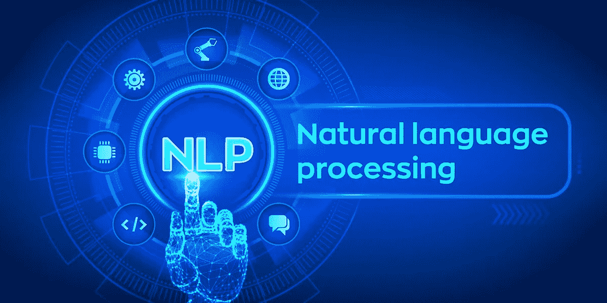

# NLP 最佳人工智能/人工智能研究论文

> 原文：<https://medium.datadriveninvestor.com/best-ai-ml-research-papers-for-nlp-a39de074eff6?source=collection_archive---------12----------------------->

## 惊人的论文…

Pic credits : Pinterest

# 知识密集型自然语言处理任务的检索增强生成

*作者:Patrick Lewis、Ethan Perez、Aleksandara Piktus、Fabio Petroni、Vladimir Karpukhin、Naman Goyal、Heinrich Küttler、迈克·刘易斯、Wen-tau Yih、Tim rocktschel、Sebastian Riedel、Douwe Kiela*

# 抽象—

大型预训练语言模型已被证明在其参数中存储事实知识，并在下游 NLP 任务上进行微调时实现最先进的结果。然而，它们访问和精确操作知识的能力仍然有限，因此在知识密集型任务上，它们的性能落后于特定任务的体系结构。此外，为他们的决策提供出处和更新他们的世界知识仍然是开放的研究问题。具有对显式非参数记忆的可区分访问机制的预训练模型可以克服这个问题，但迄今为止只对提取下游任务进行了研究。我们探索了一种通用的检索增强生成(RAG)微调方法——结合预训练参数和非参数记忆的语言生成模型。我们引入 RAG 模型，其中参数记忆是预训练的 seq2seq 模型，非参数记忆是维基百科的密集向量索引，通过预训练的神经检索器访问。我们比较了两个 RAG 公式，一个以整个生成序列中相同的检索段落为条件，另一个可以对每个令牌使用不同的段落。我们在广泛的知识密集型 NLP 任务上微调和评估了我们的模型，并在三个开放域 QA 任务上设置了最先进的技术，优于参数 seq2seq 模型和特定于任务的检索和提取架构。对于语言生成任务，我们发现 RAG 模型比最先进的仅含参数的 seq2seq 基线生成更具体、多样和真实的语言。

***论文可以在这里找到:***

[https://arxiv.org/pdf/2005.11401v2.pdf](https://arxiv.org/pdf/2005.11401v2.pdf)

***代码可以在这里找到:***

 [## 拥抱脸/变形金刚

### PyTorch 和 TensorFlow 2.0 的最新自然语言处理技术🤗变形金刚提供了成千上万的…

github.com](https://github.com/huggingface/transformers)  [## deepset-ai/haystack

### Haystack 是一个用于问答和神经搜索的端到端框架，它使您能够......在…中提问

github.com](https://github.com/deepset-ai/haystack) 

# 关于高效的神经网络，计算机视觉能教给 NLP 什么？

由 Forrest N. Iandola，Albert E. Shaw，Ravi Krishna，Kurt W. Keutzer

# 抽象—

人类每天读写数千亿条信息。此外，由于大型数据集、大型计算系统和更好的神经网络模型的可用性，自然语言处理(NLP)技术在理解、校对和组织这些消息方面取得了重大进展。因此，在无数的应用程序中部署 NLP 来帮助 web 用户、社交网络和企业是一个很好的机会。特别是，我们认为智能手机和其他移动设备是大规模部署 NLP 模型的重要平台。然而，今天的高度精确的 NLP 神经网络模型，如 BERT 和 RoBERTa，在计算上极其昂贵，BERT-base 需要 1.7 秒来对 Pixel 3 智能手机上的文本片段进行分类。在这项工作中，我们观察到，分组卷积等方法已经为计算机视觉网络带来了显著的加速，但其中许多技术尚未被 NLP 神经网络设计者采用。我们演示了如何用分组卷积替换自我关注层中的几个操作，我们在一个名为 SqueezeBERT 的新网络架构中使用了这一技术，该架构在 Pixel 3 上的运行速度比 BERT-base 快 4.3 倍，同时在 GLUE 测试集上实现了具有竞争力的准确性。

***论文可以在这里找到:***

【https://arxiv.org/pdf/2006.11316v1.pdf 

# FLAIR:一个易于使用的最新自然语言处理框架

*艾伦·阿克比克、塔尼亚·博格曼、邓肯·布莱斯、卡希夫·拉苏尔、斯特凡·施韦特、罗尔·沃尔格拉夫*

# 抽象—

我们提出了 FLAIR，这是一个 NLP 框架，旨在促进最先进的序列标记、文本分类和语言模型的培训和分发。该框架的核心思想是为概念上非常不同的 word 和 document 嵌入类型提供一个简单、统一的接口。这有效地隐藏了所有嵌入特定的工程复杂性，并允许研究人员毫不费力地混合和匹配各种嵌入。该框架还实现了标准模型训练和超参数选择例程，以及可以下载公开可用的 NLP 数据集并将其转换为数据结构以快速设置实验的数据获取模块。最后，FLAIR 还附带了一个预训练模型的{ ` }模型动物园{''}，允许研究人员在他们的应用程序中使用最先进的 NLP 模型。本文概述了该框架及其功能。

***论文可以在这里找到:***

[https://www.aclweb.org/anthology/N19-4010](https://www.aclweb.org/anthology/N19-4010)

***代码可以在这里找到:***

 [## flairNLP/flair

### 最先进的自然语言处理的一个非常简单的框架。由柏林洪堡大学和朋友开发。重要的是…

github.com](https://github.com/zalandoresearch/flair) 

# PyText:从 NLP 研究到生产的无缝路径

*作者:Ahmed Aly、Kushal Lakhotia、赵世聪、Mrinal Mohit、Barlas Oguz、Abhinav Arora、Sonal Gupta、Christopher、Stef Nelson-Lindall、Rushin Shah*

 [## 机器学习和人工智能如何改变电子商务的面貌？|数据驱动…

### 电子商务开发公司，现在，整合先进的客户体验到一个新的水平…

www.datadriveninvestor.com](https://www.datadriveninvestor.com/2020/11/19/how-machine-learning-and-artificial-intelligence-changing-the-face-of-ecommerce/) 

# 抽象—

我们介绍 py text——一个基于深度学习的 NLP 建模框架，建立在 PyTorch 之上。PyText 解决了快速实验和大规模模型服务这两个经常发生冲突的需求。它通过为模型组件提供简单且可扩展的接口，并使用 PyTorch 的导出模型的功能，通过优化的 Caffe2 执行引擎进行推理，从而实现了这一点。我们报告了自己将实验和生产工作流迁移到 PyText 的经验，这使我们能够更快地迭代新的建模想法，然后无缝地将它们以工业规模发布。

***论文可以在这里找到:***

[https://arxiv.org/pdf/1812.08729v1.pdf](https://arxiv.org/pdf/1812.08729v1.pdf)

***代码可以在这里找到:***

 [## facebookresearch/pytext

### PyText 是一个基于深度学习的 NLP 建模框架，构建于 PyTorch 之上。PyText 解决了经常发生冲突的…

github.com](https://github.com/facebookresearch/pytext) 

# 使用 OpenSeq2Seq 为自然语言处理和语音识别进行混合精度训练

*作者:Oleksii Kuchaiev、Boris Ginsburg、Igor Gitman、Vitaly Lavrukhin、Jason Li、Huyen Nguyen、Carl Case、Paulius Micikevicius*

# 抽象—

我们提出了 openseq 2 seq——一个基于 TensorFlow 的工具包，用于训练序列到序列模型，其特点是分布式和混合精度训练。机器翻译和语音识别任务的基准测试表明，使用 OpenSeq2Seq 构建的模型提供了一流的性能，而训练时间减少了 1.5-3 倍。OpenSeq2Seq 目前为解决包括神经机器翻译、自动语音识别和语音合成在内的广泛任务的模型提供构建块。

***论文可以在这里找到:***

[https://arxiv.org/pdf/1805.10387v2.pdf](https://arxiv.org/pdf/1805.10387v2.pdf)

***代码可以在这里找到:***

 [## NVIDIA/OpenSeq2Seq

### OpenSeq2Seq 的主要目标是让研究人员最有效地探索各种序列间模型。的…

github.com](https://github.com/NVIDIA/OpenSeq2Seq) 

参考文献和致谢—

 [## arXiv.org

### arXiv 是一个免费的分发服务和开放存取的档案库，包含 1，721，837 篇学术文章，涉及领域包括…

arxiv.org](https://arxiv.org/) 

## 访问专家视图— [订阅 DDI 英特尔](https://datadriveninvestor.com/ddi-intel)