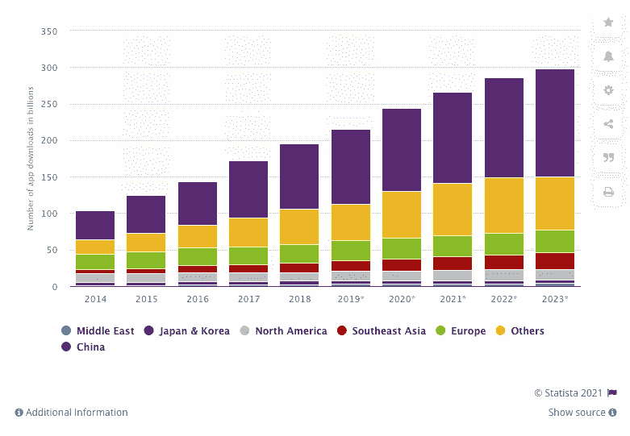
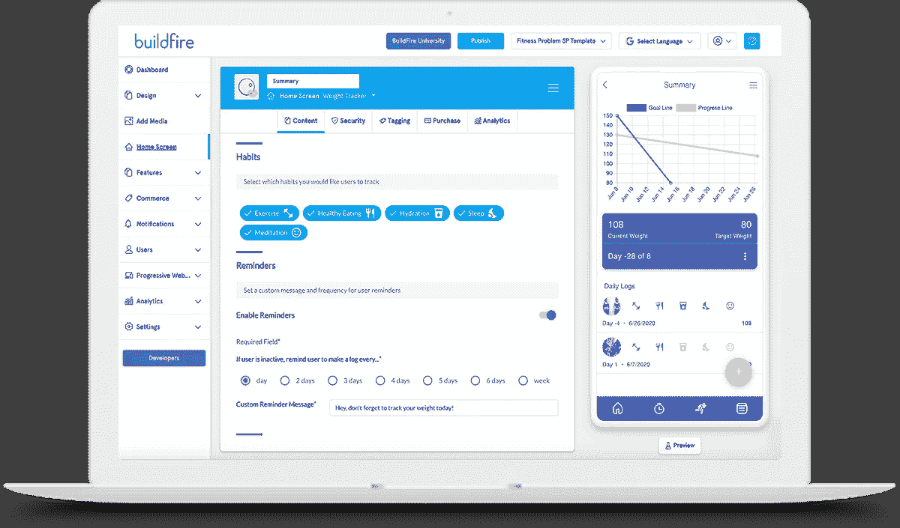

# 2021 年最佳 App 开发软件[榜单]

> 原文：<https://medium.datadriveninvestor.com/best-app-development-software-in-2021-list-b3634e213129?source=collection_archive---------26----------------------->

选择 2021 年提供的最佳应用程序开发软件，让您的技术顺利起步

# 2021 年最佳 App 开发软件[榜单]

2020 年远不可预测。但是，研究人员预测的应用程序下载量的增长被证明是真实的。现在，我们没有水晶球，但我们和 [Statista](https://www.statista.com/statistics/266488/forecast-of-mobile-app-downloads/) 愿意打赌移动应用程序的使用将在 2021 年继续上升。这就解释了为什么会有这么多软件公司冒出来，声称提供应用程序开发中的下一个最好的东西。从构建、购买到开展业务，每个人都想参与应用程序相关的活动。我们没有在 YouTube 的研究中钻牛角尖，而是收集了一些我们认为适合各种情况的最好的应用程序开发软件提供商。

# 最佳 DIY 应用开发软件:Appy Pie

[Appy Pie](https://www.appypie.com/app-builder/appmaker) 作为每个人最喜欢的无代码平台，在整个技术领域迅速赢得了声誉。Appy Pie 的使命很明确:将软件开发的力量给予每个人——甚至是最不擅长技术的企业家。通过收购 AppMakr，任何人都可以通过三个简单的步骤为 iOS 和 Android 构建一个快速、响应迅速的移动应用程序:输入应用程序名称、添加功能和发布应用程序。这些本地应用程序配备了 API、GPS、推送通知等等，都是通过拖放编辑器构建的。借助 Appy Pie 快速、经济且易于使用的平台，企业可以在没有典型应用程序开发的财务或时间投入的情况下提高利润

# 面向小型企业的最佳应用开发软件:React Native

[React Native](https://www.thesunflowerlab.com/blog/top-framework-for-small-business-app-development/) 是由脸书公司创建的开源移动应用框架。React Native 在移动应用开发社区中迅速流行起来。这个框架帮助开发人员构建一个用单一代码基语言编写的跨平台应用程序，就像本地应用程序开发一样好。一些最大的应用程序，如 Instagram、彭博、特斯拉、Skype、优步、沃尔玛等都是使用 React Native 构建的。但是，React Native 非常适合小型企业应用程序开发，原因也有很多。随着时间的推移，它不仅提高了敏捷性和可伸缩性，而且在 React Native 中构建也是经济高效和高度可靠的。点击查看它的其他好处[。](https://www.thesunflowerlab.com/blog/top-framework-for-small-business-app-development/)

# 美丽产品最佳 App 开发软件:Flutter

Flutter 是 Google 的 UI 工具包，用于从单一代码库为移动、web 和桌面构建漂亮的本地编译应用程序。现在它的性能和速度正以指数级增长，每天都有成千上万的开发人员在开发应用程序。那么，我们有一个秘密来帮助你从成千上万的开发者中脱颖而出。 DevTools 是一套针对 Dart 和 Flutter 的性能和调试工具。它目前处于测试版，但正在积极开发中。以下是您可以使用 DevTools 做的一些事情:

*   检查一个 Flutter 应用的 UI 布局和状态。
*   颤振或飞镖应用程序的 CPU 分析。
*   颤振应用程序的网络分析。
*   Flutter 或 Dart 应用程序的源代码级调试。
*   分析代码和应用程序大小。

要了解更多关于 Flutter 的信息，请查看[Flutter 的基础构建模块:布局部件第 1 部分](https://www.thesunflowerlab.com/blog/fundamental-building-blocks-of-flutter-layout-widgets-part-1/)和[第 2 部分](https://www.thesunflowerlab.com/blog/fundamental-building-blocks-of-flutter-layout-widgets-part-2/)。

# 获得强大体验的最佳应用开发软件:BuildFire

[BuildFire](https://buildfire.com/) 是当今市场上最流行、最通用的基于云的移动应用开发软件解决方案之一。这款强大的软件可用于创建任何类型的应用程序，无需编码。超过 10，000 名移动应用程序所有者发现了 BuildFire 的力量，包括 PayPal、Cisco、Travelers、Pandora 和其他行业领导者。凭借一系列内置功能和强大的分析产品，BuildFire 正在像野火一样蔓延。

# 最佳合作应用开发软件公司:向日葵实验室

找到最好的应用开发软件很重要，但在你的产品跨过终点线之前，还有很多工作要做。您必须考虑安全包、营销策略和技术支持。要在一个专业的地方获得所有最好的框架、技术专家和客户支持，请寻求[向日葵实验室](http://thesunflowerlab.com/)的帮助。我们在帮助客户解决最困难的技术问题方面享有盛誉。我们拥有多元化的投资组合，涵盖汽车、娱乐、医疗保健等行业。凭借终身学习的心态，我们的团队没有克服不了的挑战。因此，2021 年，无论你为我们准备了什么，请拿出来吧——我们能够应对！