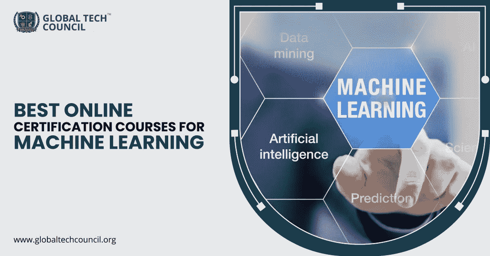

# 机器学习最佳在线认证课程

> 原文：<https://medium.datadriveninvestor.com/best-online-certification-courses-for-machine-learning-8f92c47b5186?source=collection_archive---------13----------------------->

如果你已经来到这里，那么你的主要兴趣将是了解不同的机器学习课程，为什么不呢，这是发展最快的领域之一，几乎在各行各业都有应用。从简单的应用程序到运行各种业务操作的复杂算法，机器学习已经成为最受追捧的应用程序之一，对机器学习专家的需求也是如此。如果你也是那些正在寻找一些最好的 [**机器学习课程**](https://www.globaltechcouncil.org/certifications/certified-machine-learning-expert/?utm_source=Article%20Submission&utm_medium=Off%20Page&utm_campaign=KM%2007%2F08%2F2020) 的技术极客之一，我们已经策划了这 5 个最好的项目，你可以考虑。

# **这些是在线机器学习课程，会帮助你成为机器学习专家。**

## **让我们一起探索:**

**1。认证机器学习专家-** 我们名单上的第一个机器学习认证项目是认证机器学习专家。全球技术委员会提供这个项目。该计划在线运行，涵盖了机器学习的所有方面，从基础到涉及学习应用的各个方面。作为该认证课程的一部分，您还将了解到**编程语言 Python** ，这是机器学习培训的重要组成部分。这种机器学习培训计划最适合学生和专业人士。因此，如果你希望成为一名机器学习专家，他的认证计划对你来说是必须的。

**课程费用** : ₹10,655

**课程时长** : 4 小时培训计划

**授课方式:**在线

**2。机器学习和人工智能方面的专业证书课程**——如果你希望作为一名机器学习专家获得良好的职业发展，拥有关于人工智能的简要知识也是必不可少的。这个证书课程需要关于机器学习和人工智能的所有细节和信息。成功完成本课程后，你将精通人工智能和机器学习的概念。同时，你也获得了关于你所学概念的实施的可操作的知识。这门课程由麻省理工学院的一些最优秀的专家提供，他们将帮助你掌握尖端技术，如机器学习和人工智能系统。

**课程费用:**每门课程 2500-5500 美元

**课程持续时间**:各不相同

**教学方式**:在线

3.**使用 TensorFlow 在 Google 云平台上进行机器学习专业化认证-** 该机器学习认证计划包含 5 门不同的课程，将为您提供关于机器学习的所有知识和信息。它由入门课程组成，还重点介绍了 Tensorflow，这是一个开源的机器学习框架。除此之外，您还将获得实践经验，以便您可以磨练机器学习的概念并了解其实现。

**注册:**每两个月在 Coursera 上

**课程时长:** 9 周(自定进度)

**授课方式:**在线

**4。** **机器学习斯坦福在线-** 这也是斯坦福在线提供的最著名的机器学习认证项目之一。你会了解统计模式识别和机器学习。作为该认证计划的一部分，人们还可以了解机器学习的应用和机器算法的开发。

课程费用: $5040

**课程时长** : 3 个月

**授课方式:**在线

**5。eCornell 机器学习证书**——下一个你可以选择的认证项目是康奈尔的机器学习证书项目。它明确了机器学习基础的所有概念，以及使用 Python 实现机器学习的所有概念。如果你想成为机器学习专家，你需要了解的编程语言是 Python。通过这个认证项目，你可以深入了解机器学习的概念，以及使用 Python 来准备算法。

除了从事机器学习项目，你还将了解实时数据的算法实现。您将学习如何调试和排除程序故障。您还将探索神经网络的工作方式，以及如何为多样化的数据构建和调整神经网络。

**报名:**全年

**课程费用:**$ 3600 或$ 565/月

病程: 3.5 个月

**授课方式:**在线

**先决条件:** Python

这是五个最受欢迎的 [**机器学习认证项目**](https://www.globaltechcouncil.org/certifications/certified-machine-learning-expert/?utm_source=Article%20Submission&utm_medium=Off%20Page&utm_campaign=KM%2007%2F08%2F2020) 。这个项目最好的部分是你将了解机器学习的概念及其应用。而且这些程序都是在线运行的，所以你可以在自己的舒适区轻松学习。

## **收尾**

机器学习将成为未来变革的关键驱动力。事实上，它带来了商业运作模式的改变。它是，并且将是未来时代最需要的技能之一，如果你希望成为这一领域的专家，机器学习认证是必须的。

根据上面的清单或你选择的计划，你可以创造一条成功的职业生涯之路。关于机器学习和联盟认证计划的更多更新，请继续回到 [**全球技术委员会**](https://www.globaltechcouncil.org/?utm_source=Article%20Submission&utm_medium=Off%20Page&utm_campaign=KM%2007%2F08%2F2020) 。