# 最佳实践:使用 Keras 进行高级深度学习

> 原文：<https://medium.datadriveninvestor.com/best-practices-advanced-deep-learning-with-keras-a183985a0a07?source=collection_archive---------15----------------------->

这个博客将帮助我们探索各种工具，这些工具将使我们更接近解决难题的最新发展水平。使用 Keras functional API，我们可以构建一个类似图形的模型，跨不同的输入共享各层。Keras 回调和 Tensorboard 可视化工具允许我们在训练期间监控模型。

**Keras 功能 API:超越顺序模型**

当我们谈论训练神经网络时，序列模型是非常常见的。它只有一个输入和一个输出，由线性层叠组成。

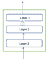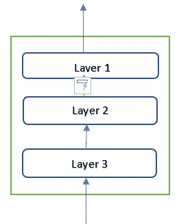

顺序模型

一些场景需要多模态输入，我们将来自不同来源的数据合并，并在神经网络中进行处理。

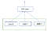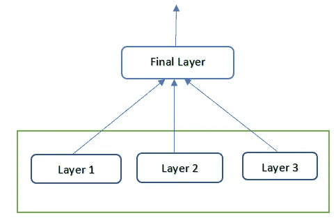

此外，在神经网络结构中有许多发展需要非线性拓扑。有三种类型的用例——多输入模型、多输出模型和类似图形的模型。

**简介:**

在函数 API 中，我们直接处理张量，使用层作为取张量和返回张量的函数。

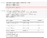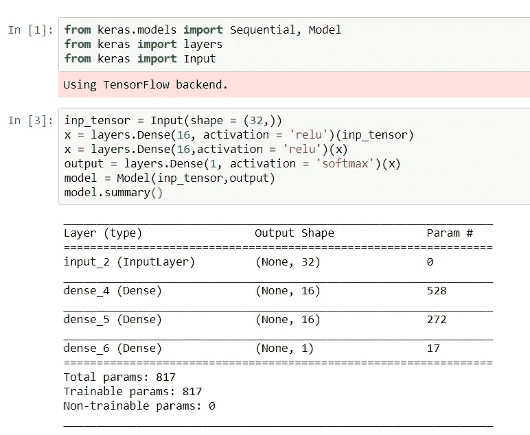

代码中唯一令人惊讶的部分是“模型”对象的使用。这里，**模型**由输入张量和输出张量实例化。在图片背后，Keras 检索了从输入张量到输出张量所涉及的所有层，将它们整合到一个类似图形的数据结构中。

 [## 深度学习用 7 个步骤解释-更新|数据驱动的投资者

### 在深度学习的帮助下，自动驾驶汽车、Alexa、医学成像-小工具正在我们周围变得超级智能…

www.datadriveninvestor.com](https://www.datadriveninvestor.com/2019/01/23/deep-learning-explained-in-7-steps/) 

**多输入型号:**

函数式 API 可用于构建具有多个输入的模型。这种类型的模型总是有一个我们可以组合它们不同输入的点:通过添加它们或者连接它们。

这通常通过 Keras 合并操作完成，例如 **keras.layers.add** ，**Keras . layers . concatenate**。

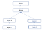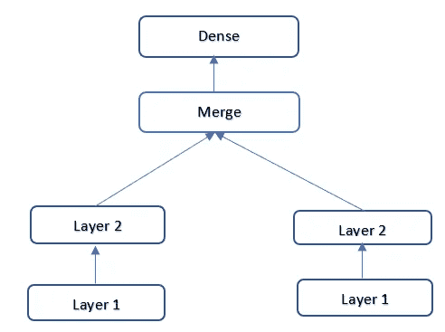

**多输出型号:**

以同样的方式，函数式 API 可以用于构建具有多个输出的模型。

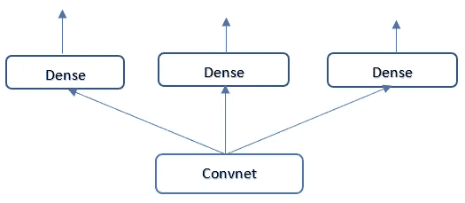

重要的是，训练这样的模型需要为网络的不同头部指定不同损失函数的能力。一种情况可能是回归，另一种情况可能是需要不同训练过程的二元分类。但是因为梯度下降要求我们最小化一个标量，所以我们必须将这些损失组合成单个值，以便训练模型。组合不同损失的最简单方法是将它们相加。在 Keras 中，对于不同的输出，我们可以在编译到不同的对象时使用一个损失列表或字典:得到的损失值被加到一个全局损失中，该损失在训练期间被最小化。

请注意，非常不平衡的损失贡献将导致模型表示优先针对具有最大个体损失的任务进行优化，而以另一个任务为代价。为了补救这一点，我们可以根据损失价值对最终损失的贡献程度来分配不同的重要性级别。

**层的有向无环图:**

在 functional API 中，我们还可以实现具有复杂内部拓扑的网络。Keras 中的神经网络可以是任意层的有向无环图。限定词“非循环的”很重要:这些图不能有循环。张量 x t 不可能成为生成 x 的另一层的输入。唯一允许的处理循环(即循环连接)是循环层内部的处理循环。

几个常见的神经网络组件以图形形式实现:

1.初始模块

2.残留连接。

初始模块:

盗梦空间模型是由 Christian Szegedy 在 2013-14 年开发的。它包含分成并行分支的小独立模块。初始模块的最基本形式具有三个或四个分支，以 1x1 卷积开始，随后是 3x3 卷积，并以结果特征的连接结束。

这种设置有助于网络分别学习空间特征和通道特征，这比联合学习它们更有效。

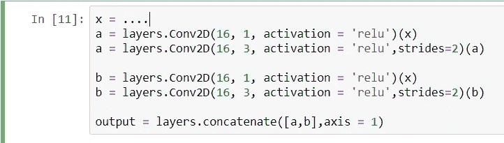

**剩余连接:**

这是微软在 2015 年开发的。它处理深度学习模型中的两个主要问题:消失梯度和表示瓶颈。一般来说，向任何超过 10 层的模型添加剩余连接是有益的。

剩余连接有效地将前一层的输出作为后一层的输入，有效地在 q 序列网络中创建了捷径。不是连接到后面的激活，而是将前面的激活与后面的激活相加，这假定两者的大小相同。如果它们是不同的形状，我们可以使用线性变换将其调整为目标形状。

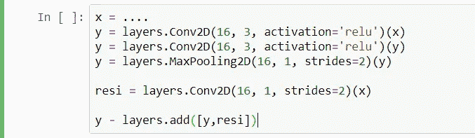