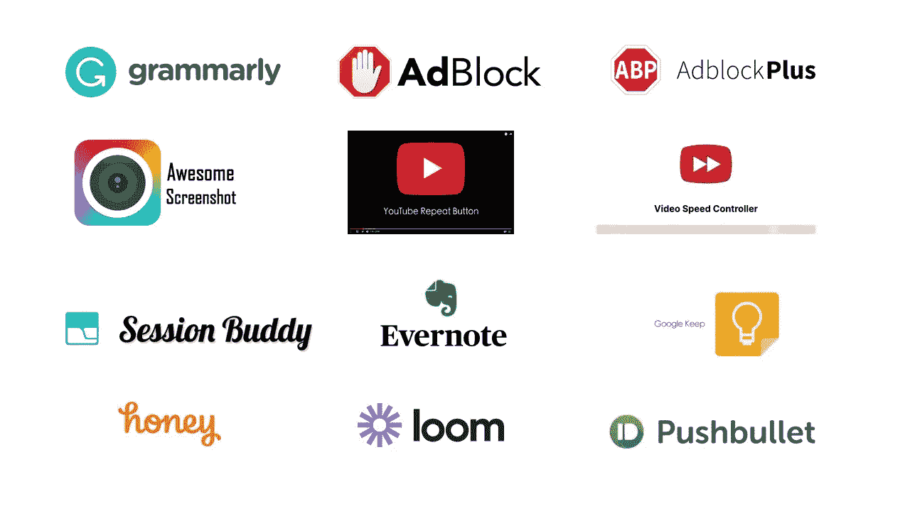

# 最佳 windows chrome 扩展将于 2021 年发布

> 原文：<https://medium.datadriveninvestor.com/best-productive-windows-chrome-extensions-to-follow-in-2021-7b6198f35de5?source=collection_archive---------42----------------------->

我们中的许多人已经习惯了 chrome 浏览器和它的一些功能。为了方便用户和提高他们的工作效率，可以在 chrome 浏览器中安装一些程序，这些程序可以改变或激发浏览器的某些功能，这些程序被称为扩展。今天我将描述一些最有用的 chrome 扩展，这些扩展几乎是我在谷歌 chrome 之旅的最开始就一直在使用的。这些扩展非常有用和有效。希望这对用户各方面肯定有帮助。因此，不再拖延，让我们讨论扩展:

My favorite Chrome extensions

1.  [**语法上**](https://chrome.google.com/webstore/detail/grammarly-for-chrome/kbfnbcaeplbcioakkpcpgfkobkghlhen) **:** 超过 1000 万用户利用语法扩展。它使用起来更加友好，写任何东西都非常有效。就像现在，我正在利用语法扩展写这个故事。从语法上消除写作错误是最好的选择。你可以在博客、在线写论文和任何地方使用它。即使你在写作上非常谨慎，我也建议你遵循这个扩展。它对用户非常友好，在书写适当的英语时非常方便。即使有免费版的 Grammarly，你也可以让你的英语更加标准，更加准确。如果你在访问这个扩展时需要帮助，那么你可以跟随这个 [**视频**](https://www.youtube.com/watch?v=wyw9CMQG9OI&ab_channel=RamNJavaTutorial) 。
2.  [**Adblock**](https://chrome.google.com/webstore/detail/adblock-for-youtube/cmedhionkhpnakcndndgjdbohmhepckk) **或** [**Adblock plus**](https://chrome.google.com/webstore/detail/adblock-plus-free-ad-bloc/cfhdojbkjhnklbpkdaibdccddilifddb) :大多数时候，我们会访问很多网站，在这些网站上，我们会遇到无数令人不快且不相关的广告，而这些广告并不是我们所期望的。有时候也有点尴尬。为了避免这种情况，您可以使用[**Adblock**](https://chrome.google.com/webstore/detail/adblock-for-youtube/cmedhionkhpnakcndndgjdbohmhepckk)**或[**Adblock 加**](https://chrome.google.com/webstore/detail/adblock-plus-free-ad-bloc/cfhdojbkjhnklbpkdaibdccddilifddb) 扩展。这两个工具都被大量使用(>1000 万用户)，在拦截任何带有广告的网站时都非常有效。当您使用这些广告模块时，一些网站将无法运行，但您也可以暂停特定网站的广告模块。它非常方便和有用。甚至有一款针对 youtube 的 [**广告拦截器**](https://chrome.google.com/webstore/detail/adblock-for-youtube/cmedhionkhpnakcndndgjdbohmhepckk) 也是在播放 youtube 视频时跳过广告。你也可以看看这个 [**视频**](https://www.youtube.com/watch?v=aW6AqI3dLno&ab_channel=Raqmedia) 关于如何使用这些广告拦截器。**
3.  **[**牛逼截图&截屏器**](https://chrome.google.com/webstore/detail/awesome-screenshot-screen/nlipoenfbbikpbjkfpfillcgkoblgpmj) :这个扩展是我迄今为止体验最好的一个。截图对任何用户来说都是很平常的事情。大多数时候我使用 windows 内置的截图工具来截图，但最大的限制是你只能选择标签中可见的部分。后来有一天我偶然发现了这个多功能分机。您可以记录、捕捉、编辑和创建可共享的链接，并将其上传到您的云存储中。在录制时，您可以在桌面模式、当前标签模式和仅 Cam 模式下进行录制，而在捕捉模式下，您可以捕捉可见部分、整页以及最重要的选定区域模式，在该模式下，您可以选择想要捕捉的部分，即使在开始捕捉时它是不可见的。你可以跟随这个 [**视频**](https://www.youtube.com/watch?v=nF6W1QHlMcM&ab_channel=HelloHelper) 了解更多关于神话般的延伸。
    [**【light shot】**](https://chrome.google.com/webstore/detail/lightshot-screenshot-tool/mbniclmhobmnbdlbpiphghaielnnpgdp)**是另一个不错的截图工具扩展，你可以效仿。****
4.  ****[有时候大量的标签会让 chrome 在系统中变得更重，这就是为什么保存一些标签非常重要。然后，您的浏览器中可以有有限数量的选项卡。会话伙伴可以同时完成这两项任务。它可以记录你最近的浏览历史，也可以保存会话或特定标签以备将来使用，非常方便。可以看看这个](https://chrome.google.com/webstore/detail/session-buddy/edacconmaakjimmfgnblocblbcdcpbko) [**视频**](https://www.youtube.com/watch?v=wY4NKrD1DWQ&feature=emb_logo&ab_channel=HansMeyer) 简单了解一下详情。****
5.  ****[**视频速度控制器**](https://chrome.google.com/webstore/detail/video-speed-controller/nffaoalbilbmmfgbnbgppjihopabppdk) :我确实经常使用这个扩展。我们大多数人确实会看很多视频、教程等。有时你会觉得播放速度太快或太慢，这并不是使用 youtube 内置播放速度的正确选择，要么太快，要么太慢。如果你能让回放速度达到 1.1、1.2 或 0.9、0.8，那会怎么样？这种速度非常舒适，有助于简短地观看视频。这个工具不仅适用于 youtube 视频，也适用于任何嵌入式视频。我对使用这个扩展非常满意。在这个疫情时代，大多数课程和会议都在网上举行。所以你可能要看一堆视频课程和在线课程。你可以有效地利用你的时间来观看这些视频。你也可以通过这个 [**视频**](https://www.youtube.com/watch?v=DJvpgjLVhVk&ab_channel=SabioEducation) 了解详情。****
6.  ****[**Youtube 重复按钮**](https://chrome.google.com/webstore/detail/youtube-repeat-button/aihdpnkmhcbjkfonmmfepcjjfaenobip) :我们很多人都有反复听同一首歌的意图。这个扩展对他们来说是一个极好的工具。安装此扩展将在您的 youtube 播放器中创建一个重复按钮。当你喜欢的音乐开始播放时，你可以点击重复按钮，然后开始欣赏。用了很久了，用起来得心应手。****

****这些是我最喜欢的 chrome 扩展，我每天都会碰到。有一些值得注意的地方你可以关注:[**Chrome Notepad**](https://chrome.google.com/webstore/detail/notepad/ffbhefmlcoihbjcmibbfkocmnaiacinp)**保存一些重要的笔记以便定期关注**[**Google Keep**](https://chrome.google.com/webstore/detail/google-keep-chrome-extens/lpcaedmchfhocbbapmcbpinfpgnhiddi)**保存东西**、**[**Evernote web clipper**](https://chrome.google.com/webstore/detail/evernote-web-clipper/pioclpoplcdbaefihamjohnefbikjilc)**保存你在网上看到的东西**、**[**Hola ad remover**](https://chrome.google.com/webstore/detail/hola-ad-remover/lalfpjdbhpmnhfofkckdpkljeilmogfl) [**蜜糖**](https://chrome.google.com/webstore/detail/honey/bmnlcjabgnpnenekpadlanbbkooimhnj) 获取特别针对亚马逊的优惠券**[**织机**](https://chrome.google.com/webstore/detail/loom-for-chrome/liecbddmkiiihnedobmlmillhodjkdmb) 录音**[**推钮**](https://chrome.google.com/webstore/detail/pushbullet/chlffgpmiacpedhhbkiomidkjlcfhogd) 获取手机通知以及一些信息服务。 这些是我最喜欢遵循的 chrome 扩展列表。你使用其他一些值得注意的扩展吗？随时让我知道。感谢您浏览这个故事。希望对很多不同领域的有志之士有所帮助。非常感谢任何形式的批评和建议。你可以通过我的 [**简介**](https://armanruet.medium.com/) 看看其他可用的故事。****************

****最后但同样重要的是，保持安全和健康。善待人类。让我们意识到我们周围的人疫情的情况以及需要维护的规则。“2021 年新年快乐”****

**** [## React Native 如何提高移动应用开发者的生产力？数据驱动的投资者

### React Native 是一个有益的框架，可以帮助您使用 JavaScript 设计应用程序。这种结构包括…

www.datadriveninvestor.com](https://www.datadriveninvestor.com/2020/11/30/how-react-native-improves-the-productivity-of-mobile-app-developers/) 

**进入专家视角—** [**订阅 DDI 英特尔**](https://datadriveninvestor.com/ddi-intel)****