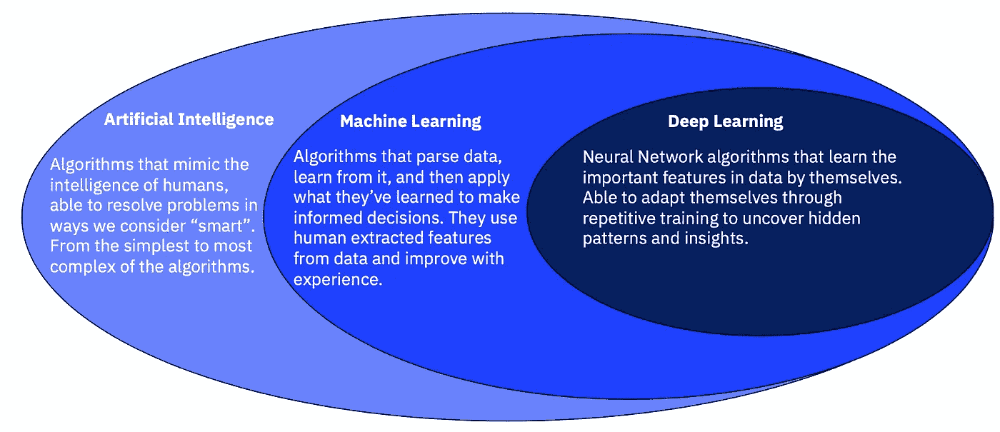
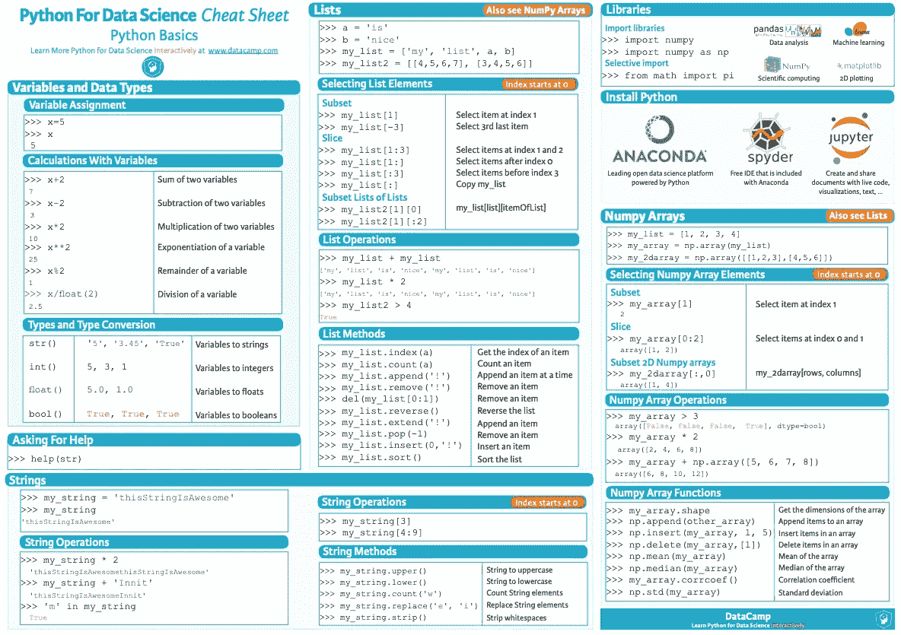
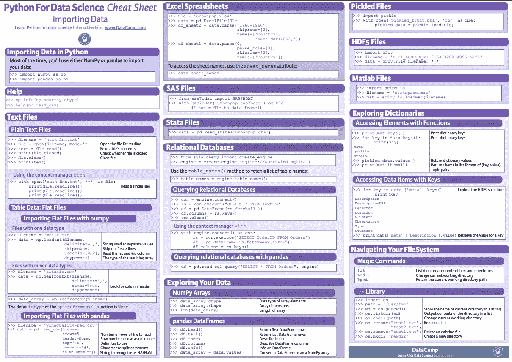
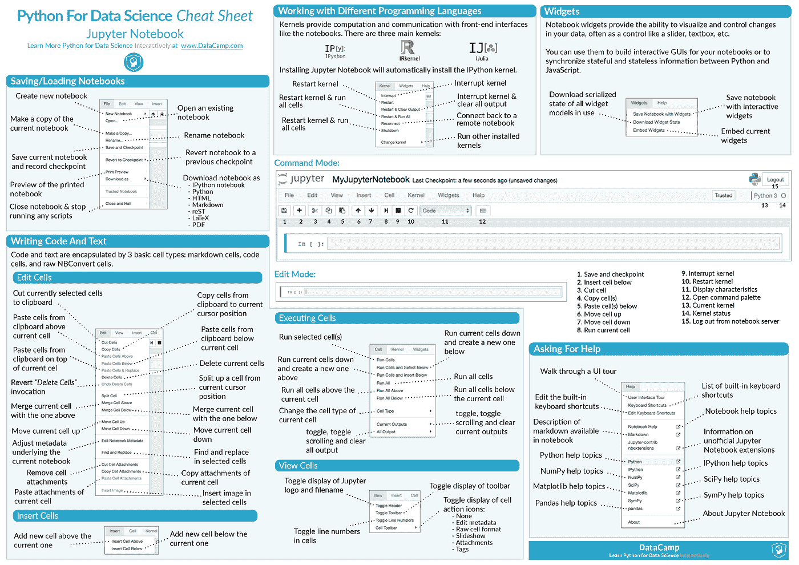
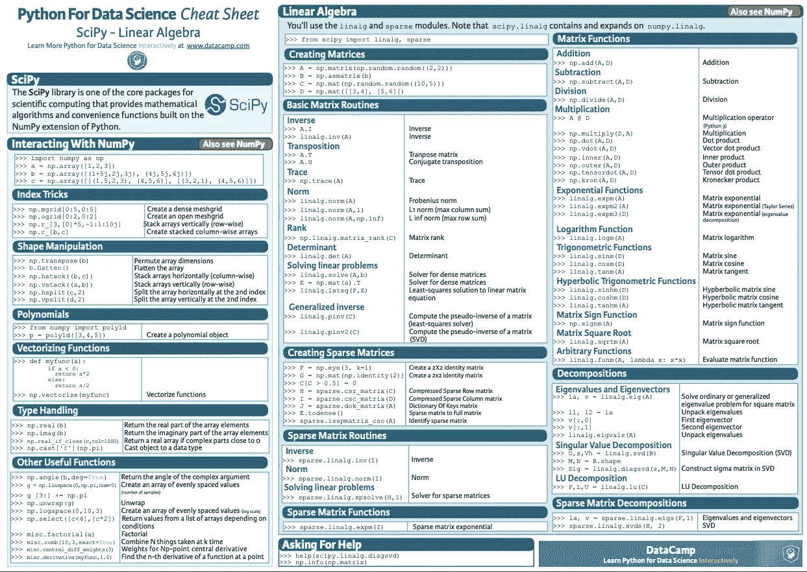
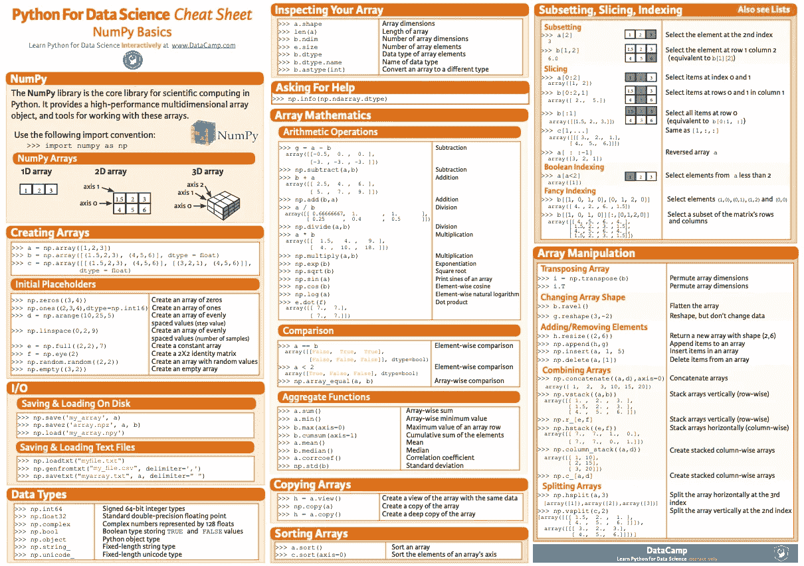
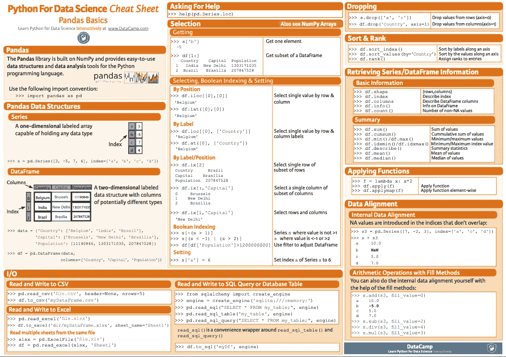
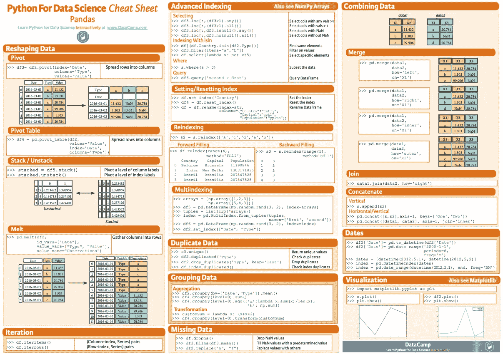

# 数据科学和机器学习的最佳资源(完整列表)

> 原文：<https://medium.datadriveninvestor.com/best-resources-for-data-science-and-machine-learning-full-list-5ceb9a2791bf?source=collection_archive---------1----------------------->

## 成为一名 rockstar 数据科学或 ML 工程师…

AI, ML, DL (Pic credits: Pinterest)

这篇文章分为 20 个部分，如下所示。每一部分都涵盖了成为伟大的数据科学家或机器学习工程师所需的最佳数据科学和机器学习资源。

 [## Stack Overflow 分析了来自 60，000 多名软件开发人员的数据，包括他们的工作时间、语言…

### 以下是他们的发现…

medium.com](https://medium.com/datadriveninvestor/stack-overflow-analyzed-data-from-60-000-software-developers-hours-they-work-languages-they-476ac6ca0197)  [## 黑客地球调查了来自 76 个国家的 16000 名开发者——以下是我的发现

### 惊人的洞察力…

medium.com](https://medium.com/datadriveninvestor/hacker-earth-surveyed-16000-developers-from-76-countries-heres-what-i-found-dbd5d7c422b0)  [## Hacker Rank 分析了来自 10 万多名开发人员和招聘经理的数据——以下是我的发现

### 来自 100，000 多名开发人员和招聘经理的出色分析结果

medium.com](https://medium.com/datadriveninvestor/hacker-rank-analyzed-data-from-100k-developers-and-hiring-managers-here-is-what-i-found-a374b98e937e) 

1.  最佳课程
2.  最佳频道和博客
3.  最佳数据科学技术——23 个数据科学技巧
4.  ML 面试问题
5.  最佳播客
6.  鲜为人知的数据科学 Python 库
7.  最佳比赛
8.  有用的 Ipython 笔记本教程/指南
9.  最佳数据集
10.  数据科学和机器学习项目
11.  新闻和时事通讯
12.  工具和流程
13.  备忘单、提示和技巧
14.  免费书籍和完整教程
15.  深度学习资源
16.  免费计算机科学，机器学习，数据科学，深度学习书籍
17.  免费计算机科学在线课程
18.  ML/数据科学项目
19.  工资、技术和工具

# 课程

# 强烈推荐您必须学习的数据科学和机器学习课程(带证书)—

> [**完成数据科学家**](https://imp.i115008.net/c/2345654/788805/11298?prodsku=nd025&u=https%3A%2F%2Fwww.udacity.com%2Fcourse%2Fdata-scientist-nanodegree--nd025&intsrc=PUI2_5678)
> 
> [**完成数据分析师**](https://imp.i115008.net/c/2345654/788805/11298?prodsku=nd002&u=https%3A%2F%2Fwww.udacity.com%2Fcourse%2Fdata-analyst-nanodegree--nd002&intsrc=PUI2_5678)
> 
> [**完成数据工程**](https://imp.i115008.net/c/2345654/788805/11298?prodsku=nd027&u=https%3A%2F%2Fwww.udacity.com%2Fcourse%2Fdata-engineer-nanodegree--nd027&intsrc=PUI2_5678)
> 
> [**完全机器学习工程师**](https://imp.i115008.net/c/2345654/788805/11298?prodsku=nd009t&u=https%3A%2F%2Fwww.udacity.com%2Fcourse%2Fmachine-learning-engineer-nanodegree--nd009t&intsrc=PUI2_5678)
> 
> [**完成深度学习**](https://imp.i115008.net/c/2345654/788805/11298?prodsku=nd101&u=https%3A%2F%2Fwww.udacity.com%2Fcourse%2Fdeep-learning-nanodegree--nd101&intsrc=PUI2_5678)
> 
> [**完成自然语言处理**](https://imp.i115008.net/c/2345654/788805/11298?prodsku=nd892&u=https%3A%2F%2Fwww.udacity.com%2Fcourse%2Fnatural-language-processing-nanodegree--nd892&intsrc=PUI2_5678)
> 
> [**完全自动驾驶汽车工程师**](https://imp.i115008.net/c/2345654/788805/11298?prodsku=nd0013&u=https%3A%2F%2Fwww.udacity.com%2Fcourse%2Fself-driving-car-engineer-nanodegree--nd0013&intsrc=PUI2_5678)

# 基础课程列表:

## 基础课程— Python 和计算机科学

*   [Udacity 用 Python 编程入门](https://imp.i115008.net/c/2345654/788805/11298?prodsku=nd000&u=https%3A%2F%2Fwww.udacity.com%2Fcourse%2Fintro-to-programming-nanodegree--nd000):最佳 Python 编程课程。
*   [用 Python 进行人工智能编程](https://imp.i115008.net/c/2345654/788805/11298?prodsku=nd089&u=https%3A%2F%2Fwww.udacity.com%2Fcourse%2Fai-programming-python-nanodegree--nd089)
*   [使用 Python 进行数据科学编程](https://imp.i115008.net/c/2345654/788805/11298?prodsku=nd104&u=https%3A%2F%2Fwww.udacity.com%2Fcourse%2Fprogramming-for-data-science-nanodegree--nd104)
*   [CS50 的计算机科学入门](https://www.edx.org/course/cs50s-introduction-to-computer-science)

## 基础课程——统计学

*   [Udacity 统计数据](https://www.udacity.com/course/statistics--st095)
*   [统计学简介](https://www.udacity.com/course/intro-to-statistics--st101)

## 基础课程— SQL

*   [学习 SQL](https://imp.i115008.net/c/2345654/788805/11298?prodsku=nd072&u=https%3A%2F%2Fwww.udacity.com%2Fcourse%2Flearn-sql--nd072)

## 基础课程——数学

*   [数据科学专业数学](https://www.coursera.org/specializations/mathematics-for-data-science)
*   [用于机器学习的微积分](https://medium.com/ai-in-plain-english/the-best-course-for-calculus-for-machine-learning-is-free-33f42e81d924?source=friends_link&sk=896ba78c7aa7e39eb58e3f16edb5c99a)

## 基础课程—数据科学

*   [Udacity 数据科学简介](https://imp.i115008.net/c/2345654/788805/11298?prodsku=nd025&u=https%3A%2F%2Fwww.udacity.com%2Fcourse%2Fdata-scientist-nanodegree--nd025):全合一(最佳课程)
*   [Python 中的数据科学简介](https://www.coursera.org/learn/python-data-analysis)

## 基础课程—数据工程师

*   [数据工程师课程](https://imp.i115008.net/c/2345654/788805/11298?prodsku=nd027&u=https%3A%2F%2Fwww.udacity.com%2Fcourse%2Fdata-engineer-nanodegree--nd027) —我认为最好的课程之一。

## 基础课程——商业经理的人工智能

*   [商业经理的 AI](https://imp.i115008.net/c/2345654/788805/11298?prodsku=nd054&u=https%3A%2F%2Fwww.udacity.com%2Fcourse%2Fai-for-business-leaders--nd054)——必修课。

想学哈佛？

 [## 哈佛大学的 10 门免费数据科学课程

### 抓住机会

medium.com](https://medium.com/ai-in-plain-english/10-data-science-courses-from-harvard-705fb36c0999) 

## 基础课程—机器学习

*   [机器学习课程介绍](https://www.udacity.com/course/intro-to-machine-learning--ud120)
*   【Tensorflow 机器学习简介
*   [Udacity 的机器学习工程师](https://imp.i115008.net/c/2345654/788805/11298?prodsku=nd009t&u=https%3A%2F%2Fwww.udacity.com%2Fcourse%2Fmachine-learning-engineer-nanodegree--nd009t):这是我上过的最好的 ML 课程之一。
*   [机器学习](https://www.edx.org/course/machine-learning)

机器学习的书籍(在下面的文章中)

 [## 机器学习工程师应该读的 6 本书

### 通过动手练习掌握 ML 的重要概念…

medium.com](https://medium.com/datadriveninvestor/6-books-machine-learning-engineers-should-read-973eb278d17c) 

## 基础课程——人工智能

*   [人工智能简介](https://www.udacity.com/course/intro-to-artificial-intelligence--cs271)

## 基础课程— Jupyter

 [## 你应该知道的 11 个 Jupyter 笔记本技术

### 成为 Jupyter 专业人员

medium.com](https://medium.com/ai-in-plain-english/11-jupyter-notebook-techniques-you-should-know-2ebeafefa303) 

# 高级课程列表:

*   [Python 专业化的应用数据科学](https://www.coursera.org/specializations/data-science-python)
*   [在 Python 中应用机器学习](https://www.coursera.org/learn/python-machine-learning)
*   吴恩达在 Coursera 上的机器学习【免费】
*   [Udacity 深度学习纳米学位基础](https://www.udacity.com/course/deep-learning-nanodegree-foundation--nd101)
*   [Udacity 人工智能纳米度](https://www.udacity.com/ai)
*   [Fast.ai 机器学习课程](http://course18.fast.ai/ml)【免费】
*   [深度学习 TensorFlow 简介](https://www.udacity.com/course/intro-to-tensorflow-for-deep-learning--ud187)【免费】
*   【PyTorch 深度学习简介
*   [自动驾驶汽车课程](https://imp.i115008.net/c/2345654/788805/11298?prodsku=nd013&u=https%3A%2F%2Fwww.udacity.com%2Fcourse%2Fself-driving-car-engineer-nanodegree--nd013):如果你追求的是计算机视觉领域。
*   [飞行汽车和自主飞行工程师](https://imp.i115008.net/c/2345654/788805/11298?prodsku=nd787&u=https%3A%2F%2Fwww.udacity.com%2Fcourse%2Fflying-car-nanodegree--nd787)

# 3.最佳频道和博客

*注意:我全都遵守了*

# Youtube 频道和视频:

*   [Andreas Kretz 的数据工程](https://www.youtube.com/channel/UCY8mzqqGwl5_bTpBY9qLMAA/videos)
*   [send ex:最佳 Python 教程](https://www.youtube.com/user/sentdex/)
*   [2020 年数据科学职业](https://www.youtube.com/watch?v=tJPURyKJAR4&list=PLaFfQroTgZnyQFq4nUfb-w2vEopN3ULMb)
*   T21:数学变得简单
*   [吴恩达:深度学习、自学学习和无监督特征学习](https://www.youtube.com/watch?v=n1ViNeWhC24)
*   [采访谷歌的 AI，深度学习采访杰弗里·辛顿](https://www.youtube.com/watch?v=1Wp3IIpssEc)
*   [Python 深度学习简介](https://www.youtube.com/watch?v=S75EdAcXHKk)
*   [制作我的第一个机器学习游戏](https://www.youtube.com/watch?v=ZX2Hyu5WoFg&list=PL0nQ4vmdWaA0mzW4zPffYnaRzzO7ZqDZ0)
*   [开始编程所需的一切！](https://www.youtube.com/watch?v=vUn5akOlFXQ&list=PL0nQ4vmdWaA3GLsZESEkBiIAEvnDEge8D)
*   [Python 中的数据分析与熊猫](https://www.youtube.com/watch?v=yzIMircGU5I&list=PL5-da3qGB5ICCsgW1MxlZ0Hq8LL5U3u9y)
*   [什么是机器学习，它是如何工作的？](https://www.youtube.com/watch?v=elojMnjn4kk)
*   [数据科学 101](https://www.youtube.com/watch?v=7XdoaQYwTeA&list=PLtqF5YXg7GLn0WWB_wQx7wHrIvbs0EH2e)
*   Hugo Larochelle 的神经网络系列视频
*   [谷歌 DeepMind 联合创始人谢恩·莱格——机器超级智能](https://www.youtube.com/watch?v=evNCyRL3DOU)
*   [数据科学初级读本](https://www.youtube.com/watch?v=cHzvYxBN9Ls&list=PLPqVjP3T4RIRsjaW07zoGzH-Z4dBACpxY)
*   [AI 101](https://www.youtube.com/playlist?list=PL_-uv7N8XX4OitDyERnkCp9O80_jpvIx6)
*   [评估您的数据科学项目](https://www.youtube.com/watch?v=_K6cNdgN3CI&list=PL2zq7klxX5ARwEq13TVSxcKmx6pVv2R2B)
*   [从零开始的数据科学项目](https://www.youtube.com/watch?v=MpF9HENQjDo&list=PL2zq7klxX5ASFejJj80ob9ZAnBHdz5O1t)
*   [获得数据科学工作的 5 个技巧【面试】](https://www.youtube.com/watch?v=iVq3qcNWayw)
*   两分钟论文:卡罗里·佐尔奈-费希尔展示了关于最新人工智能和科学研究进展的简短摘要视频。

# Twitter 账户:

*   [数据科学中心](https://twitter.com/DataScienceCtrl)
*   [Clare Corthell](https://twitter.com/clarecorthell) —开发、设计、数据科学@mattermark #hackerei
*   [数据科学伦敦](https://twitter.com/ds_ldn)数据科学。大数据。数据黑客。数据迷。
*   [数据科学报告](https://twitter.com/TedOBrien93) —任务是帮助指导&推进数据科学&分析的职业发展。
*   [数据科学提示](https://twitter.com/datasciencetips)
*   [德鲁·康威](https://twitter.com/drewconway)——数据呆子，黑客，冲突的学生。
*   [数据风暴](https://twitter.com/DataVisualizati) —数据、安全、军事
*   [艾琳·巴托洛](https://twitter.com/erinbartolo)——与大数据一起运行
*   格雷格·瑞达在 GrubHub 研究数据和熊猫
*   DJ Patil —白宫数据主管，副总裁@ RelateIQ。
*   格雷戈里·皮亚泰茨基——KD nuggets 总裁
*   [哈坎·卡尔达斯](https://twitter.com/hakan_kardes) —数据科学家
*   [希拉里·梅森](https://twitter.com/hmason)——常驻@accel 的数据科学家。
*   Jeff Hammerbacher 转发关于数据科学的消息
*   约翰·迈尔斯·怀特是脸书和茱莉亚·开发商的科学家。《黑客机器学习》的作者。
*   朱莉娅·伊文思 —黑客—熊猫—数据分析
*   《经济学人》的数据编辑和《大数据》的合著者
*   [凯文·马卡姆](https://twitter.com/justmarkham)——数据科学讲师，[数据学校](http://www.dataschool.io/)创始人
*   Kim Rees —交互式数据可视化和工具。数据漫游者。
*   琳达·瑞格伯——数据说书人，可视化。
*   [路易斯·雷](https://twitter.com/lmrei)——博士生。编程，移动，网络。人工智能。
*   [Mark Stevenson](https://twitter.com/Agent_Analytics)—Salt 的数据分析招聘专家
*   马修·拉塞尔——挖掘社交网络。
*   [biz qualify 的数据科学家、开发人员梅尔特·努奥卢](https://twitter.com/mertnuhoglu)
*   [Monica Rogati](https://twitter.com/mrogati)——Jawbone 的数据。
*   [彼得·斯科莫罗奇](https://twitter.com/peteskomoroch)——创造智能系统来自动化任务&改善决策。
*   Quora 数据科学 Quora 的数据科学主题
*   兰迪·奥尔森——研究人工智能的计算机科学家。数据修补者。
*   [Recep Erol](https://twitter.com/EROLRecep) —数据科学极客@ UALR
*   [Ryan Orban](https://twitter.com/ryanorban) —数据科学家、基因折纸专家、硬件爱好者
*   肖恩·j·泰勒——社会科学家。黑客。脸书数据科学团队。
*   [西尔维娅·k·斯皮娃](https://twitter.com/silviakspiva)—#思科的数据科学
*   BBVA 指南针公司的数据科学家哈什·b·古普塔
*   斯潘塞·尼尔森——数据呆子
*   [诺亚·伊利金斯基](https://twitter.com/noahi) —可视化&交互设计师。实用的自行车手。
*   [保罗·米勒](https://twitter.com/PaulMiller) —云计算/大数据/开放数据分析师&顾问。作家、演讲人&主持人。Gigaom 研究分析师。
*   [Tasos Skarlatidis](https://twitter.com/anskarl) —复杂事件处理、大数据、人工智能和机器学习。对编程和开源充满热情。
*   [特里·蒂姆科](https://twitter.com/Terry_Timko)—info gov；Bigdata 数据即服务；数据科学；开放、社交&商业数据融合
*   [托尼·奥赫达](https://twitter.com/tonyojeda3) —数据科学家|作者|企业家。联合创始人@DataCommunityDC。
*   [慧眼](https://twitter.com/WileyEd) —高级经理—@希捷大数据分析

# 脸书账户:

*   [数据科学 101](https://www.facebook.com/DataScience101)
*   [大数据科学家](https://www.facebook.com/Bigdatascientist)
*   [数据科学技术与公司](https://www.facebook.com/DataScienceTechnologyCorporation?ref=br_rs)
*   [数据科学中心](https://www.facebook.com/centerdatasciences?ref=br_rs)
*   [大数据、数据科学、数据挖掘&统计学](https://www.facebook.com/groups/bigdatastatistics/)
*   [BigData/Hadoop 专家](https://www.facebook.com/groups/BigDataExpert/)
*   [数据科学博客](https://www.facebook.com/theDataScienceBlog/)

# 博客:

*   安德烈亚斯·米勒
*   [安德烈·卡帕西的博客](http://karpathy.github.io/)
*   [Airbnb 数据博客](https://medium.com/airbnb-engineering/tagged/data-science)
*   一个人类工程师的博客
*   [高级分析& R](http://advanceddataanalytics.net/)
*   [数据世界的冒险](http://blog.smola.org)
*   [Algobeans |数据分析教程&外行人的实验](https://algobeans.com)
*   [亚马逊 AWS AI 博客](https://aws.amazon.com/blogs/ai/)
*   [分析 Vidhya](http://www.analyticsvidhya.com/blog/)
*   [漂亮的数据](http://beautifuldata.net/)
*   [成为数据科学家](http://www.becomingadatascientist.com/)
*   [伯克利人工智能研究](http://bair.berkeley.edu/blog/)
*   [神经网络博客](http://yerevann.github.io/)
*   [关于科学和编程的绝妙错误想法](https://arogozhnikov.github.io/)
*   [Naina Chaturvedi Tech](https://medium.com/@Naina04)
*   [Cloudera 数据科学帖子](http://blog.cloudera.com/blog/category/data-science/)
*   [Cortana 智能和机器学习博客](https://blogs.technet.microsoft.com/machinelearning/)
*   [基于数据的发明](http://datalab.lu/)
*   [数据博主](https://www.data-blogger.com/)
*   [数据实验室](http://blog.insightdatalabs.com/)
*   [数据挖掘研究](http://www.dataminingblog.com/)
*   [数据挖掘:文本挖掘、可视化和社交媒体](http://datamining.typepad.com/data_mining/)
*   [数据科学 101](http://101.datascience.community/)
*   [数据科学@脸书](https://research.fb.com/category/data-science/)
*   [数据科学道场博客](https://blog.datasciencedojo.com/)
*   [数据科学洞察](http://www.datasciencebowl.com/data-science-insights/)
*   [数据科学教程](https://codementor.io/data-science/tutorial)
*   [数据科学笔记本](http://uconn.science/)
*   [数据探索博客](https://www.dataquest.io/blog/)
*   [数据机器人](http://www.datarobot.com/blog/)
*   [深度学习](http://deeplearning.net/blog/)
*   [深碟](http://deepdish.io/)
*   [潜入数据](https://blog.datadive.net/)
*   [创业极客](http://ianozsvald.com/)
*   法比安·佩德罗戈萨
*   [快进实验室](http://blog.fastforwardlabs.com/)
*   [FastML](http://fastml.com/)
*   [满栈 ML](http://fullstackml.com/)
*   [梯度度量博客](http://gradientmetrics.com/blog)
*   [洞察数据科学](https://blog.insightdatascience.com/)
*   [杰森玩具](http://www.jtoy.net/)
*   [杰瑞米·杰克森博士](http://www.jeremydjacksonphd.com/)
*   [数据的喜悦](http://www.joyofdata.de/blog/)
*   [KDnuggets](http://www.kdnuggets.com/)
*   [大规模机器学习](http://bickson.blogspot.com/)
*   [懒惰的程序员](http://lazyprogrammer.me/)
*   [在此学习分析](https://learnanalyticshere.wordpress.com/)
*   [LearnDataSci](http://www.learndatasci.com/)
*   [用数据学习](http://learningwithdata.com/)
*   [机器学习和数据科学](http://alexhwoods.com/blog/)
*   [机器学习](https://charlesmartin14.wordpress.com/)
*   [机器学习掌握度](http://machinelearningmastery.com/blog/)
*   [机器学习博客](https://machinelearningblogs.com/)
*   [机器学习、数学和物理](https://mlopezm.wordpress.com/)
*   [模型有启发，错误](https://peadarcoyle.wordpress.com/)
*   [我对数据科学、预测分析、Python 的看法](http://shahramabyari.com/)
*   [自然语言处理博客](http://nlpers.blogspot.fr/)
*   [海王星博客:机器学习从业者深度文章](https://neptune.ai/blog)
*   [NLP 和深度学习爱好者](http://camron.xyz/)
*   [关于机器智能](https://aimatters.wordpress.com/)
*   [Peter Laurinec—R 中的时间序列数据挖掘](https://petolau.github.io/)
*   [Plotly 博客](http://blog.plot.ly/)
*   [PyImageSearch](http://www.pyimagesearch.com/)
*   [蟒游](https://jakevdp.github.io/)
*   [R 和数据挖掘](https://rdatamining.wordpress.com/)
*   拉米罗·戈麦斯
*   [计算机科学、数学和软件工程随笔](http://barmaley-exe.github.io/)
*   [趣味强化学习](https://reinforcementlearning4.fun)
*   [火箭驱动的数据科学](http://rocketdatascience.org)
*   肖恩·j·泰勒
*   塞巴斯蒂安·拉什卡
*   [简单统计](http://simplystatistics.org)
*   [统计和 R](https://www.statsandr.com/blog/)
*   [统计建模、因果推理和社会科学](http://andrewgelman.com/)
*   [Stitch Fix 技术博客](http://multithreaded.stitchfix.com/blog/)
*   [在 Quora 上用统计数据讲故事](http://datastories.quora.com/)
*   [聪明的机器](https://theclevermachine.wordpress.com/)
*   [数据营博客](https://www.datacamp.com/community/blog)
*   [数据孵化器](http://blog.thedataincubator.com/)
*   [数据科学实验室](https://datasciencelab.wordpress.com/)
*   [非官方的谷歌数据科学博客](http://www.unofficialgoogledatascience.com/)
*   Tombone 的计算机视觉博客
*   [UW 数据科学博客](http://datasciencedegree.wisconsin.edu/blog/)
*   [韦斯·麦金尼](http://wesmckinney.com/archives.html)
*   [WildML](http://www.wildml.com/)
*   [哈佛数据科学](http://harvarddatascience.com/) —关于统计计算和可视化的思考。
*   [新数据科学家](http://newdatascientist.blogspot.com/)——社会科学家如何跳入大数据世界
*   [P 值](http://www.p-value.info/) —关于数据科学、机器学习和统计的思考。
*   克里斯·阿尔邦的网站 —数据科学和人工智能笔记
*   安德鲁·卡尔(Andrew Carr)——数据科学与深奥的编程语言

 [## 2020 年将跟进的 5 大人工智能博客

### 保持对人工智能新闻的关注的最好方法是什么？

medium.com](https://medium.com/datadriveninvestor/top-5-ai-blogs-to-follow-in-2020-7133ba2e7de1) 

# 4.最佳数据科学技术——23 个数据科学技巧

数据科学家的工作并不容易，因此了解一些数据科学技巧非常重要，它们可以节省您的宝贵时间，让您的生活更加简单。在下面的帖子中，我将介绍我用过的 23 个数据科学技巧。

 [## 你应该知道的 23 种数据科学技术！

### 使用这些技巧来节省您的宝贵时间…

levelup.gitconnected.com](https://levelup.gitconnected.com/23-data-science-techniques-you-should-know-af67883da00f) 

# 5.ML 面试问题

根据 Indeed 的研究，机器学习的平均工资约为 146085 美元(自 2015 年以来增长了 344%)。这是 ML 面试 3 部分系列的第 1 部分。

 [## 破解机器学习面试:第 1 部分

### 根据 Indeed 的研究，机器学习的平均工资约为 146，085 美元(惊人的 344%…

medium.com](https://medium.com/datadriveninvestor/crack-machine-learning-interviews-part-1-9182fb47c0ad) 

# 6.最佳播客:

*   [对抗性学习](http://adversariallearning.com/)
*   [成为数据科学家](https://www.becomingadatascientist.com/category/podcast/)
*   [学习机 101](http://www.learningmachines101.com/)
*   [线性题外话](http://lineardigressions.com/)
*   [偏导数](http://partiallyderivative.com/)
*   [数据紧缩](http://vaultanalytics.com/datacrunch/)
*   [数据怀疑论者](https://dataskeptic.com/)
*   [数据故事](http://datastori.es/)

# 7.为数据科学收集表格数据和鲜为人知的 Python 库

数据抓取是将信息从网站导入到系统的电子表格或本地文件中的过程，它是从网络上获取数据的最有效的方式之一。你们中的许多人必须熟悉 Cheerio 库或带有漂亮汤的 Python 来抓取数据。

# 8.最佳比赛:

*   [卡格尔](https://www.kaggle.com/)
*   [驱动数据](https://www.drivendata.org/)
*   [分析 Vidhya](http://datahack.analyticsvidhya.com/)
*   [数据科学游戏](http://www.datasciencegame.com/)

# 9.有用的 Ipython 笔记本教程/指南:

*   [熊猫教程](http://nbviewer.ipython.org/github/twiecki/financial-analysis-python-tutorial/blob/master/1.%20Pandas%20Basics.ipynb) —笔记本形式的熊猫基础介绍。
*   [Scipy 教程](http://nbviewer.ipython.org/github/jrjohansson/scientific-python-lectures/blob/master/Lecture-3-Scipy.ipynb) —基础 Scipy 教程。
*   [Numpy 教程](http://nbviewer.ipython.org/github/jrjohansson/scientific-python-lectures/blob/master/Lecture-2-Numpy.ipynb) —基础 Numpy 教程。
*   [使用统计模型的多重回归](http://nbviewer.ipython.org/urls/s3.amazonaws.com/datarobotblog/notebooks/multiple_regression_in_python.ipynb)
*   [iPython 中的 SQL](http://nbviewer.ipython.org/gist/catherinedevlin/6588378)
*   [Python 中的 Mongo](http://api.mongodb.org/python/current/tutorial.html)
*   [美汤教程](http://nbviewer.ipython.org/github/kcranston/2013-08-ku/blob/master/beautifulsoup/notebooks/00-BeautifulSoup.ipynb)
*   [Sci-Kit 学习基础知识](http://nbviewer.ipython.org/urls/raw2.github.com/yhat/DataGotham2013/master/notebooks/4%20-%20scikit-learn%20basics.ipynb?create=1) —使用 scikit-learn 的机器学习基础知识。
*   [MatPlotLib](http://nbviewer.ipython.org/github/jrjohansson/scientific-python-lectures/blob/master/Lecture-4-Matplotlib.ipynb) —使用 MatPlotLib 的数据可视化
*   [Python 中的一些基础数据分析](http://nbviewer.ipython.org/github/jvns/talks/blob/master/pyconca2013/pistes-cyclables.ipynb) —用 Python 进行基础数据分析。
*   [面向科学家的 Python 速成班](http://nbviewer.ipython.org/gist/rpmuller/5920182) —面向科学家的 Ipython 笔记本
*   [正则表达式](http://nbviewer.ipython.org/gist/rjweiss/7577022) —正则表达式匹配字符串中的模式——非常强大。
*   [递归](http://nbviewer.ipython.org/github/gumption/Motivating_and_Visualizing_Recursion_in_Python/blob/master/Motivating_and_Visualizing_Recursion_in_Python.ipynb)

# 10.最佳数据集:

*   [航空安全](https://github.com/fivethirtyeight/data/tree/master/airline-safety) —包含各航空公司的事故信息。
*   [美国天气历史](https://github.com/fivethirtyeight/data/tree/master/us-weather-history) —美国的历史天气数据。
*   [脸书的政治广告](https://www.propublica.org/datastore/dataset/political-advertisements-from-facebook)——关于脸书广告的免费数据收集，每天更新。
*   [仇恨犯罪新闻](https://www.propublica.org/datastore/dataset/documenting-hate-news-index) —谷歌新闻中定期更新的仇恨犯罪相关数据。
*   [美国姓名](https://cloud.google.com/bigquery/public-data/usa-names) —包含美国从 1879 年到 2015 年的所有社会保障姓名申请。
*   [Github 活动](https://cloud.google.com/bigquery/public-data/github) —包含超过 280 万个公共 Github 存储库上的所有公共活动。
*   [卫星照片顺序](https://www.kaggle.com/c/draper-satellite-image-chronology) —一组地球卫星照片——目标是预测哪些照片比其他照片拍摄得早。
*   Data.Gov——美国政府开放数据的门户网站。
*   [数据盆地](http://databasin.org/) —基于科学的制图和分析平台。
*   [寻找数据集| CMU 图书馆](https://guides.library.cmu.edu/machine-learning/datasets):借助王华金的收藏，发现高质量的数据集。
*   [开放能源数据倡议](http://en.openei.org/wiki/Main_Page) —涵盖能源问题的 800 多个数据集。
*   [UCI 机器学习数据集](https://archive.ics.uci.edu/ml/datasets.html) —机器学习的数据—大量带标签的数据和问题类型的描述。
*   [Quandl](https://www.quandl.com/) **:** 经济金融数据的好来源。
*   世界银行公开数据:涵盖人口统计学、大量经济和发展指标的数据集。
*   [信用卡欺诈检测:](https://www.kaggle.com/mlg-ulb/creditcardfraud)识别欺诈性信用卡交易。
*   [IMF 数据](https://www.imf.org/en/Data):国际货币基金组织发布国际金融、外汇储备、大宗商品价格、投资等数据。
*   [伦敦数据商店](http://data.london.gov.uk/) —英国伦敦的大量数据集。
*   [制造过程故障](https://www.kaggle.com/c/bosch-production-line-performance) —制造过程中测量的变量集合。目标是预测制造过程中的故障。
*   [多项选择题](https://www.kaggle.com/c/the-allen-ai-science-challenge) —多项选择题及其对应正确答案的数据集。目标是预测任何给定问题的答案。
*   [历史天气](https://cloud.google.com/bigquery/public-data/noaa-gsod)—1929 年至 2016 年 9000 个 NOAA 气象站的数据。
*   [投票机年龄](https://www.propublica.org/datastore/dataset/voting-machine-age-in-2016-election)—2016 年选举中使用的投票机年龄数据。
*   [新冠肺炎开放研究数据集挑战(CORD-19)](https://www.kaggle.com/allen-institute-for-ai/CORD-19-research-challenge)—CORD-19 数据集代表了迄今为止可用于数据挖掘的最广泛的机器可读冠状病毒文献集合。
*   [趋势 YouTube 视频统计数据](https://www.kaggle.com/datasnaek/youtube-new) —各种形式的情感分析，根据评论和统计数据对 YouTube 视频进行分类，训练像 RNNs 这样的 ML 算法来生成自己的 YouTube 评论，分析影响 YouTube 视频受欢迎程度的因素，随时间推移进行统计分析。
*   [加州水资源](http://www.water.ca.gov/data_home.cfm) —加州水资源数据。
*   [酷派 DS 项目数据](http://101.datascience.community/2014/10/17/data-sources-for-cool-data-science-projects-part-1-guest-post/)
*   学术洪流 —分享数据很难，洪流让学术更容易。
*   [费城开放数据](https://www.opendataphilly.org/)费城人与数据互联
*   [有用资源列表](http://ahmetkurnaz.net/en/statistical-data-sources/)一篇博客文章包括许多数据集数据库
*   [grouplens.org](https://grouplens.org/datasets/)示例电影(带评级)、图书和维基数据集
*   [加州大学欧文分校机器学习知识库](http://archive.ics.uci.edu/ml/) —包含有利于机器学习的数据集
*   [国家气候数据中心——NOAA](https://www.ncdc.noaa.gov/)
*   [肝脏肿瘤分割挑战数据集](http://www.lits-challenge.com/)
*   [公共 Git 档案](https://github.com/src-d/datasets/tree/master/PublicGitArchive)
*   [光线](http://ghtorrent.org/)
*   [微软研究院公开数据](https://msropendata.com/)
*   [印度开放政府数据平台](https://data.gov.in/)
*   [谷歌数据集搜索(测试版)](https://toolbox.google.com/datasetsearch)
*   [NAYN.CO 土耳其语新闻分类](https://github.com/naynco/nayn.data)
*   [新冠肺炎谷歌](https://github.com/google-research/open-covid-19-data)

# 11.数据科学和机器学习项目

1.  [使用 python 进行推特情感分析](https://www.geeksforgeeks.org/twitter-sentiment-analysis-using-python/)
2.  [使用 python 进行垃圾邮件检测](https://www.kdnuggets.com/2017/03/email-spam-filtering-an-implementation-with-python-and-scikit-learn.html)
3.  [构建和部署机器学习 web 应用](https://www.kdnuggets.com/2020/05/build-deploy-machine-learning-web-app.html)
4.  [使用沃尔玛数据集进行销售预测](https://www.dezyre.com/project-use-case/walmart)
5.  [BigMart 销售预测 ML 项目—了解无监督机器学习算法](https://www.dezyre.com/project-use-case/predict-big-mart-sales)
6.  [电子商务产品评论—成对排名和情感分析](https://www.dezyre.com/big-data-hadoop-projects/ecommerce-product-reviews-ranking-sentiment-analysis)
7.  [MNIST 手写数字分类](https://www.dezyre.com/project-use-case/classify-handwritten-digits)
8.  [数据科学项目-TalkingData AdTracking 欺诈检测](https://www.dezyre.com/big-data-hadoop-projects/talkingdata-adtracking-fraud-detection)
9.  [谷歌研究公司的 tensor 2 robot(T2R)](https://github.com/google-research/tensor2robot)
10.  [tensor flow 2 中的生成模型](https://github.com/timsainb/tensorflow2-generative-models)
11.  [谷歌研究足球——独特的强化学习环境](https://github.com/google-research/football)
12.  [Gaussian YOLOv3:用于自动驾驶的准确快速的物体检测器](https://github.com/jwchoi384/Gaussian_YOLOv3)
13.  [超轻快速人脸检测器](https://github.com/Linzaer/Ultra-Light-Fast-Generic-Face-Detector-1MB)
14.  [视频对象移除](https://github.com/zllrunning/video-object-removal)
15.  [deep privacy——令人印象深刻的图像匿名技术](https://github.com/hukkelas/DeepPrivacy?utm_source=blog&utm_medium=data-science-github-repositories-form-2019)
16.  [Siam mask——快速在线对象跟踪和分割](https://github.com/foolwood/SiamMask)
17.  [2019 年墨西哥政府报告文本挖掘——自然语言处理的精彩应用](https://github.com/PhantomInsights/mexican-government-report)
18.  [LazyNLP 创建海量文本数据集](https://github.com/chiphuyen/lazynlp)
19.  [deep mind 的 BigGAN 的 PyTorch 实现](https://github.com/huggingface/pytorch-pretrained-BigGAN)
20.  [使用 TensorFlow.js 进行实时人员移除](https://github.com/jasonmayes/Real-Time-Person-Removal)
21.  [使用 TensorFlow.js 进行实时人员移除](https://github.com/jasonmayes/Real-Time-Person-Removal)
22.  [电影推荐系统项目](https://data-flair.training/blogs/data-science-r-movie-recommendation/)
23.  [语音情感识别项目](https://data-flair.training/blogs/python-mini-project-speech-emotion-recognition/)

 [## 基于 CNN、Keras 和 Tensorflow 后端的图像识别分类器

### 今天如何实施

medium.com](https://medium.com/coders-mojo/an-image-recognition-classifier-using-cnn-keras-and-tensorflow-backend-31fda7856906) 

# 12.新闻和时事通讯

1.  [KDNuggets](https://www.kdnuggets.com/) —这个平台完全致力于人工智能和分析
2.  [BananaData](https://banana-data.com/) —这份时事通讯筛选新闻，每周一次将热门数据发送到你的收件箱。
3.  [艾文摘](https://aidigest.net/)。每周时事通讯，了解人工智能、机器学习和数据科学的最新动态。

# 13.工具和流程

*   Weka 是一个用于数据挖掘任务的机器学习算法的集合。
*   [Google 的 Datalab](https://cloud.google.com/datalab/docs/)使用熟悉的语言，如 Python 和 SQL，以交互方式轻松探索、可视化、分析和转换数据。
*   [ML Workspace](https://github.com/ml-tooling/ml-workspace) —机器学习和数据科学的一体化集成开发环境。
*   R 是一个用于统计计算和图形的自由软件环境。
*   r studio IDE——强大的 r 用户界面。它是免费和开源的，可以在 Windows、Mac 和 Linux 上运行。
*   [巨蟒——蟒蛇](https://www.continuum.io/downloads)
*   [Scikit-Learn](http://scikit-learn.org/stable/)Python 中的机器学习
*   NumPy 是使用 Python 进行科学计算的基础。
*   SciPy 使用 NumPy 数组，并为数值积分和优化提供高效的例程。
*   [数据科学工具箱](https://www.coursera.org/learn/data-scientists-tools)
*   [数据科学工具箱](http://datasciencetoolbox.org/)
*   [Datadog](https://www.datadoghq.com/) 面向大规模数据科学的解决方案、代码和开发运维。
*   Apache Flink 是一个高效、分布式、通用数据处理平台。
*   [A/B 测试](http://conversionxl.com/how-to-build-a-strong-ab-testing-plan-that-gets-results/#.) —关于 A/B 测试的博客。
*   Apache Hama Apache Hama 是一个 Apache 顶级开源项目。
*   GNU Octave 是一种高级解释语言，主要用于数值计算。(免费 Matlab)
*   [Apache Spark](https://spark.apache.org/) 快如闪电的集群计算
*   [Bloom Filters](http://nbviewer.ipython.org/github/ctb/2013-pycon-awesome-big-data-algorithms/blob/master/04-bloom-filters.ipynb) —关于 Bloom Filters 的 Python 笔记本。
*   [布隆过滤器](http://billmill.org/bloomfilter-tutorial/) —布隆过滤器。
*   [油藏取样](http://blog.cloudera.com/blog/2013/04/hadoop-stratified-randosampling-algorithm/)——油藏取样入门。
*   [Caffe](http://caffe.berkeleyvision.org/) 深度学习框架
*   [火炬](http://torch.ch/)科学计算框架
*   [英特尔框架](https://github.com/01org/idlf) —英特尔深度学习框架
*   [Datawrapper](https://www.datawrapper.de/) —一个开源的数据可视化平台
*   张量流是一个用于机器智能的开源软件库
*   [自然语言工具包](http://www.nltk.org/)
*   [Julia](http://julialang.org/) —高级高性能动态编程语言
*   [Apache Zeppelin](http://zeppelin.apache.org/) —基于网络的笔记本电脑，支持数据驱动、交互式数据分析以及与 SQL、Scala 等的协作文档
*   [Featuretools](https://github.com/featuretools/featuretools/) —用 python 编写的自动化特征工程的开源框架
*   [马尔可夫链蒙特卡罗](http://nbviewer.ipython.org/github/CamDavidsonPilon/Probabilistic-Programming-and-Bayesian-Methods-for-Hackers/blob/master/Chapter3_MCMC/IntroMCMC.ipynb)。
*   [多线程和队列](http://pymotw.com/2/Queue/) —如何构建多线程和队列。
*   [多线程和队列的基础知识](http://www.troyfawkes.com/learn-python-multithreading-queues-basics/) —涵盖多线程和队列的基础知识。
*   [Optimus](https://github.com/ironmussa/Optimus) —清理、预处理、特征工程、探索性数据分析和简单 ML
*   [AWS Data Wrangler](https://github.com/awslabs/aws-data-wrangler) —一个开源 Python 包，它使用 Pandas 库的功能并将其扩展到 AWS，连接数据帧和 AWS 数据相关服务。
*   [Lightwood](https://github.com/mindsdb/lightwood) —一个基于 Pytorch 的框架，它将机器学习问题分解成更小的块，可以通过单行代码解决这些块以建立预测模型。

# 14.备忘单、提示和技巧

## Python 基础知识和导入数据

Python 是一种强大的通用编程语言。它用于开发 web 应用程序、数据科学、创建软件原型等等。对初学者来说幸运的是，Python 有简单易用的语法。这使得 Python 成为初学者学习编程的优秀语言。

Python for Data Science Cheat Sheet ( Image source : DataCamp)

学习 Python 基础知识的最佳 MOOC:[https://www.edx.org/course/python-basics-for-data-science](https://www.edx.org/course/python-basics-for-data-science)

*MOOC 课程回顾:*课程结束后，你将能够使用我们基于 Jupyter 的实验室环境编写自己的 Python 脚本，并进行基本的动手数据分析。这是最好的球场之一。

*评分* : 8/10

你可以在这里找到备忘单: [Python 基础备忘单](https://s3.amazonaws.com/assets.datacamp.com/blog_assets/PythonForDataScience.pdf)

Python for Data Science : Importing Data Cheat Sheet ( Image source : DataCamp)

你可以在这里找到备忘单:[Python for Data Science:Importing Data Cheat Sheet](https://datacamp-community-prod.s3.amazonaws.com/50d31142-3de0-4159-89b9-18b718a728ef)

## Jupyter 笔记本

Jupyter Notebook 是一个开源的 web 应用程序，允许您创建和共享包含实时代码、等式、可视化和叙述性文本的文档。用途包括:数据清理和转换、数值模拟、统计建模、数据可视化、机器学习等等。

Python for Data Science : Jupyter Cheat Sheet ( Image source : DataCamp)

你可以在这里找到小抄: [Jupyter 笔记本小抄](https://s3.amazonaws.com/assets.datacamp.com/blog_assets/Jupyter_Notebook_Cheat_Sheet.pdf)

# 数学

SciPy 是 Python 中科学计算的核心包之一，它提供了基于 Python 的 NumPy 扩展的数学算法和便利函数。

Python for Data Science : SciPy Cheat Sheet ( Image source : DataCamp)

你可以在这里找到小抄: [Scipy 线性代数小抄](https://s3.amazonaws.com/assets.datacamp.com/blog_assets/Python_SciPy_Cheat_Sheet_Linear_Algebra.pdf)

# 数据操作

## NumPy

NumPy 是 Python 中科学计算的核心库。它提供了一个高性能的多维数组对象，以及处理这些数组的工具。

Python for Data Science : NumPy Cheat Sheet ( Image source : DataCamp)

你可以在这里找到备忘单: [NumPy 基础备忘单](https://s3.amazonaws.com/assets.datacamp.com/blog_assets/Numpy_Python_Cheat_Sheet.pdf)

## 熊猫

Pandas 是一个快速、强大、灵活且易于使用的开源数据分析和操作工具，构建于 Python 编程语言之上。

Python for Data Science : Pandas Cheat Sheet ( Image source : DataCamp)

你可以在这里找到小抄:[熊猫基础小抄](https://www.datacamp.com/community/blog/python-pandas-cheat-sheet)

## 熊猫数据争论

数据争论包括处理各种格式的数据，如合并、分组、连接等。以便分析或准备好与另一组数据一起使用。Python 具有内置特性，可以将这些争论方法应用于各种数据集，以实现分析目标。

Credits: Datacamp

*   [在 Python 中执行文本数据清理的步骤](https://www.analyticsvidhya.com/blog/2015/06/quick-guide-text-data-cleaning-python/)
*   [备忘单— Python &通用机器学习算法的 R 代码](https://www.analyticsvidhya.com/blog/2015/09/full-cheatsheet-machine-learning-algorithms/)
*   [机器学习](https://github.com/FavioVazquez/ds-cheatsheets#machine-learning)
*   [Scitk-Learn (PDF)](https://github.com/FavioVazquez/ds-cheatsheets/blob/master/Python/Datacamp/scikit-learn.pdf)
*   [R 中的机器学习建模](https://github.com/rstudio/cheatsheets/blob/master/Machine%20Learning%20Modelling%20in%20R.pdf)
*   [插入符号](https://github.com/rstudio/cheatsheets/blob/master/caret.pdf)
*   [估计值](https://github.com/rstudio/cheatsheets/blob/master/estimatr.pdf)
*   [H2O](https://github.com/rstudio/cheatsheets/blob/master/h2o.pdf)
*   [mlr](https://github.com/rstudio/cheatsheets/blob/master/mlr.pdf)
*   [微软 Azure 机器学习:算法备忘单](https://www.analyticsvidhya.com/wp-content/uploads/2017/02/microsoft-machine-learning-algorithm-cheat-sheet-v6.pdf)
*   概率基础小抄
*   [Apache Spark 备忘单](https://www.mapr.com/ebooks/spark/apache-spark-cheat-sheet.html)
*   [回归](https://github.com/FavioVazquez/ds-cheatsheets/blob/master/Machine_Learning/Supervised%20Learning/bsu-regression.pdf)
*   [VIP 监督学习](https://github.com/FavioVazquez/ds-cheatsheets/blob/master/Machine_Learning/Supervised%20Learning/cheatsheet-supervised-learning.pdf)
*   [分割和聚类](https://github.com/FavioVazquez/ds-cheatsheets/blob/master/Machine_Learning/Unsupervised%20Learning/segmentation_clustering.pdf)
*   [VIP 无监督学习](https://github.com/FavioVazquez/ds-cheatsheets/blob/master/Machine_Learning/Unsupervised%20Learning/cheatsheet-unsupervised-learning.pdf)
*   [VIP 机器学习技巧和窍门](https://github.com/FavioVazquez/ds-cheatsheets/blob/master/Machine_Learning/Tricks/cheatsheet-machine-learning-tips-and-tricks.pdf)
*   [选择合适的型号](https://github.com/FavioVazquez/ds-cheatsheets/blob/master/Machine_Learning/Choosing_Model/img/microsoft-machine-learning-algorithm-cheat-sheet-v7-1.png)
*   [数据科学备忘单外卖](https://github.com/FavioVazquez/ds-cheatsheets/blob/master/General/data-science-cheatsheet.pdf)

# 15.深度学习资源

深度学习是机器学习的一个分支，本质上，它实现了具有多个单个隐藏层神经元的神经网络。

 [## 一瞬间学会数据科学！？数据驱动的投资者

### 在我之前的职业生涯中，我是一名训练有素的古典钢琴家。还记得那些声称你可以…

www.datadriveninvestor.com](https://www.datadriveninvestor.com/2020/07/23/learn-data-science-in-a-flash/) 

**优步的路德维希**

优步推出了一个无需编写代码就能训练和测试深度学习模型的框架，并将其命名为 Ludwig —

> Ludwig 是一个建立在 TensorFlow 之上的工具箱，它允许我们在不需要编写代码的情况下训练和测试深度学习模型。

路德维希的核心设计原则是(来源:路德维希 Github):

*   **不需要编码:**不需要编码技能来训练模型并使用它来获得预测。
*   **通用性:**一种新的基于数据类型的深度学习模型设计方法，使该工具可以跨许多不同的用例使用。
*   **灵活性:**有经验的用户对模型的建立和训练有广泛的控制，而新手会觉得很好用。
*   **扩展性:**易于添加新的模型架构和新的特征数据类型。
*   **可解释性和可理解性** : Ludwig 包括帮助数据科学家理解机器学习模型性能的可视化。

 [## 优步的路德维希是什么？

### 低代码 ML 的开源框架…

medium.com](https://medium.com/datadriveninvestor/what-is-ubers-ludwig-c963d089e0e) 

# 16.免费计算机科学，机器学习，数据科学，深度学习书籍

**所有的统计数据**

*作者:*拉里·乏色曼

*拿书:*【http://link.springer.com/openurl?genre=book】T2&ISBN = 978-0-387-21736-9

**离散数学**

*作者:*拉斯洛·洛瓦斯，约瑟夫·佩利坎，卡塔琳·维斯特尔贡比

*获取图书:*[http://link.springer.com/openurl?genre=book&ISBN = 978-0-387-21777-2](http://link.springer.com/openurl?genre=book&isbn=978-0-387-21777-2)

**数值优化**

*作者:*豪尔赫·诺切达尔，斯蒂芬·赖特

*获取图书:*[http://link.springer.com/openurl?genre=book&ISBN = 978-0-387-40065-5](http://link.springer.com/openurl?genre=book&isbn=978-0-387-40065-5)

**时间序列分析**

*作者:* Jonathan D. Cryer，陈坤植

*拿到书:*[http://link.springer.com/openurl?genre=book&ISBN = 978-0-387-75959-3](http://link.springer.com/openurl?genre=book&isbn=978-0-387-75959-3)

**带 R 的入门统计**

*作者:*彼得·达尔加德

*获取图书:*[http://link.springer.com/openurl?genre=book&ISBN = 978-0-387-79054-1](http://link.springer.com/openurl?genre=book&isbn=978-0-387-79054-1)

**统计学习的要素**

*作者:*特雷弗·哈斯蒂，罗伯特·蒂布拉尼，杰罗姆·弗里德曼

*获取图书:*【http://link.springer.com/openurl?genre=book】T42&ISBN = 978-0-387-84858-7

**带 R 的介绍性时间序列**

*作者:*保罗 S.P 考伯特·韦特，安德鲁·梅特卡夫

*拿书:*[http://link.springer.com/openurl?genre=book&ISBN = 978-0-387-88698-5](http://link.springer.com/openurl?genre=book&isbn=978-0-387-88698-5)

**R 初学者指南**

*作者:*阿兰·祖尔，埃琳娜·n·伊埃诺，埃里克·梅斯特

*拿到书:*[http://link.springer.com/openurl?genre=book&ISBN = 978-0-387-93837-0](http://link.springer.com/openurl?genre=book&isbn=978-0-387-93837-0)

**偏微分方程导论**

*作者:*大卫·博思威克

*取书:*【http://link.springer.com/openurl?genre=book】T2&ISBN = 978-3-319-48936-0

**用 Python 实现数据结构和算法**

*作者:*肯特·李，史蒂夫·哈伯德

*获取图书:*[http://link.springer.com/openurl?genre=book&ISBN = 978-3-319-13072-9](http://link.springer.com/openurl?genre=book&isbn=978-3-319-13072-9)

**数学建模的方法**

*作者:*托马斯·维特勒斯基，马克·鲍文

*获取图书:*[http://link.springer.com/openurl?genre=book&ISBN = 978-3-319-23042-9](http://link.springer.com/openurl?genre=book&isbn=978-3-319-23042-9)

**算法设计手册**

*作者:*史蒂文·斯基亚纳

*拿到书:*[http://link.springer.com/openurl?genre=book&ISBN = 978-1-84800-070-4](http://link.springer.com/openurl?genre=book&isbn=978-1-84800-070-4)

**统计与数据分析简介**

*作者:*克里斯蒂安·休曼，迈克尔·舒梅克，沙拉布

*拿书:*[http://link.springer.com/openurl?genre=book&ISBN = 978-3-319-46162-5](http://link.springer.com/openurl?genre=book&isbn=978-3-319-46162-5)

**数据挖掘原理**

*作者:*马克斯·布拉默

*获取图书:*【http://link.springer.com/openurl?genre=book】T42&ISBN = 978-1-4471-7307-6

**应用多元统计分析**

*作者:*沃尔夫冈·卡尔·哈德勒，列奥波尔德·西玛

*拿书:*[http://link.springer.com/openurl?genre=book&ISBN = 978-3-662-45171-7](http://link.springer.com/openurl?genre=book&isbn=978-3-662-45171-7)

**机器人、视觉和控制**

*作者:*彼得·考克

*拿书:*[http://link.springer.com/openurl?genre=book&ISBN = 978-3-319-54413-7](http://link.springer.com/openurl?genre=book&isbn=978-3-319-54413-7)

**计算机视觉**

*作者:*理查德·塞利斯基

*取书:*【http://link.springer.com/openurl?genre=book】T2&ISBN = 978-1-84882-935-0

**数据挖掘**

*作者:*查鲁·阿加瓦尔

*获取图书:*[http://link.springer.com/openurl?genre=book&ISBN = 978-3-319-14142-8](http://link.springer.com/openurl?genre=book&isbn=978-3-319-14142-8)

**计算几何**

*作者:*马克·德·伯格、奥特弗里德·张、马克·范·克雷维尔德、马克·奥维马斯

*获取图书:*[http://link.springer.com/openurl?genre=book&ISBN = 978-3-540-77974-2](http://link.springer.com/openurl?genre=book&isbn=978-3-540-77974-2)

**概率**

*作者:*吉姆·皮特曼

*拿到书:*[http://link.springer.com/openurl?genre=book&ISBN = 978-1-4612-4374-8](http://link.springer.com/openurl?genre=book&isbn=978-1-4612-4374-8)

**造型生活**

*作者:*阿兰·加芬克尔，简·谢夫佐夫，郭

*拿到书:*[http://link.springer.com/openurl?genre=book&ISBN = 978-3-319-59731-7](http://link.springer.com/openurl?genre=book&isbn=978-3-319-59731-7)

**Python 科学编程入门**

*作者:*汉斯·皮特·朗坦根

*获取图书:*【http://link.springer.com/openurl?genre=book】T42&ISBN = 978-3-662-49887-3

**统计分析和数据显示**

*作者:*理查德·m·黑伯格，伯特·霍兰德

*获取图书:*[http://link.springer.com/openurl?genre=book&ISBN = 978-1-4939-2122-5](http://link.springer.com/openurl?genre=book&isbn=978-1-4939-2122-5)

**初等分析**

*作者:*肯尼斯·罗斯

*拿书:*[http://link.springer.com/openurl?genre=book&ISBN = 978-1-4614-6271-2](http://link.springer.com/openurl?genre=book&isbn=978-1-4614-6271-2)

**概率论**

*作者:*亚历山大·巴甫洛夫·博罗夫斯基

*取书:*【http://link.springer.com/openurl?genre=book】T2&ISBN = 978-1-4471-5201-9

**金融工程统计与数据分析**

*作者:*大卫·鲁佩特，大卫·s·马特森

*获取图书:*[http://link.springer.com/openurl?genre=book&ISBN = 978-1-4939-2614-5](http://link.springer.com/openurl?genre=book&isbn=978-1-4939-2614-5)

**微分方程及其应用**

*作者:*马丁·布劳恩

*获取图书:*[http://link.springer.com/openurl?genre=book&ISBN = 978-1-4612-4360-1](http://link.springer.com/openurl?genre=book&isbn=978-1-4612-4360-1)

**偏微分方程**

*作者:*尤尔根·乔斯特

*拿到书:*[http://link.springer.com/openurl?genre=book&ISBN = 978-1-4614-4809-9](http://link.springer.com/openurl?genre=book&isbn=978-1-4614-4809-9)

**随机过程和微积分**

*作者:*乌韦·哈斯勒

*拿书:*[http://link.springer.com/openurl?genre=book&ISBN = 978-3-319-23428-1](http://link.springer.com/openurl?genre=book&isbn=978-3-319-23428-1)

**贝叶斯和频率主义回归方法**

*作者:*乔恩·韦克菲尔德

*获取图书:*【http://link.springer.com/openurl?genre=book】T42&ISBN = 978-1-4419-0925-1

**数据科学设计手册**

*作者:*史蒂文·斯基亚纳

*获取图书:*[http://link.springer.com/openurl?genre=book&ISBN = 978-3-319-55444-0](http://link.springer.com/openurl?genre=book&isbn=978-3-319-55444-0)

**机器学习入门**

*作者:*米罗斯拉夫·库巴特

*拿书:*[http://link.springer.com/openurl?genre=book&ISBN = 978-3-319-63913-0](http://link.springer.com/openurl?genre=book&isbn=978-3-319-63913-0)

**离散数学指南**

*作者:*杰拉德·奥里甘

*取书:*【http://link.springer.com/openurl?genre=book】T2&ISBN = 978-3-319-44561-8

**时间序列与预测简介**

*作者:*彼得·j·布罗克韦尔，理查德·a·戴维斯

*获取图书:*[http://link.springer.com/openurl?genre=book&ISBN = 978-3-319-29854-2](http://link.springer.com/openurl?genre=book&isbn=978-3-319-29854-2)

**多元微积分和几何**

*作者:*塞恩·迪宁

*获取图书:*[http://link.springer.com/openurl?genre=book&ISBN = 978-1-4471-6419-7](http://link.springer.com/openurl?genre=book&isbn=978-1-4471-6419-7)

**线性和非线性规划**

*作者:*戴维·卢恩伯格，·叶

*拿到书:*[http://link.springer.com/openurl?genre=book&ISBN = 978-3-319-18842-3](http://link.springer.com/openurl?genre=book&isbn=978-3-319-18842-3)

**线性代数做对了**

*作者:*谢尔登·埃克斯勒

*拿到书:*[http://link.springer.com/openurl?genre=book&ISBN = 978-3-319-11080-6](http://link.springer.com/openurl?genre=book&isbn=978-3-319-11080-6)

**机器人机械系统基础**

*作者:*豪尔赫·安吉利斯

*获取图书:*【http://link.springer.com/openurl?genre=book】T42&ISBN = 978-3-319-01851-5

**线性代数**

*作者:*约尔格·列森，福尔克·梅尔曼

*拿书:*[http://link.springer.com/openurl?genre=book&ISBN = 978-3-319-24346-7](http://link.springer.com/openurl?genre=book&isbn=978-3-319-24346-7)

**理解分析**

*作者:*斯蒂芬·阿博特

*拿书:*[http://link.springer.com/openurl?genre=book&ISBN = 978-1-4939-2712-8](http://link.springer.com/openurl?genre=book&isbn=978-1-4939-2712-8)

**常微分方程**

*作者:*威廉·a·阿德金斯，马克·g·戴维森

*取书:*【http://link.springer.com/openurl?genre=book】T2&ISBN = 978-1-4614-3618-8

**用 R 理解统计**

*作者:*兰德尔·舒马赫，萨拉·托梅克

*获取图书:*[http://link.springer.com/openurl?genre=book&ISBN = 978-1-4614-6227-9](http://link.springer.com/openurl?genre=book&isbn=978-1-4614-6227-9)

**统计学习简介**

作者:加雷斯·詹姆斯，丹妮拉·威滕，特雷弗·哈斯蒂，罗伯特·蒂布拉尼

*获取图书:*[http://link.springer.com/openurl?genre=book&ISBN = 978-1-4614-7138-7](http://link.springer.com/openurl?genre=book&isbn=978-1-4614-7138-7)

**从回归的角度看统计学习**

*作者:*理查德·伯克

*拿到书:*[http://link.springer.com/openurl?genre=book&ISBN = 978-3-319-44048-4](http://link.springer.com/openurl?genre=book&isbn=978-3-319-44048-4)

**应用偏微分方程**

*作者:*j·大卫·罗根

*拿书:*[http://link.springer.com/openurl?genre=book&ISBN = 978-3-319-12493-3](http://link.springer.com/openurl?genre=book&isbn=978-3-319-12493-3)

**回归建模策略**

作者:小弗兰克·e·哈勒尔

*获取图书:*【http://link.springer.com/openurl?genre=book】T42&ISBN = 978-3-319-19425-7

**应用数量金融学**

*作者:*沃尔夫冈·卡尔·海德尔、凯茜·陈怡萱、勒德格尔·奥弗贝克

*拿书:*[http://link.springer.com/openurl?genre=book&ISBN = 978-3-662-54486-0](http://link.springer.com/openurl?genre=book&isbn=978-3-662-54486-0)

**现代概率统计导论**

*作者:* F.M .戴金，c .克莱坎普，H.P .洛普哈，L.E .梅斯特

*拿书:*[http://link.springer.com/openurl?genre=book&ISBN = 978-1-84628-168-6](http://link.springer.com/openurl?genre=book&isbn=978-1-84628-168-6)

**复杂分析**

*作者:*约瑟夫·贝克，唐纳德·j·纽曼

*拿书:*[http://link.springer.com/openurl?genre=book&ISBN = 978-1-4419-7288-0](http://link.springer.com/openurl?genre=book&isbn=978-1-4419-7288-0)

**Python 工作簿**

*作者:*本·斯蒂芬森

*获取图书:*[http://link.springer.com/openurl?genre=book&ISBN = 978-3-319-14240-1](http://link.springer.com/openurl?genre=book&isbn=978-3-319-14240-1)

**Python 编程基础**

*作者:*肯特·李

*拿书:*[http://link.springer.com/openurl?genre=book&ISBN = 978-1-4471-6642-9](http://link.springer.com/openurl?genre=book&isbn=978-1-4471-6642-9)

**医学中的机器学习——完整概述**

*作者:*唐·j·克利奥法斯，阿伊尔科·h·兹温德曼

*拿到书:*[http://link.springer.com/openurl?genre=book&ISBN = 978-3-319-15195-3](http://link.springer.com/openurl?genre=book&isbn=978-3-319-15195-3)

**面向对象的分析、设计和实现**

*作者:*梵天达赞，萨纳特拉姆纳特

*拿到书:*[http://link.springer.com/openurl?genre=book&ISBN = 978-3-319-24280-4](http://link.springer.com/openurl?genre=book&isbn=978-3-319-24280-4)

**数据科学简介**

*作者:*劳拉·伊瓜尔，桑蒂·塞古伊

【http://link.springer.com/openurl?genre=book】获取图书:[T42&ISBN = 978-3-319-50017-1](http://link.springer.com/openurl?genre=book&isbn=978-3-319-50017-1)

**微积分及其应用**

*作者:*彼得·d·拉克斯，玛丽亚·谢伊·特雷尔

*拿书:*[http://link.springer.com/openurl?genre=book&ISBN = 978-1-4614-7946-8](http://link.springer.com/openurl?genre=book&isbn=978-1-4614-7946-8)

**应用预测建模实分析**

*作者:*马克斯·库恩、杰尔·约翰逊

*拿书:*[http://link.springer.com/openurl?genre=book&ISBN = 978-1-4614-6849-3](http://link.springer.com/openurl?genre=book&isbn=978-1-4614-6849-3)

**概率论**

*作者:*阿奇姆·克兰克

*取书:*【http://link.springer.com/openurl?genre=book】T2&ISBN = 978-1-4471-5361-0

# 17.免费计算机科学在线课程

[计算机科学:有目的的编程](https://www.classcentral.com/course/cs-programming-java-13151?utm_source=fcc_medium&utm_medium=web&utm_campaign=cs_programming_july_2020)来自*普林斯顿大学*评分:★★★★(1)

[伦敦大学国际课程*中的虚拟现实介绍*](https://www.classcentral.com/course/introduction-virtual-reality-9358?utm_source=fcc_medium&utm_medium=web&utm_campaign=cs_programming_july_2020)

评分:★★★★(1)

[计算机如何工作](https://www.classcentral.com/course/how-computers-work-12188?utm_source=fcc_medium&utm_medium=web&utm_campaign=cs_programming_july_2020)来自*伦敦大学国际项目*

评分:★★★★(1)

[伦敦大学国际课程*中的*](https://www.classcentral.com/course/introduction-to-computer-programming-12185?utm_source=fcc_medium&utm_medium=web&utm_campaign=cs_programming_july_2020)计算机编程入门

评分:★★★★(1)

[软件工程:简介](https://www.classcentral.com/course/edx-software-engineering-introduction-8205?utm_source=fcc_medium&utm_medium=web&utm_campaign=cs_programming_july_2020)来自*英属哥伦比亚大学*评分:★★★★(1)

[HTML5 编码要点和最佳实践](https://www.classcentral.com/course/edx-html5-coding-essentials-and-best-practices-3444?utm_source=fcc_medium&utm_medium=web&utm_campaign=cs_programming_july_2020)来自*万维网联盟(W3C)*

评分:★★★☆(12)

[加密货币和区块链:数字货币简介](https://www.classcentral.com/course/wharton-cryptocurrency-blockchain-introd-13733?utm_source=fcc_medium&utm_medium=web&utm_campaign=cs_programming_july_2020)来自*宾夕法尼亚大学*

[解决问题的计算思维](https://www.classcentral.com/course/computational-thinking-problem-solving-12278?utm_source=fcc_medium&utm_medium=web&utm_campaign=cs_programming_july_2020)来自*宾夕法尼亚大学*

[来自*密歇根大学*的 JavaScript、jQuery 和 JSON](https://www.classcentral.com/course/javascript-jquery-json-9568?utm_source=fcc_medium&utm_medium=web&utm_campaign=cs_programming_july_2020)

[来自*加州大学欧文分校*的区块链](https://www.classcentral.com/course/uciblockchain-16866?utm_source=fcc_medium&utm_medium=web&utm_campaign=cs_programming_july_2020)

[来自*加州大学欧文分校*的区块链系统](https://www.classcentral.com/course/blockchain-system-16867?utm_source=fcc_medium&utm_medium=web&utm_campaign=cs_programming_july_2020)

[计算的美丽和快乐— AP CS 原理第 2 部分](https://www.classcentral.com/course/edx-the-beauty-and-joy-of-computing-ap-cs-principles-part-2-2532?utm_source=fcc_medium&utm_medium=web&utm_campaign=cs_programming_july_2020)来自*加州大学伯克利分校*

[数字媒体创意编程&移动应用](https://www.classcentral.com/course/digitalmedia-529?utm_source=fcc_medium&utm_medium=web&utm_campaign=cs_programming_july_2020)来自*伦敦大学国际课程*

评分:★★★☆(11)

[自己编码！爱丁堡大学*的*](https://www.classcentral.com/course/codeyourself-2938?utm_source=fcc_medium&utm_medium=web&utm_campaign=cs_programming_july_2020)编程入门

评分:★★★★(10)

[加州大学洛杉矶分校*的 p5.js*](https://www.classcentral.com/course/kadenze-introduction-to-programming-for-the-visual-arts-with-p5-js-3770?utm_source=fcc_medium&utm_medium=web&utm_campaign=cs_programming_july_2020) 视觉艺术编程入门

评分:★★★★(10)

[来自*哈佛大学*的 CS50 的使用 Python 和 JavaScript 的 Web 编程](https://www.classcentral.com/course/edx-cs50-s-web-programming-with-python-and-javascript-11506?utm_source=fcc_medium&utm_medium=web&utm_campaign=cs_programming_july_2020)

评分:★★★★(9)

从多伦多*大学*学习编程:制作质量代码

评分:★★★☆(9)

[可用证券](https://www.classcentral.com/course/usablesec-1727?utm_source=fcc_medium&utm_medium=web&utm_campaign=cs_programming_july_2020)来自*马里兰大学，学院公园*

评分:★★★☆☆(9)

[Bootstrap 简介——微软*的教程*](https://www.classcentral.com/course/edx-introduction-to-bootstrap-a-tutorial-3338?utm_source=fcc_medium&utm_medium=web&utm_campaign=cs_programming_july_2020)

评分:★★★☆☆(9)

[如何在一个周末创建一个网站！(以项目为中心的课程)](https://www.classcentral.com/course/how-to-create-a-website-5815?utm_source=fcc_medium&utm_medium=web&utm_campaign=cs_programming_july_2020)来自*纽约州立大学*

评分:★★★☆(6)

[来自*微软*的 jQuery](https://www.classcentral.com/course/edx-introduction-to-jquery-4062?utm_source=fcc_medium&utm_medium=web&utm_campaign=cs_programming_july_2020) 介绍

评分:★★★☆(6)

[HTML5 和 CSS 基础](https://www.classcentral.com/course/edx-html5-and-css-fundamentals-5764?utm_source=fcc_medium&utm_medium=web&utm_campaign=cs_programming_july_2020)来自*万维网联盟(W3C)*

评分:★★★☆(6)

[技术支持基础知识](https://www.classcentral.com/course/technical-support-fundamentals-10220?utm_source=fcc_medium&utm_medium=web&utm_campaign=cs_programming_july_2020)来自*谷歌*

评分:★★★☆☆(5)

[AWS 机器学习入门](https://www.classcentral.com/course/aws-machine-learning-16924?utm_source=fcc_medium&utm_medium=web&utm_campaign=cs_programming_july_2020)来自*亚马逊网络服务*

评分:★★★☆☆(4)

[Web 编码基础:HTML、CSS 和 Javascript](https://www.classcentral.com/course/kadenze-web-coding-fundamentals-html-css-and-javascript-3781?utm_source=fcc_medium&utm_medium=web&utm_campaign=cs_programming_july_2020) 来自*新加坡国立大学*

评分:★★★★(4)

[从零开始编程](https://www.classcentral.com/course/edx-programming-in-scratch-2954?utm_source=fcc_medium&utm_medium=web&utm_campaign=cs_programming_july_2020)来自*哈维马德学院*

评分:★★★★(4)

[版本控制用 Git](https://www.classcentral.com/course/version-control-with-git-10166?utm_source=fcc_medium&utm_medium=web&utm_campaign=cs_programming_july_2020) 从 *Atlassian*

评分:★★★★(4)

[CS50 的商业专业人士计算机科学](https://www.classcentral.com/course/edx-cs50-s-computer-science-for-business-professionals-10143?utm_source=fcc_medium&utm_medium=web&utm_campaign=cs_programming_july_2020)来自*哈佛大学*

评分:★★★★(3)

[使用 Python 进行计算的介绍](https://www.classcentral.com/course/edx-introduction-to-computing-using-python-7622?utm_source=fcc_medium&utm_medium=web&utm_campaign=cs_programming_july_2020)来自*佐治亚理工学院*评分:★★★★(3)

[使用来自*加州艺术学院*的 Wordpress](https://www.classcentral.com/course/kadenze-web-development-and-design-using-wordpress-6408?utm_source=fcc_medium&utm_medium=web&utm_campaign=cs_programming_july_2020) 进行网页开发和设计

评分:★★★☆(3)

[面向对象编程](https://www.classcentral.com/course/edx-object-oriented-programming-1651?utm_source=fcc_medium&utm_medium=web&utm_campaign=cs_programming_july_2020)来自*印度孟买理工学院*

评分:★★★☆☆(3)

[物联网简介](https://www.classcentral.com/course/swayam-introduction-to-internet-of-things-10093?utm_source=fcc_medium&utm_medium=web&utm_campaign=cs_programming_july_2020)来自*印度理工学院，哈拉格普尔*

评分:★★★★(2)

[来自*加州大学戴维斯分校*的 Web 开发简介](https://www.classcentral.com/course/web-development-7027?utm_source=fcc_medium&utm_medium=web&utm_campaign=cs_programming_july_2020)

评分:★★★☆(2)

[网页设计:策略和信息架构](https://www.classcentral.com/course/web-design-strategy-12097?utm_source=fcc_medium&utm_medium=web&utm_campaign=cs_programming_july_2020)来自*加州艺术学院*

评分:★★★★(2)

[问题解决、Python 编程和视频游戏](https://www.classcentral.com/course/problem-solving-programming-video-games-11500?utm_source=fcc_medium&utm_medium=web&utm_campaign=cs_programming_july_2020)来自*阿尔伯塔大学*

评分:★★★★(2)

[C 编程:使用来自*达特茅斯*的 Linux 工具和库](https://www.classcentral.com/course/edx-c-programming-using-linux-tools-and-libraries-11538?utm_source=fcc_medium&utm_medium=web&utm_campaign=cs_programming_july_2020)

评分:★★★★(2)

[C 编程:指针和内存管理](https://www.classcentral.com/course/edx-c-programming-pointers-and-memory-management-11533?utm_source=fcc_medium&utm_medium=web&utm_campaign=cs_programming_july_2020)来自*达特茅斯*

评分:★★★★(2)

[Linux 基础知识:来自*达特茅斯*的命令行界面](https://www.classcentral.com/course/edx-linux-basics-the-command-line-interface-11537?utm_source=fcc_medium&utm_medium=web&utm_campaign=cs_programming_july_2020)

评分:★★★★(2)

[认为。创造。代码。](https://www.classcentral.com/course/edx-think-create-code-3231?utm_source=fcc_medium&utm_medium=web&utm_campaign=cs_programming_july_2020)来自*阿德莱德大学*

评分:★★★★(2)

[智能手机内部的计算技术](https://www.classcentral.com/course/edx-the-computing-technology-inside-your-smartphone-2809?utm_source=fcc_medium&utm_medium=web&utm_campaign=cs_programming_july_2020)来自*康奈尔大学*

评分:★★★★(2)

[来自*微软*的 HTML 和 JavaScript 介绍](https://www.classcentral.com/course/edx-introduction-to-html-and-javascript-5923?utm_source=fcc_medium&utm_medium=web&utm_campaign=cs_programming_july_2020)

评分:★★★★(2)

[微软*的*](https://www.classcentral.com/course/edx-introduction-to-nodejs-9597?utm_source=fcc_medium&utm_medium=web&utm_campaign=cs_programming_july_2020)NodeJS 简介

评分:★★★★(2)

[逻辑和计算思维](https://www.classcentral.com/course/edx-logic-and-computational-thinking-8725?utm_source=fcc_medium&utm_medium=web&utm_campaign=cs_programming_july_2020)来自*微软*

评分:★★★★(2)

[网络入门](https://www.classcentral.com/course/edx-introduction-to-networking-17999?utm_source=fcc_medium&utm_medium=web&utm_campaign=cs_programming_july_2020)来自*纽大(NYU)*

评分:★★★☆(2)

[慕尼黑工业大学的软件工程基础](https://www.classcentral.com/course/edx-software-engineering-essentials-8527?utm_source=fcc_medium&utm_medium=web&utm_campaign=cs_programming_july_2020)

评分:★★★☆(2)

[哈佛大学*律师*](https://www.classcentral.com/course/edx-cs50-for-lawyers-16857?utm_source=fcc_medium&utm_medium=web&utm_campaign=cs_programming_july_2020)CS50

评分:★★★★(1)

[用 PHP 构建数据库应用](https://www.classcentral.com/course/database-applications-php-9570?utm_source=fcc_medium&utm_medium=web&utm_campaign=cs_programming_july_2020)来自*密歇根大学*评分:★★★★(1)

[结构化查询语言(SQL)简介](https://www.classcentral.com/course/intro-sql-9567?utm_source=fcc_medium&utm_medium=web&utm_campaign=cs_programming_july_2020)来自*密西根大学*评分:★★★★(1)

[Python 编程要领](https://www.classcentral.com/course/python-programming-9549?utm_source=fcc_medium&utm_medium=web&utm_campaign=cs_programming_july_2020)来自*莱斯大学*

评分:★★★★(1)

[主动计算机安全](https://www.classcentral.com/course/proactive-computer-security-9422?utm_source=fcc_medium&utm_medium=web&utm_campaign=cs_programming_july_2020)来自*科罗拉多大学系统*评分:★★★★(1)

[商业网络安全介绍](https://www.classcentral.com/course/intro-cyber-security-business-9421?utm_source=fcc_medium&utm_medium=web&utm_campaign=cs_programming_july_2020)来自*科罗拉多大学系统*评分:★★★☆(1)

[道德黑客:简介](https://www.classcentral.com/course/ethical-hacking-an-introduction-13186?utm_source=fcc_medium&utm_medium=web&utm_campaign=cs_programming_july_2020)来自*考文垂大学*

评分:★★★★(1)

[C 编程:语言基础](https://www.classcentral.com/course/edx-c-programming-language-foundations-11535?utm_source=fcc_medium&utm_medium=web&utm_campaign=cs_programming_july_2020)来自 *Institut Mines-Télécom* 评分:★★★★(1)

[创意编码](https://www.classcentral.com/course/edx-creative-coding-13438?utm_source=fcc_medium&utm_medium=web&utm_campaign=cs_programming_july_2020)来自*纽约大学(NYU)*

评分:★★★☆(1)

[来自*纽约大学(NYU)* 的计算和编程基础](https://www.classcentral.com/course/edx-basics-of-computing-and-programming-17997?utm_source=fcc_medium&utm_medium=web&utm_campaign=cs_programming_july_2020)评分:★★☆☆(1)

[计算机硬件和操作系统](https://www.classcentral.com/course/edx-computer-hardware-and-operating-systems-17998?utm_source=fcc_medium&utm_medium=web&utm_campaign=cs_programming_july_2020)来自*纽约大学(NYU)* 评分:★★★★(1)

[计算:艺术、魔法、科学](https://www.classcentral.com/course/edx-computing-art-magic-science-2195?utm_source=fcc_medium&utm_medium=web&utm_campaign=cs_programming_july_2020)来自*苏黎世联邦理工学院*

评分:★★★☆(1)

[C for Everyone:编程基础](https://www.classcentral.com/course/c-for-everyone-16909?utm_source=fcc_medium&utm_medium=web&utm_campaign=cs_programming_july_2020)来自*加州大学圣克鲁斯分校*

评分:★★★☆(1)

互联网连接:如何上网？来自*思科*

评分:★★★☆(1)

[计算形式和形状:用 Rhinoscript 库进行 Python 编程](https://www.classcentral.com/course/kadenze-computing-form-and-shape-python-programming-with-the-rhinoscript-library-7596?utm_source=fcc_medium&utm_medium=web&utm_campaign=cs_programming_july_2020)来自*罗德岛设计学院*

评分:★★★★(1)

[MyCS:面向初学者的计算机科学](https://www.classcentral.com/course/edx-mycs-computer-science-for-beginners-2957?utm_source=fcc_medium&utm_medium=web&utm_campaign=cs_programming_july_2020)来自*哈维·马德学院*

评分:★★★☆☆(1)

[Python 中的面向对象编程:创建自己的冒险游戏](https://www.classcentral.com/course/object-oriented-principles-8884?utm_source=fcc_medium&utm_medium=web&utm_campaign=cs_programming_july_2020)来自 *Raspberry Pi Foundation*

评分:★★★☆(1)

[计算机如何工作:揭开计算的神秘面纱](https://www.classcentral.com/course/how-computers-work-12030?utm_source=fcc_medium&utm_medium=web&utm_campaign=cs_programming_july_2020)来自*树莓派基金会*

评分:★★☆☆☆(1)

[CS50 用 Python 介绍人工智能](https://www.classcentral.com/course/edx-cs50-s-introduction-to-artificial-intelligence-with-python-18122?utm_source=fcc_medium&utm_medium=web&utm_campaign=cs_programming_july_2020)来自*哈佛大学*

[计算原理](https://www.classcentral.com/course/stanford-openedx-principles-of-computing-6114?utm_source=fcc_medium&utm_medium=web&utm_campaign=cs_programming_july_2020)来自*斯坦福大学*

[黑客工具](https://www.classcentral.com/course/independent-hacker-tools-13160?utm_source=fcc_medium&utm_medium=web&utm_campaign=cs_programming_july_2020)来自*麻省理工*

[c++编程](https://www.classcentral.com/course/swayam-programming-in-c-6704?utm_source=fcc_medium&utm_medium=web&utm_campaign=cs_programming_july_2020)来自*印度理工学院，Kharagpur*

[面向对象的分析和设计](https://www.classcentral.com/course/swayam-object-oriented-analysis-and-design-14215?utm_source=fcc_medium&utm_medium=web&utm_campaign=cs_programming_july_2020)来自*印度理工学院，哈拉格普尔*

[通过 C 语言编程解决问题](https://www.classcentral.com/course/swayam-problem-solving-through-programming-in-c-10090?utm_source=fcc_medium&utm_medium=web&utm_campaign=cs_programming_july_2020)来自*印度理工学院，哈拉格普尔*

[与系统交互并管理内存](https://www.classcentral.com/course/interacting-system-managing-memory-10760?utm_source=fcc_medium&utm_medium=web&utm_campaign=cs_programming_july_2020)来自*杜克大学*

[杜克大学*的编程基础*](https://www.classcentral.com/course/programming-fundamentals-9574?utm_source=fcc_medium&utm_medium=web&utm_campaign=cs_programming_july_2020)

[华盛顿大学*的国际化和本地化介绍*](https://www.classcentral.com/course/edx-introduction-to-internationalization-and-localization-14385?utm_source=fcc_medium&utm_medium=web&utm_campaign=cs_programming_july_2020)

[网络安全介绍](https://www.classcentral.com/course/edx-introduction-to-cybersecurity-8651?utm_source=fcc_medium&utm_medium=web&utm_campaign=cs_programming_july_2020)来自*华府大学*

[构建交互式 3D 角色和社交虚拟现实](https://www.classcentral.com/course/interactive-3d-characters-social-virtual-9362?utm_source=fcc_medium&utm_medium=web&utm_campaign=cs_programming_july_2020)来自*伦敦大学国际课程*

[编码为设计师、经理、&企业家 III](https://www.classcentral.com/course/uva-coding-for-design-managers-3-17345?utm_source=fcc_medium&utm_medium=web&utm_campaign=cs_programming_july_2020) 来自*弗吉尼亚大学*

[编码为设计师、经理、&企业家 II](https://www.classcentral.com/course/uva-coding-for-design-managers-2-17344?utm_source=fcc_medium&utm_medium=web&utm_campaign=cs_programming_july_2020) 来自*弗吉尼亚大学*

[编码为设计师、经理、&企业家 I](https://www.classcentral.com/course/uva-coding-for-design-managers-1-17343?utm_source=fcc_medium&utm_medium=web&utm_campaign=cs_programming_july_2020) 来自*弗吉尼亚大学*

[数据库](https://www.classcentral.com/course/data-in-database-15235?utm_source=fcc_medium&utm_medium=web&utm_campaign=cs_programming_july_2020)中的数据来自*亚利桑那州立大学*

[安全编码原理](https://www.classcentral.com/course/secure-coding-principles-14478?utm_source=fcc_medium&utm_medium=web&utm_campaign=cs_programming_july_2020)来自*加州大学戴维斯分校*

[识别安全漏洞](https://www.classcentral.com/course/identifying-security-vulnerabilities-14376?utm_source=fcc_medium&utm_medium=web&utm_campaign=cs_programming_july_2020)来自*加州大学戴维斯分校*

[软件测试](https://www.classcentral.com/course/swayam-software-testing-14295?utm_source=fcc_medium&utm_medium=web&utm_campaign=cs_programming_july_2020)来自*印度班加罗尔理工学院*

[使用 Python 的编程、数据结构和算法](https://www.classcentral.com/course/swayam-programming-data-structures-and-algorithms-using-python-14260?utm_source=fcc_medium&utm_medium=web&utm_campaign=cs_programming_july_2020)来自*钦奈数学研究所*

[明尼苏达大学*的云安全基础知识*](https://www.classcentral.com/course/cloud-security-basics-17944?utm_source=fcc_medium&utm_medium=web&utm_campaign=cs_programming_july_2020)

明尼苏达大学*的[软件测试简介](https://www.classcentral.com/course/introduction-software-testing-19607?utm_source=fcc_medium&utm_medium=web&utm_campaign=cs_programming_july_2020)*

[从*科罗拉多大学系统*中抽象出来的软件设计](https://www.classcentral.com/course/software-design-abstraction-9654?utm_source=fcc_medium&utm_medium=web&utm_campaign=cs_programming_july_2020)

[TCP/IP 和高级主题](https://www.classcentral.com/course/tcp-ip-advanced-9269?utm_source=fcc_medium&utm_medium=web&utm_campaign=cs_programming_july_2020)来自*科罗拉多大学系统*

[软件设计方法和工具](https://www.classcentral.com/course/software-design-methods-tools-9652?utm_source=fcc_medium&utm_medium=web&utm_campaign=cs_programming_july_2020)来自*科罗拉多大学系统*

[软件设计作为软件开发生命周期的一个元素](https://www.classcentral.com/course/software-design-development-life-cycle-9653?utm_source=fcc_medium&utm_medium=web&utm_campaign=cs_programming_july_2020)来自*科罗拉多大学系统*

[计算的美丽和快乐(CS 原理)，第 4 部分](https://www.classcentral.com/course/edx-the-beauty-and-joy-of-computing-cs-principles-part-4-2543?utm_source=fcc_medium&utm_medium=web&utm_campaign=cs_programming_july_2020)来自*加州大学伯克利分校*

[计算的美丽和快乐(CS 原理)，第 3 部分](https://www.classcentral.com/course/edx-the-beauty-and-joy-of-computing-cs-principles-part-3-2548?utm_source=fcc_medium&utm_medium=web&utm_campaign=cs_programming_july_2020)来自*加州大学伯克利分校*

[计算的美丽和快乐(计算机科学原理)，第一部分](https://www.classcentral.com/course/edx-the-beauty-and-joy-of-computing-cs-principles-part-1-2528?utm_source=fcc_medium&utm_medium=web&utm_campaign=cs_programming_july_2020)来自*加州大学伯克利分校*

[来自孟买*印度理工学院*的学生、工程师和科学家](https://www.classcentral.com/course/edx-latex-for-students-engineers-and-scientists-15201?utm_source=fcc_medium&utm_medium=web&utm_campaign=cs_programming_july_2020)使用的乳胶

[视频游戏设计与平衡](https://www.classcentral.com/course/edx-video-game-design-and-balance-6660?utm_source=fcc_medium&utm_medium=web&utm_campaign=cs_programming_july_2020)来自*罗切斯特理工学院*

[商业深度学习](https://www.classcentral.com/course/deep-learning-business-9431?utm_source=fcc_medium&utm_medium=web&utm_campaign=cs_programming_july_2020)来自*延世大学*

[延世大学*TCP/IP*](https://www.classcentral.com/course/tcpip-9143?utm_source=fcc_medium&utm_medium=web&utm_campaign=cs_programming_july_2020)简介

[网络安全基础知识:实践方法](https://www.classcentral.com/course/edx-cyber-security-basics-a-hands-on-approach-7849?utm_source=fcc_medium&utm_medium=web&utm_campaign=cs_programming_july_2020)来自*马德里卡洛斯三世大学*

[区块链 360:专业人士的艺术状态](https://www.classcentral.com/course/blockchain-professionals-12595?utm_source=fcc_medium&utm_medium=web&utm_campaign=cs_programming_july_2020)来自 *EIT Digital*

[决策者的区块链](https://www.classcentral.com/course/blockchain-decision-maker-13811?utm_source=fcc_medium&utm_medium=web&utm_campaign=cs_programming_july_2020)来自 *EIT Digital*

# 中级课程

[防御性编程和调试](https://www.classcentral.com/course/defensive-programming-and-debugging-12107?utm_source=fcc_medium&utm_medium=web&utm_campaign=cs_programming_july_2020)来自*欧洲高级计算合作伙伴*

[高性能计算中的 Python](https://www.classcentral.com/course/python-in-hpc-13774?utm_source=fcc_medium&utm_medium=web&utm_campaign=cs_programming_july_2020)来自*欧洲高级计算合作伙伴*

[并发](https://www.classcentral.com/course/independent-concurrency-6493?utm_source=fcc_medium&utm_medium=web&utm_campaign=cs_programming_july_2020)来自*阿达科尔大学*

[蒙特利尔大学*的深度学习基础*](https://www.classcentral.com/course/edx-deep-learning-essentials-18145?utm_source=fcc_medium&utm_medium=web&utm_campaign=cs_programming_july_2020)

[AI 中的偏见和歧视](https://www.classcentral.com/course/edx-bias-and-discrimination-in-ai-18144?utm_source=fcc_medium&utm_medium=web&utm_campaign=cs_programming_july_2020)来自*蒙特利尔大学*

[阿尔伯塔机器智能研究所的](https://www.classcentral.com/course/machine-learning-applied-15163?utm_source=fcc_medium&utm_medium=web&utm_campaign=cs_programming_july_2020)应用机器学习简介

[设计一个来自*编码研究所*的女权主义聊天机器人](https://www.classcentral.com/course/designing-a-feminist-chatbot-19294?utm_source=fcc_medium&utm_medium=web&utm_campaign=cs_programming_july_2020)

[数据结构与算法(一)](https://www.classcentral.com/course/data-structures-algorithms-1-17914?utm_source=fcc_medium&utm_medium=web&utm_campaign=cs_programming_july_2020)来自*清华大学*

[数据结构与算法(四)](https://www.classcentral.com/course/data-structures-algorithms-4-17917?utm_source=fcc_medium&utm_medium=web&utm_campaign=cs_programming_july_2020)来自*清华大学*

[数据结构与算法(二)](https://www.classcentral.com/course/data-structures-algorithms-2-17915?utm_source=fcc_medium&utm_medium=web&utm_campaign=cs_programming_july_2020)来自*清华大学*

[数据结构与算法(三)](https://www.classcentral.com/course/data-structures-algorithms-3-17916?utm_source=fcc_medium&utm_medium=web&utm_campaign=cs_programming_july_2020)来自*清华大学*

[Sinatra 的动态网络应用](https://www.classcentral.com/course/udacity-dynamic-web-applications-with-sinatra-6796?utm_source=fcc_medium&utm_medium=web&utm_campaign=cs_programming_july_2020)

[虚拟现实场景和物体](https://www.classcentral.com/course/udacity-vr-scenes-and-objects-7380?utm_source=fcc_medium&utm_medium=web&utm_campaign=cs_programming_july_2020)

[使用 Heroku 部署应用](https://www.classcentral.com/course/udacity-deploying-applications-with-heroku-6798?utm_source=fcc_medium&utm_medium=web&utm_campaign=cs_programming_july_2020)

[UIKit 基础知识](https://www.classcentral.com/course/udacity-uikit-fundamentals-3350?utm_source=fcc_medium&utm_medium=web&utm_campaign=cs_programming_july_2020)

[用 Python 使用数据库](https://www.classcentral.com/course/python-databases-4272?utm_source=fcc_medium&utm_medium=web&utm_campaign=cs_programming_july_2020)来自*密西根大学*

收视率:★★★★(2059)

[机器学习](https://www.classcentral.com/course/machine-learning-835?utm_source=fcc_medium&utm_medium=web&utm_campaign=cs_programming_july_2020)来自*斯坦福大学*

评分:★★★★(365)

[面向音乐家和艺术家的机器学习](https://www.classcentral.com/course/kadenze-machine-learning-for-musicians-and-artists-3768?utm_source=fcc_medium&utm_medium=web&utm_campaign=cs_programming_july_2020)来自*伦敦大学金匠学院*

评分:★★★★(83)

[分而治之，分类搜索，随机化算法](https://www.classcentral.com/course/algorithms-divide-conquer-374?utm_source=fcc_medium&utm_medium=web&utm_campaign=cs_programming_july_2020)来自*斯坦福大学*

评分:★★★★(68)

[Scala 中的函数式编程原理](https://www.classcentral.com/course/progfun-422?utm_source=fcc_medium&utm_medium=web&utm_campaign=cs_programming_july_2020)来自*洛桑联邦理工学院*

评分:★★★★(66)

[算法，第一部分](https://www.classcentral.com/course/algs4partI-339?utm_source=fcc_medium&utm_medium=web&utm_campaign=cs_programming_july_2020)来自*普林斯顿大学*

评分:★★★★(60)

[CS188.1x:人工智能](https://www.classcentral.com/course/edx-cs188-1x-artificial-intelligence-445?utm_source=fcc_medium&utm_medium=web&utm_campaign=cs_programming_july_2020)来自*加州大学伯克利分校*

评分:★★★★(32)

[计算原理(上)](https://www.classcentral.com/course/principlescomputing1-1724?utm_source=fcc_medium&utm_medium=web&utm_campaign=cs_programming_july_2020)出自*莱斯大学*

评分:★★★★(31)

[软件安全](https://www.classcentral.com/course/software-security-1728?utm_source=fcc_medium&utm_medium=web&utm_campaign=cs_programming_july_2020)来自*马里兰大学，学院公园*

评分:★★★☆(27)

[实用机器学习](https://www.classcentral.com/course/predmachlearn-1719?utm_source=fcc_medium&utm_medium=web&utm_campaign=cs_programming_july_2020)来自*约翰·霍普金斯大学*

评分:★★★☆☆(26)

[响应式网站基础:HTML、CSS 和 JavaScript 代码](https://www.classcentral.com/course/website-coding-4191?utm_source=fcc_medium&utm_medium=web&utm_campaign=cs_programming_july_2020)来自*伦敦大学国际课程*

评分:★★★☆(26)

[加州大学圣克鲁斯分校*C 程序员的 C++，A 部分*](https://www.classcentral.com/course/c-plus-plus-a-671?utm_source=fcc_medium&utm_medium=web&utm_campaign=cs_programming_july_2020)

评分:★★★☆☆(25)

[编程语言，A 部分](https://www.classcentral.com/course/programming-languages-452?utm_source=fcc_medium&utm_medium=web&utm_campaign=cs_programming_july_2020)来自*华盛顿大学*

评分:★★★★(24)

[加州大学圣地亚哥分校*的*](https://www.classcentral.com/course/algorithmic-toolbox-5471?utm_source=fcc_medium&utm_medium=web&utm_campaign=cs_programming_july_2020)算法工具箱

评分:★★★☆(23)

[面向对象设计](https://www.classcentral.com/course/object-oriented-design-9216?utm_source=fcc_medium&utm_medium=web&utm_campaign=cs_programming_july_2020)来自*阿尔伯塔大学*

评分:★★★☆(22)

[算法，第二部分](https://www.classcentral.com/course/algs4partII-340?utm_source=fcc_medium&utm_medium=web&utm_campaign=cs_programming_july_2020)来自*普林斯顿大学*

评分:★★★★(21)

[云计算概念，第 1 部分](https://www.classcentral.com/course/cloud-computing-2717?utm_source=fcc_medium&utm_medium=web&utm_campaign=cs_programming_july_2020)来自*伊利诺伊大学香槟分校*

评分:★★★☆☆(21)

[自动机理论](https://www.classcentral.com/course/edx-automata-theory-376?utm_source=fcc_medium&utm_medium=web&utm_campaign=cs_programming_july_2020)来自*斯坦福大学*

评分:★★★☆(20)

[机器学习课程简介](https://www.classcentral.com/course/udacity-introduction-to-machine-learning-course-2996?utm_source=fcc_medium&utm_medium=web&utm_campaign=cs_programming_july_2020)来自*斯坦福大学*

评分:★★★☆(19)

[茱莉亚科学编程](https://www.classcentral.com/course/julia-programming-7092?utm_source=fcc_medium&utm_medium=web&utm_campaign=cs_programming_july_2020)来自*开普敦大学*

评分:★★★☆(19)

[代码性质](https://www.classcentral.com/course/kadenze-the-nature-of-code-3777?utm_source=fcc_medium&utm_medium=web&utm_campaign=cs_programming_july_2020)来自*加工基础*

评分:★★★★(18)

[计算原理(二)](https://www.classcentral.com/course/principlescomputing2-3198?utm_source=fcc_medium&utm_medium=web&utm_campaign=cs_programming_july_2020)来自*莱斯大学*

评分:★★★☆(16)

[算法思维(上)](https://www.classcentral.com/course/algorithmicthink1-1725?utm_source=fcc_medium&utm_medium=web&utm_campaign=cs_programming_july_2020)来自*莱斯大学*

评分:★★★☆(15)

[计算机程序设计](https://www.classcentral.com/course/udacity-design-of-computer-programs-323?utm_source=fcc_medium&utm_medium=web&utm_campaign=cs_programming_july_2020)来自*斯坦福大学*

评分:★★★☆(14)

[文本检索和搜索引擎](https://www.classcentral.com/course/textretrieval-2734?utm_source=fcc_medium&utm_medium=web&utm_campaign=cs_programming_july_2020)来自*伊利诺伊大学香槟分校*

评分:★★★☆☆(14)

[设计模式](https://www.classcentral.com/course/design-patterns-9215?utm_source=fcc_medium&utm_medium=web&utm_campaign=cs_programming_july_2020)来自*阿尔伯塔大学*

评分:★★★☆(13)

[来自*伦敦大学国际项目的响应性网页设计*](https://www.classcentral.com/course/responsive-web-design-4200?utm_source=fcc_medium&utm_medium=web&utm_campaign=cs_programming_july_2020)

等级:★u★u˞( 12)

[如何编码:来自不列颠哥伦比亚大学的简单数据](https://www.classcentral.com/course/edx-how-to-code-simple-data-3465?utm_source=fcc_medium&utm_medium=web&utm_campaign=cs_programming_july_2020)

等级:★u★u˞( 12)

[密歇根州立大学*游戏开发导论*](https://www.classcentral.com/course/gamedev-4275?utm_source=fcc_medium&utm_medium=web&utm_campaign=cs_programming_july_2020)

额定值:★ú★ú(12)

[离散优化](https://www.classcentral.com/course/optimization-487?utm_source=fcc_medium&utm_medium=web&utm_campaign=cs_programming_july_2020)来自墨尔本大学

*等级:★u★u˞( 12)*

*[艾伯塔大学软件产品管理导论](https://www.classcentral.com/course/introduction-to-software-product-managem-4196?utm_source=fcc_medium&utm_medium=web&utm_campaign=cs_programming_july_2020)*

**等级:★u★u˞( 12)**

**[与密歇根大学的 JavaScript](https://www.classcentral.com/course/javascript-4295?utm_source=fcc_medium&utm_medium=web&utm_campaign=cs_programming_july_2020) 互动**

***等级:{★ú{☆( 11)***

***[Delft 理工大学*功能程序设计导论*](https://www.classcentral.com/course/edx-introduction-to-functional-programming-2147?utm_source=fcc_medium&utm_medium=web&utm_campaign=cs_programming_july_2020)***

**等级:{★ú{☆( 11)**

**[利用 Python 进行研究](https://www.classcentral.com/course/edx-using-python-for-research-7204?utm_source=fcc_medium&utm_medium=web&utm_campaign=cs_programming_july_2020)来自*哈佛大学***

**等级:★u★u˞( 10)**

**[弗吉尼亚大学的编程语言](https://www.classcentral.com/course/udacity-programming-languages-325?utm_source=fcc_medium&utm_medium=web&utm_campaign=cs_programming_july_2020)**

***等级:★★★☆☆***

***[从数据中学习(机器学习入门课程)](https://www.classcentral.com/course/independent-learning-from-data-introductory-machine-learning-course-366?utm_source=fcc_medium&utm_medium=web&utm_campaign=cs_programming_july_2020)来自*加州理工学院****

**评分:★★★★(10)**

**[全栈式基础](https://www.classcentral.com/course/udacity-full-stack-foundations-3254?utm_source=fcc_medium&utm_medium=web&utm_campaign=cs_programming_july_2020)**

**[云计算应用，第 1 部分:云系统和基础设施](https://www.classcentral.com/course/cloud-applications-part1-2738?utm_source=fcc_medium&utm_medium=web&utm_campaign=cs_programming_july_2020)来自伊利诺伊大学厄巴纳-香槟分校**

***评分:★★★☆☆(9)***

***[算法思维(下)](https://www.classcentral.com/course/algorithmicthink2-3200?utm_source=fcc_medium&utm_medium=web&utm_campaign=cs_programming_july_2020)来自*莱斯大学****

**评分:★★★☆(9)**

**[响应式网页设计基础](https://www.classcentral.com/course/udacity-responsive-web-design-fundamentals-3255?utm_source=fcc_medium&utm_medium=web&utm_campaign=cs_programming_july_2020)来自*谷歌***

**评分:★★★★(9)**

**[与来自 *MongoDB 大学*的 MongoDB](https://www.classcentral.com/course/udacity-data-wrangling-with-mongodb-1479?utm_source=fcc_medium&utm_medium=web&utm_campaign=cs_programming_july_2020) 的数据争论**

**评分:★★★☆☆(9)**

**[汇编者](https://www.classcentral.com/course/compilers-328?utm_source=fcc_medium&utm_medium=web&utm_campaign=cs_programming_july_2020)来自*斯坦福大学***

**评分:★★★★(8)**

**[数据结构](https://www.classcentral.com/course/data-structures-5475?utm_source=fcc_medium&utm_medium=web&utm_campaign=cs_programming_july_2020)来自*加州大学圣地亚哥分校***

**评分:★★★☆(8)**

**[密歇根大学*的高级造型与响应式设计*](https://www.classcentral.com/course/responsivedesign-4190?utm_source=fcc_medium&utm_medium=web&utm_campaign=cs_programming_july_2020)**

**评分:★★★☆(8)**

**[软件定义的网络](https://www.classcentral.com/course/sdn-489?utm_source=fcc_medium&utm_medium=web&utm_campaign=cs_programming_july_2020)来自*普林斯顿大学***

**评分:★★★☆(7)**

**[金融机器学习的导游](https://www.classcentral.com/course/guided-tour-machine-learning-finance-11231?utm_source=fcc_medium&utm_medium=web&utm_campaign=cs_programming_july_2020)来自*纽约大学(NYU)***

**评分:★☆☆☆(7)**

**[犹他大学*的软件测试*](https://www.classcentral.com/course/udacity-software-testing-365?utm_source=fcc_medium&utm_medium=web&utm_campaign=cs_programming_july_2020)**

**评分:★★★☆(7)**

**[devo PS 简介](https://www.classcentral.com/course/udacity-intro-to-devops-4013?utm_source=fcc_medium&utm_medium=web&utm_campaign=cs_programming_july_2020)来自 *Nutanix***

**评分:★★★☆☆(7)**

**[AJAX 简介](https://www.classcentral.com/course/udacity-intro-to-ajax-2997?utm_source=fcc_medium&utm_medium=web&utm_campaign=cs_programming_july_2020)**

**[物联网:我们是如何走到这一步的？加州大学圣地亚哥分校](https://www.classcentral.com/course/internet-of-things-history-4276?utm_source=fcc_medium&utm_medium=web&utm_campaign=cs_programming_july_2020)**

**评分:★★☆☆☆(6)**

**[数据结构和性能](https://www.classcentral.com/course/data-structures-optimizing-performance-4203?utm_source=fcc_medium&utm_medium=web&utm_campaign=cs_programming_july_2020)来自*加州大学圣地亚哥分校***

**评分:★★★☆(6)**

**加州大学圣地亚哥分校的计算机图形学**

**评分:★★★☆(6)**

**[计算机架构](https://www.classcentral.com/course/comparch-342?utm_source=fcc_medium&utm_medium=web&utm_campaign=cs_programming_july_2020)来自*普林斯顿大学***

**评分:★★★☆(6)**

**[计算机网络](https://www.classcentral.com/course/udacity-computer-networking-2336?utm_source=fcc_medium&utm_medium=web&utm_campaign=cs_programming_july_2020)来自*佐治亚理工学院***

**评分:★★★☆(6)**

**[使用 JavaScript 和 MongoDB 的 Web 应用开发](https://www.classcentral.com/course/web-application-development-4288?utm_source=fcc_medium&utm_medium=web&utm_campaign=cs_programming_july_2020)来自*伦敦大学国际课程***

**评分:★★★☆(6)**

**[客户需求和软件要求](https://www.classcentral.com/course/client-needs-and-software-requirements-4302?utm_source=fcc_medium&utm_medium=web&utm_campaign=cs_programming_july_2020)来自*阿尔伯塔大学***

**评分:★★★★(6)**

**[来自*谷歌*的 Kubernetes](https://www.classcentral.com/course/udacity-scalable-microservices-with-kubernetes-6275?utm_source=fcc_medium&utm_medium=web&utm_campaign=cs_programming_july_2020) 可扩展微服务**

**评分:★★★☆☆(6)**

**[Java 中的软件构造](https://www.classcentral.com/course/edx-software-construction-in-java-6469?utm_source=fcc_medium&utm_medium=web&utm_campaign=cs_programming_july_2020)来自*麻省理工***

**评分:★★★★(5)**

**[软件开发流程](https://www.classcentral.com/course/udacity-software-development-process-2335?utm_source=fcc_medium&utm_medium=web&utm_campaign=cs_programming_july_2020)来自*佐治亚理工学院***

**评分:★★★☆(5)**

**伊利诺伊大学香槟分校*的[云网络](https://www.classcentral.com/course/cloudnetworking-2732?utm_source=fcc_medium&utm_medium=web&utm_campaign=cs_programming_july_2020)***

**评分:★★★☆(5)**

**[软件调试](https://www.classcentral.com/course/udacity-software-debugging-457?utm_source=fcc_medium&utm_medium=web&utm_campaign=cs_programming_july_2020)来自*萨尔州大学***

**评分:★★★★(5)**

**[并行编程概念](https://www.classcentral.com/course/openhpi-parallel-programming-concepts-1701?utm_source=fcc_medium&utm_medium=web&utm_campaign=cs_programming_july_2020)**

**[字符串算法](https://www.classcentral.com/course/algorithms-on-strings-5470?utm_source=fcc_medium&utm_medium=web&utm_campaign=cs_programming_july_2020)来自*加州大学圣地亚哥分校***

**评分:★★★☆☆(4)**

**[Rails 带活动记录和动作包](https://www.classcentral.com/course/rails-with-active-record-4197?utm_source=fcc_medium&utm_medium=web&utm_campaign=cs_programming_july_2020)来自*约翰霍普金斯大学***

**评分:★★★☆(4)**

**[物联网:设置您的 DragonBoard 开发平台](https://www.classcentral.com/course/internet-of-things-dragonboard-4260?utm_source=fcc_medium&utm_medium=web&utm_campaign=cs_programming_july_2020)来自*加州大学圣地亚哥分校***

**评分:★★★☆☆(4)**

**[普林斯顿大学*的*](https://www.classcentral.com/course/aofa-921?utm_source=fcc_medium&utm_medium=web&utm_campaign=cs_programming_july_2020)算法分析**

**评分:★★★★(4)**

**[云计算概念:第二部分](https://www.classcentral.com/course/cloudcomputing2-2942?utm_source=fcc_medium&utm_medium=web&utm_campaign=cs_programming_july_2020)来自*伊利诺伊大学香槟分校***

**评分:★★★★(4)**

**[数据库管理要领](https://www.classcentral.com/course/dbessentials-4337?utm_source=fcc_medium&utm_medium=web&utm_campaign=cs_programming_july_2020)来自*科罗拉多大学系统***

**评分:★★★☆(4)**

**[软件架构](https://www.classcentral.com/course/software-architecture-9217?utm_source=fcc_medium&utm_medium=web&utm_campaign=cs_programming_july_2020)来自*阿尔伯塔大学***

**评分:★★★★(4)**

**[谷歌云平台基础:核心基础设施](https://www.classcentral.com/course/gcp-fundamentals-7784?utm_source=fcc_medium&utm_medium=web&utm_campaign=cs_programming_july_2020)来自*谷歌***

**评分:★★★☆(4)**

**[JavaScript 承诺](https://www.classcentral.com/course/udacity-javascript-promises-5680?utm_source=fcc_medium&utm_medium=web&utm_campaign=cs_programming_july_2020)来自*谷歌***

**评分:★★★★(4)**

**[网站性能优化](https://www.classcentral.com/course/udacity-website-performance-optimization-2189?utm_source=fcc_medium&utm_medium=web&utm_campaign=cs_programming_july_2020)来自*谷歌***

**评分:★★★☆(4)**

**[UX 为移动开发者设计](https://www.classcentral.com/course/udacity-ux-design-for-mobile-developers-2212?utm_source=fcc_medium&utm_medium=web&utm_campaign=cs_programming_july_2020)来自*谷歌***

**评分:★★★★(4)**

**[使用来自*微软*的 Transact-SQL](https://www.classcentral.com/course/edx-querying-data-with-transact-sql-3341?utm_source=fcc_medium&utm_medium=web&utm_campaign=cs_programming_july_2020) 查询数据**

**评分:★★★☆(4)**

**[实用的 Python 数值方法](https://www.classcentral.com/course/independent-practical-numerical-methods-with-python-2339?utm_source=fcc_medium&utm_medium=web&utm_campaign=cs_programming_july_2020)来自*乔治华盛顿大学***

**评分:★★★☆(4)**

**[交互式计算机图形学](https://www.classcentral.com/course/interactivegraphics-2067?utm_source=fcc_medium&utm_medium=web&utm_campaign=cs_programming_july_2020)来自*东京大学***

**评分:★★☆☆☆(4)**

**[物联网:通信技术](https://www.classcentral.com/course/internet-of-things-communication-4173?utm_source=fcc_medium&utm_medium=web&utm_campaign=cs_programming_july_2020)来自*加州大学圣地亚哥分校***

**评分:★★★☆☆(3)**

**[加州大学圣地亚哥分校*的机器学习基础*](https://www.classcentral.com/course/edx-machine-learning-fundamentals-8216?utm_source=fcc_medium&utm_medium=web&utm_campaign=cs_programming_july_2020)**

**评分:★★★☆(3)**

**[掌握软件工程面试](https://www.classcentral.com/course/cs-tech-interview-4261?utm_source=fcc_medium&utm_medium=web&utm_campaign=cs_programming_july_2020)来自*加州大学圣地亚哥分校***

**评分:★★★☆(3)**

**[加州大学圣地亚哥分校*的算法设计和技术*](https://www.classcentral.com/course/edx-algorithmic-design-and-techniques-10241?utm_source=fcc_medium&utm_medium=web&utm_campaign=cs_programming_july_2020)**

**评分:★★★☆(3)**

**[网络图解:没有微积分的原理](https://www.classcentral.com/course/ni-891?utm_source=fcc_medium&utm_medium=web&utm_campaign=cs_programming_july_2020)来自*普林斯顿大学***

**评分:★★★☆(3)**

**[机器学习:无监督学习](https://www.classcentral.com/course/udacity-machine-learning-unsupervised-learning-1848?utm_source=fcc_medium&utm_medium=web&utm_campaign=cs_programming_july_2020)来自*布朗大学***

**评分:★★★☆☆(3)**

**[人机交互 I:基础&设计原则](https://www.classcentral.com/course/edx-human-computer-interaction-i-fundamentals-design-principles-14444?utm_source=fcc_medium&utm_medium=web&utm_campaign=cs_programming_july_2020)来自*佐治亚理工学院***

**评分:★★★★(3)**

**[编程语言，B 部分](https://www.classcentral.com/course/programming-languages-part-b-6920?utm_source=fcc_medium&utm_medium=web&utm_campaign=cs_programming_july_2020)来自*华盛顿大学***

**评分:★★★☆(3)**

**[面向 AWS 专业人员的谷歌云平台基础](https://www.classcentral.com/course/gcp-fundamentals-aws-8614?utm_source=fcc_medium&utm_medium=web&utm_campaign=cs_programming_july_2020)来自*谷歌云***

**评分:★★★☆☆(3)**

**[开发者开发运维:如何入门](https://www.classcentral.com/course/edx-devops-for-developers-how-to-get-started-6333?utm_source=fcc_medium&utm_medium=web&utm_campaign=cs_programming_july_2020)来自*微软***

**评分:★★★☆(3)**

**[JavaScript 测试](https://www.classcentral.com/course/udacity-javascript-testing-3351?utm_source=fcc_medium&utm_medium=web&utm_campaign=cs_programming_july_2020)**

**[配置 Linux Web 服务器](https://www.classcentral.com/course/udacity-configuring-linux-web-servers-4050?utm_source=fcc_medium&utm_medium=web&utm_campaign=cs_programming_july_2020)**

**[来自加州大学圣地亚哥分校*的 Java 高级数据结构*](https://www.classcentral.com/course/advanced-data-structures-4346?utm_source=fcc_medium&utm_medium=web&utm_campaign=cs_programming_july_2020)**

**评分:★★★☆(2)**

**[操作系统简介](https://www.classcentral.com/course/swayam-introduction-to-operating-systems-6559?utm_source=fcc_medium&utm_medium=web&utm_campaign=cs_programming_july_2020)来自*印度理工学院马德拉斯***

**评分:★★★☆(2)**

**[软件架构&设计](https://www.classcentral.com/course/udacity-software-architecture-design-3418?utm_source=fcc_medium&utm_medium=web&utm_campaign=cs_programming_july_2020)来自*佐治亚理工学院***

**评分:★★★★(2)**

**[编程语言，C 部分](https://www.classcentral.com/course/programming-languages-part-c-7187?utm_source=fcc_medium&utm_medium=web&utm_campaign=cs_programming_july_2020)来自*华盛顿大学***

**评分:★★★☆(2)**

**[c++中面向对象的数据结构](https://www.classcentral.com/course/cs-fundamentals-1-14489?utm_source=fcc_medium&utm_medium=web&utm_campaign=cs_programming_july_2020)来自*伊利诺伊大学香槟分校***

**评分:★★★☆(2)**

**[响应式网站教程和示例](https://www.classcentral.com/course/responsive-website-examples-4356?utm_source=fcc_medium&utm_medium=web&utm_campaign=cs_programming_july_2020)来自*伦敦大学国际课程***

**评分:★★★★(2)**

**[如何编码:复杂数据](https://www.classcentral.com/course/edx-how-to-code-complex-data-3464?utm_source=fcc_medium&utm_medium=web&utm_campaign=cs_programming_july_2020)来自*英属哥伦比亚大学***

**评分:★★★★(2)**

**[软件测试管理](https://www.classcentral.com/course/edx-software-testing-management-8171?utm_source=fcc_medium&utm_medium=web&utm_campaign=cs_programming_july_2020)来自*马里兰大学系统***

**评分:★★☆☆☆(2)**

**[面向服务的架构](https://www.classcentral.com/course/service-oriented-architecture-9219?utm_source=fcc_medium&utm_medium=web&utm_campaign=cs_programming_july_2020)来自*阿尔伯塔大学***

**评分:★★★★(2)**

**[浏览器渲染优化](https://www.classcentral.com/course/udacity-browser-rendering-optimization-3524?utm_source=fcc_medium&utm_medium=web&utm_campaign=cs_programming_july_2020)来自*谷歌***

**评分:★★★☆(2)**

**[客户端-服务器通信](https://www.classcentral.com/course/udacity-client-server-communication-6527?utm_source=fcc_medium&utm_medium=web&utm_campaign=cs_programming_july_2020)来自*谷歌***

**评分:★★★★(2)**

**[开发国际软件，第一部分](https://www.classcentral.com/course/edx-developing-international-software-part-1-3996?utm_source=fcc_medium&utm_medium=web&utm_campaign=cs_programming_july_2020)来自*微软***

**评分:★★★☆(2)**

**[自主移动机器人](https://www.classcentral.com/course/edx-autonomous-mobile-robots-1564?utm_source=fcc_medium&utm_medium=web&utm_campaign=cs_programming_july_2020)来自*苏黎世联邦理工学院***

**评分:★★★★(2)**

**[用于数据分析的 SQL](https://www.classcentral.com/course/udacity-sql-for-data-analysis-10509?utm_source=fcc_medium&utm_medium=web&utm_campaign=cs_programming_july_2020)**

**[网络开发者网络](https://www.classcentral.com/course/udacity-networking-for-web-developers-5965?utm_source=fcc_medium&utm_medium=web&utm_campaign=cs_programming_july_2020)**

**[用于建模和仿真的计算思维](https://www.classcentral.com/course/edx-computational-thinking-for-modeling-and-simulation-12764?utm_source=fcc_medium&utm_medium=web&utm_campaign=cs_programming_july_2020)来自*麻省理工学院***

**评分:★★☆☆☆(1)**

**[计算结构 2:计算机体系结构](https://www.classcentral.com/course/edx-computation-structures-2-computer-architecture-4810?utm_source=fcc_medium&utm_medium=web&utm_campaign=cs_programming_july_2020)来自*麻省理工***

**评分:★★★☆(1)**

**[算法设计与分析](https://www.classcentral.com/course/edx-algorithm-design-and-analysis-8520?utm_source=fcc_medium&utm_medium=web&utm_campaign=cs_programming_july_2020)来自*宾夕法尼亚大学***

**评分:★★★☆(1)**

**[高级算法和复杂性](https://www.classcentral.com/course/advanced-algorithms-and-complexity-5474?utm_source=fcc_medium&utm_medium=web&utm_campaign=cs_programming_july_2020)来自*加州大学圣地亚哥分校***

**评分:★★★☆☆(1)**

**[用 PHP 构建 Web 应用](https://www.classcentral.com/course/web-applications-php-9566?utm_source=fcc_medium&utm_medium=web&utm_campaign=cs_programming_july_2020)来自*密西根大学***

**评分:★★★★(1)**

**[比特币和加密货币](https://www.classcentral.com/course/edx-bitcoin-and-cryptocurrencies-11417?utm_source=fcc_medium&utm_medium=web&utm_campaign=cs_programming_july_2020)来自*加州大学伯克利分校***

**评分:★★★★(1)**

**[机器学习入门](https://www.classcentral.com/course/machine-learning-duke-12086?utm_source=fcc_medium&utm_medium=web&utm_campaign=cs_programming_july_2020)来自*杜克大学***

**评分:★★☆☆☆(1)**

**[数据库系统概念&设计](https://www.classcentral.com/course/udacity-database-systems-concepts-design-8573?utm_source=fcc_medium&utm_medium=web&utm_campaign=cs_programming_july_2020)来自*佐治亚理工学院***

**评分:★★★☆(1)**

**[虚拟现实的 3D 模型](https://www.classcentral.com/course/3d-models-virtual-reality-9359?utm_source=fcc_medium&utm_medium=web&utm_campaign=cs_programming_july_2020)来自*伦敦大学国际课程***

**评分:★★★★(1)**

**[计算机科学数学](https://www.classcentral.com/course/mathematics-for-computer-science-12817?utm_source=fcc_medium&utm_medium=web&utm_campaign=cs_programming_july_2020)来自*伦敦大学国际课程***

**评分:★★★★(1)**

**[软件构建:数据抽象](https://www.classcentral.com/course/edx-software-construction-data-abstraction-8200?utm_source=fcc_medium&utm_medium=web&utm_campaign=cs_programming_july_2020)来自*英属哥伦比亚大学***

**评分:★★★☆☆(1)**

**[软件构造:面向对象设计](https://www.classcentral.com/course/edx-software-construction-object-oriented-design-8201?utm_source=fcc_medium&utm_medium=web&utm_campaign=cs_programming_july_2020)来自*英属哥伦比亚大学***

**评分:★★☆☆☆(1)**

**[运行产品设计冲刺](https://www.classcentral.com/course/running-design-sprints-5592?utm_source=fcc_medium&utm_medium=web&utm_campaign=cs_programming_july_2020)来自*弗吉尼亚大学***

**评分:★★★☆☆(1)**

**[数据科学 SQL](https://www.classcentral.com/course/sql-for-data-science-9725?utm_source=fcc_medium&utm_medium=web&utm_campaign=cs_programming_july_2020)来自*加州大学戴维斯分校***

**评分:★☆☆☆(1)**

**[明尼苏达大学*的软件开发过程和方法*](https://www.classcentral.com/course/software-processes-9514?utm_source=fcc_medium&utm_medium=web&utm_campaign=cs_programming_july_2020)**

**评分:★★★☆☆(1)**

**[使用 React Native 开发多平台移动应用](https://www.classcentral.com/course/react-native-11687?utm_source=fcc_medium&utm_medium=web&utm_campaign=cs_programming_july_2020)来自*香港科技大学***

**评分:★★★☆(1)**

**[使用 NodeJS、Express 和 MongoDB 进行服务器端开发](https://www.classcentral.com/course/server-side-nodejs-8888?utm_source=fcc_medium&utm_medium=web&utm_campaign=cs_programming_july_2020)来自*香港科技大学***

**评分:★★★★(1)**

**[自动化软件测试:基于模型和状态的测试](https://www.classcentral.com/course/edx-automated-software-testing-model-and-state-based-testing-12039?utm_source=fcc_medium&utm_medium=web&utm_campaign=cs_programming_july_2020)来自*代尔夫特理工大学***

**评分:★★★★(1)**

**[自动化软件测试:单元测试、覆盖标准和可测试性设计](https://www.classcentral.com/course/edx-automated-software-testing-unit-testing-coverage-criteria-and-design-for-testability-12038?utm_source=fcc_medium&utm_medium=web&utm_campaign=cs_programming_july_2020)来自*代尔夫特理工大学***

**评分:★★★☆(1)**

**[黑客攻击和打补丁](https://www.classcentral.com/course/hacking-patching-9529?utm_source=fcc_medium&utm_medium=web&utm_campaign=cs_programming_july_2020)来自*科罗拉多大学系统***

**评分:★★★★(1)**

**[网络通信基础](https://www.classcentral.com/course/fundamentals-network-communications-9267?utm_source=fcc_medium&utm_medium=web&utm_campaign=cs_programming_july_2020)来自*科罗拉多大学系统***

**评分:★★★★(1)**

**[Haskell 中的函数式编程:增强你的编码](https://www.classcentral.com/course/functional-programming-haskell-6636?utm_source=fcc_medium&utm_medium=web&utm_campaign=cs_programming_july_2020)**

**评分:★★★☆(1)**

**[谷歌地图 API](https://www.classcentral.com/course/udacity-google-maps-apis-6477?utm_source=fcc_medium&utm_medium=web&utm_campaign=cs_programming_july_2020)来自*谷歌***

**评分:★★★★(1)**

**[格鲁吉亚*大学系统*的网络安全和移动性](https://www.classcentral.com/course/cybersecurity-and-mobility-6584?utm_source=fcc_medium&utm_medium=web&utm_campaign=cs_programming_july_2020)**

**评分:★☆☆☆(1)**

**[计算理论介绍](https://www.classcentral.com/course/complexity-explorer-introduction-to-computation-theory-11494?utm_source=fcc_medium&utm_medium=web&utm_campaign=cs_programming_july_2020)来自*圣达菲研究所***

**评分:★★★★(1)**

**[使用来自*微软*的 JavaScript](https://www.classcentral.com/course/edx-building-interactive-prototypes-using-javascript-8719?utm_source=fcc_medium&utm_medium=web&utm_campaign=cs_programming_july_2020) 构建交互式原型**

**评分:★★★☆(1)**

**[算法和数据结构](https://www.classcentral.com/course/edx-algorithms-and-data-structures-8937?utm_source=fcc_medium&utm_medium=web&utm_campaign=cs_programming_july_2020)来自*微软***

**评分:★★☆☆☆(1)**

**[微软*的 TypeScript 2*](https://www.classcentral.com/course/edx-introduction-to-typescript-2-8633?utm_source=fcc_medium&utm_medium=web&utm_campaign=cs_programming_july_2020) 简介**

**评分:★☆☆☆(1)**

**[c#](https://www.classcentral.com/course/edx-introduction-to-c-8823?utm_source=fcc_medium&utm_medium=web&utm_campaign=cs_programming_july_2020)简介来自*微软***

**评分:★★☆☆☆(1)**

**[机器学习原理](https://www.classcentral.com/course/edx-principles-of-machine-learning-6511?utm_source=fcc_medium&utm_medium=web&utm_campaign=cs_programming_july_2020)来自*微软***

**评分:★★★★(1)**

**[开发 SQL 数据库](https://www.classcentral.com/course/edx-developing-sql-databases-7405?utm_source=fcc_medium&utm_medium=web&utm_campaign=cs_programming_july_2020)来自*微软***

**评分:★★☆☆☆(1)**

**[金融强化学习高级方法概述](https://www.classcentral.com/course/advanced-methods-reinforcement-learning--11240?utm_source=fcc_medium&utm_medium=web&utm_campaign=cs_programming_july_2020)来自*纽约大学(NYU)***

**评分:★☆☆☆(1)**

**[金融机器学习基础](https://www.classcentral.com/course/fundamentals-machine-learning-in-finance-11226?utm_source=fcc_medium&utm_medium=web&utm_campaign=cs_programming_july_2020)来自*纽约大学(NYU)***

**评分:★☆☆☆(1)**

**[云基础设施技术简介](https://www.classcentral.com/course/edx-introduction-to-cloud-infrastructure-technologies-6000?utm_source=fcc_medium&utm_medium=web&utm_campaign=cs_programming_july_2020)来自 *Linux 基金会***

**评分:★★★☆(1)**

**[2D 用 libGDX 开发的游戏](https://www.classcentral.com/course/udacity-2d-game-development-with-libgdx-4856?utm_source=fcc_medium&utm_medium=web&utm_campaign=cs_programming_july_2020)来自*亚马逊***

**评分:★★★★(1)**

**[实用深度学习简介](https://www.classcentral.com/course/intro-practical-deep-learning-10449?utm_source=fcc_medium&utm_medium=web&utm_campaign=cs_programming_july_2020)来自*英特尔***

**评分:★★★☆☆(1)**

**[英特尔架构上的并行基础](https://www.classcentral.com/course/parallelism-ia-9390?utm_source=fcc_medium&utm_medium=web&utm_campaign=cs_programming_july_2020)来自*英特尔***

**评分:★★★★(1)**

**[如何赢得编码比赛:冠军的秘密](https://www.classcentral.com/course/edx-how-to-win-coding-competitions-secrets-of-champions-6300?utm_source=fcc_medium&utm_medium=web&utm_campaign=cs_programming_july_2020)来自 *ITMO 大学***

**评分:★★★☆☆(1)**

**[HTML5 应用和游戏](https://www.classcentral.com/course/edx-html5-apps-and-games-4671?utm_source=fcc_medium&utm_medium=web&utm_campaign=cs_programming_july_2020)来自*万维网联盟(W3C)***

**评分:★★★☆☆(1)**

**[机器学习基础](https://www.classcentral.com/course/independent-foundations-of-machine-learning-13622?utm_source=fcc_medium&utm_medium=web&utm_campaign=cs_programming_july_2020)来自*彭博***

**评分:★★★★(1)**

**[来自 *Pramp* 的技术访谈](https://www.classcentral.com/course/udacity-technical-interview-6143?utm_source=fcc_medium&utm_medium=web&utm_campaign=cs_programming_july_2020)**

**评分:★★★★(1)**

**[理论计算机科学简介](https://www.classcentral.com/course/udacity-intro-to-theoretical-computer-science-455?utm_source=fcc_medium&utm_medium=web&utm_campaign=cs_programming_july_2020)**

**[设计 RESTful API](https://www.classcentral.com/course/udacity-designing-restful-apis-4887?utm_source=fcc_medium&utm_medium=web&utm_campaign=cs_programming_july_2020)**

**[哈佛大学*的*](https://www.classcentral.com/course/edx-quantitative-methods-for-biology-17849?utm_source=fcc_medium&utm_medium=web&utm_campaign=cs_programming_july_2020)生物定量方法**

**[概率图形模型 3:向*斯坦福大学*学习](https://www.classcentral.com/course/probabilistic-graphical-models-3-learnin-7293?utm_source=fcc_medium&utm_medium=web&utm_campaign=cs_programming_july_2020)**

**[最短路径重访，NP-完全问题及其对策](https://www.classcentral.com/course/algorithms-npcomplete-7351?utm_source=fcc_medium&utm_medium=web&utm_campaign=cs_programming_july_2020)来自*斯坦福大学***

**[算法:设计和分析，第 1 部分](https://www.classcentral.com/course/edx-algorithms-design-and-analysis-part-1-8984?utm_source=fcc_medium&utm_medium=web&utm_campaign=cs_programming_july_2020)来自*斯坦福大学***

**[贪婪算法、最小生成树和动态规划](https://www.classcentral.com/course/algorithms-greedy-7350?utm_source=fcc_medium&utm_medium=web&utm_campaign=cs_programming_july_2020)来自*斯坦福大学***

**[图搜索、最短路径和数据结构](https://www.classcentral.com/course/algorithms-graphs-data-structures-7354?utm_source=fcc_medium&utm_medium=web&utm_campaign=cs_programming_july_2020)来自*斯坦福大学***

**[移动应用体验第 3 部分:构建移动应用](https://www.classcentral.com/course/edx-mobile-application-experiences-part-3-building-mobile-apps-5633?utm_source=fcc_medium&utm_medium=web&utm_campaign=cs_programming_july_2020)来自*麻省理工学院***

**[来自*麻省理工学院*的 Java 高级软件构造](https://www.classcentral.com/course/edx-advanced-software-construction-in-java-6475?utm_source=fcc_medium&utm_medium=web&utm_campaign=cs_programming_july_2020)**

**[移动应用体验](https://www.classcentral.com/course/edx-mobile-application-experiences-7840?utm_source=fcc_medium&utm_medium=web&utm_campaign=cs_programming_july_2020)来自*麻省理工***

**[数据结构和软件设计](https://www.classcentral.com/course/edx-data-structures-and-software-design-8517?utm_source=fcc_medium&utm_medium=web&utm_campaign=cs_programming_july_2020)来自*宾夕法尼亚大学***

**[来自*约翰霍普金斯大学*R](https://www.classcentral.com/course/neurohacking-6420?utm_source=fcc_medium&utm_medium=web&utm_campaign=cs_programming_july_2020)的神经黑客入门**

**[游戏、传感器和媒体](https://www.classcentral.com/course/games-4280?utm_source=fcc_medium&utm_medium=web&utm_campaign=cs_programming_july_2020)来自*加州大学欧文分校***

**[Merkle 树和加密货币](https://www.classcentral.com/course/merkle-cryptocurrencies-16868?utm_source=fcc_medium&utm_medium=web&utm_campaign=cs_programming_july_2020)来自*加州大学欧文分校***

**[区块链技术](https://www.classcentral.com/course/edx-blockchain-technology-11428?utm_source=fcc_medium&utm_medium=web&utm_campaign=cs_programming_july_2020)来自*加州大学柏克莱分校***

**[数据科学:机器学习和预测](https://www.classcentral.com/course/edx-data-science-machine-learning-and-predictions-10320?utm_source=fcc_medium&utm_medium=web&utm_campaign=cs_programming_july_2020)来自*加州大学伯克利分校***

**[加州大学圣地亚哥分校*的数据结构基础*](https://www.classcentral.com/course/edx-data-structures-fundamentals-10246?utm_source=fcc_medium&utm_medium=web&utm_campaign=cs_programming_july_2020)**

**[字符串处理和模式匹配算法](https://www.classcentral.com/course/edx-string-processing-and-pattern-matching-algorithms-10248?utm_source=fcc_medium&utm_medium=web&utm_campaign=cs_programming_july_2020)来自*加州大学圣地亚哥分校***

**[加州大学圣地亚哥分校*的图形算法*](https://www.classcentral.com/course/edx-graph-algorithms-10247?utm_source=fcc_medium&utm_medium=web&utm_campaign=cs_programming_july_2020)**

**[《我的世界》，编码和教学](https://www.classcentral.com/course/edx-minecraft-coding-and-teaching-7480?utm_source=fcc_medium&utm_medium=web&utm_campaign=cs_programming_july_2020)来自*加州大学圣地亚哥分校***

**[虚拟现实如何工作](https://www.classcentral.com/course/edx-how-virtual-reality-works-8514?utm_source=fcc_medium&utm_medium=web&utm_campaign=cs_programming_july_2020)来自*加州大学圣地亚哥分校***

**[创建虚拟现实应用](https://www.classcentral.com/course/edx-creating-virtual-reality-vr-apps-8515?utm_source=fcc_medium&utm_medium=web&utm_campaign=cs_programming_july_2020)来自*加州大学圣地亚哥分校***

**[物联网:设备的传感和驱动](https://www.classcentral.com/course/internet-of-things-sensing-actuation-4182?utm_source=fcc_medium&utm_medium=web&utm_campaign=cs_programming_july_2020)来自*加州大学圣地亚哥分校***

**[计算机科学:算法、理论和机器](https://www.classcentral.com/course/computerscience2-10671?utm_source=fcc_medium&utm_medium=web&utm_campaign=cs_programming_july_2020)来自*普林斯顿大学***

**[云计算](https://www.classcentral.com/course/swayam-cloud-computing-10027?utm_source=fcc_medium&utm_medium=web&utm_campaign=cs_programming_july_2020)来自*印度理工学院，哈拉格普尔***

**[数据库管理系统](https://www.classcentral.com/course/swayam-database-management-system-9914?utm_source=fcc_medium&utm_medium=web&utm_campaign=cs_programming_july_2020)来自*印度理工学院，Kharagpur***

**[算法和分析简介](https://www.classcentral.com/course/swayam-introduction-to-algorithms-and-analysis-17670?utm_source=fcc_medium&utm_medium=web&utm_campaign=cs_programming_july_2020)来自*印度理工学院，Kharagpur***

**[Java 编程:构建推荐系统](https://www.classcentral.com/course/java-programming-recommender-5113?utm_source=fcc_medium&utm_medium=web&utm_campaign=cs_programming_july_2020)来自*杜克大学***

**[研究生算法简介](https://www.classcentral.com/course/udacity-introduction-to-graduate-algorithms-10625?utm_source=fcc_medium&utm_medium=web&utm_campaign=cs_programming_july_2020)来自*佐治亚理工学院***

**[人机交互 IV:评估、敏捷方法&超越](https://www.classcentral.com/course/edx-human-computer-interaction-iv-evaluation-agile-methods-beyond-14447?utm_source=fcc_medium&utm_medium=web&utm_campaign=cs_programming_july_2020)来自*佐治亚理工学院***

**[人机交互 II:认知、语境&文化](https://www.classcentral.com/course/edx-human-computer-interaction-ii-cognition-context-culture-14445?utm_source=fcc_medium&utm_medium=web&utm_campaign=cs_programming_july_2020)来自*佐治亚理工学院***

**[人机交互 III:伦理，需求发现&原型](https://www.classcentral.com/course/edx-human-computer-interaction-iii-ethics-needfinding-prototyping-14446?utm_source=fcc_medium&utm_medium=web&utm_campaign=cs_programming_july_2020)来自*佐治亚理工学院***

**[数据库系统概念和设计](https://www.classcentral.com/course/edx-database-systems-concepts-and-design-8994?utm_source=fcc_medium&utm_medium=web&utm_campaign=cs_programming_july_2020)来自*佐治亚理工学院***

**[软件分析&测试](https://www.classcentral.com/course/udacity-software-analysis-testing-8568?utm_source=fcc_medium&utm_medium=web&utm_campaign=cs_programming_july_2020)来自*佐治亚理工学院***

**[寻找你的网络安全职业道路](https://www.classcentral.com/course/edx-finding-your-cybersecurity-career-path-8654?utm_source=fcc_medium&utm_medium=web&utm_campaign=cs_programming_july_2020)来自*华盛顿大学***

**[构建网络安全工具包](https://www.classcentral.com/course/edx-building-a-cybersecurity-toolkit-8653?utm_source=fcc_medium&utm_medium=web&utm_campaign=cs_programming_july_2020)来自*华盛顿大学***

**网络安全:CISO 的观点来自华盛顿大学的 T21**

**[伊利诺伊大学香槟分校*会计数据分析基础 II*](https://www.classcentral.com/course/data-analytics-accountancy-2-10515?utm_source=fcc_medium&utm_medium=web&utm_campaign=cs_programming_july_2020)**

**[无序数据结构](https://www.classcentral.com/course/cs-fundamentals-3-14487?utm_source=fcc_medium&utm_medium=web&utm_campaign=cs_programming_july_2020)来自*伊利诺伊大学香槟分校***

**[有序数据结构](https://www.classcentral.com/course/cs-fundamentals-2-14488?utm_source=fcc_medium&utm_medium=web&utm_campaign=cs_programming_july_2020)来自*伊利诺伊大学香槟分校***

**[用 Python 进行会计机器学习](https://www.classcentral.com/course/machine-learning-accounting-python-18078?utm_source=fcc_medium&utm_medium=web&utm_campaign=cs_programming_july_2020)来自*伊利诺伊大学厄巴纳-香槟分校***

**布法罗*大学*的[区块链平台](https://www.classcentral.com/course/blockchain-platforms-11313?utm_source=fcc_medium&utm_medium=web&utm_campaign=cs_programming_july_2020)**

**[布法罗*大学的区块链基础知识*](https://www.classcentral.com/course/blockchain-basics-11314?utm_source=fcc_medium&utm_medium=web&utm_campaign=cs_programming_july_2020)**

**布法罗*大学*的[分散应用(Dapps)](https://www.classcentral.com/course/decentralized-apps-on-blockchain-11316?utm_source=fcc_medium&utm_medium=web&utm_campaign=cs_programming_july_2020)**

**布法罗*大学*的[智能合同](https://www.classcentral.com/course/smarter-contracts-11315?utm_source=fcc_medium&utm_medium=web&utm_campaign=cs_programming_july_2020)**

**[DevOps 文化和心态](https://www.classcentral.com/course/devops-culture-and-mindset-12549?utm_source=fcc_medium&utm_medium=web&utm_campaign=cs_programming_july_2020)来自*加州大学戴维斯分校***

**[加州大学戴维斯分校*的 Spark SQL*](https://www.classcentral.com/course/spark-sql-17045?utm_source=fcc_medium&utm_medium=web&utm_campaign=cs_programming_july_2020) 分布式计算**

**[持续集成](https://www.classcentral.com/course/continuous-integration-13654?utm_source=fcc_medium&utm_medium=web&utm_campaign=cs_programming_july_2020)来自*加州大学戴维斯分校***

**[来自加州大学戴维斯分校*的 SQL*](https://www.classcentral.com/course/data-wrangling-analysis-abtesting-14375?utm_source=fcc_medium&utm_medium=web&utm_campaign=cs_programming_july_2020) 的数据争论、分析和 AB 测试**

**[识别 C/c++编程中的安全漏洞](https://www.classcentral.com/course/identifying-security-vulnerabilities-c-p-14509?utm_source=fcc_medium&utm_medium=web&utm_campaign=cs_programming_july_2020)来自*加州大学戴维斯分校***

**[利用和保护 Java 应用中的漏洞](https://www.classcentral.com/course/exploiting-securing-vulnerabilities-java-15154?utm_source=fcc_medium&utm_medium=web&utm_campaign=cs_programming_july_2020)来自*加州大学戴维斯分校***

**[从*墨尔本大学*迁移到云](https://www.classcentral.com/course/movingtothecloud-6607?utm_source=fcc_medium&utm_medium=web&utm_campaign=cs_programming_july_2020)**

**[数据结构与算法，第二部分](https://www.classcentral.com/course/edx-data-structures-and-algorithms-part-2-2693?utm_source=fcc_medium&utm_medium=web&utm_campaign=cs_programming_july_2020)来自*北京大学***

**[自动化分析简介](https://www.classcentral.com/course/automated-analysis-19609?utm_source=fcc_medium&utm_medium=web&utm_campaign=cs_programming_july_2020)来自*明尼苏达大学***

**[精益软件开发](https://www.classcentral.com/course/lean-software-development-9512?utm_source=fcc_medium&utm_medium=web&utm_campaign=cs_programming_july_2020)来自*明尼苏达大学***

**[明尼苏达大学*的*](https://www.classcentral.com/course/engineering-practices-secure-software-qu-9515?utm_source=fcc_medium&utm_medium=web&utm_campaign=cs_programming_july_2020)建筑质量软件的工程实践**

**[使用 Web 技术开发多平台移动应用程序:Ionic 和 Cordova](https://www.classcentral.com/course/ionic-cordova-8683?utm_source=fcc_medium&utm_medium=web&utm_campaign=cs_programming_july_2020) 来自*香港科技大学***

**[使用本地脚本开发多平台移动应用](https://www.classcentral.com/course/nativescript-8684?utm_source=fcc_medium&utm_medium=web&utm_campaign=cs_programming_july_2020)来自*香港科技大学***

**[前端 Web UI 框架和工具:Bootstrap 4](https://www.classcentral.com/course/bootstrap-4-8682?utm_source=fcc_medium&utm_medium=web&utm_campaign=cs_programming_july_2020) 来自*香港科技大学***

**[用来自*香港科技大学*的应用发明者](https://www.classcentral.com/course/app-inventor-android-8687?utm_source=fcc_medium&utm_medium=web&utm_campaign=cs_programming_july_2020)开发安卓应用**

**[使用 Java Spring 框架构建云服务](https://www.classcentral.com/course/cloud-services-java-spring-framework-13273?utm_source=fcc_medium&utm_medium=web&utm_campaign=cs_programming_july_2020)来自*范德比尔特大学***

**[项目规划和机器学习](https://www.classcentral.com/course/industrial-iot-project-planning-machine--12284?utm_source=fcc_medium&utm_medium=web&utm_campaign=cs_programming_july_2020)来自*科罗拉多大学博尔德分校***

**[全球软件开发](https://www.classcentral.com/course/edx-global-software-development-9119?utm_source=fcc_medium&utm_medium=web&utm_campaign=cs_programming_july_2020)来自*代尔夫特理工大学***

**[算法、数据收集和开始编码](https://www.classcentral.com/course/algorithms-data-collection-code-15137?utm_source=fcc_medium&utm_medium=web&utm_campaign=cs_programming_july_2020)来自*科罗拉多大学系统***

**[SRS 文件:要求和图解符号](https://www.classcentral.com/course/srs-documents-requirements-9808?utm_source=fcc_medium&utm_medium=web&utm_campaign=cs_programming_july_2020)来自*科罗拉多大学系统***

**[需求引出:工件和涉众分析](https://www.classcentral.com/course/requirements-elicitation-9811?utm_source=fcc_medium&utm_medium=web&utm_campaign=cs_programming_july_2020)来自*科罗拉多大学系统***

**[安全软件开发的需求收集](https://www.classcentral.com/course/requirements-gathering-secure-9809?utm_source=fcc_medium&utm_medium=web&utm_campaign=cs_programming_july_2020)来自*科罗拉多大学系统***

**[需求规格:目标和冲突分析](https://www.classcentral.com/course/requirements-specification-goals-9807?utm_source=fcc_medium&utm_medium=web&utm_campaign=cs_programming_july_2020)来自*科罗拉多大学系统***

**[软件设计威胁和缓解](https://www.classcentral.com/course/software-design-threats-mitigations-9655?utm_source=fcc_medium&utm_medium=web&utm_campaign=cs_programming_july_2020)来自*科罗拉多大学系统***

**[抽象、问题分解和功能](https://www.classcentral.com/course/abstraction-problem-decomposition-functi-15140?utm_source=fcc_medium&utm_medium=web&utm_campaign=cs_programming_july_2020)来自*科罗拉多大学系统***

**[数据分析和表示，选择和迭代](https://www.classcentral.com/course/data-analysis-representation-selection-i-15139?utm_source=fcc_medium&utm_medium=web&utm_campaign=cs_programming_july_2020)来自*科罗拉多大学系统***

**[科罗拉多大学*系统*游戏开发人员的数据结构和设计模式](https://www.classcentral.com/course/data-structures-design-patterns-10139?utm_source=fcc_medium&utm_medium=web&utm_campaign=cs_programming_july_2020)**

**[检测和缓解网络威胁和攻击](https://www.classcentral.com/course/detecting-cyber-attacks-9419?utm_source=fcc_medium&utm_medium=web&utm_campaign=cs_programming_july_2020)来自*科罗拉多大学系统***

**[对等协议和局域网](https://www.classcentral.com/course/peer-to-peer-protocols-local-area-networ-9266?utm_source=fcc_medium&utm_medium=web&utm_campaign=cs_programming_july_2020)来自*科罗拉多大学系统***

**[包交换网络和算法](https://www.classcentral.com/course/packet-switching-networks-algorithms-9268?utm_source=fcc_medium&utm_medium=web&utm_campaign=cs_programming_july_2020)来自*科罗拉多大学系统***

**[国土安全&网络安全联系——这不是关于恐怖分子](https://www.classcentral.com/course/homeland-security-cybersecurity-connecti-8820?utm_source=fcc_medium&utm_medium=web&utm_campaign=cs_programming_july_2020)来自*科罗拉多大学系统***

**[软件需求优先级:风险分析](https://www.classcentral.com/course/software-requirements-prioritization-9810?utm_source=fcc_medium&utm_medium=web&utm_campaign=cs_programming_july_2020)来自*科罗拉多大学系统***

**[Linux 服务器管理和安全](https://www.classcentral.com/course/linux-server-management-security-9319?utm_source=fcc_medium&utm_medium=web&utm_campaign=cs_programming_july_2020)来自*科罗拉多大学系统***

**[云计算安全](https://www.classcentral.com/course/cloud-computing-security-11754?utm_source=fcc_medium&utm_medium=web&utm_campaign=cs_programming_july_2020)来自*科罗拉多大学系统***

**[数据结构的实现](https://www.classcentral.com/course/edx-implementation-of-data-structures-5753?utm_source=fcc_medium&utm_medium=web&utm_campaign=cs_programming_july_2020)来自*印度孟买理工学院***

**[数据结构基础](https://www.classcentral.com/course/edx-foundations-of-data-structures-5755?utm_source=fcc_medium&utm_medium=web&utm_campaign=cs_programming_july_2020)来自*印度孟买理工学院***

**[面向企业的云计算](https://www.classcentral.com/course/edx-cloud-computing-for-enterprises-8168?utm_source=fcc_medium&utm_medium=web&utm_campaign=cs_programming_july_2020)来自*马里兰大学系统***

**[马里兰*大学系统*的软件测试基础](https://www.classcentral.com/course/edx-software-testing-fundamentals-8179?utm_source=fcc_medium&utm_medium=web&utm_campaign=cs_programming_july_2020)**

**[云计算管理](https://www.classcentral.com/course/edx-cloud-computing-management-8172?utm_source=fcc_medium&utm_medium=web&utm_campaign=cs_programming_july_2020)来自*马里兰大学系统***

**[审查&软件改进的度量](https://www.classcentral.com/course/reviews-and-metrics-for-software-improve-4318?utm_source=fcc_medium&utm_medium=web&utm_campaign=cs_programming_july_2020)来自*亚伯达大学***

**[与机器人和机器人交流](https://www.classcentral.com/course/edx-communicating-with-robots-and-bots-15152?utm_source=fcc_medium&utm_medium=web&utm_campaign=cs_programming_july_2020)来自*科廷大学***

**[物联网中的网络安全和隐私](https://www.classcentral.com/course/edx-cybersecurity-and-privacy-in-the-iot-9754?utm_source=fcc_medium&utm_medium=web&utm_campaign=cs_programming_july_2020)来自*科廷大学***

**[来自 *Institut Mines-Télécom* 的 Python](https://www.classcentral.com/course/edx-advanced-algorithmics-and-graph-theory-with-python-12017?utm_source=fcc_medium&utm_medium=web&utm_campaign=cs_programming_july_2020) 高级算法和图论**

**[程序建模](https://www.classcentral.com/course/edx-procedural-modelling-17212?utm_source=fcc_medium&utm_medium=web&utm_campaign=cs_programming_july_2020)来自*新加坡国立大学***

**[从*圣保罗大学*引进软件](https://www.classcentral.com/course/intro-teste-de-software-10389?utm_source=fcc_medium&utm_medium=web&utm_campaign=cs_programming_july_2020)**

**[在交易和金融中使用机器学习](https://www.classcentral.com/course/machine-learning-trading-finance-17911?utm_source=fcc_medium&utm_medium=web&utm_campaign=cs_programming_july_2020)来自*纽约金融学院***

**[数据结构和算法介绍](https://www.classcentral.com/course/udacity-intro-to-data-structures-and-algorithms-11457?utm_source=fcc_medium&utm_medium=web&utm_campaign=cs_programming_july_2020)来自*谷歌***

**[离线网络应用](https://www.classcentral.com/course/udacity-offline-web-applications-5679?utm_source=fcc_medium&utm_medium=web&utm_campaign=cs_programming_july_2020)来自*谷歌***

**[介绍来自*谷歌*的渐进式网络应用](https://www.classcentral.com/course/udacity-intro-to-progressive-web-apps-6548?utm_source=fcc_medium&utm_medium=web&utm_campaign=cs_programming_july_2020)**

**[阿德莱德大学*的数据结构介绍*](https://www.classcentral.com/course/edx-introduction-to-data-structures-7391?utm_source=fcc_medium&utm_medium=web&utm_campaign=cs_programming_july_2020)**

**[网络安全和物联网](https://www.classcentral.com/course/cybersecurity-and-the-internet-of-things-6586?utm_source=fcc_medium&utm_medium=web&utm_campaign=cs_programming_july_2020)来自*佐治亚大学系统***

**[格鲁吉亚*大学系统*的网络安全和 X 因素](https://www.classcentral.com/course/cybersecurity-and-x-factor-6585?utm_source=fcc_medium&utm_medium=web&utm_campaign=cs_programming_july_2020)**

**[来自*微软*的应用机器学习](https://www.classcentral.com/course/edx-applied-machine-learning-6406?utm_source=fcc_medium&utm_medium=web&utm_campaign=cs_programming_july_2020)**

**[AngularJS:框架基础](https://www.classcentral.com/course/edx-angularjs-framework-fundamentals-7377?utm_source=fcc_medium&utm_medium=web&utm_campaign=cs_programming_july_2020)来自*微软***

**[从*微软*创建程序化 SQL 数据库对象](https://www.classcentral.com/course/edx-creating-programmatic-sql-database-objects-7401?utm_source=fcc_medium&utm_medium=web&utm_campaign=cs_programming_july_2020)**

**[实现来自*微软*的内存 SQL 数据库对象](https://www.classcentral.com/course/edx-implementing-in-memory-sql-database-objects-7399?utm_source=fcc_medium&utm_medium=web&utm_campaign=cs_programming_july_2020)**

**[应用程序设计考虑因素:来自*微软*的包容性方法](https://www.classcentral.com/course/edx-application-design-considerations-an-inclusive-approach-8741?utm_source=fcc_medium&utm_medium=web&utm_campaign=cs_programming_july_2020)**

**[设计数据平台解决方案](https://www.classcentral.com/course/edx-designing-data-platform-solutions-10313?utm_source=fcc_medium&utm_medium=web&utm_campaign=cs_programming_july_2020)来自*微软***

**[先进的 CSS 概念](https://www.classcentral.com/course/edx-advanced-css-concepts-7208?utm_source=fcc_medium&utm_medium=web&utm_campaign=cs_programming_july_2020)来自*微软***

**[微软*的 C#*](https://www.classcentral.com/course/edx-algorithms-and-data-structures-in-c-9483?utm_source=fcc_medium&utm_medium=web&utm_campaign=cs_programming_july_2020) 中的算法和数据结构**

**[开发来自*微软*的智能应用和机器人](https://www.classcentral.com/course/edx-developing-intelligent-apps-and-bots-6357?utm_source=fcc_medium&utm_medium=web&utm_campaign=cs_programming_july_2020)**

**[用微软 Azure 构建云应用——第 3 部分](https://www.classcentral.com/course/edx-building-cloud-apps-with-microsoft-azure-part-3-3535?utm_source=fcc_medium&utm_medium=web&utm_campaign=cs_programming_july_2020)来自*微软***

**[使用来自*微软*的 Node.js](https://www.classcentral.com/course/edx-building-functional-prototypes-using-node-js-8722?utm_source=fcc_medium&utm_medium=web&utm_campaign=cs_programming_july_2020) 构建功能原型**

**[优化基于 SQL 的应用程序的性能](https://www.classcentral.com/course/edx-optimizing-performance-for-sql-based-applications-7398?utm_source=fcc_medium&utm_medium=web&utm_campaign=cs_programming_july_2020)来自*微软***

**[IBM Z 上的基本系统编程](https://www.classcentral.com/course/system-programming-16738?utm_source=fcc_medium&utm_medium=web&utm_campaign=cs_programming_july_2020)来自 *IBM***

**[网络安全合规框架&系统管理](https://www.classcentral.com/course/cybersecurity-compliance-framework-syste-14384?utm_source=fcc_medium&utm_medium=web&utm_campaign=cs_programming_july_2020)来自 *IBM***

**[网络制图简介:第一部分](https://www.classcentral.com/course/edx-introduction-to-web-cartography-part-1-10345?utm_source=fcc_medium&utm_medium=web&utm_campaign=cs_programming_july_2020)来自*苏黎世联邦理工学院***

**[利用 Node.js 的力量开发 Web 应用](https://www.classcentral.com/course/edx-web-app-development-with-the-power-of-node-js-10245?utm_source=fcc_medium&utm_medium=web&utm_campaign=cs_programming_july_2020)来自*慕尼黑工业大学***

**[5G、物联网和人工智能的商业考虑](https://www.classcentral.com/course/edx-business-considerations-for-5g-iot-and-ai-13841?utm_source=fcc_medium&utm_medium=web&utm_campaign=cs_programming_july_2020)来自 *Linux 基金会***

**[开源和 5G 过渡](https://www.classcentral.com/course/edx-open-source-and-the-5g-transition-13842?utm_source=fcc_medium&utm_medium=web&utm_campaign=cs_programming_july_2020)来自 *Linux 基金会***

**[来自 *Linux 基金会*的 Kubernetes](https://www.classcentral.com/course/edx-introduction-to-kubernetes-8764?utm_source=fcc_medium&utm_medium=web&utm_campaign=cs_programming_july_2020) 简介**

**[面向应用开发者的 Hyperledger 锯齿](https://www.classcentral.com/course/edx-hyperledger-sawtooth-for-application-developers-16915?utm_source=fcc_medium&utm_medium=web&utm_campaign=cs_programming_july_2020)来自 *Linux 基金会***

**[物联网系统架构:设计与评估](https://www.classcentral.com/course/edx-iot-system-architecture-design-and-evaluation-13241?utm_source=fcc_medium&utm_medium=web&utm_campaign=cs_programming_july_2020)来自*早稻田大学***

**[黑客 PostgreSQL:数据访问方法](https://www.classcentral.com/course/edx-hacking-postgresql-data-access-methods-9163?utm_source=fcc_medium&utm_medium=web&utm_campaign=cs_programming_july_2020)来自*乌拉尔联邦大学***

**[容器、Kubernetes 和 Red Hat 的基础知识从 *Red Hat* 开始转移](https://www.classcentral.com/course/edx-fundamentals-of-containers-kubernetes-and-red-hat-openshift-9105?utm_source=fcc_medium&utm_medium=web&utm_campaign=cs_programming_july_2020)**

# **高级课程**

**[深度学习](https://www.classcentral.com/course/swayam-deep-learning-17566?utm_source=fcc_medium&utm_medium=web&utm_campaign=cs_programming_july_2020)来自*印度理工学院，哈拉格普尔***

**[编译者:理论与实践](https://www.classcentral.com/course/udacity-compilers-theory-and-practice-8572?utm_source=fcc_medium&utm_medium=web&utm_campaign=cs_programming_july_2020)来自*佐治亚理工学院***

**[高性能计算](https://www.classcentral.com/course/udacity-high-performance-computing-1028?utm_source=fcc_medium&utm_medium=web&utm_campaign=cs_programming_july_2020)来自*佐治亚理工学院***

**[网络物理系统安全](https://www.classcentral.com/course/udacity-cyber-physical-systems-security-8569?utm_source=fcc_medium&utm_medium=web&utm_campaign=cs_programming_july_2020)来自*佐治亚理工学院***

**[FA17:来自*佐治亚理工学院*的机器学习](https://www.classcentral.com/course/edx-fa17-machine-learning-8995?utm_source=fcc_medium&utm_medium=web&utm_campaign=cs_programming_july_2020)**

**信息物理系统设计&分析来自*佐治亚理工学院***

**[人工智能](https://www.classcentral.com/course/udacity-artificial-intelligence-8565?utm_source=fcc_medium&utm_medium=web&utm_campaign=cs_programming_july_2020)来自*佐治亚理工学院***

# **19.ML/数据科学项目**

** [## 基于 CNN、Keras 和 Tensorflow 后端的图像识别分类器

### 今天如何实施

medium.com](https://medium.com/coders-mojo/an-image-recognition-classifier-using-cnn-keras-and-tensorflow-backend-31fda7856906)** 

*****引用与感谢—*****

** [## 在线学习 R、Python 和数据科学

### 使用 DataCamp 的视频教程&编码，按照您自己的节奏，在您的浏览器中舒适地学习数据科学…

www.datacamp.com](https://www.datacamp.com/)  [## arXiv.org

### arXiv 是一个免费的分发服务和开放存取的档案库，包含 1，721，837 篇学术文章，涉及领域包括…

arxiv.org](https://arxiv.org/)  [## 麻省理工学院开放式课程|免费在线课程材料

### 麻省理工学院开放式课程是一个基于网络的出版物，包含了几乎所有的麻省理工学院课程内容。开放式课程是开放的，可供…

ocw.mit.edu](https://ocw.mit.edu/) 

# 所有完整的系统设计系列零件—

> [***1。系统设计基础***](https://medium.com/coders-mojo/complete-system-design-series-part-1-45bf9c8654bc)
> 
> [***2。水平和垂直缩放***](https://medium.com/coders-mojo/complete-system-design-series-part-2-922f45f2faaf)
> 
> [***3。负载平衡和消息队列***](https://medium.com/coders-mojo/part-3-complete-system-design-series-e1362baa8a4c)
> 
> [***4。高层设计和低层设计，一致散列，单片和微服务架构***](https://medium.com/coders-mojo/part-4-complete-system-design-series-138bc9fbcfc0)
> 
> [***5。缓存、索引、代理***](https://medium.com/coders-mojo/part-5-complete-system-design-series-4b9b04f23608)
> 
> [***6。联网、浏览器如何工作、内容网络交付(CDN)***](https://medium.com/coders-mojo/part-6-complete-system-design-series-59a2d8bbf1ed)
> 
> [***7。数据库分片、CAP 定理、数据库模式设计***](https://medium.com/coders-mojo/part-7-complete-system-design-series-1bef528923d6)
> 
> [***8。并发、API、组件+ OOP +抽象***](https://medium.com/coders-mojo/part-8-complete-system-design-series-57bc88433c8e)
> 
> [***9。***](https://medium.com/coders-mojo/part-9-complete-system-design-series-df975c85ec51) 估算与规划、绩效
> 
> **10*。*** [***地图缩小，图案和微服务***](https://medium.com/coders-mojo/part-10-complete-system-design-series-523b4dd978bf?sk=741f92929c8639a2e4cf218521e8cc4a)
> 
> ***11。***[***SQL vs NoSQL 和云***](https://naina0412.medium.com/part-11-complete-system-design-series-9c8efbc0237a?sk=5bddf2adc78ea4947ae88ab21c94af1c)
> 
> [***12。最受欢迎的系统设计问题***](https://medium.com/coders-mojo/most-popular-system-design-questions-mega-compilation-45218129fe26)

# Github —

 [## Complete-System-Design/readme . MD at main Coder-world 04/Complete-System-Design

### 这个存储库包含了精通系统设计主题所需的一切，您应该了解系统…

github.com](https://github.com/Coder-World04/Complete-System-Design/blob/main/README.md) 

# 感谢阅读。继续学习:)

# 想看程序员幽默？

 [## 编程幽默第 2 部分

### 继续笑，因为太搞笑了…

medium.com](https://medium.com/datadriveninvestor/programming-humor-part-2-f92cf5a26f2b)  [## 史上最搞笑的代码注释

### 程序员幽默:是的，实际上是程序员写的！

medium.com](https://medium.com/datadriveninvestor/the-most-hilarious-code-comments-ever-bae3cb1030b5)  [## 编码原罪:令人捧腹的开发者自白

### “白板”是如何被嘲笑的

medium.com](https://medium.com/datadriveninvestor/coding-sins-hilarious-developer-confessions-f55eb342454e)  [## 10 个让你着迷的诙谐编程笑话

### 这些太搞笑了…

medium.com](https://medium.com/datadriveninvestor/10-witty-programming-jokes-that-will-make-you-go-rofl-a53fbfb91943) 

# 推荐文章-

 [## Python 迭代器、生成器和装饰器变得简单

### 快速实施指南

medium.com](https://medium.com/python-in-plain-english/python-iterators-generators-and-decorators-made-easy-659cae26054f)  [## 你应该知道的 23 种数据科学技术！

### 使用这些技巧来节省你的宝贵时间

medium.com](https://medium.com/ai-in-plain-english/23-data-science-techniques-you-should-know-61bc2c9d1b3a)  [## 面向数据科学家的 5 项酷炫先进熊猫技术

### 使用这些技巧…

medium.com](https://medium.com/datadriveninvestor/5-cool-advanced-pandas-techniques-for-data-scientists-c5a59ae0625d)  [## Stack Overflow 分析了来自 60，000 多名软件开发人员的数据，包括他们的工作时间、语言…

### 以下是他们的发现…

medium.com](https://medium.com/datadriveninvestor/stack-overflow-analyzed-data-from-60-000-software-developers-hours-they-work-languages-they-476ac6ca0197)**