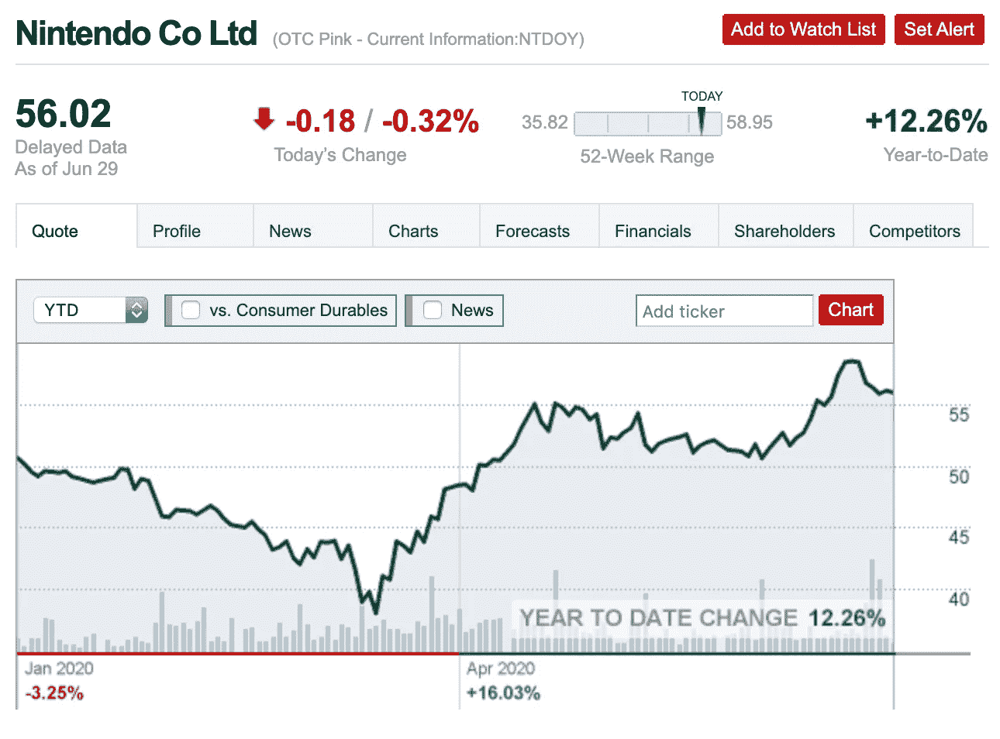

# 2020 年 7 月最佳选股

> 原文：<https://medium.datadriveninvestor.com/best-stock-picks-for-july-2020-c821bf294bdc?source=collection_archive---------6----------------------->

## 高增长股票加入你的投资组合

Photo by [Jason Briscoe](https://unsplash.com/@jsnbrsc?utm_source=unsplash&utm_medium=referral&utm_content=creditCopyText) on [Unsplash](https://unsplash.com/s/photos/stocks?utm_source=unsplash&utm_medium=referral&utm_content=creditCopyText)

以下是顶级投资者认为 2020 年 7 月份投资的 5 只股票。如果你想了解这些股票是如何挑选的，请阅读到本文结束。

在这里领取您的免费股票[，在这里](https://join.robinhood.com/andyl8)领取[。估计价值在 12-1400 美元之间！](https://www.webull.com/activity?inviteCode=KT8D7wlKgLFg&source=invite_gw)

# 第一名:特维利奥

Twilio 是一个云计算机通信平台，允许软件开发人员以编程方式拨打和接听电话、短信以及执行其他通信功能。该公司的活跃客户同比增长 23%。此外，冠状病毒疫情帮助刺激了对 Twilio 视频和其他数字通信服务的需求。不仅应用程序用户发现 Twilio 很吸引人，现有客户的平均支出也比上一年增加了 43%。

 [## 利用股市相关性的最佳方式|数据驱动的投资者

### 当阿尔弗雷德·温斯洛·琼斯开创了世界上第一个“对冲”基金(后来“d”被去掉了)时，他让其他投资者大吃一惊…

www.datadriveninvestor.com](https://www.datadriveninvestor.com/2020/02/02/the-best-way-to-use-stock-market-correlations/) 

自今年年初以来，该股市值翻了一番。由于该公司公布了令人印象深刻的第一季度业绩，仅 5 月份股价就上涨了 76%。 [Motley Fool](https://www.fool.com/investing/2020/06/26/3-hot-stocks-that-can-double-again-in-the-second-h.aspx) 认为该股可能在 2020 年下半年再次翻番:“其最近一个季度的收入增长了 57%，其调整后的利润连续第三个时期超过分析师预期。”这些原因使得 Twilio 对顶级投资者来说是一个有吸引力的投资。

Photo from [CNN Money](https://money.cnn.com/quote/quote.html?symb=TWLO) on June 30, 2020

# 快速统计

*   今年迄今，该公司股票已累计下跌 122.68%
*   当前交易价格:218.85 美元
*   52 周低点:68.06 美元
*   52 周高点:222.38 美元
*   2019 年净收入:307，063，000 美元
*   CNN Money 预测该股在未来 12 个月内可能达到 240 美元(价值增长 9%)。

# #2:天狼星 XM

天狼星 XM 是一家美国广播公司。尽管增长正在放缓，但沃伦巴菲特和 The Motley Fool 建议投资者购买 Sirius XM 股票，因为该公司有 3000 万付费订户。该公司还在 2018 年收购了 Pandora，该公司被全球数百万人使用。目前，股价接近历史低点，随着越来越多的人利用 Sirius XM 和 Pandora 订购避难所，股价很可能会飙升。

Motley Fool 描述 Sirius XM 和 Pandora 的用户:“他们致力于他们喜爱的节目背后的个性，他们愿意继续付费观看像霍华德·斯特恩这样的人做的节目。Sirius 还提供其他方式无法获得的体育赛事和节目，比如《T2》中的《澳大利亚足球与埃迪·麦奎尔统治美洲》这些原因使得 Sirius XM 在 7 月份对投资者来说是一个有吸引力的买入。

Photo from [CNN Money](https://money.cnn.com/quote/quote.html?symb=SIRI) on June 30, 2020

# 快速统计

*   今年迄今，该公司的股票已经下跌了 18.39%
*   当前交易价格:5.83 美元
*   52 周低点:4.11 美元
*   52 周高点:7.40 美元
*   2019 年净收入:9.14 亿美元
*   [CNN 财经](https://money.cnn.com/quote/forecast/forecast.html?symb=SIRI)预测该股在未来 12 个月内可能达到 7.50 美元(价值增长 29%)。

 [## 我 25 岁时的 8 种收入来源

### 千禧年生活:我如何赚钱和存钱

medium.com](https://medium.com/makingofamillionaire/my-8-sources-of-income-at-age-25-d574ff5d14ff) 

# #3:富国银行

富国银行是一家总部位于美国的跨国金融服务公司。该公司因众多丑闻而受到抨击，这些丑闻导致该公司最近表现不佳。此外，疫情对公司的股票价值产生了负面影响。尽管该公司正在经历一段艰难时期，但为了长期发展，还有许多其他因素需要考虑。

富国银行在负责任的贷款和高资产质量方面有着悠久的历史。这支股票目前对长期投资者来说是一笔大买卖。该公司拥有强大的销售文化和领导团队。最近，该公司任命了前 Visa 首席执行官 Charles Scharf，他在有效领导方面有着出色的记录。该公司利润丰厚，财务状况良好，足以渡过疫情。如果你购买并长期持有富国银行的股票，顶级投资者预测回报将是值得的。

Photo from [CNN Money](https://money.cnn.com/quote/quote.html?symb=WFC) on June 30, 2020

# 快速统计

*   今年迄今，该公司的股票已经下跌了 52.45%
*   当前交易价格:25.55 美元
*   52 周低点:22.00 美元
*   52 周高点:54.75 美元
*   2019 年净收入:195.49 亿美元
*   CNN Money 预测该股在未来 12 个月内可能达到 65.00 美元(价值增长 154%)。

# #4:任天堂

任天堂是一家日本消费电子和视频游戏公司。2020 年 3 月，视频游戏销售额增长 35%，达到 2008 年以来的最高水平。随着在家订单，越来越多的人转向电子游戏来打发时间。任天堂见证了 Switch 和视频游戏购买量的激增。一些流行的视频游戏包括*马里奥赛车*、*塞尔达传说*、*路易吉的豪宅*和*超级粉碎兄弟*

顶级投资者预测，任天堂未来将继续表现出色。目前还不确定家庭订单何时会正式结束，从而推动该公司目前的增长。此外，该公司计划在 2021 年推出 Switch 2，这将进一步推动该公司的销售。InvestorPlace 表示:“考虑到公司强劲的长期增长前景，NTDOY 股票的估值仍然合理。”

Photo from [CNN Money](https://money.cnn.com/quote/quote.html?symb=NTDOY) on June 30, 2020

# 快速统计

*   今年迄今，该公司的股票已经上涨了 12.26%
*   当前贸易价格:56.02 美元
*   52 周低点:35.82 美元
*   52 周高点:58.95 美元
*   2019 年净收入:1.94 亿美元
*   [CNN 财经](https://money.cnn.com/quote/forecast/forecast.html?symb=NTDOY)预测该股在未来 12 个月内可能达到 78.10 美元(价值增长 39%)。

 [## 我如何通过脸书广告创造 50，000+销售线索

### 循序渐进的教程

medium.com](https://medium.com/better-marketing/how-i-generated-50-000-leads-with-facebook-ads-ca710e59e3cf) 

# 第五名:脸书

如果你错过了 3 月份脸书股市创下历史新低的第一次下跌，7 月份可能是投资脸书的好时机。目前，该公司因在打击平台上的仇恨言论和歧视方面做得不够而受到批评。包括可口可乐、巴塔哥尼亚和联合利华在内的许多品牌决定在 7 月份削减在脸书的广告。一些品牌暂停支出，直到年底。这意味着该公司将损失数十亿美元的广告收入。当抵制声明出来后，股价下跌了约 5%。

然而，许多投资者认为，这种负面影响只会是短期的。脸书正致力于许多平台更新，以打击仇恨言论、歧视和其他社会和政治问题。一旦到位，品牌将再次开始在该平台上投资，因为投资回报率优于其他社交媒体网络。据预测，一旦他们克服了这个障碍，脸书将恢复正常水平。在 7 月份和 2020 年第三季度的剩余时间里，该股票很可能会进一步下跌。这使得脸书成为长期投资者的一个有吸引力的选择。

Photo from [CNN Money](https://money.cnn.com/quote/quote.html?symb=fb) on June 30, 2020

# 快速统计

*   今年迄今，该公司的股票已经上涨了 9.74%
*   当前交易价格:225.32 美元
*   52 周低点:137.10 美元
*   52 周高点:245.19 美元
*   2019 年净收入:184.85 亿美元
*   [CNN 财经](https://money.cnn.com/quote/forecast/forecast.html?symb=FB)预测该股在未来 12 个月内可能达到 300 美元(价值增长 33%)。

 [## 作为一名作家，我每月挣 100 美元的 5 个策略

### 分享我的个人数据和建议

medium.com](https://medium.com/illumination/my-5-strategies-to-generating-100-month-as-a-writer-d4cff6551295) 

# 我的策略:

找公司投资的时候，要考虑很多因素。首先，看看财务状况，确保公司每年都有正收入。然后看看公司每年消耗多少现金。净收入为正的公司是值得投资的。

此外，搜索网络，看看公司是否每年都在增长。公司销售的产品和服务是否很抢手？人们在购买公司的产品和服务吗？这些也是影响公司寿命的重要因素。

许多顶级投资者推荐的另一条建议是 ***买入并长期持有*** 。

[Investopedia](https://www.investopedia.com/articles/investing/052216/4-benefits-holding-stocks-long-term.asp) 声明:

> 长期购买和持有股票的主要原因是，当投资者尝试和选择投资时机时，长期投资几乎总能跑赢市场。

确保在投资任何公司之前做好调查。

**访问专家视图—** [**订阅 DDI 英特尔**](https://datadriveninvestor.com/ddi-intel)

感谢阅读！让我们保持联系。