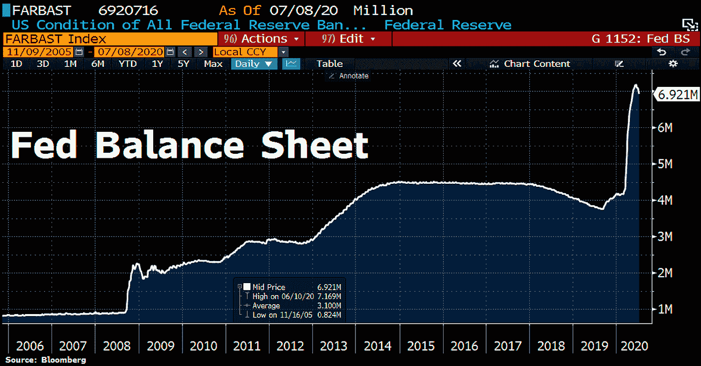

# 第三季度的最佳策略？中国、美元和一个持续存在的病毒

> 原文：<https://medium.datadriveninvestor.com/best-strategy-for-q3-china-the-dollar-and-a-persistent-virus-f7a9f290b31c?source=collection_archive---------10----------------------->

## 7 月 12 日当周的阿尔法交易简讯。

Source: Morning Brew

*被困在 Medium 的付费墙后面？* [*注册我们的 Discord 服务器*](https://discord.gg/a97qq2s) *查看#公告免费获取全文:*[*https://discord.gg/a97qq2s*](https://discord.gg/a97qq2s)

# 外卖:

1.  随着经济企稳，S&P 仍有支撑，但有衰退的基本迹象。
2.  COVID 第二波惊吓投资者。
3.  中国的紧张局势(基本上与每个人)仍在继续。

*欢迎阅读 Alpha Trades 的每周股票时事通讯。如果你是来看周日视频的，请滚动到底部。请记住，我们在视频中涉及的主题不同于时事通讯，因此值得您花时间订阅两者！可以看上一期我们的加密货币简讯* [*【这里】*](https://medium.com/datadriveninvestor/is-this-the-start-of-alt-season-bitcoin-needs-to-hold-9000-alphatrades-38d5bf458f1) *。*

[【复制我们的 S & P 500 主图，设置警报！]](https://www.tradingview.com/chart/12yl2kNH/)

我们还减少了向公众提供的交易电话数量。滴入 [*不和谐服务器*](https://discord.gg/a97qq2s) *了解更多成为优势会员的信息，不容错过。*

 [## 将美元变成硬币:久经考验的亏损期权策略|数据驱动的投资者

### 创造伟大的期权策略是一个反复试验的过程。这篇文章就是关于这些错误的。这张图表显示了…

www.datadriveninvestor.com](https://www.datadriveninvestor.com/2020/04/24/turning-dollars-into-dimes-time-tested-options-strategies-for-losing-money/) 

SPX 在 7 月 3 日和 7 月 9 日触及低点 3106，我们的关键支撑位 3080 守住了。此外，突破 3175 点打开了向 3325 点攀升的大门。[【点击查看上一期股票快讯】](https://medium.com/datadriveninvestor/two-trading-ideas-to-weather-the-coming-storm-alphatrades-ecab765fbf77)。

**快进:**全球中型股今年将比 2009 年[削减 12%的资本支出](https://www.reuters.com/article/us-companies-costs-graphic-idUSKBN2480YH?taid=5f04440617654f00015acaba&utm_campaign=trueAnthem:+Trending+Content&utm_medium=trueAnthem&utm_source=twitter)。分析师预计投资疲软将减缓经济复苏。GDP 增长放缓应该不足为奇。一些遭受大幅裁员的著名公司包括英国石油公司(B.P. Plc)。l)、通用电气(GE。XOM 的埃克森美孚公司。n)。在全球越来越担心第二波严重的 COVID 病例的情况下，[美元走强](https://www.reuters.com/article/uk-global-forex-idUSKBN2480LH?taid=5f042f04621aa70001d0382d&utm_campaign=trueAnthem:+Trending+Content&utm_medium=trueAnthem&utm_source=twitter)。投资者将 10 年期美国国债视为煤矿中的金丝雀。

**对兴奋剂上瘾|** 数据出来了，直接刺激似乎起作用了。倡导者正努力说服国会，认为如果美联储取消每月 600 美元的疫情失业补偿，数百万家庭将陷入困境。相比之下，美国消费者新闻与商业频道在六月份报告了创纪录的 480 万份工作。

美联储也放缓了他们的流动性注入，降至 7 万亿美元以下(见下图)。

# 每周节拍

**病态的经济|** 本周，冠状病毒继续反复袭击全球经济。随着 38 个州的 COVID 病例数上升，美国经济的复苏停滞不前。亚利桑那州、加利福尼亚州、科罗拉多州、佛罗里达州、密歇根州和德克萨斯州正在取消重新开放的计划。伤亡者包括申请破产的布鲁克斯兄弟公司，同时超过 130 万美国工人申请失业。

与此同时，澳大利亚的主要城市也在重新实施检疫限制。[欧元区进一步陷入衰退，分析师预计 2021 年将出现微弱反弹。](https://www.reuters.com/article/us-eurozone-economy/eu-sees-deeper-recession-less-steep-rebound-for-euro-zone-idUSKBN2480ZG)

US STATES: Reopened, Reopening, Pausing and Reversing (Source: NY Times)

[**一把双刃剑**](https://www.reuters.com/article/us-health-coronavirus-ppp/u-s-pandemic-aid-program-saved-51-1-million-jobs-but-wealthy-and-connected-also-benefited-idUSKBN2471ZD?utm_medium=Social&utm_source=twitter) **|** 数据显示，薪酬保护计划(PPP)支持了超过 84%的小企业，专家称之为“巨大的成功”。疫情援助计划在美国挽救了 5150 万个工作岗位。然而，亿万富翁、拥有充足现金储备的精英大学以及各种巨头和关系良好的公司所获得的援助水平令人惊讶。Kanye West 的 Yeezy 是获得贷款的人之一。虽然接受者已经归还了 300 多亿美元，但一些公司因非法获得贷款资格而受到抨击。PPP 的许多主要贷款人是私人银行机构，他们自然希望优先考虑最盈利的客户，这一事实引发了激烈的讨论。

**电动滑梯|** 如果像 Rivian 这样的竞争对手继续碾压大街，Elon 可能会摇摆短裤。电动汽车制造商 underdog 获得了另一笔 25 亿美元的资金，将其 RT1 皮卡和 R1S SUV 推向市场。著名的投资者包括福特汽车公司、亚马逊、索罗斯基金、富达和贝莱德。

谁穿短裤？在球场的另一端，TSLA 刚刚以大约 200 亿美元的空头利息打破了投资界的纪录。卖空者继续被打压，因为 TSLA 卖家今年[缩水 180 亿美元](https://www.cnbc.com/2020/07/10/tesla-short-sellers-are-down-18-billion-this-year-including-another-4-billion-in-july.html)。

[**香甜可口的数据**](https://techcrunch.com/2020/07/06/secretive-data-startup-palantir-has-confidentially-filed-for-an-ipo/) **|** 彼得·泰尔的大数据创业公司已经申请 IPO。估值为 260 亿美元，人们可能会想象一只独角兽，但有着结实的大腿和微弱的威胁光环。该公司因其秘密的数据挖掘做法和政府合同而引发争议。

**现在看我的** [**特殊目的收购公司**](https://www.investopedia.com/terms/s/spac.asp) **|** 街头出现了一种新潮流。特殊目的收购公司(特殊目的收购公司)是通过首次公开募股筹集资金来收购另一家公司的绝妙手段。spac 已经存在了一段时间，但由于对大量 spac 的报道，如比尔·阿克曼的潘兴广场和大众喜爱的电动汽车制造商尼古拉，近年来它们在 T21 越来越受欢迎。

# 与中国的麻烦

[**一只大得离谱的独角兽**](https://www.reuters.com/article/us-ant-financial-ipo-exclusive/exclusive-alibabas-ant-plans-hong-kong-ipo-targets-valuation-over-200-billion-sources-say-idUSKBN2491JU?utm_source=newsletter&utm_medium=email&utm_campaign=newsletter_axiosprorata&stream=top&utm_source=morning_brew) **|** 阿里巴巴旗下 fintech 外延蚂蚁将申请 IPO，目标估值超过 2000 亿美元。分析师预计，此次 IPO 对香港来说是一个巨大的利好。

[**有毒关系**](https://www.cnbc.com/2020/07/10/trump-says-us-china-relationship-damaged-phase-2-trade-deal-not-a-priority.html?utm_source=morning_brew) **|** 川普说美中关系“严重受损”，他没有考虑第二阶段的贸易协议。这个消息是在政府正式通知从世卫组织撤军的时候传来的。总统一直对中国处理 COVID 的方式持强烈批评态度。国务卿迈克·蓬佩奥表示，美国正在考虑禁止中国社交媒体应用，包括抖音。

[**最坏的情况**](https://www.zerohedge.com/markets/chinese-banks-preparing-worst-case-hong-kong-scenario-bank-runs-swift-cut) **|** 如果无法获得 SWIFT 和美元融资，中资银行可能会遭遇挤兑。

# 本周洞察

今年，科技股无视地心引力，主要受益于快递服务以及大量劳动力和业务运营转移到网上等优势。随着许多人认为世界末日即将结束，事情将慢慢恢复正常，我们的分析师预计，市场将把一些这种行动转移到像工业股这样的价值股。此外，我们对在 QQQ 等指数中建仓持谨慎态度，更倾向于选择每个领域中最可靠的名字。除了美国资产和美元，世界各地的投资者都不愿意把钱投到其他地方。此外，酒店行业也处于昏迷状态。尽管溢价很高，但拥有 COVID 优势、强大且经过验证的价值主张以及持续盈利指导的大型科技公司已经成为一种安全的交易。

从长远来看，我们认为下一次经济衰退将与外汇密切相关。下图显示，美元在几个方面都是主流货币。

# 其他新闻

**神奇的互联网货币|** 加密货币交易所**比特币基地**旨在上市。价值 80 亿美元，这是加密货币领域的一项重大举措。

[**王牌**](https://edition.cnn.com/2020/07/09/politics/supreme-court-donald-trump-tax-returns/index.html?utm_source=morning_brew) **|** 在最高法院做出裁决后，特朗普总统在选举周期期间不会受到任何对其税收记录的刺激。

[**巴菲特的买入！我们期待已久的时刻终于到来了吗？伯克希尔哈撒韦公司收购 Dominion 能源公司。**](https://www.usatoday.com/story/money/2020/07/05/berkshire-hathaway-dominion-energy-gas-lines/5380788002/)

[**十亿美元的医疗保健赌注**](https://www.wsj.com/articles/walgreens-to-open-doctors-offices-at-its-u-s-stores-11594209601?mod=business_lead_pos3) **|** 沃尔格林计划投资 10 亿美元在其美国门店开设多达 700 家诊所。

# 收益季节开始

(感谢@StockM_Society 让我们的生活变得更简单)。

# 编辑每周精选

*我们在《数据驱动投资者》的朋友会定期发布令人心痒的内容，所以如果你还没有订阅，* [*可以看看*](https://www.datadriveninvestor.com/) *。*

在投资实现梦想之前，你应该问每位 CEO 哪些关于数字化的问题？ [Uwe Weinreich 提供了八个](https://www.datadriveninvestor.com/2020/07/06/8-questions-about-the-digital-transformation-investors-should-get-answers-from-every-ceo/)。

卡尔·罗德正在组建一支由“酷猎手”组成的 Z 世代军队，让我们未来的领导者在科技、工作、食品、时尚等领域保持领先。

# 素食贸易，硅，和闪亮的东西

本周，Advantage 会员加入了我们的分析师讨论他们在交易什么，如何长期定位，以及投资策略。我们在这些新闻简报中为您提供开胃菜，但我们会在我们的高级现场会议 [**【了解更多】**](https://discord.gg/a97qq2s) 中分享真正的内容。

注意安全。

# 阿尔法交易优势

[订阅 Discord 服务器](https://bit.ly/2KJ1oor)学习技术分析以及如何投资获利。优势会员在前两天是免费的。

# 放弃

Alpha Trades，LLC 提供的信息不用于制定任何财务决策，也不是购买、持有和/或销售特定产品、数字资产或 ICO 的请求或建议。

访问我们的完整服务条款:[https://bit.ly/3faVeeV](https://bit.ly/3faVeeV)

**访问专家视图—** [**订阅 DDI 英特尔**](https://datadriveninvestor.com/ddi-intel)