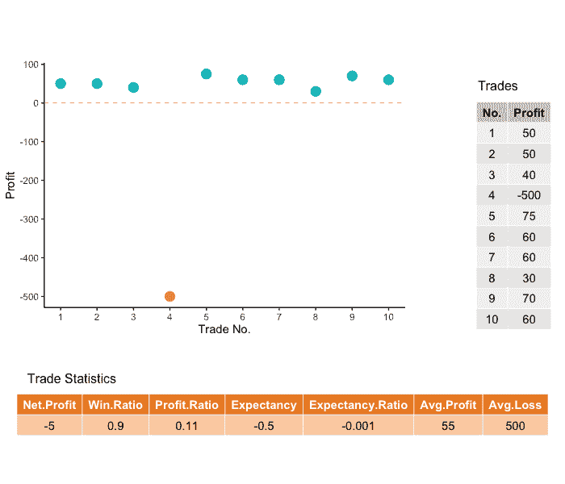
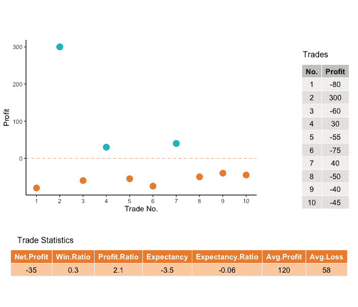
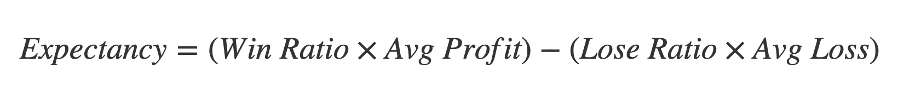
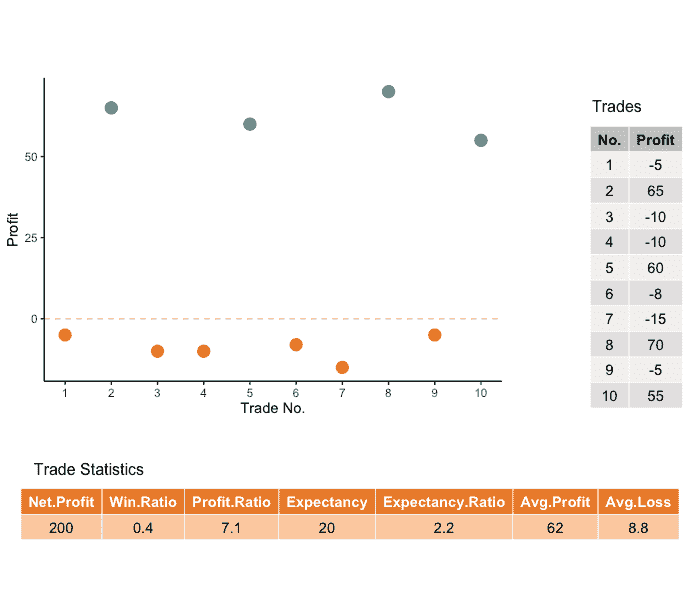
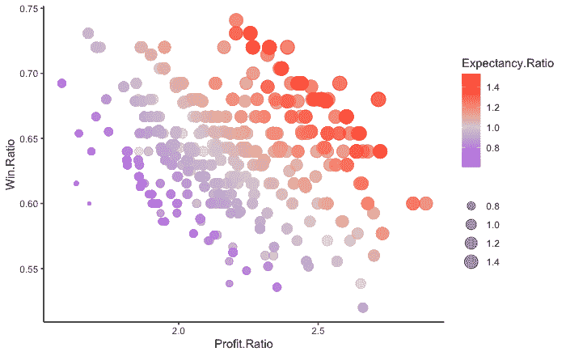

# 每个交易者都应该知道的最佳交易策略指标

> 原文：<https://medium.datadriveninvestor.com/best-trading-strategy-metric-every-trader-should-know-375cab4b42d8?source=collection_archive---------9----------------------->

## 了解胜率和盈亏率的更好替代方法

像其他生意一样，成功的交易需要对我们的表现进行分析。在回溯测试、远期演示测试或实时交易中应用策略时，我们会查看各种指标，如净利润、胜率、盈亏比、平均利润、提款等。有这么多指标要看，我们应该根据哪个指标来优化我们的战略参数？

让我们来讨论两个常用的交易绩效指标，胜率和盈亏率，以及一个不太为人所知的指标，叫做期望比率。后者是最好的交易指标之一，任何新手或认真的交易者都应该理解。

# 胜率

你多久赢一次？—这可能是最常见、最容易理解的指标。这被定义为一段时间内成功交易的数量与总交易数量的比率。

一般来说，产生正利润的交易被认为是盈利，而产生负利润的交易被认为是亏损。我们注意到，这并没有区分大赢和小赢，也没有区分小输和大输。

此外，如果没有适当的背景，这一指标可能具有欺骗性。高胜率很可能意味着盈利，但情况并非总是如此。

反之亦然:胜率低并不总是意味着盈利能力差。我们必须仔细考虑胜率之外的其他指标。

这里有一个假设的 10 笔交易的例子。下图显示了 1 到 10 的所有交易及其相应的美元利润/损失。还显示了贸易和贸易统计表格。

Scenario 1\. Hypothetical case of 10 trades resulting in a poor trading performance despite a 90% win ratio

虽然胜率高达 90%，但这显然不是一个有利可图的业绩。单笔亏损交易的平均亏损 500 美元实在太大了，它抹去了所有较小的收益。如果你不改变你的策略，你可能会认为这种损失会在未来的某个时候再次发生。

胜率告诉我们胜率发生的频率，但它的缺点是不能显示胜率的大小。盈利/亏损比率试图对此加以限定，我们将在下一节讨论，然后是期望和期望比率。

# 利润/亏损比率

这被定义为盈利交易的平均利润与亏损交易的平均亏损的比率。该公式采用平均损失的绝对值，因此盈亏比始终为正值。

直觉上，盈利的业绩应该总是给我们大于 1.0 的利润/亏损比率，这样平均利润就大于平均亏损。该指标越高，性能越好。

然而，就像盈利率一样，如果没有适当的背景，盈利/亏损率可能会具有欺骗性。下图展示了另一组假设的 10 笔交易，显示了看似可接受的 2.1 的利润率(利润/亏损数字以美元表示)。

Scenario 2\. Hypothetical case of 10 trades resulting in a poor trading performance despite a profit/loss ratio of 2.1

在这种情况下，虽然平均利润是平均亏损的 2.1 倍，但盈利率很低，因此我们得到的是负净利润。

理解了盈亏比之后，我们可以回顾 10 笔交易的第一个场景。盈利率高达 90%，而盈利/亏损率为 0.11，这是一个非常糟糕的交易表现指标，令人难以接受。

将这两个指标放在一起考虑，可以更好地描述实际性能。有没有一个指标我们可以查看，而不是检查两个？

在下一节中，我们将讨论将胜率和利润/亏损率合并到一个指标中的预期指标。

# 期望和期望比率

预期基本上是我们期望每笔交易赚/亏的平均金额。例如，100 美元的期望值表明未来交易的平均盈利能力为 100 美元。期望值为-20 美元表明策略失败，因为我们预计在未来的交易中平均会损失 20 美元。

这个指标考虑了三个项目:赢家的平均规模，输家的平均规模，以及赢的概率(从中输的概率正好反过来)。在公式中，我们取平均损失的绝对值，这样当策略有利可图时，期望值取正值，当策略不利时，期望值取负值。

我们可以通过将期望值除以平均损失的绝对值来标准化这一指标，如下所示:

预期比率变成了一个更通用的、无量纲的指标(比如利润率)，它不会区分头寸规模的变化。例如，两个交易者可能分别有$350 和$ 2000 的期望值，但是可能有相同的期望值比率 1.25。这两个交易者表现相似，尽管他们可能有不同的账户资金规模。

在下图中，我们给出了一个假设的盈利场景，有 10 笔交易，预期比率为 2.2。请注意，虽然胜率相对较低，为 40%，但利润率却高达 7.1，令人印象深刻。虽然平均利润是 62 美元，但预期或平均盈利能力只有 20 美元。

Scenario 3\. Hypothetical case of 10 trades resulting in a profitable performance with an expectancy ratio of 2.2

你也可以回顾前两个场景，并确定每个场景的期望值和期望值比率。回想一下，这两个场景的性能都非常差。

# 这些指标之间有什么关系

预期比率将胜率和盈利/亏损规模纳入一个单一指标。这显然使它成为一个优于其他两个单独采用的指标。我基于此优化我的趋势跟踪外汇策略。然而，我还没有一个好的基准来为这个指标设定一个好的水平。

下图展示了我的回溯测试工作的实际结果，并为将来的活动设置了一个初始参考点。每个数据点代表一组策略参数的回溯测试。我用欧元兑美元对的 3 年历史数据对每日时间框架的策略进行了回溯测试，并应用了以下过滤器:

*   交易总数大于或等于 25
*   预期比率大于或等于 0.10(因此这里所有的点都给出了有利可图的结果)

Backtest results relating the win ratios, profit/loss ratios, and expectancy ratios from different strategies

通过目测，相关水平的期望比率似乎遵循从图的左上侧到右下侧的线性模式。该图表明，如果我们只寻找一个具有最佳胜率的策略，我们就会错过其他具有相似或更好预期的策略。

拥有具有相似盈利水平的各种选择是非常重要的。首先，每个选项在其他指标方面的表现会有所不同，包括本文中没有讨论的指标。例如，他们的最大提款和连续亏损交易的最大次数可能不同。此外，有些选择可能在不同的时间段和市场条件下略有盈利，而有些可能会失败。

# 现在怎么办…

预期比率是衡量每笔交易平均盈利能力的指标。这表明了我们在下一次交易中平均预期的利润或损失。如果我们继续使用策略并进行下一次交易，这显然是一个非常重要的决策输入。因此，如果我们只想优化一个指标，那么在其他指标中选择最大化期望比率是有意义的。

在优化期望比率后，下一步是在不同的时间段和使用其他工具验证选定的最佳策略集。但那是另一篇文章。

*原载于 2020 年 11 月 16 日*[*【https://www.datadriveninvestor.com】*](https://www.datadriveninvestor.com/2020/11/16/best-trading-strategy-metric-every-trader-should-know/)*。*