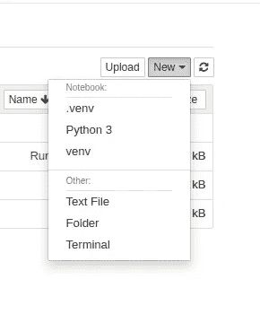

# 在 Python 虚拟环境中创建 Jupyter 笔记本的最佳方式

> 原文：<https://medium.datadriveninvestor.com/best-way-to-create-jupyter-notebook-in-python-virtual-environment-f74656b261fa?source=collection_archive---------3----------------------->

如何在 jupyter 笔记本中正确简单地获得虚拟环境？我想以同样的方式分享，简单而恰到好处。


[Source](https://realpython.com/python-virtual-environments-a-primer/)

首先，确保你的电脑上安装了 python。如果没有安装 python 和 pip。在你的命令终端上

```
sudo apt update
sudo apt install python3
sudo apt install python3-pip
#check for pip version
pip3 --version
```

现在你需要在你的系统上安装 jupyter 笔记本。

```
pip install -U jupyter
```

创建虚拟环境

```
#Installing VirtualEnvironment
sudo pip3 install virtualenv
virtualenv venv
#OR
virtualenv -p python3 venv
#Activate virtual environment
source venv/bin/activate
```

为了在虚拟环境中使用 jupyter 笔记本，您必须安装 Ipykernel

```
pip install ipykernel
```

然后，您可以将我们安装在 venv 中的 ipykernel 添加到 jupyter 笔记本中

```
python -m ipykernel install --user --name=venv
```

现在您可能会看到这样的输出

> 已将 kernelspec venv 安装在/home/accubits/中。本地/共享/jupyter/内核/venv

您可以使用 vim 或 nano 检查该位置，您可以看到一个 kernel.json 文件，打开后会显示这个文件。

```
{
 "argv": [
  "/home/user/Documents/**venv/bin/python**",
  "-m",
  "ipykernel_launcher",
  "-f",
  "{connection_file}"
 ],
 "display_name": "venv",
 "language": "python"
}
```

这意味着它在虚拟环境中使用 python。

查看同一教程的 youtube 视频:

[](https://www.datadriveninvestor.com/2020/03/29/microsoft-having-an-edge-over-chrome/) [## 数据驱动的投资者|微软比 Chrome 有“优势”

### 简史我从来不是浏览器的粉丝，确切地说，我只是一个浏览器的粉丝，Chrome。这是我的…

www.datadriveninvestor.com](https://www.datadriveninvestor.com/2020/03/29/microsoft-having-an-edge-over-chrome/) 

好的，现在把这个输入你的命令终端。

```
jupyter notebook
```

您的 jupyter 笔记本将被打开，您可以选择 venv 来使用虚拟环境。



jupyter notebook

现在你可以开始你的项目了。

我希望这对你有用。感谢阅读。