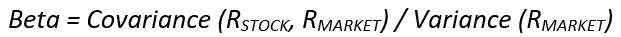
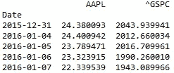
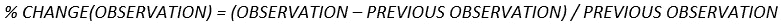
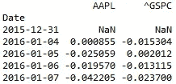
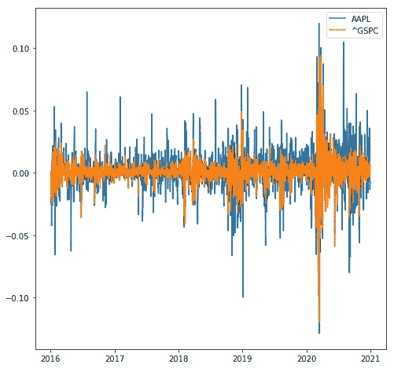
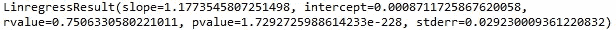
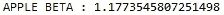

# 股票的贝塔系数

> 原文：<https://medium.datadriveninvestor.com/beta-of-a-stock-using-python-4abad23b778?source=collection_archive---------1----------------------->

我相信你一定听说过股票市场和各种股票交易所，如 S&P500、道琼斯和 NSE。如果没有，让我快速地向您介绍一下。股票市场本质上是一个交易股票、衍生品和各种其他期权的市场。衍生品和其他选择超出了本文的范围，我们现在只关注股票。

人们认为股票市场可能是最危险的赚钱方式。嗯，他们是对的，也是错的。当然，股票市场是有风险的，但如果操作得当，计划周密，你仍然可以获得健康的回报，同时保持可控的风险水平。下一个合乎逻辑的问题是，如何量化某种股票的风险。为此，我们分析了很多指标和比率，但现在，我们只关注股票的贝塔系数及其使用 Python 的计算。

一只股票的贝塔系数衡量它的波动性，这基本上是它的起伏程度。贝塔系数是根据股票所属的指数计算的，由以下公式给出



Beta Formula

其中β是通过将股票回报和市场回报的协方差除以市场回报的方差而获得的。

任何指数的贝塔系数都是 1.0，根据股票的贝塔系数，我们可以确定股票比指数风险更大还是更安全。如果贝塔系数大于 1.0，股票回报的变化就比指数的变化更大，被认为风险更大，如果贝塔系数小于 1.0，就被认为更安全。也就是说，股票的预期收益也与风险成正比。因此，如果贝塔系数越高，股票的波动性就越大，风险也就越大，因此，回报也就越高。

现在，计算部分可能有点深奥，因此，为了使事情相对简单，您可以实现市场回报回归模型。我知道这个名字看起来有点吓人，但它的核心其实很简单。它是基于股票收益可以表现为市场收益的线性函数这一事实。这是基本方程式

线性回归的斜率表示股票的贝塔系数，阿尔法系数是截距。我已经详细阐述了如何解释 beta，但是现在我将扩展如何解释这个 alpha 值。

假设你有一个股票投资组合，只包含一只股票，比如股票 x。你执行回归模型，最终得到 alpha 和 beta 值。β值将衡量风险水平，而α值基本上量化了投资特定股票的优势。例如，假设某一天的市场回报率为 0%。然后，有人可能会认为股票 X 当天的回报率也是 0%，但事实并非如此。在这种情况下，预期的股票回报是(alpha)%。这可以通过简单地将回归方程中的市场回报率指定为零来实现。这个量词在这里并不重要，但是在比较由多只股票组成的股票投资组合时，它被证明是非常有用的。

现在让我们看看 Python 的实现。

第一步是导入所有需要的库。对于这一点，只有一个基本包除外，pandas_datareader。Pandas datareader 是 Pandas 图书馆的一个子包，它使我们能够从不同的互联网来源创建数据框架。目前，您可以从 Yahoo！金融和谷歌金融。

```
import pandas as pd
import seaborn as sns
import matplotlib.pyplot as plt
from scipy import stats
from pandas_datareader import data as dr
```

在这篇文章中，我将使用苹果股票数据演示 beta 计算，并且我将从 Yahoo！金融。为此，我们需要雅虎！股票和标准普尔 500 指数的代码。它们分别是“苹果公司”和'^GSPC'。

```
tickers = ['AAPL', '^GSPC']
data = pd.DataFrame(columns = tickers)for t in tickers :
    data[t] = dr.DataReader(t, data_source = 'yahoo', start = '2016-1-1', end = '2020-12-31')['Adj Close']
```



First 5 entries of the data

使用一个循环，我存储了从 2106 年到 2020 年 5 年间两个报价机的每日调整收盘股价。beta 有多个版本。例如，有 3 个月的每日测试，使用过去 3 个月的每日回报，有 5 年的每月测试，使用过去 5 年的每月回报，等等。对于这篇文章，我选择了 5 年的每日测试，顾名思义，它使用过去 5 年的每日回报。

为了计算每日回报，我使用了 pct_change()函数，它计算百分比变化，如下所示



Daily returns formula

这是它的实现和输出

```
returns = data.pct_change()
```



Daily returns

第一行自然是“NaN ”,因为没有先前的观测值可供计算。你可以去掉这一排。

```
returns.dropna(inplace = True)
```

为了更直观地展示，我甚至绘制了两个报价器的每日收益。这是它看起来的样子。



5-year daily returns for APPLE and S&P 500

从图中可以看出，股票比指数更不稳定，因此贝塔系数应该大于 1。现在是执行线性回归的时候了。我已经使用 Scipy 库中的 stats 包执行过了。

```
regress_coefs = stats.linregress(x,y)
print(regress_coefs)
```

这将产生以下输出



Regression Results

这个斜坡就是我们要找的东西。所以我把它存储在一个单独的变量里。这里

```
beta = regress_coefs[0]
print('APPLE BETA : {}'.format(beta))
```



Beta of APPLE stock.

从苹果股票的贝塔系数来看，很明显股票比指数更不稳定，所以期望股票比指数有更高的回报是公平的。

股票的贝塔系数是一个无价的量化指标。即使是经验丰富的专业人士也用它来衡量股票的变化、风险和预期回报，投资时考虑贝塔系数将有助于你避免不必要的高风险赌注。

如果你喜欢这篇文章，如果它对你有所帮助，请继续关注，因为我已经准备了一些更有趣的东西。