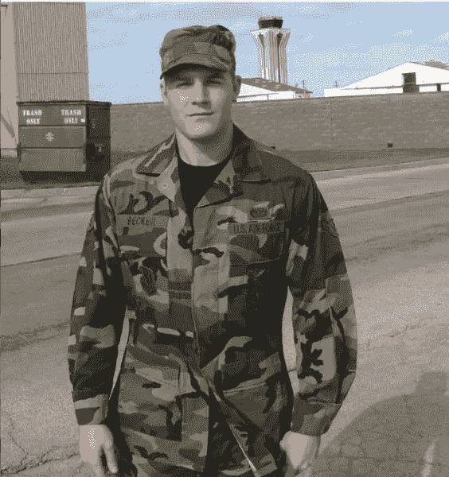
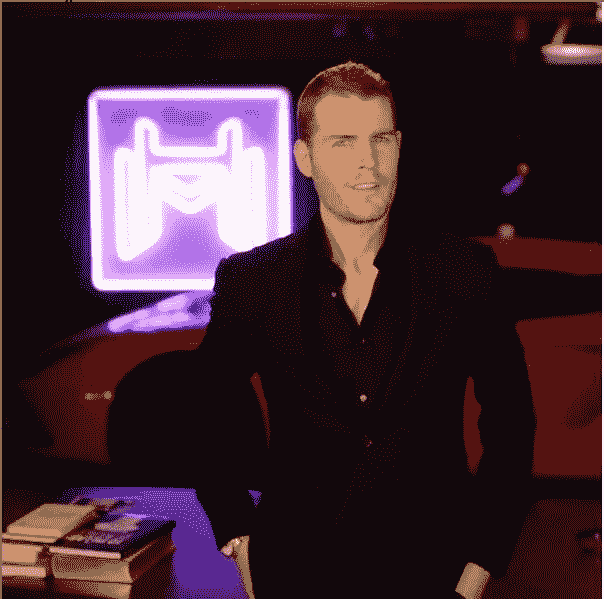
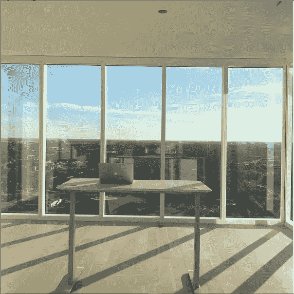

# 当心那些说“金钱不会让你幸福”的富人

> 原文：<https://medium.datadriveninvestor.com/beware-the-rich-who-say-money-wont-make-you-happy-d2ced2dc6bd?source=collection_archive---------8----------------------->

## 有钱人总是这么说。是真的吗？

Photo by [Joshua Rondeau](https://unsplash.com/@liferondeau?utm_source=medium&utm_medium=referral) on [Unsplash](https://unsplash.com?utm_source=medium&utm_medium=referral)

如果…会怎样

走在人行道上的时候，一个穿着西装戴着墨镜的年轻人从你身边走过。在他旁边，三个超级模特——一个俄罗斯人，一个意大利人和一个美国人，就像一个笑话的开头。

你的目光跟随他到了他闪亮的新跑车，车门垂直打开。女士们咯咯地笑着走进来，而他保持着冷静、自信的举止。

尽管犹豫了一会儿，你还是接近了他。他在开车，看见你来了就摇下车窗。

“怎么了？”他傻笑。

“我能问一个问题吗？”

他点点头。你靠过来。

“我怎么才能赚到你那么多钱？”

每个人都问他这个问题。他微笑着摘下墨镜…

“听着，不要把注意力放在钱上。这不会让你开心的……”

然后他离开了，模特们还在后座咯咯地笑。 ***金钱不会让你幸福吗？那是什么意思？***

富人总是说这样的话，而我们这些普通人——不介意每个月多赚几千美元的人——只能远远地看着他们赚越来越多的钱。

这些富人是不是试图说服我们不值得变得富有，从而让我们远离变得富有？

我想是时候揭露真相了…

请继续阅读，寻找答案:

*   **为什么这些百万富翁名人和商人在显然拥有一切的时候会有自杀的感觉……(这就是富人试图告诉你的关于金钱的问题。)**
*   如何赚更多的钱*能让你快乐**(…在一定条件下…)*
*   涉及伯尼·麦道夫的额外提示

# 有钱又不开心？不会吧…

Images From [Alex Becker’s Instagram Page](https://www.instagram.com/alexbeckertech1)

亚历克斯·贝克尔是世界上最好的在线营销者之一。他的广告覆盖了数百万人，他的 YouTube 频道有超过 50 万的订阅者，他还是一家快速发展的软件公司 Hyros T21 的首席执行官。

他在 20 岁出头离开空军后开始了他的事业，目标是成为百万富翁。

仅仅两年后，他就建立了一个百万美元的企业。

有了新赚的钱，亚历克斯有了汽车、昂贵的手表、大房子…

他终于成功了。还是他已经……？

接下来的 8 年里，他不断创业，每年赚 100 万到 200 万美元。对于我们大多数人来说，这将是一个伟大的成就，但亚历克斯觉得不对劲…

人们对他创办的企业没有好感。这座大房子很酷，但堆满了无用的富人物品。尽管拥有他的兰博基尼很有趣，但它也有不好的一面(主要是维护和保险费用。)

亚历克斯觉得很痛苦。

在大多数故事中，这是人们指出亚历克斯既富有又不快乐的事实的部分。他们会告诉你，这就是为什么你不应该追逐金钱。他们会在网上向你展示数百个视频，其中有[名人谈论他们如何获得金钱和名声，但仍然感到不快乐。](https://www.youtube.com/watch?v=zYDKCx4hSQQ)

但是我敢说他们——*和你*——会再看一遍。

像大多数获得大笔名利的人一样，亚历克斯过去非常乐于赚钱，并努力工作赚钱。一开始，赚几百万美元感觉很棒。

 [## SpaceX vs 维珍银河——太空旅游业务主导地位的竞赛|数据驱动的投资者

### 只有 566 个人去过太空。这些人 85%以上来自三个民族。超过一半的…

www.datadriveninvestor.com](https://www.datadriveninvestor.com/2020/11/25/spacex-vs-virgin-galactic-the-race-to-a-space-tourism-business-dominance/) 

# 心态的必要转变

大约一年前，亚历克斯决定改变他的生活，放弃所有的汽车，大房子，富人的东西。

现在他住在一个相对空旷的公寓里，大部分时间都在办公桌前工作。

Image From [Alex Becker’s Instagram Page](https://www.instagram.com/alexbeckertech1)

所有的东西都没了，他可以专注于做令人满意的工作。那是什么意思？令人满意的工作……这只是对世界产生影响的工作，也是他充满激情的工作。

亚历克斯目前的业务 Hyros 每年的收入远远超过 8 位数，因为他开始专注于做令人满意的工作，而不是为钱而工作。

这就是大多数富人在提到金钱不能让他们幸福的事实时，从来没有谈到的区别。

你看，当你为了赚钱而赚钱时，金钱不会让你快乐。但是，当你把赚钱和一个重要的目标联系在一起时，赚钱会让你像在炎热的夏天拿着蛋卷冰淇淋的孩子一样快乐。

想想赚钱捐给慈善机构，或者赚钱支付孩子的学费，或者赚钱支付医疗账单。

除非你想像 Alex 和其他有钱人一样一成不变，否则就把你的金钱目标和你关心的人或事联系起来。

我个人的目标是赚很多钱，用这些钱回到我的祖国，创造就业机会，帮助经济好转。我赚的每一分钱都让我脸上带着微笑，因为它让我更接近那个目标。

# 健康和不健康的目标

宇宙在 2008 年终结。

对你我来说，它并没有完全结束，但对投资了伯尼·马多夫庞氏骗局的 4800 人来说，它可能已经结束了。他们总共 650 亿美元——是的，带 B 的——消失得无影无踪。他们走上街头抗议…

Photo by [Alex Radelich](https://unsplash.com/@alexradelich?utm_source=medium&utm_medium=referral) on [Unsplash](https://unsplash.com?utm_source=medium&utm_medium=referral)

要不是警察把他带走，人们早就赤手空拳把他打死了。人们对麦道夫和他的家人恨之入骨，以至于他的儿子马克结束了自己的生命。

街上的人们高呼“麦道夫是邪恶的！”和“烂在地狱里！”但从未停下来想一想，是什么让一个人做出这样的事……？

在[与哈佛商学院教授尤金·索特斯](https://hbswk.hbs.edu/item/bernie-madoff-explains-himself)的采访中，麦道夫在一段 3 分钟的录音*(我正在总结)*中说道:

**“…除了成功，我并不确定我在生活中还想要什么…然后我在一个很难进入的行业中找到了成功，*特别是对于像我这样没有钱的人来说,*你知道，它给了你一种心态和信心，你可以完成任何事情。”**

麦道夫做了我之前提到的事情:他给自己赚的钱附加了一个目标，那就是挑战去做一些像他这样成长的人从未做过的事情。但这也意味着欺骗人们。

他和贝克尔的不同之处在于，亚历克斯决定积极影响人们的生活，而麦道夫…

嗯，这很复杂:麦道夫给了投资他的人一种虚假的安全感。这让他们在短期内感到快乐，但从长远来看却伤害了他们。所以他的成功是短暂的。

尝试用长期(5-10 年)目标来刺激你对金钱的追求。长远的观点有助于正确看待事物。

# 外卖食品

我不认为有钱人是错的，但我也不认为他们是对的。

赚钱会让你快乐，但快乐不会持续太久。所以，认真思考你赚钱的目标。

如果你有更多的钱，你会帮助谁？如果你有更多的可用资金，你可以做哪些有激情的项目？赚更多的钱如何让你爱的人受益？

把你的眼睛放在那个目标上，用金钱作为衡量标准来决定你离那个目标有多近。当你实现了那个目标，再设定一个目标。那样的话，你会一直为某样东西而奋斗。

## 访问专家视图— [订阅 DDI 英特尔](https://datadriveninvestor.com/ddi-intel)