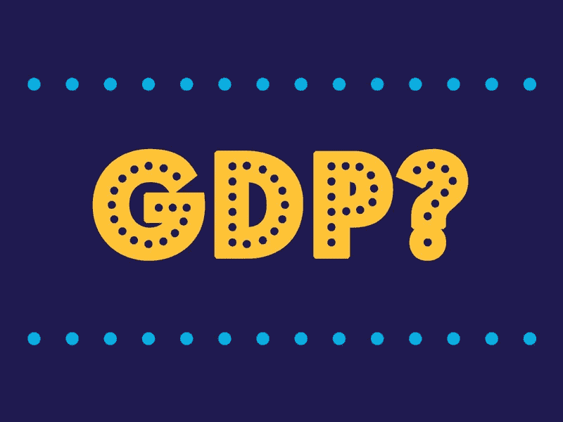

# 超越 GDP:衡量我们生活的健康

> 原文：<https://medium.datadriveninvestor.com/beyond-gdp-measuring-the-health-of-our-lives-b4e61ecdd754?source=collection_archive---------11----------------------->

Photo Credit: Npr.org

经济运行良好。不，经济陷入困境。就业增长强劲。就业增长实际上是疲软的，雇主们计划缩减招聘。

国内生产总值(GDP)有望快速增长。遗憾的是，事实并非如此:GDP 实际上将会下降，经济正在萎缩。

随着时间的推移，我们每天都会从政治家、媒体专家和经济分析师那里听到这种说法。与此同时，我们观察我们自己后院的经济表现。最重要的是，我们把自己的生活经历考虑在内。

 [## 为什么包容性财富指数比 GDP 更能衡量社会进步？|数据驱动…

### 你不需要成为一个经济奇才或金融大师就能知道 GDP 的定义。即使你从未拿过 ECON 奖…

www.datadriveninvestor.com](https://www.datadriveninvestor.com/2019/03/08/why-inclusive-wealth-index-is-a-better-measure-of-societal-progress-than-gdp/) 

我们口袋里有钱，还是在挣扎？即使我们挣了相当多的钱，我们能储蓄吗，或者工资完全被住房、交通、医疗和其他费用消耗掉了吗？

我们生活的其他衡量标准呢？我们是每时每刻都在工作，还是享受个人生活的平衡？我们生活在安全的社区吗？地方政府是有效的，还是腐败不可信的？

我们认识我们的邻居，并感觉与周围的人有联系吗，或者我们是陌生人？我们面对的是猖獗的环境破坏，还是我们生活在一个干净、健康的环境中？简单来说，我们过得好吗？

这些都是重要的问题，切中健康社会的核心。然而，尽管国内生产总值，尤其是人均国内生产总值，是衡量一个社会经济健康状况的重要指标，但它还远远不够。我们如何能包括社会健康的相关措施，以提供一个社会是否是一个生活的好地方的更全面的图片？

**什么是 GDP？**

首先，应用 GDP 的[工作定义](https://www.investopedia.com/terms/g/gdp.asp)很重要。简言之，GDP 是一个国家在特定时期内生产的所有商品和服务的总价值。GDP 既可以按季度考核，也可以按年度考核，还可以按人均计算(称为人均 GDP)。

GDP 是用几种不同的方法计算出来的[。最普遍的方法之一是观察消费者支出(即购买商品和服务)，加上政府支出和私人投资(主要是企业投资)，以及出口减去进口。](https://www.investopedia.com/articles/investing/051415/how-calculate-gdp-country.asp)

另一种方法考虑商品的生产(基于经济产出的总价值)。虽然计算 GDP 的每种方法的细节超出了本讨论的范围，但作为一般规则，GDP 衡量经济活动。

然而，国内生产总值没有考虑特定的经济活动如何影响社会，特别是从社会和环境的角度来看。清洁能源的生产和销售与煤炭和化石燃料没有区别，尽管后者对环境的负面影响更大。

此外，GDP 对社会财富的经济分配或更深层次的生活质量问题提供了最少的洞察力。强劲的经济活动，尤其是集中在相对较少的人手里的经济活动，并不能确保获得足够的医疗保健、公共安全或健康环境。

现在，需要明确的是，GDP 确实扮演了一个角色。它让我们了解一个经济体是否在增长，以及一个社会中的普通人大致有多富裕(通过人均 GDP)。

经济增长对于减轻发展中国家的贫困至关重要。毫无疑问，贫穷会让人极度虚弱，无论是身体上的[还是精神上的](https://health.usnews.com/health-news/patient-advice/articles/2016-04-20/the-countless-ways-poverty-affects-peoples-health)。在更发达的国家，经济增长有助于提高生活水平。国内生产总值的增长可能表明我们正朝着正确的方向前进。

然而，国内生产总值充其量是我们应该考虑的一个衡量标准。让我们来看看一些替代方案。

**美好生活指数**

经济合作与发展组织(OECD)是一个政府间组织，有 36 个成员国。每年，经济合作与发展组织都会发布“更美好生活指数”( T10 ),根据各种维度对其成员国进行排名，包括收入、住房、工作、安全、工作与生活的平衡、社区、公民参与、健康、对生活的总体满意度等等。这一指数提供了各国生活质量的更全面的情况。

例如，美国在收入和就业方面排名很高，但在工作与生活的平衡和社区方面排名相当低。墨西哥在公民参与和生活满意度方面表现良好，但在收入和公共安全问题上表现不佳。卢森堡在几乎所有方面都表现良好。

这种方法之所以如此引人注目，是因为它为我们的生活描绘了一幅更全面的图景。在一个人们收入高，但工作生活平衡差的国家(如美国)，养育一个家庭可能比瑞士更具挑战性，瑞士的工作生活平衡更好，尽管收入有点低(但也不是很低)。

与此同时，平均而言，美国几乎肯定比墨西哥或土耳其更容易生活，因为这两个国家的收入和工作与生活的平衡都要低得多。公共安全是一个主要问题的地方，或严重缺乏负担得起的住房，往往导致生活质量的大幅下降。

因此，明智的做法是不要只看国内生产总值，而要看更大范围的指标，这些指标能让我们更好地了解一个国家的整体状况。更美好生活指数是朝着正确方向迈出的一步。

**世界幸福报告**

1972 年，不丹国王吉格梅·辛格·旺楚克[说](https://ophi.org.uk/policy/national-policy/gross-national-happiness-index/)“国民幸福总值比国内生产总值更重要。”在接下来的几年里，不丹创造了国民幸福总值(GNH)指数，旨在考虑生活水平以及不太传统的社会福利指标。

GNH [关注](http://www.grossnationalhappiness.com/wp-content/uploads/2017/01/Final-GNH-Report-jp-21.3.17-ilovepdf-compressed.pdf)生活水平、健康、教育、良好治理、生态多样性、时间利用、心理健康、文化多样性和社区活力。其中一些因素，如生态多样性和良好的治理，取决于不丹公民如何看待治理或环境，不可否认，这些因素相当主观。

GNH 最终帮助激发了《世界幸福报告》的灵感，该报告旨在考虑一个国家内影响幸福的各种因素。这份由经济学家杰弗里·萨克斯(Jeffrey Sachs)和其他专家编写的报告着眼于政府和幸福之间的联系(通常由腐败的看法驱动)、亲社会行为(如社区内的慷慨)和总体幸福，以及技术如何影响幸福(以及受幸福影响)。

使用人均国内生产总值、社会支持、健康预期寿命、自由选择、慷慨程度和对腐败的看法等指标，芬兰将 T1 列为世界上最幸福的国家，其次是丹麦、冰岛和挪威。美国排名第 19 位(比墨西哥高 4 位)，仅次于比利时。

有趣的是，美国的人均国内生产总值比芬兰、丹麦、冰岛和挪威都高，但总体幸福指数却低于这些国家。我这么说不是为了批评美国——作为一个美国人，我对自己的生活感到相当满意。

同样，GDP 当然很重要。没有钱，人们很难满足他们的基本需求，更不用说发挥他们的潜力了。

然而，这份报告强调了 GDP(包括人均 GDP)作为生活质量唯一衡量标准的不可靠性。一个人均 GDP 很高、但社区联系较弱、预期寿命较短的社会，是否比一个人均 GDP 略低(但仍不错)、社区意识更强、人们寿命更长的地方更适合居住，这是值得怀疑的。

**真实进度指标**

GPI 寻求对一个国家的社会、经济和环境健康进行更全面的[衡量。它考虑了对社会经济健康有积极贡献的各种因素，包括净资本投资、调整后的个人消费、高速公路和道路服务、志愿者工作和家务劳动。GPI 还考虑了一系列减损一个国家经济和社会地位的负面因素，包括臭氧消耗、家庭破裂、车祸、收入不平等和就业不足。](https://www.investopedia.com/terms/g/gpi.asp)

GPI 试图纠正 GDP 的明显缺陷。比如，GDP 既考虑了污染增加带来的经济增长(比如由高碳排放的低能效卡车运送的商品)，也考虑了改善污染影响所花的钱(比如环境清理工作)。换句话说，GDP 在很大程度上对经济活动的社会影响漠不关心。

GDP 也不评估财富分配。是否有一些非常富有的人，但大多数人是穷人，缺乏足够的医疗保健和教育？还是生活水平更加公平，大多数人都过着充实的生活？

简而言之，GDP 衡量经济活动，但它不考虑这种活动实际上是否有益于社会，也不考虑这种活动是如何分布的。GPI 旨在为我们的经济健康提供一个更全面、更平衡的图景。

2010 年，马里兰州成为第一个正式采用 GPI 替代 GDP 的州，马里兰州和佛蒙特州每年都报告 GPI。全球约有 20 个国家计算了 GPI，它正成为一种被更广泛接受的经济增长衡量标准。

**普惠财富指数(IWI)**

包容性财富指数(IWI)是 GDP 的另一个迷人替代品。IWI [衡量](http://www.managi-lab.com/iwp/iwp_iw.html)制造资本的社会价值、人力资本的社会价值和自然资本的社会价值，以达到包容性财富的指标，这被定义为人类福祉的积极变化。

制造资本的社会价值考虑了投资、折旧、产出增长和生产率等因素——许多衡量 GDP 的标准。自然资本着眼于化石燃料、森林资源、农业用地和渔业的社会价值。人力资本考虑死亡率、教育程度、按年龄和性别划分的劳动力等等。

简而言之，这些因素旨在考虑经济增长是否可持续，并最终考虑这种扩张的社会和经济影响毕竟，快速增长我们的经济，但在此过程中消耗我们的资源，很难成为实现可持续长期繁荣的有效途径。

**如何逃离 GDP 陷阱**

显然，我们有一些很好的 GDP 替代方案，每一个都非常值得考虑。这些模型都不完美，但每一个都为我们的社会和经济健康提供了一个窗口。

然而，国内生产总值(在这个保护伞下，我包括人均国内生产总值)，仍然顽固地停留在我们的意识中，作为经济健康的有效措施。我们如何扩展我们的关注点，考虑其他指标，比如这里讨论的指标？

任何改变都必须从经济学家开始。经济学家，特别是那些在世界银行、国际货币基金组织(基金组织)、经济顾问委员会、美联储和其他中央银行担任有影响力职务的经济学家，引导着我们的经济轨迹。

我们需要的是对自己的行业采取非正统方法的经济学家，他们愿意跳出传统规范进行思考。阿莫斯·特沃斯基和丹尼尔·卡曼在与理查德·塞勒的合作中，在发展行为经济学领域中实现了这一点。

同样，我们需要更多的经济学家关注更广泛的社会健康指标，并准备好在他们的影响范围内外传播这些观点。毫无疑问，他们将面临一些同僚的抵制，这些同僚舒适地固守着以 GDP 为中心的现状。

然而，随着时间的推移， [Overton Window](https://www.mackinac.org/7504) 可以移动，让我们可以减少对 GDP 的重视。这些观点(支持它们的经济学家)将会发挥更重要和更有影响力的作用，并有助于推动思维的转变。

我并不幻想这种转变会一帆风顺，或者会在一夜之间发生。改变并不容易。然而，随着时间的推移，转变是可能的。思想传播，它们带来改变。是时候抛弃 GDP 这一衡量经济健康的单一主导指标了。