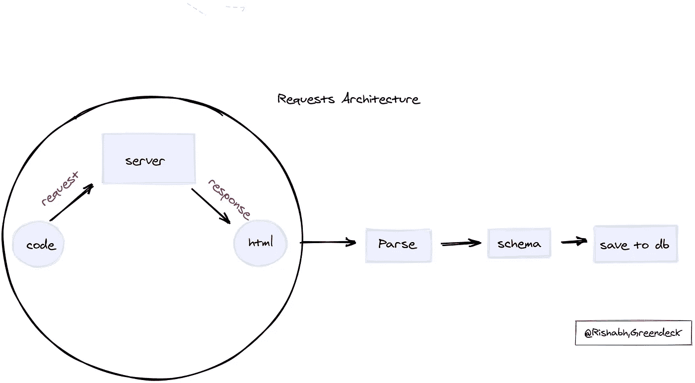
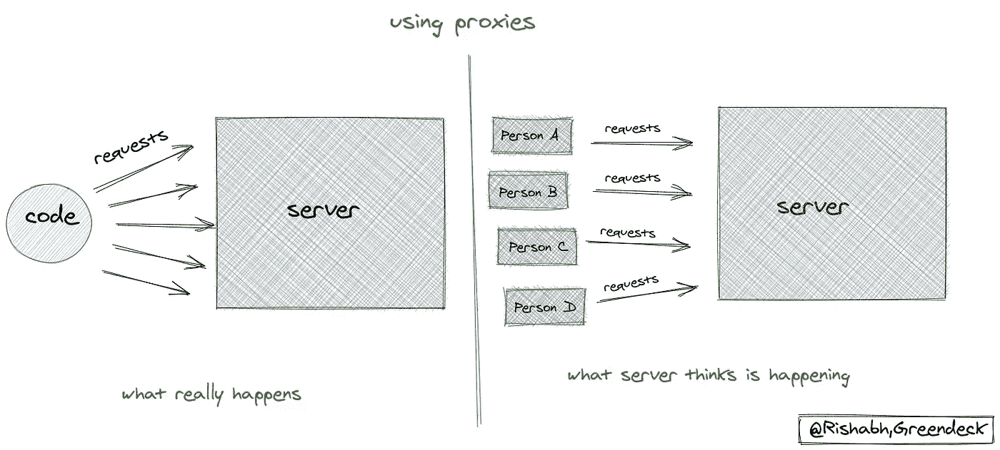
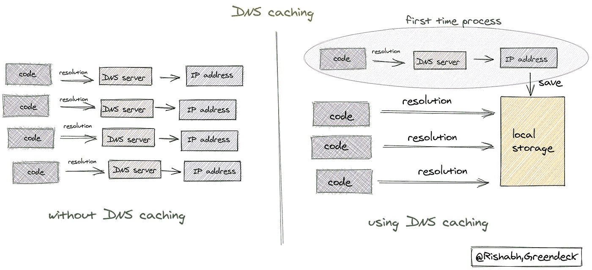
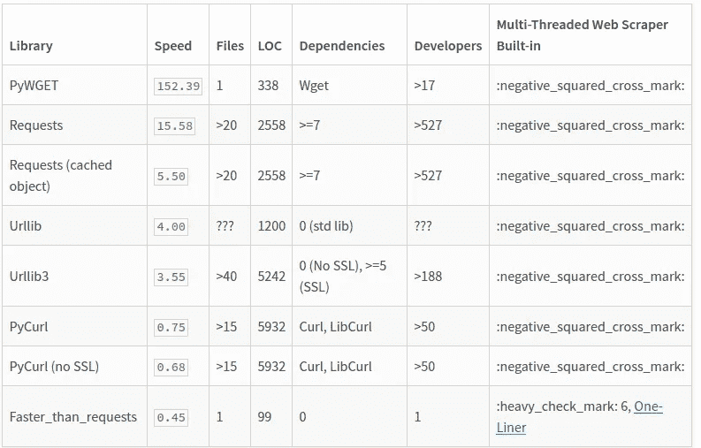

# 超出要求

> 原文：<https://medium.datadriveninvestor.com/beyond-requests-1c2237ce45d6?source=collection_archive---------15----------------------->

我们在 [**Greendeck**](https://greendeck.co/) 为我们的客户提供定价和零售智能解决方案。我们帮助他们根据数据而不是直觉做出伟大的定价决策。

为了实现这一点，主要任务之一是每天从许多电子商务商店中抓取数以亿计的产品。

由于我们是一家数据驱动型公司，数据构成了 Greendeck 的基础。如果我们不能在正确的时间获得正确的数据，事物就不会从一个地方转移到另一个地方。

 [## 软件开发过程:如何选择正确的过程？数据驱动的投资者

### 软件是任何企业组织成功的生命线。没有软件的帮助，一个…

www.datadriveninvestor.com](https://www.datadriveninvestor.com/2020/01/16/software-development-process-how-to-pick-the-right-process/) 

我们需要构建一个健壮可靠的架构，能够尽快完成抓取操作，这样其他任务也可以执行。

下面是这种情况下数据管道的大致情况:

1.  发送请求并接收 HTML 作为响应。
2.  解析响应:以正确的格式提取数据。
3.  将数据保存在所需的模式中。

AMS Architecture

这些任务中的第一个任务是最耗时的，所有其他任务都依赖于它。做好这件事，并让它变得更快，是这个架构的基础。

**要求:**

1.  我们需要向多个门户发送数百万个请求，而不会被阻塞。
2.  它需要很快。
3.  它需要强大和可靠。
4.  需要具有成本效益。

这篇文章就像是我们尝试的每一件事情的旅程，我们从那些实验中得到的结果，什么有效，什么无效。

## 基本要求

像大多数人一样，我们简单地从 [**python 的请求**](https://pypi.org/project/requests/) 模块开始向服务器发送请求。简单明了的请求只是为了开始。按照我们的期望和要求，它失败了。它悲惨地失败了。

1.  超级慢。
2.  我们被禁止发送这么多请求。
3.  我们只是在做`requests.get(url)`。稍后将详细介绍。

简单的要求在各个方面对我们来说都不够好。

在我们开始考虑加快这个过程之前，我们必须停止被门户网站禁止。我们开始挖掘问题，我们发现我们需要比自动化整个过程的代码更人性化。门户屏蔽了我们，因为他们知道是幕后的代码在发送请求，而不是真正的人。所以，我们需要用代码模拟现实世界的过程。

这就是我们需要利用**用户代理、cookies 和头文件的地方。**

Using proxies

这些就像是模拟人类使用浏览器请求资源的过程的小插件。情况有所改善。我们开始得到一些门户网站的回应，但大多数仍在屏蔽我们。下一个明显的步骤是使用**代理。**我们需要有一个非常大的**池在每一个实例中工作**代理，这样我们就可以利用它们来欺骗服务器，请求是从不同的位置由不同的用户发送的。在 Greendeck 上有一项 24x7 全天候运行的服务，可以返回有效的代理。

使用代理、用户代理、cookies 和头文件为我们解决了大部分问题。我们提出的 95%以上的请求都得到了处理，没有任何问题。

**如何让它** **快？**

在加快这个过程之前，我们需要提高我们将为所有实验优化的指标。当你知道你最终想要实现什么时，事情就很容易完成。

我们得出的指标是每秒**个请求**。它是每秒完成的请求数。非常简单。我们需要使这个数字尽可能高。

下一步是集中精力让**变得更快。**需要认识到的重要一点是，该进程是一个 **I/O 受限的**进程，而不是**基于计算的**进程。因此，我们可以利用多线程和多处理，而不会受到 python 解释器强加给多线程进程的 [**GIL 锁**](https://wiki.python.org/moin/GlobalInterpreterLock) 的限制。

我们开始利用多线程和多处理来同时发送许多并发请求。不用说，性能大幅提升。

**如何不再被封禁？**

在使用多线程和多处理后，速度得到了疯狂的提高，但随之而来的是另一个问题。即使使用了代理，我们又开始受阻。现在，我们要在两个选项中做出选择:

1.  对每个 URL 请求使用不同的代理。
2.  对每个 **n 个**请求使用相同的代理，其中 n =门户允许的同时请求数

继续选择选项 2 肯定是正确的，也是唯一的选择，因为可用的代理数量有限。你不能指望每时每刻都有数百万个代理供你使用。**刮的时候需要大方，尊重门户网站的政策。在你的头脑中设定这个规则。**

因此，我们同时发送给门户的请求总数等于可用代理总数乘以数量 **n** 。整批请求由来自不同门户的 URL 组成。这样，我们既尊重政策，又能充分利用我们的资源。

**如何让它更快？**

整个过程仍然没有达到标准。我们知道它可以更优化。这就是使用**会话**和 **DNS 缓存**的想法发挥作用的地方。

# 会议

当我们执行`requests.get(url,headers=headers,proxies=proxies)`时，它为每个请求创建与服务器的会话。这就像是我们所做的努力白费了。我们可以利用我们为第一个请求创建的会话，并且可以为进一步的请求使用相同的会话对象。这意味着第一次使用`requests.session()`创建一个会话对象，然后对每个后续请求使用相同的会话对象。这极大地提高了速度。会话对我们的用例非常有用。

# DNS 缓存

在访问实际的服务器之前，请求首先通过 DNS 服务器，该服务器将域名解析为服务器的实际 IP 地址。这个过程需要时间，但是当我们通过浏览器发送请求时，它通常会被忽略。我们认为，与其在每次请求时都解析同一个域名的 IP 地址，为什么不在开始时只解析一次，并存储解析后的 IP 地址供以后的请求使用。

DNS caching

我们能让它更快吗？

我们从一开始就在想这个问题。我们能让它更快吗？答案是:当然可以。我们开始寻找 python 请求库的良好替代品。在做了一点研究之后，我们开始了解到 [**pycurl**](http://pycurl.io/docs/latest/index.html) 和 [**比请求更快。**](https://pypi.org/project/faster-than-requests/)

Libraries comparison, [Source](https://pypi.org/project/faster-than-requests/).

首先，我们尝试了比请求更快，但后来意识到它没有我们想要的那种定制。开发人员在发出请求时可以传递的参数非常少。大约 95%的请求是使用用户代理、cookies、代理和头来完成的。因此，我们放弃了使用比请求更快的想法。

然后，我们尝试了 **pycurl，**这主要是一个在 **libcurl** 库之上的 python 包装器。结果真的很棒。我们注意到速度提高了 3 倍。

这些都是我们迄今为止为使我们的架构更快更可靠而做的实验。该过程仍未完成。我们仅仅触及了可能性的表面。有很多事情可以尝试，作为回报，它可以更加优化。

希望您会发现这些见解对您的用例有用，如果您还有其他建议，请告诉我们！

如果你对……感兴趣，或者只是想打个招呼，请给我写信，地址是 rishabh@greendeck.co。

**进入专家视角—** [**订阅 DDI 英特尔**](https://datadriveninvestor.com/ddi-intel)