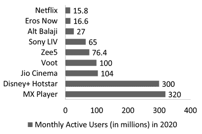
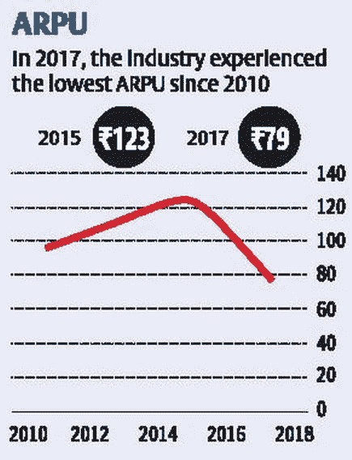
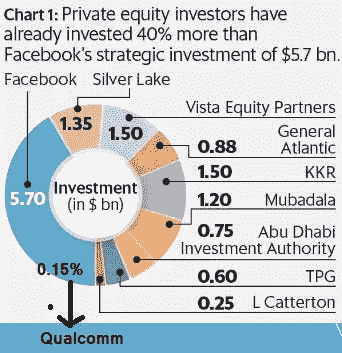
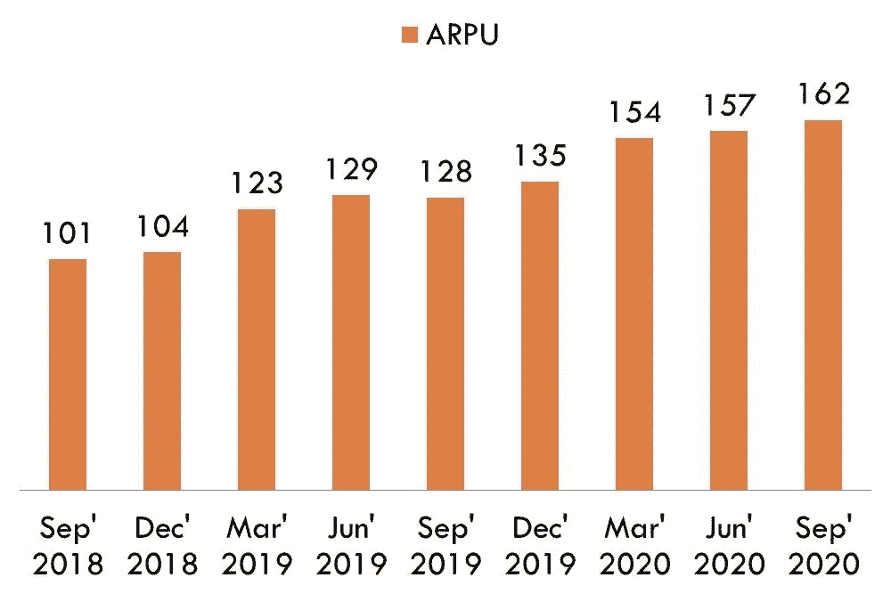

# Bharti Airtel 和印度的电信部门

> 原文：<https://medium.datadriveninvestor.com/bharti-airtel-and-the-telecom-sector-in-india-da26281e398e?source=collection_archive---------3----------------------->

为未来的伟大时代做好准备！

[(Source)](https://www.airtel.in/logo-tune)

披露:

1.  这不是投资建议。投资前请咨询您的理财顾问。
2.  “Bharti Airtel”是我长期投资组合的一部分。

在这篇文章中，我将讨论:

1.  电信行业的长期整合
2.  电信公司不断增加的债务
3.  长期整合结束
4.  数据是新的石油
5.  “在家工作”文化的兴起
6.  “ARPUs”增加的希望
7.  电信行业:可能的双头垄断
8.  Bharti Airtel 已经做好 5G 准备
9.  Bharti Airtel 的最新收购:OneWeb

# 电信行业的长期整合

在“Reliance Jio”进入并改变游戏规则之前，印度的电信部门多年来一直是财富的破坏者。信实通信、沃达丰-Idea、塔塔通信等等，仅仅举几个例子，都没有为投资者创造长期的财富。

电信行业长期整合的主要原因之一是 2007 年至 2020 年的“AGR(调整后总收入)”案例。

让我给你简单介绍一下 AGR 的情况。

一家电信公司要在印度运营，政府需要做两件事，

1.  电信许可证
2.  光谱

电信许可证类似于从政府那里获得在电信部门经营的许可。

简单地说，频谱是电信公司为电磁波范围支付的费用。为了进一步简化，我们作为客户获得的互联网速度取决于频谱(通俗的说法是 2G、3G、4G)。

1999 年，新政要求电信公司支付以下百分比的 AGR:

1.  3–5%的频谱使用费
2.  8%的许可费

我再给你讲讲电信公司是怎么赚‘收益’的。

1.  **电信业务收入:**这是他们的核心业务。这是他们向用户收取的电信服务费用。
2.  **来自其他活动的收入:**这将包括银行存款的利息收入、出售塔楼的收入等等。

**DoT 和电信公司之间的真正问题**

这两者之间的真正问题是你如何定义 AGR 的“收入”。让我们看看双方都说了些什么，

1.  电信公司:看，你已经为我们提供了经营电信业务的许可证和频谱。我们将向您支付我们核心电信业务收入的固定百分比。
2.  不，不是这样的。我们已经给了你许可证和光谱。收入将包括从“核心电信业务”以及“其他活动”中获得的收入。你定期存款的利息是因为你从许可证和频谱上赚的钱，这些钱确实是我们提供的。付给我们你赚的每一分钱的固定百分比。

2007 年，法院讨论了此事，2019 年 10 月 24 日，最高法院裁定 DoT 胜诉。

这些年来的总数是一个巨大的数字。这是公司欠 DoT 的钱以及所有的利息和损失，

*   巴蒂电信 21682 亿卢比
*   沃达丰-想法在 28308 亿卢比
*   信实通信 16456 亿卢比(公司几乎濒临破产！)
*   塔塔集团 9987 亿卢比
*   7852 亿卢比的 Aircel
*   BSNL 209.8 亿卢比
*   Telenor 的 195 亿卢比
*   reliance Jio 1300 万卢比(幸运的是，它在 2016 年末开始运营！)

从上面的列表来看，活跃的玩家只有，

*   Bharti Airtel
*   沃达丰-Idea
*   BSNL
*   信实 Jio

# **电信公司不断增加的债务**

电信公司需要巨额资金来创建一个坚实的生态系统和基础设施，如塔。

不断上升的债务一直是这些公司关心的问题。事实上，印度最大的亏损公司包括:沃达丰、信实通信、Airtel、BSNL。

事实上，[2019 年三大电信公司的总债务为 39 亿卢比，相当于印度财政赤字的一半。](http://Telecom companies require huge capital for creating a solid ecosystem and infrastructure like towers.  The rising debt has always been a matter of concern for these companies. As a matter of fact, the largest loss making companies in India includes the names like: Vodafone Idea, Reliance Communications, Airtel, BSNL.)

# 长期整合结束

2020 年 9 月 1 日，最高法院宣布了一项具有里程碑意义的判决

它允许 telecos 有 10 年的时间支付 AGR 会费。因此，电信公司现在可以争取时间来清理欠款，开始一个新的故事。

# 数据是新的石油

数据是新的石油。这适用于当前的场景。我们无法想象没有互联网的生活！此外，对 OTT (Over-the-top)平台的需求也证明了电信公司的未来是光明的。

(created by author in MS PowerPoint)

看看这些数字！而且增长速度非常快。

不仅如此，智能手机的使用已经上升了很多年了！这表明，没有数据，几乎不可能与世界同步。

# “在家工作”文化的兴起

新冠肺炎改变了员工的工作方式。在封锁期间，几乎所有 IT 部门的员工都在家里工作，这实际上对 TCS、Infosys、Wipro 等 IT 巨头很有效。

否则，这些公司不得不在员工的差旅费上花费巨大。然而，由于“在家工作”的文化，IT 公司的利润率已经有了明显的提高。事实上，TCS 已经宣布，到 2025 年，全球近 75%的员工将在家工作。

如果这种趋势持续下去，电信公司可能会处于有利位置。在家工作意味着更好的网络连接。IT 公司也很乐意在良好的互联网连接上花更多的钱来推广“在家工作”的文化。

# ARPUs 增长的希望

**代表“每用户平均收入”。简而言之，“ARPU”显示了电信公司从每个用户身上获得的平均收入。**

****

**[(Source)](https://www.thehindubusinessline.com/info-tech/mobile-arpu-hits-seven-year-low/article24373836.ece)**

**你可以清楚地看到下降图。这表明在 Reliance Jio 进入后，电信行业发生了怎样的变化。**

**2016 年，随着 Reliance Jio 进入市场，它几乎免费提供优质服务。这导致了 ARPU 战争和其他电信公司，如 Airtel，Idea，沃达丰等被迫降低价格。这导致 ARPUs 大幅下跌。**

**与此同时，从 2016 年到 2020 年，**

1.  **Reliance Jio 不仅成功增加了市场份额，而且最终成为市场领导者[，拥有超过 30%的市场份额](https://telecom.economictimes.indiatimes.com/news/jios-market-share-reaches-to-34-33-in-may-trai/77759512)。此外，它设法收支平衡，现在它正在为其母公司“信实工业有限公司”释放价值。**
2.  **Idea 和沃达丰意识到，要想留在游戏中，他们需要握手言和。这标志着 2018 年 8 月 31 日 Idea 沃达丰的[合并。](https://en.wikipedia.org/wiki/Vodafone_Idea#:~:text=On%2031%20August%202018%2C%20Vodafone,merged%20company%20as%20the%20Chairman.)**

**2020 年，Reliance Jio 掀起了一场融资狂潮。每个大牌都想尝尝 Reliance Jio 蛋糕的成功。**

****

**[(Source)](https://www.jagranjosh.com/general-knowledge/list-of-top-investors-in-reliance-jio-1594630586-1)**

**有这么多大牌投资者投资 Reliance Jio，很明显 ARPUs 值未来会上升。不用说，这对整个电信行业都有好处，包括像 Bharti Airtel 这样的巨头。**

**Bharti Airtel 在 ARPU 的持续增长令人鼓舞。让我们看看这些数字。**

****

**(Created by author in MS PowerPoint using data disclosed by Bharti Airtel)**

# **电信行业，可能的双头垄断**

**电信行业现在有三个活跃的参与者:**

1.  **信实 Jio**
2.  **Bharti Airtel**
3.  **沃达丰创意**

**毫无疑问，Reliance Jio 处于最佳位置，Bharti Airtel 也是一个非常好的故事。**

**然而，随着债务的增加和巨大的 AGR 费用，沃达丰的想法的生存受到质疑。沃达丰 Idea 的用户正被其他两大巨头抢走，这一事实再次证明了这一点。**

**此外，沃达丰 Idea 需要花费巨额资金为 5G 做好准备，并与 Jio 和 Airtel 竞争。随着债务和损失的增加，沃达丰很难轻松筹集资金。**

**因此，缓慢的双头垄断的迹象对“Airtel”的股价可能是一件好事，该公司的股价仍低于“Reliance”。**

# **Bharti Airtel 已经做好 5G 准备**

**“Airtel”股价不动的众多原因之一是媒体报道不足。我记得当 Reliance Jio 宣布其 5G 游戏时，媒体是如何开始报道的，以及它将如何[提供廉价手机](https://gadgets.ndtv.com/telecom/news/jio-phone-android-low-cost-december-launch-reliance-report-2292631)。**

**母公司“信实工业有限公司”拥有媒体公司，这一事实确实有助于在正确的时间为“Jio”播放正确的新闻，但“Airtel”的情况并非如此。**

**然而，即使是 Airtel 也在美国和日本合作伙伴的帮助下，通过自己的研发来开发[当地的 5G 设备生态系统。这一点报道不足。Bharti Airtel 已经准备好 5G 了！它释放 5G 技术并证明其价值只是时间问题。](https://telecom.economictimes.indiatimes.com/news/airtels-dramatic-strategy-shift-developing-local-5g-gear-local-ecosystem-via-own-rd-and-us-japanese-partners/78774004)**

# **Bharti Airtel 的最新收购:OneWeb**

**现在，让我来讨论一下 Bharti Airtel 的未来。**

**你和我，我们都使用电信公司的服务，不是吗？但是，为了实现无缝互联网接入，电信公司需要在发射塔和基础设施上花费数十亿卢比。一座塔覆盖的范围很广，如果你在那个范围内，你可以体验到优质的服务。**

**但是，你有没有想过用一颗太空卫星代替地面发射塔，为你提供无缝的互联网和其他服务？**

**2012 年， [One Web](https://en.wikipedia.org/wiki/OneWeb) (总部位于英国)成立，他们开始制造卫星，旨在为“任何地方的任何人”提供互联网服务，正如他们的目标所暗示的那样。这个想法是推出“一个网络卫星星座”。**

**让我们了解一下什么是星座。星座不是一颗单独的卫星，而是一组覆盖整个地球的卫星。**

****

**[(Source)](https://www.airbus.com/space/telecommunications-satellites/oneweb-satellites-connection-for-people-all-over-the-globe.html)**

**一家网站计划在第一阶段将 650 颗卫星送入轨道，然后在第二阶段将 1972 颗卫星送入轨道。**

**到 2020 年 3 月，它设法将 74 颗卫星放入初始星座。**

**通常，地球静止卫星运行在地球的外层轨道，这太远了(在 36，000 公里的范围内)。然而，One Web 的卫星位于低地球轨道(1200 公里)。**

**逻辑很简单，低地球轨道意味着更快的连接，这将解决延迟问题。**

**想象一下，给你的朋友打电话，无论你说什么，都会晚一两秒到达你的朋友那里。那会令人沮丧，对吗？这就是所谓的延迟问题。对于无缝通信，低轨道卫星是完美的选择。**

**而且我们需要承认这一点，卫星很酷！**

**想象一下，在阿拉斯加或沙漠地区或偏远的岛屿上建立一座塔是多么痛苦的事情。嗯，有了卫星，就方便多了。**

****

**[(Source)](https://en.wikipedia.org/wiki/OneWeb_satellite_constellation#%2Fmedia%2FFile%3AKSC-20170316-PH_KLS01_0007~orig.jpg)**

**不幸的是，对于 One Web 来说，事情并没有像计划的那样发展。2020 年 3 月，因资金不足申请破产。**

**这对 Bharti Global 来说是一个千载难逢的机会。Bharti 赢得了竞标，并以 5 亿美元的价格获得了 One Web 45%的股份，相当于 37 亿卢比。**

**英国政府设法以同样的金额购买了 45%的股份(在英国退出欧盟之后，他们将无法使用伽利略项目。因此，这笔交易)**

**如果计划和执行得当，Bharti Airtel 可以通过卫星开发尚未开发的市场。随着太空互联网的新的数字革命，可能会有单独的计划和订阅。**

**此外，不仅如此，它还可以与埃隆马斯克的“SpaceX”和杰夫·贝索斯的亚马逊关联的“柯伊伯项目”相媲美，后者已经在竞争中了！**

**总而言之，我认为电信行业和 Bharti Airtel 前景广阔。但是，如前所述，这不是一个投资建议。**