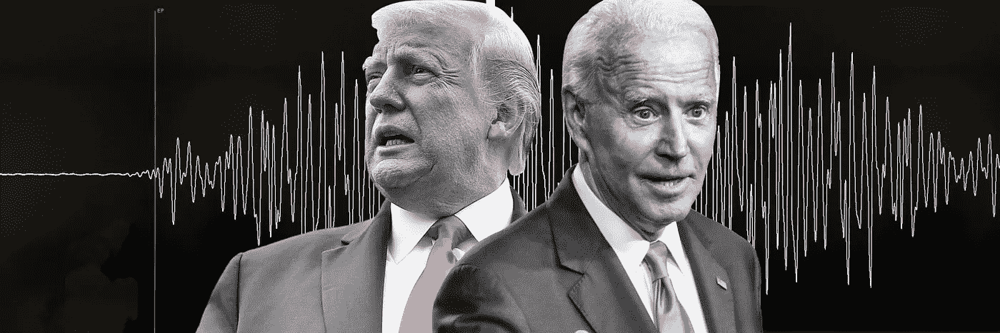
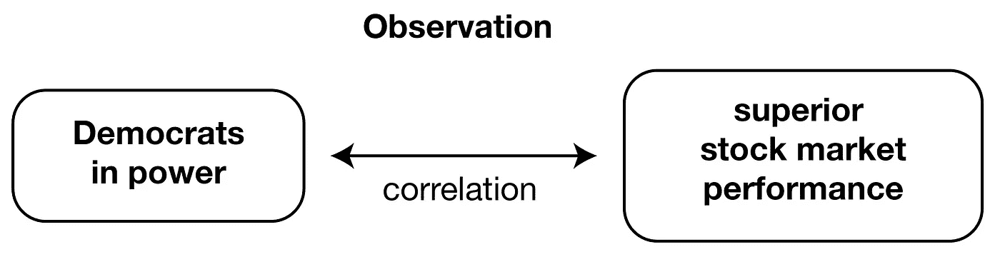
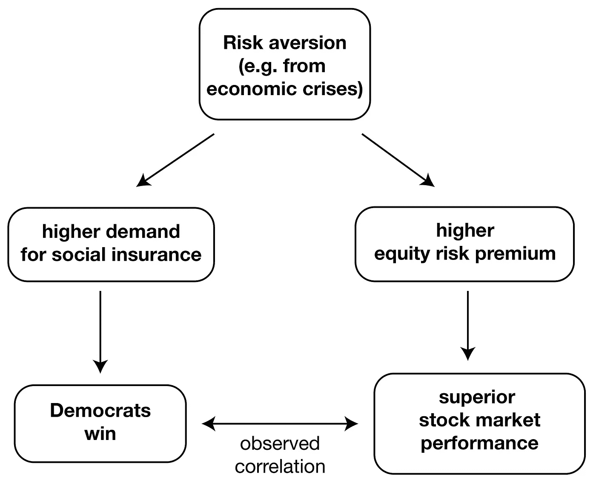
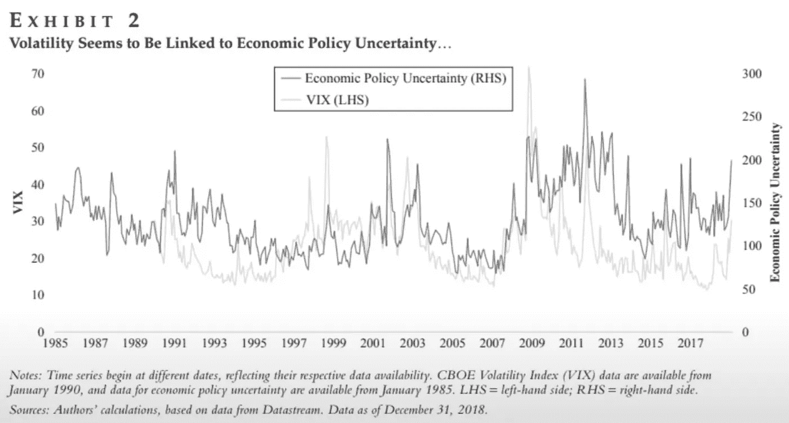
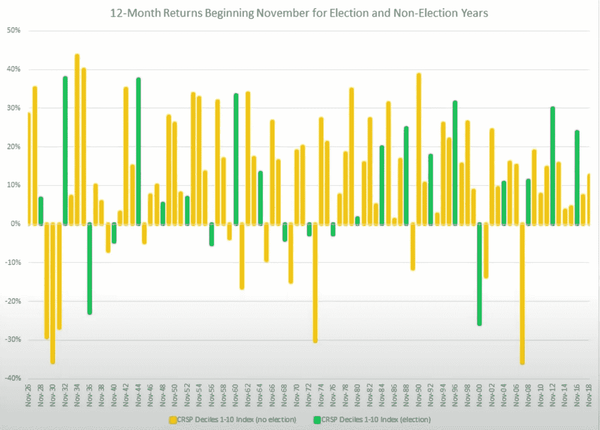
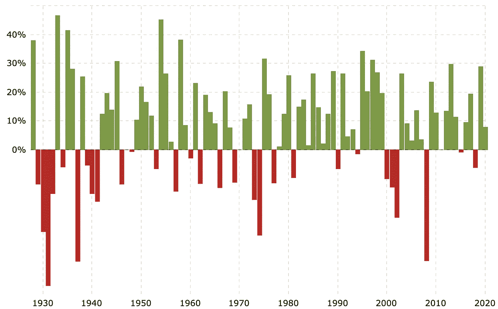

# 拜登与特朗普——谁对股市更有利？

> 原文：<https://medium.datadriveninvestor.com/biden-vs-trump-whos-better-for-the-stock-market-65d13fd97870?source=collection_archive---------8----------------------->

## 数据显示民主党，但不是因为民主党的领导

许多人担心大选前后的股市表现。我是。让我们深入了解一下数据驱动型(DDDD)的情况。

加入 Medium [这里](https://col-jung.medium.com/membership)并获得**无限制访问**互联网上最好的文章。

# 哪一方给投资者的回报更高？

**简而言之:**民主党人，但不是因为民主党的领导。

数据显示，在民主党总统任期内，股市回报率平均更高。参见[圣克拉拉等人(2003)](https://www.jstor.org/stable/3648176) & [帕斯托尔等人(2017)](https://www.nber.org/papers/w23184) 。

Average market returns under Democrat vs. Republican presidents. Source: Pastor (2017).

在 1927 年至 2015 年间，民主党总统统治下的平均[超额市场回报率](https://www.investopedia.com/terms/e/equityriskpremium.asp)为 10.7%，而共和党总统统治下的平均超额市场回报率仅为每年-0.2%。根据 Pastor 等人的研究，每年高出约 11%的差异“在经济上和统计上都非常显著”。

然而，我们应该非常小心，不要在民主领导力和股市表现之间得出任何错误的因果关系。

正如 Pastor 等人所认为的，并不是民主党的政策导致了这些高回报，而是民主党当选的时机。

简而言之:民主党总统任期和优异的股市回报都同时受到第三个变量的影响:**风险厌恶**。

规避风险——通常与经济危机联系在一起——使得选民更有可能选举民主党总统，因为他们会要求更高的社会保障网络。(相比之下，当风险厌恶程度较低时，选民更有可能选择共和党总统，因为他们希望承担更多的商业风险。)

风险厌恶的增加导致更高的股票风险溢价，从而带来更高的股票市场平均回报。

那么所谓的避险和经济危机的关系呢？[Guiso et al(2008)](https://www.sciencedirect.com/science/article/abs/pii/S0304405X18300461)2008 年金融危机后风险厌恶情绪激增； [Broz (2010)](https://www.researchgate.net/publication/228121131_Partisan_Financial_Cycles) 表明发达国家金融崩溃后，左翼政府往往会胜出；和[赖特(2012)](https://www.jstor.org/stable/23357704?seq=1) 表明，美国选民倾向于在高失业率时期选举民主党人。我们挑选了选民比平时更厌恶风险的重要例子:

*   1932 年——大萧条:胡佛输给了罗斯福
*   1960 年——1960-61 年的经济衰退:尼克松输给了肯尼迪
*   1976 年——1973 年至 1975 年的经济衰退:福特输给了卡特
*   1992 年——1990-91 年的经济衰退:布什输给了克林顿
*   2008 年——全球金融危机:布什输给了奥巴马。

总之，在民主党总统的领导下，股市往往表现更好，但这并不是因为民主党的领导本身。由于第三个令人困惑的变量，更高的回报往往与民主党总统相吻合:通常由暗淡的经济状况引起的风险厌恶。

看看本·菲利克斯的这个[精彩视频](https://www.youtube.com/watch?v=HYHu9PMY_C4)。

好吧。既然我们在这里，让我们看看一些相关的问题。

# 选举前市场总是不稳定的吗？

**回答:**经常是的。

这是因为不确定性造成了市场波动。领导层的潜在变动会带来巨大的不确定性。在选举紧张时尤其如此，例如:

*   2000 年(戈尔对布什)
*   2004 年(克里对布什)
*   2016 年(克林顿对特朗普)

这可以从以下数据中观察到，摘自赵聆庄等人的[*【2019】*](https://jii.pm-research.com/content/10/3/6.abstract)【不确定性越大，波动性越大】。

Source: Zorina et al (2019).

# **选举后市场表现会更差吗？**

**回答:**平均来说，是的。

以下是一些选举后(绿色)与非选举后(黄色)股市表现的数据。

Analyst: [Ben Felix](https://www.youtube.com/watch?v=HYHu9PMY_C4). Tool: Dimensional Returns Web

平均而言，与所有其他非选举年(11.9%)相比，选举后一年的回报率(10.6%)略低。在选举后的 23 年中，有 7 年给出了负回报:

*   1936 年(富兰克林·罗斯福)
*   1940 年(富兰克林·罗斯福)
*   1956 年(德怀特·戴维·艾森豪威尔)
*   1968 年(林登·约翰逊)
*   1972 年(理查德·尼克松)
*   1976(吉米·卡特)
*   2000 年(小布什)

只有两个负回报出现在第一任期:卡特和布什。

# 你应该担心吗？

如果你是一名长期投资者，答案是否定的。自 1928 年成立以来，在 9 位共和党和 7 位民主党总统任期内，以及在许多经济危机、战争和冲突中，标准普尔 500 的平均年回报率为 10%。

不过，预计市场会出现波动，尤其是在竞争激烈的情况下。作为一名长期投资者，我更关心政府执行有远见的政策的能力，这种政策将压制新冠肺炎，同时不会加剧与中国的争端。在特朗普的第二个任期内，我预计复苏将持续很长时间，因为特朗普拒绝支持更严格的封锁——用短期经济收益换取长期痛苦。与此同时，拜登政府可能会加大对冠状病毒的打击力度，但在稳定与中国关系的同时，会加大刺激支出。

在 Twitter & [YouTube](https://www.youtube.com/c/CryptoFilmmaker) 上关注我，获取定期分析和指导。

# 我的加密文章

通过在这里加入获得**对媒体的无限制访问**。

*   [2022 年加密货币市场回顾](/new-to-crypto-heres-what-you-need-to-know-2022-guide-c1da32866837)
*   [了解加密为何存在](https://medium.com/geekculture/understanding-why-crypto-exists-677a32b4e3bb)
*   FTX 的垮台&索拉纳会活下来吗？
*   [多边形&索拉纳— 6 黑仔加密/NFT 用例](/solana-polygon-6-killer-use-cases-9687b70487e0)
*   [NFT 集市简史](https://medium.com/geekculture/a-brief-history-of-nft-marketplaces-ed25252478e6)
*   [复利是世界第七大奇迹](https://medium.com/swlh/the-power-of-compound-interest-850ab4517506)
*   [如何用 Crypto 产生被动收入](https://col-jung.medium.com/how-to-generate-passive-income-with-cryptocurrencies-fbca623b2b4f)
*   [BNB 链上的加密被动收入](https://col-jung.medium.com/cryptocurrency-passive-income-on-the-binance-smart-chain-babff31a45f6)
*   [移动&赚取加密—步骤的 6 个月回顾](https://medium.com/geekculture/stepn-past-present-and-future-65139f0d3f31)
*   PancakeSwap 的高 APY 池——有什么内幕？
*   赌注指南:[卡尔达诺](https://col-jung.medium.com/cardano-ada-staking-passive-income-2022-guide-c840a24923a0)、[雪崩](https://col-jung.medium.com/avalanche-avax-staking-passive-income-guide-2022-edition-e3fbfa1d743e)、[索拉纳](https://col-jung.medium.com/solana-sol-staking-passive-income-guide-2022-edition-b1bb4fd4f988) (2022)
*   价格预测:[卡尔达诺](https://col-jung.medium.com/how-high-can-cardano-ada-go-crypto-price-predictions-9de753634a17)，[雪崩](https://col-jung.medium.com/how-high-can-avalanche-go-crypto-price-analysis-6dbc88780050)，[索拉纳](https://col-jung.medium.com/how-high-can-solana-go-crypto-price-analysis-57f1a051245f)(牛市)
*   [如何进行加密价格预测](https://col-jung.medium.com/2021-crypto-bull-run-calculations-445bdd2c3b1d)
*   [三大价格预测错误](https://col-jung.medium.com/how-to-make-realistic-cryptocurrency-price-predictions-436f3f6f54e3)
*   加密 VISA 卡——每次购物都有返现？
*   [如何像聪明钱一样积累财富](/what-is-crypto-com-credit-build-wealth-like-the-rich-6be53b492834)
*   [crypto . com 的 Earn 计划值得吗？](/what-is-crypto-com-earn-build-your-crypto-wealth-2c0a434c7185)
*   [了解 Terra 的锚协议](https://medium.com/coinmonks/forget-banks-earn-20-on-your-usd-in-defi-on-the-terra-blockchain-2b1d2844574)
*   [如何参与首次 DEX 发售](https://col-jung.medium.com/crypto-income-with-launchpad-idos-solchicks-chicks-experience-on-trustswap-bd948736d3d4)
*   Memecoin 投机——值得吗？
*   [为什么 SHIB 永远达不到 1 美元(甚至接近 1 美元)](https://col-jung.medium.com/why-shiba-inu-shib-cant-reach-1-crypto-reality-check-484ed3844333)
*   [想提前退休？购买比特币](https://medium.com/swlh/want-to-retire-early-invest-in-bitcoin-cf445f7a716f)
*   民主党 vs 共和党——哪一方对市场更有利？

# 加密注册奖金

*   **币安——永远九五折** ( [链接](https://accounts.binance.com/en/register?ref=X7LBTYDM))
*   **Nexo——25 美元免费 BTC** ，100 美元存款([链接](https://nexo.io/ref/khchmqekem))
*   **Crypto.com——25 美元免费 CRO** 和一张玉绿色 VISA 卡([链接](https://www.crypto.com/app/col))