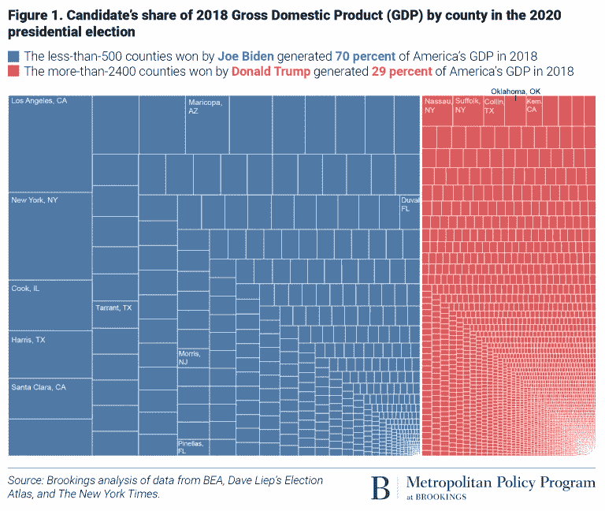

# 拜登赢得了占美国 GDP 的县

> 原文：<https://medium.datadriveninvestor.com/biden-won-counties-totaling-70-of-us-gdp-9b2aa8a397c3?source=collection_archive---------24----------------------->

## 这个国家充满活力、高经济产出的地区压倒性地投票支持民主党。

[Chelsea Stahl, NBC News.](https://www.nbcnews.com/politics/2020-election/will-democrats-beat-gop-again-dark-money-donations-2020-despite-n1102666)

关于人口统计学的未来有相当多的谈论。而且，正如人口学家喜欢提醒我们的那样，“人口统计就是命运。”

应该指出的是，选民之间的历史分歧，甚至是持续了近一个世纪的分歧，似乎在最近的选举中发生了逆转。特朗普看到有色人种的支持有所增加，有色人种长期以来是民主党基础的核心方面。非裔美国人对特朗普的支持度从 2016 年的 8%上升到 12%，拉丁裔美国人的支持度从 2016 年的 29%上升到 31%。

特朗普在城市地区的表现也超过了他 2016 年的总和。在总统法律努力的中心费城，超过 18%的选民选择了特朗普——高于 2016 年的 15%。另一方面，拜登在郊区的表现比克林顿好。

但是，尽管种族和地理上的差异已经缩小，一种新的选举模式已经出现。根据布鲁金斯都市政策项目[的新分析](https://www.brookings.edu/blog/the-avenue/2020/11/09/biden-voting-counties-equal-70-of-americas-economy-what-does-this-mean-for-the-nations-political-economic-divide/)，拜登支持的县不到 500 个，但这些县占美国 GDP 的 70%。特朗普赢得了 2400 多个县，但那些更小、更穷、更农村的县占了我们 GDP 的 29%。(由于四舍五入，这些数字加起来并不完全是 100%。)

回到 2016 年，我注意到这个国家充满活力的高经济产出地区也支持克林顿。她比特朗普多获得了近 300 万张选票，克林顿赢得的县约占 GDP 的 64%。

特朗普是少数人统治的体现。至少在人和经济方面。

正如这项研究的作者指出的:

> *简而言之，2020 年的地图继续反映了投票给民主党的大而密集的大都市县和投票给共和党的大部分远郊、小城镇或农村县之间的明显分裂。蓝色和红色美国反映了两种截然不同的经济:一种面向多样化、通常受过大学教育的专业和数字服务职业工人，另一种是白人、受教育程度较低、更依赖“传统”行业。*

值得注意的是，这种经济差距——民主党主导经济成功地区，反之亦然——并不总是存在。2000 年，戈尔在代表国内生产总值的县中仅以微弱优势领先布什。

特朗普在 2020 年成功赢得的两个经济最成功的县是代表纽约长岛的拿骚县和萨福克县。

但这不仅仅是经济琐事或无用信息。正如作者指出的那样，差距的存在，甚至是不断扩大，给我们的政治体系带来了问题:

> 相比之下，共和党代表的是一个经济基础，位于美国苦苦挣扎的小城镇和农村地区。那里的繁荣对许多人来说仍然遥不可及，共产党认为没有理由考虑国家大都市中心的优先事项和需求。这不是经济共识或成就的情景。

这一最新数据应该消除任何认为民主党是“社会主义者”或索取者的观念。该国经济最强大的地区，理论上在财富再分配平台下损失最大，投票给民主党。事实上，十个最富有的国会选区(以中等家庭收入衡量)是由民主党代表的 T2。

种族和地理对预测选举结果的影响越来越小。但是经济从来没有如此重要过。