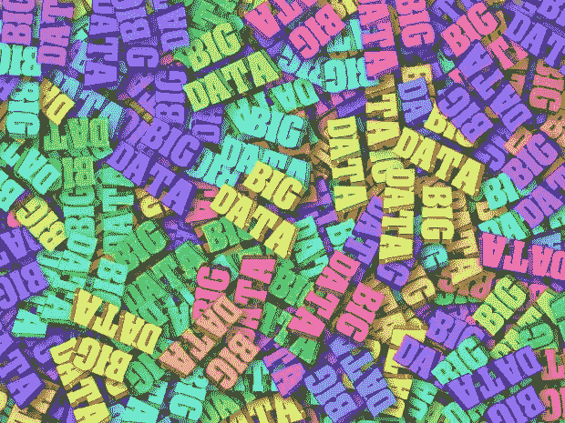
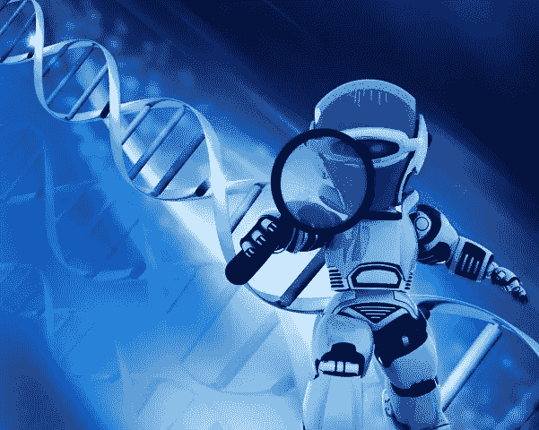

# 远程医疗中的大数据分析重塑医疗保健行业

> 原文：<https://medium.datadriveninvestor.com/big-data-analytics-in-telemedicine-reshaping-the-healthcare-industry-1d50e48ef5c9?source=collection_archive---------4----------------------->

## 远程医疗市场正在蓬勃发展，大数据分析正在极大地改变远程医疗。让我们看看如何…

最近，在冠状病毒疫情的推动下，远程医疗的使用出现了大爆炸。现在，越来越多的临床医生和患者开始采用数字医疗选项。

由于远程医疗，现在医生甚至可以在远离他们的地方给病人做手术，或者物理治疗师甚至不用探访病人就可以监控手术后的康复。

 [## 大数据颠覆了我们所知的信贷应用|数据驱动的投资者

### 融合是金融领域的最新流行词，由于支付和贷款之间的关系，我们现在…

www.datadriveninvestor.com](https://www.datadriveninvestor.com/2020/03/19/big-data-disrupts-credit-applications-as-we-know-them/) 

你认为这种趋势在新冠肺炎之后会减弱吗？

不。相反，在未来几年，全球远程医疗市场预计将呈指数增长，为投资者提供了一个巨大的机会。根据最近的一份报告，随着越来越多的医生采用这项技术，远程医疗的市场目前约为 318 亿美元，预计到 2025 年将达到 1305 亿美元。

没有技术，远程医疗是不可能的。令人欣慰的是，医学界一直在融合新技术。推动远程医疗的一项技术是——[大数据](https://www.datadriveninvestor.com/glossary/big-data/)分析。大数据与远程医疗的融合正在以多种方式在医疗和保健领域创造奇迹。

以健康信息学为例。[物联网](https://www.datadriveninvestor.com/glossary/internet-of-things/) ( [物联网](https://www.datadriveninvestor.com/glossary/internet-of-things/))和远程医疗的融合已经以智能医院、智能手术室、智能医疗监控等形式出现。这些医疗物联网设备产生的大量数据开辟了一个新的范式，称为健康信息学，它有望更快地了解、分析和共享信息。这种信息学的支柱是大数据和云计算等技术。

让我们看看大数据推动远程医疗并改善患者和医疗保健提供商体验的其他一些领域:

*Photo by* [*National Cancer Institute*](https://unsplash.com/@nci) *on Unsplash*

# 更好的诊断

在向患者提供诊断药物之前，必须考虑许多因素。这需要仔细分析海量的医疗数据。分析中的任何错误都可能造成严重的医疗后果。通常，在医生能够进行诊断之前，医生依赖于患者对症状的主观报告。但在今天，有这么多可穿戴设备，医生可以根据可穿戴设备收集的健康数据对病人进行诊断。

在这里，大数据分析可以帮助改进诊断及其结果。医疗从业者可以依靠大数据分析从大量可用的医疗数据中提取信息。这超出了个人的经验和可用资源。

# 治疗后监测和药物治疗

一旦治疗结束，就可以在远程医疗的帮助下远程监控患者的健康状况。这有助于避免患者复诊，对于年老或虚弱的患者尤其有用，因为他们不再需要亲自去医生那里。

大数据分析技术可用于为远程患者确定正确的药物剂量以及正确的治疗过程。这对患者和医生来说都是双赢的。由于监测和药物治疗可以远程完成，医疗保健的成本大大降低。

# 云上的电子健康记录

产生的大量健康数据可以存储为患者的电子健康记录或 EHR。它可以存储在云上，如果需要，它可以提供给世界上任何一个医疗从业者，不管他在哪里。当患者的治疗需要由专科医生远程完成时，这尤其有帮助。

这不仅节省了医生和患者的时间，也节省了患者前往医生处的费用。此外，[大数据](https://www.datadriveninvestor.com/glossary/big-data/)分析可应用于存储在云上的数据，以获得更多见解。

# 预测分析

[预测分析](https://www.datadriveninvestor.com/glossary/predictive-analytics/)可以帮助医疗从业者根据数据快速做出决策，改善患者的健康状况。这对于患有复杂疾病或慢性病的患者尤其有用。临床医生可以提前预测重大医疗事件，避免患者病情恶化。

大量的设备，医疗物联网(IoMT)正被用于不断收集患者的健康数据。大数据分析应用于这些数据，以监控患者的健康统计数据，并且医生不断更新状态，以便提前注意到任何异常。

所有与患者病史相关的数据都用于[预测分析](https://www.datadriveninvestor.com/glossary/predictive-analytics/)以了解对未来的任何影响。

# 传染病的早期识别和预防

医疗保健数据的分析可用于研究传染病的模式，并预测任何特定地区未来的爆发。[大数据](https://www.datadriveninvestor.com/glossary/big-data/)分析在这里可以派上用场，研究趋势并预测疾病的传播。

在确定了受感染的区域后，可以利用远程医疗开始治疗和监测。

# 未来

大数据分析与远程医疗的融合为临床医生提供了数据驱动的见解，从而更好地护理患者。它鼓励基于价值的医疗保健服务，同时降低成本。除了上述好处之外，大数据的力量还在医学领域开辟了许多其他可能性，这些可能性在以前被认为是不可能的。最近的远程医疗进步只是冰山一角，在远程医疗以及支持技术领域，它拥有一个有待开发的巨大可能性世界。

阻碍远程医疗领域广泛采用大数据和云计算的唯一障碍是数据隐私和安全性。如果这些问题得到解决，大数据的力量就可以发挥其真正的潜力，我们将在未来几年看到大数据分析在远程医疗中的更多应用！