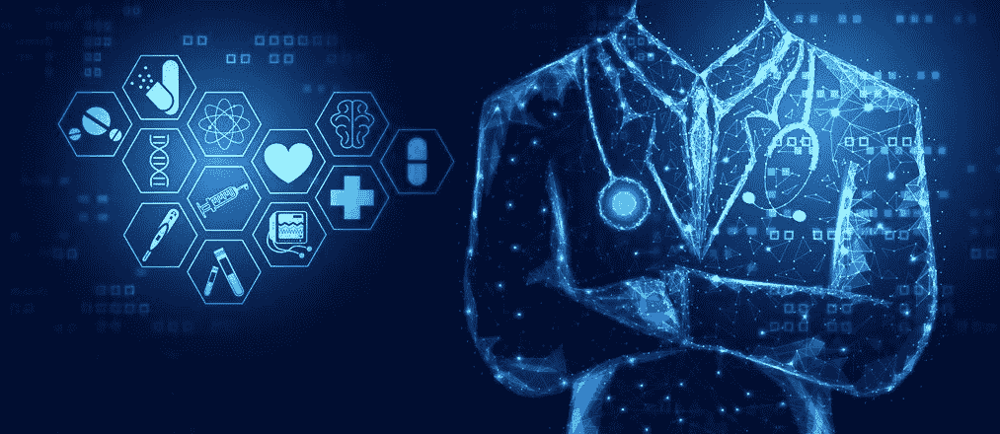

# 大数据、区块链和保护疫情数据隐私

> 原文：<https://medium.datadriveninvestor.com/big-data-blockchain-and-keeping-pandemic-data-private-3e575484a1b?source=collection_archive---------4----------------------->

(Tex Vector/Shutterstock)

从宏观到微观，从全球经济和市场趋势到每天早上 LinkedIn 和 Twitter 上显示的新闻故事，大数据驱动着我们的世界。21 世纪的经济是信息经济，越来越多的数据，加上处理和分析数据意义的能力增强，是帮助建立更好的金融、政府和社会系统的隐藏结构。

大数据的重要性以及我们如何利用大数据现在是中心话题。在反对新冠肺炎疫情的国际斗争中，一个关键问题是我们的数据不够大，为了获得更大的数据集，维护隐私成为一种微妙的平衡。各国政府正在努力寻找符合隐私法的方式，以使卫生和数据科学家能够获得关于病毒传播的实时知识，随着疫情的严重性增加，这个问题也越来越严重。

 [## 大数据颠覆了我们所知的信贷应用|数据驱动的投资者

### 融合是金融领域的最新流行词，由于支付和贷款之间的关系，我们现在…

www.datadriveninvestor.com](https://www.datadriveninvestor.com/2020/03/19/big-data-disrupts-credit-applications-as-we-know-them/) 

特别是在过去一周，全球专家不得不面对这样一个事实，即我们对关键事实缺乏了解，削弱了我们跟踪、预测和应对病毒的能力，这些事实包括识别活跃的携带者、估计抗原水平以及确定尚未感染的范围。研究人员在收集数据、将其简化为可用的格式，以及在不同部门和地域之间以及时和保密的方式共享数据方面面临着进一步的挑战。

**数据采集**

进入疫情几周后，像 [ArcGIS](https://www.arcgis.com/apps/MapJournal/index.html?appid=7edd44d94edb4b58ae57289e605632ca) (全球)、 [Anodot](https://app.anodot.com/#!/dashboards?tabs=main%3B5e6616e802bce5000df766ca&activeTab=1&%24Country_Region=%3BUS&%24Province_State=%3BAll&isFullScreen=%3Bfalse&constRange=%3B1m&startDate=%3B1581341073&endDate=%3B1583846673&autoRefreshInterval=%3B-1&timeScale=%3Blonglong&eventsPreset=%3B&eventsOn=%3Bfalse&invitationId=%3Binv_88d0-d4dc44770335) (美国)和 [Covid Tracking](https://covidtracking.com/data/) (美国)这样的数据聚合网站已经提供了最新的公共信息，在某些情况下，还提供了病毒传播数据的提交门户。数据通常来自政府层面的公共卫生机构和研究机构，但在关闭期间对医疗系统访问的挑战和实时信息的相对匮乏促使研究人员寻找其他数据采集方法。

大数据的出现意味着世界各地的公司和政府已经在处理和分析互联网、社交媒体和智能手机用户的大量信息。然而，出于未经授权的目的使用这些信息会带来严重的隐私挑战，特别是在严格的隐私法下，如欧盟的《通用数据保护条例》( GDPR ),该条例[已经放松了](https://www.geospatialworld.net/blogs/eu-member-states-covid-19/)以应对疫情。

关于使用手机定位数据来监控新冠肺炎病毒的传播或确诊病例的动向的[伦理问题的争论仍在继续。有人提出了疫情数据采集的新解决方案，如](https://www.wired.com/story/value-ethics-using-phone-data-monitor-covid-19/)[麻省理工学院实验室的应用程序](https://www.wsj.com/articles/mit-researchers-launch-location-tracking-effort-for-the-new-coronavirus-11585315674)，通知用户他们是否接触过已知受感染的人，或者英国国王学院的 [Covid 症状跟踪器](https://covid.joinzoe.com/)。由于政府授权的应用不太可能被接受，这些自愿和选择加入的解决方案让人们通过将自己的数据作为资源进行移动来为应对危机做出贡献。

而且它们可能比预测的更准确。用户提交症状的应用程序在验证方面的不足，在规模上得到了弥补——数亿人自愿提供基本的健康信息，应该(有希望)创造足够的样本量，以显著提高数据的准确性。除了症状或诊断信息，应用程序用户可以选择分享他们手机的 GIS 位置，以获得更准确的地图。

疫情研究人员面临的另一个问题是数据被捕获后，如何以结构化、安全的格式共享数据。在全球范围内，数以千计的学术机构、公共卫生机构和研究机构都在研究同一个问题——为了建立更强大的模型，他们可能需要访问和共享电子健康记录(EHR)等受隐私保护的健康数据。在许多情况下，同一组织内的部门在共享 EHR 时会面临这些隐私和协调挑战，导致系统效率低下和长时间的延迟。

**大数据和区块链**

区块链的加密安全架构大大提高了大数据的隐私性，确保数据库内容没有被更改。它简化了分发，因为网络的分散性质允许信息立即与托管节点的授权用户共享。在用于疫情数据采集的区块链系统中，这将允许数千个组织读取并添加到以有组织的、随时可用的格式构建的国际数据库中，从而导致更好的预测和更快的决策。

一些公司已经在融合这两种技术——一家名为 Endor 的麻省理工学院衍生公司声称已经利用 Etherium 区块链平台和自己的人工智能模型发明了“预测分析谷歌”。该公司表示，它可以在不需要解密的情况下处理加密数据，并使用它来提供自动化的人工智能预测。由于不需要数据科学专业知识，这种类型的技术在流行病期间对敏感数据有明确的效用。

**隐私保护**

当涉及到共享更敏感的信息(如患者护理记录)时，为数据收集和分析开发一个治理系统和协议是至关重要的。即使在危机时期，在面临对救命信息的迫切需求时，也需要尽可能地维护隐私和安全。

新兴的区块链应用如 [MTCB 的免费开源平台](https://www.mtbc.com/products-services/blockchain)展示了这项技术在共享电子病历访问权限时如何成为隐私保护的理想选择。区块链为应用程序自愿提交的数据提供了同样的保护，这些数据可以安全地存储和共享，而没有可能泄露个人信息、损害公众信任和减少使用的数据库泄露风险。通过在区块链使用简化的低成本数字支付，政府甚至可以通过补偿用户的时间和数据共享来激励自愿使用应用程序。

未来的解决方案来自于我们从应对当前危机的挑战中获得的知识和理解。大数据是当今识别和阻止新冠肺炎传播的武器，凭借其安全性、透明度和增强分析的能力，区块链有能力帮助构建未来有效的疫情应对系统。