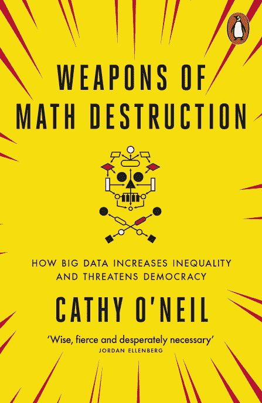
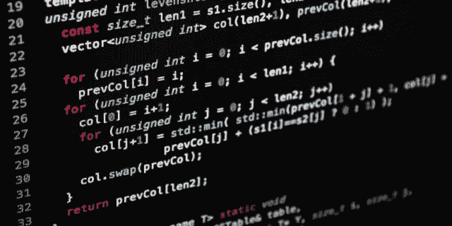
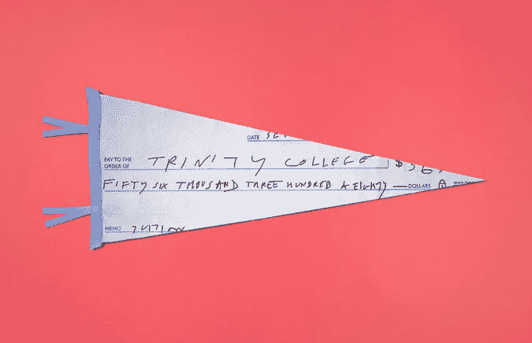

# 大数据毁了生活？——我对奥尼尔大规模杀伤性武器的看法(上)

> 原文：<https://medium.datadriveninvestor.com/big-data-ruining-lives-my-take-on-oneil-s-wmd-part-i-1098185323a8?source=collection_archive---------4----------------------->

> “欢迎来到大数据的黑暗面。”

It 是促使我更深入地探究大数据邪恶世界的那句话。我完成了生物技术和生物工程领域的本科和研究生学业。像世界上数以百万计的其他人一样，他们并不完全理解数学和技术的结合，我有一种错觉，认为它在生活的几乎所有领域都承诺了公平、准确和惊人的收益。简而言之，大数据和算法已经成为当今时代的生命力，这就是为什么每个人都被鼓励以某种形式与它们联系。从预测天气到管理银行账户，从社交网络到控制行业和领导组织，大数据无处不在——它围绕着我们，并以难以想象的方式影响着我们！

Image Source: Twitter

几天前，我的导师，IIT 甘地讷格尔大学(印度)，*的计算机科学工程教授，给了我这本由凯茜·奥尼尔写的引人入胜的书。它让我得以一窥大数据的世界——它是什么，以及它能够在全球范围内做什么*。名为*的数学毁灭武器*于 2016 年出版，它主要强调了算法(为解决逻辑问题而开发的分步程序)和数学模型在社会中造成的危险混乱和破坏。*

*奥尼尔从一名学术数学家到一名成功的数据科学家的旅程并不平坦。然而，正是在这个时候，她意识到大量有害的数学模型，这些模型最初承诺效率、积极的规模扩大、公正和所有人的利益，实际上正在大量涌现，在许多情况下传播不平等和不必要的惩罚。她将这些令人深感不安、造成巨大破坏的因素称为破坏数学的武器，它们正以惊人的速度从幕后控制和恐吓着这个世界。*

## ***开始***

*这本书以一个简单的实现开始——由人类开发，大量的算法和模型很有可能根据开发人员的想法和信念产生有偏见的结果。他们中相当多的人非但没有缩小社会差距，反而倾向于扩大社会差距——支持富人，惩罚穷人。其他的编码种族主义，并在这个过程中，促进掠夺性机构和公司针对弱势群体。然而，另一类大规模杀伤性武器在过去曾参与造成全球金融危机，现在仍拥有让危机重演的破坏性能力。这些析构函数中有相当一部分制造了有毒的反馈循环并维持着它们，大规模地传播着不公正。*

**

*Image Source: pewresearch.org*

*凭借其有趣而又翔实的写作风格，奥尼尔迅速而直接地与读者联系起来，并与他们分享这些社会破坏者令人不安的统计数据和邪恶的真相。她告诉我们，迄今为止制造的所有大规模杀伤性武器都有三个共同特征——不透明性、破坏力和规模。由于“所有权问题”，它们的主要成分都在一个黑箱里，这使得挑战和质疑它们的负面影响变得极其困难。对有权势和特权的人来说，隐形和无害是这些恶棍阴险的一面！*

# ***什么是模型？***

*在这里，奥尼尔从一个健康的模型开始，该模型对职业棒球比赛进行统计分析，并根据反馈进行自我完善。她强调了这样一个事实，即它因其透明性和公平性而具有优越性，是一个积极的动态模式的极好例子。她强调了随时间更新这些算法的重要性，并表示，*“为今天构建的模型明天会工作得更差一些，”*这就是为什么它的修改是有必要定期进行的。*

**

*Image Source: nowtheendbegins.com*

*作者随后解释了监狱中有害的和有害的累犯模式。监狱开始使用这些模式来确保公平对待所有案件。这些算法以问卷或其他监督的形式，将弱势群体的行为视为最危险的。另一方面，特权阶层根本没有受到任何负面影响，这就带来了一个问题——我们是消除了人类的偏见，还是用技术掩盖了它？*奥尼尔认为，“问题不在于某些人是否受益；而是这么多人受苦。这种威胁正在上升。”**

* [## 为什么数据将改变投资管理|数据驱动的投资者

### 有人称之为“新石油”虽然它与黑金没有什么相似之处，但它的不断商品化…

www.datadriveninvestor.com](https://www.datadriveninvestor.com/2019/01/25/why-data-will-transform-investment-management/) 

2019 年 11 月 19 日[华盛顿邮报上发表的一篇文章](https://www.washingtonpost.com/business/2019/11/19/algorithms-were-supposed-make-virginia-judges-more-fair-what-actually-happened-was-far-more-complicated/)揭示了这个问题仍未解决的苦涩事实。故事讲述的是为减少弗吉尼亚州的监狱人口而设计的算法如何导致当局对黑人被告施加更严厉的判决，对强奸犯施加更宽大的判决。

## **幻灭之旅**

Image Source: deloitte.wsj.com

这一章讲述的是奥尼尔从对冲基金的教授到私营部门雇员的转变，以及她在那里的经历。那是她目睹由 WDM 引发的海啸的时候，海啸在 2008 年摧毁了全球经济，造成了许多痛苦和折磨。在将工作再次转向电子商务后，奥尼尔注意到数学是如何不断操纵和控制人们的。用她的话说，“数学的滥用正在加速。”她经常听说人们被算法吓倒，这让她开始探索大数据的影响。

2019 年 12 月 19 日，BBC 上的一则[新闻曝光了一起案件，英国央行因其首席运营官向对冲基金泄露敏感信息而要求其辞职。一个算法驱动的软件可以利用这些早期访问的数据抢在竞争对手之前，每秒进行数千次交易。](https://www.bbc.com/news/business-50849479)

# **上大学**

在第三部分，作者举了另一个大规模杀伤性武器的例子。《美国新闻》承担了全美教育机构排名的任务，为此它寻求一个复杂数学模型的帮助。该报出于评估目的使用的代理人导致了许多学院和大学学费的不公平和快速上涨。这些排名也导致了严格的入学标准，这使得忧心忡忡的学生及其家长花费过多的金钱和时间来确保孩子的入学。为了获得录取，他们中的许多人甚至采取作弊手段。奥尼尔强调，有必要为每个学生创建定制的透明模型，根据他们的研究领域为他们提供特定机构的排名信息，以防止这种不良影响。她说，*“你可以称之为大规模杀伤性武器的反义词。”*

Image Source: nytimes.com

2019 年 9 月 10 日为《纽约时报》杂志撰写的一篇[令人大开眼界的文章揭示了大学招生办公室真正想要的是什么。文章接着指出，当今著名的教育机构并不追求学术上的卓越；相反，他们正在消除对学费收入的渴望，并传播财富高于一切的信息。各种恶意的目的使得大学很难降低成本。一个重要的原因是，美国新闻数学模型奖励他们更高的教师工资和更多的学生服务支出，直接导致更好的排名。如果超过 1/4 的学生没有提交分数，这种算法也会对他们不利。三一学院就是一个例子，它更关注学生入学的多样性，但按照《美国新闻》的标准，它在全国顶级文理学院排名中下降了六位。这些精密、复杂和基于计算的预测算法使得录取过程比以往更加不平衡和不透明。](https://www.nytimes.com/interactive/2019/09/10/magazine/college-admissions-paul-tough.html)

*大规模杀伤性武器的犯罪清单结束了吗？或者，一些错误仍然存在？* [这篇文章的第二部分](https://medium.com/@apeksha.0503/big-data-ruining-lives-my-take-on-oneil-s-wmd-part-ii-5d611ed99791)将关注更多由大规模杀伤性武器造成的灾难，以及一些凸显其罪恶的最新新闻。所以，敬请期待！

— — — — — — — — — — — — — — — — — — — — — — — — — —

*   我对科学交流非常感兴趣，并相信不同学科的研究人员和学者之间以及与公众之间的讨论最终将促进整个社会的进步。我已经开始尽自己的绵薄之力，以一种所有人都能理解的格式，写下 IITGN 不同领域的故事和研究文章。*