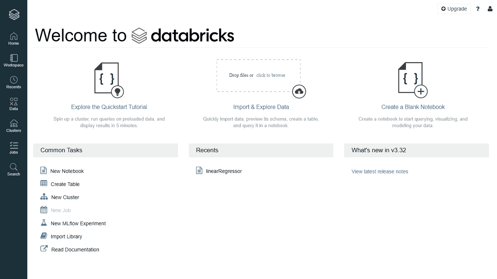
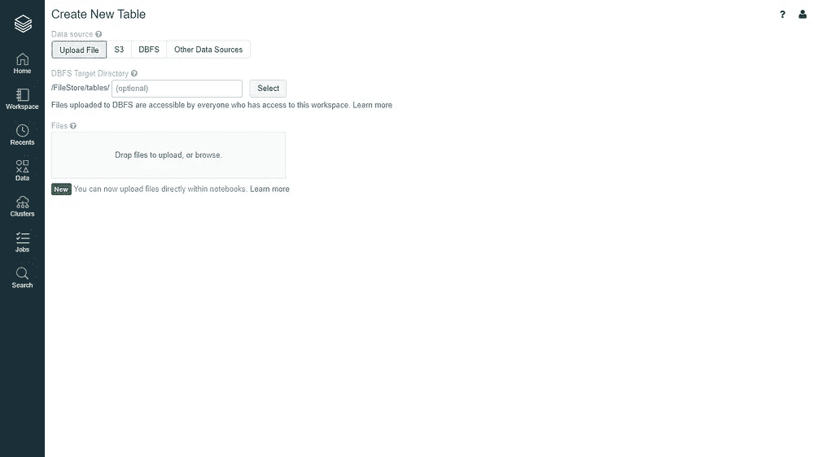

# 在数据块中使用 pyspark 的大数据

> 原文：<https://medium.datadriveninvestor.com/big-data-using-pyspark-in-databricks-7d399a860347?source=collection_archive---------3----------------------->

通过 Databricks 中的 pyspark 库实现线性回归。在开始实施之前，我们必须熟悉 databricks 平台。

这是专门为 spark 开发的 databricks 的主页，它是免费的。在会话开始之前，我们必须创建群集，然后根据 ram 以及基于您要执行的工作区的其他要求来创建群集的属性

在 Databricks 中，我们可以应用 spark RDD、SQl、MLIB、graphX。这是学习 spark 的最佳平台之一，对本地系统没有任何要求。

在上传文件之前，我们将在数据集上实现线性回归。

点击数据图标，然后浏览文件，选择你想上传的文件，点击文件上传。CSV 文件被上传。

现在，我们将形成群集以创建一个文件，我们将单击群集图标，然后我们可以选择“create cluster ”,单击它，然后我们将转到要设置 karan_first_cluster 和其他要求的群集的名称，然后我们将转到“create cluster”按钮。

在实现代码之前，我们将学习线性回归理论及其工作原理。

线性回归是一种用于模拟观察变量之间关系的技术。简单线性回归背后的思想是将两个变量的观察值“拟合”成它们之间的线性关系。用图形表示，任务是画出与点(x_i，y_i)，(*【Xi】，*)最“拟合”或“最接近”的线，其中 x _ I*和 y_i *yi* 是两个变量的观测值，这两个变量预期彼此线性相关。***

**

**变量* x *x 和 yy 之间的最佳拟合线性关系。**

*回归是现实世界中许多统计应用中常用的过程。有两种主要类型的应用:*

*   *预测:在对变量进行一系列观察后，回归分析给出了变量之间关系的统计模型。该模型可用于生成预测:给定两个变量 x *x* 和 y， *y* ，该模型可预测给定 x. *x* 的未来观测值 y *y* 的值。这种想法被用于预测无数情况下的变量，例如政治选举的结果、股票市场的行为或职业运动员的表现。*
*   *相关性:回归分析给出的模型通常更适合某些类型的数据。这可用于分析变量之间的相关性，并改进统计模型以纳入进一步的输入:如果模型很好地描述了数据点的某些子集，但对其他数据点的预测较差，则检查不同类型的数据点之间的差异以获得可能的解释可能是有益的。这种类型的应用在科学试验中是常见的，例如在对照研究中对患者的拟议药物的效果。*

*虽然最佳拟合的许多措施是可能的，但对于大多数应用来说，最佳拟合线是使用最小二乘法找到的。也就是说，将 y *y* 视为 x、 *x* 的线性函数，该方法找到最小化误差平方和的线性函数 L *L* 。*

*创建集群和上传文件后，我们将返回主页，然后创建新的笔记本。*

> *我们将首先导入 pyspark libraray。*
> 
> *进口 pyspark*
> 
> *从 pyspark.sql 导入 SparkSession*
> 
> *spark = spark session . builder . appname(' LINEAR _ REGRESSION _ KARAN _ first file ')。getOrCreate()*

*App builder 用于为流程创建一个新的应用程序，然后我们将进行新的 sparksession。*

*现在我们将通过 cmmd 导入数据集。*

> *from pyspark.ml.regression 导入线性回归
> data _ EC = spark . read . CSV(" dbfs:/file store/tables/EC . CSV "，inferSchema=True，header=True)*

*这是我们已经应用的命令的屏幕截图。*

**

> *#现在我们将打印模式，然后我们将实现每个独立到相关功能之间的相关性。*
> 
> *从 pyspark.sql.functions 导入 corr
> print(data _ EC . corr(' App 上的时间'，'网站上的时间'))*
> 
> *print(data _ EC . corr(' App 上的时间'，'每年花费的金额'))*

*#输出*

*0.0823882731909817*

*0.4993277700534503*

*#现在，我们将在一个存储行值的向量中创建一个独立变量的向量，这样我们就可以进行更好的预测。*

> *#将数值为 in 的向量转换为 pyspark.ml.linalg 中的向量
> 从 py spark . ml . feature import vector assembler 中导入向量* 
> 
> *#从数据集中取数值，然后遇到最后 5 列
> assembler = vector assembler(input cols =[' Avg Session Length '，' Time on App '，' Time on Website '，' Length of Membership']，outputCol='features ')*
> 
> *装配工*

*#将所有这些功能转换为一个功能[**‘平均会话时长’，‘在应用上的时间’，‘在网站上的时间’，‘会员时长’]***

*output = assembler . transform(data _ EC)*

> *#然后将特征预测到因变量*
> 
> *#我们可以看到密集向量，它是“平均会话长度”、“应用程序使用时间”、“网站使用时间”、“会员资格长度”向量的组合
> #现在，我们将在这里预测多元线性回归，然后将其分类
> final _ data = output . select(‘features’、‘Yearly Amount spend’)*

**

> *#将 fdata 拆分为 train 和 test
> train_split，test _ split = final _ data . random split([0.7，0.3])*

*70/30 比率 splait 数据*

**

*建立线性回归模型，然后预测残差。*

> *lr =线性回归(labelCol= '每年花费金额')
> lr _ model = lr . fit(train _ split)
> lr _ model*

*linear regression model:uid = linear regression _ 89496 b 266 f8f，numFeatures=4*

> *#每行实际预测的误差
> test _ results = lr _ model . evaluate(test _ split)
> # residuals 指实际预测的
> test_results.residuals.show()*

**

*这里是线性回归的终点，我们将使文件保存为好像集群死亡 aur 数据将被删除的格式。*

**

*我们可以把它打印成各种格式，然后推出。*

*所有的观众都可以通过驱动链接访问代码，如果你觉得文章有趣，请评论。*

*[https://drive . Google . com/drive/folders/1 wmvpind 05 _ N2 dkltpjiyja 94 psnx 0 Cu？usp =分享](https://drive.google.com/drive/folders/1mWmvpINd05_n2DKLtPJiyjA94PSNX0Cu?usp=sharing)*