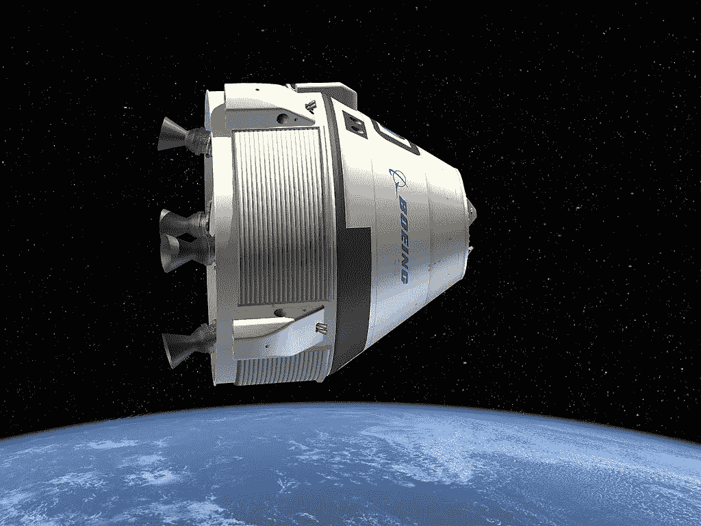
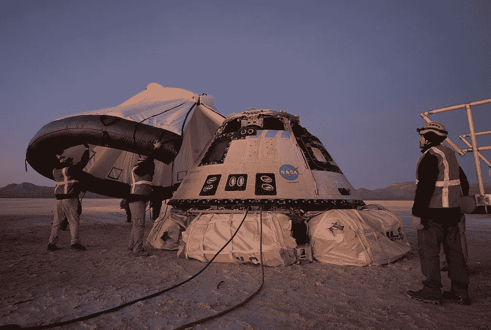
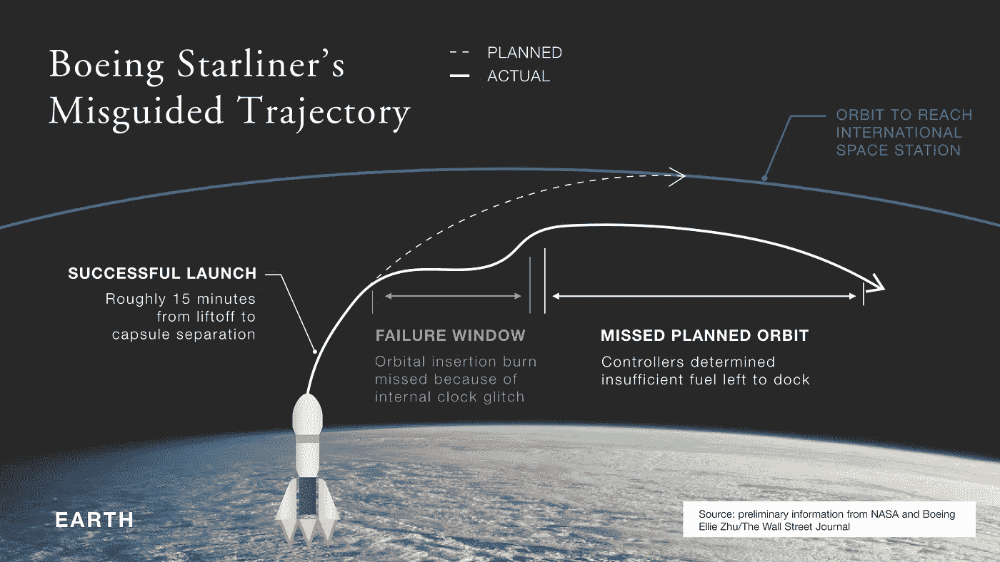

# 大是伟大的敌人

> 原文：<https://medium.datadriveninvestor.com/big-is-the-enemy-of-great-9726b0eb2b7a?source=collection_archive---------7----------------------->

## *为什么大公司努力创新*

Artist’s conception of the CST-100 under development by The Boeing Co. NASA / Public domain.

波音公司在 2019 年底需要一些好消息。所以他们把希望寄托在 12 月 20 日期待已久的新型载人飞船 **CST-100 Starliner** 的发射上。但是，在这种无人驾驶火箭发射到太空后不久，它就遭遇了令人失望的挫折，因为运载工具未能到达正确的轨道。

波音公司曾计划展示 Starliner 运送宇航员往返国际空间站(ISS)的能力。然而，当飞船错过了一个关键的发射窗口时，原本计划持续一周的测试任务只持续了两天，就在新墨西哥州的白沙返回了。

 [## 领导力。赢得|数据驱动型投资者需要更广阔的视角

### 不管他们愿不愿意，领导者都是快速运转的机器中的齿轮，这就要求他们夹住自己的爪子…

www.datadriveninvestor.com](https://www.datadriveninvestor.com/2020/02/07/leadership-it-takes-a-wider-perspective-to-win/) 

对波音公司来说，这又是糟糕的一天，他们发现自己在努力避免另一场公关灾难。2019 年是波音公司经历麻烦的一年，他们正在失去他们所服务的关键客户的信任和信心。

*一家拥有卓越创新历史和世界上最聪明头脑的公司怎么会错过这样一项至关重要的努力？*

**也许和体型有关。**

# 别忘了设置你的时钟

拙劣的 Starliner 试飞将需要波音公司支付 4.1 亿美元来抵消成本。但这个数额与 737 Max 飞机惨败的价格相比不算什么。

波音 737 Max 飞机发生两起致命事故，造成 346 人死亡，这是自 911 以来最严重的空难，波音公司不得不报告二十多年来的首次年度亏损。737 Max 危机的成本现已攀升至约 180 亿美元，这还没有考虑疫情效应。

除此之外，还有波音员工发布的令人不安的电子邮件，高管管理不善的故事，以及对与航空监管机构关系过于亲密的指控。

**Starliner 发布时出现了什么问题？**

这与高度复杂的火箭发动机、隔热罩或复杂的空气动力学工程问题有关吗？

不…这是一个内部时钟错误。

虽然我们大多数人都不知道如何将火箭发射到外层空间，但我们都可能忘记将时钟设置到正确的时间，错过一个重要的清晨会议。但在这种情况下，它不仅仅是错过了一个约会；它少了一个*“轨道插入燃烧”，*导致船上的推进器点火时间比预期的长，燃料耗尽。

哎呀！

时钟那部分，我们都懂。但是我们没有预料到的是，这种人为错误会发生在一个像火箭发射这样任务关键、昂贵且有生命危险的大组织内部。

NASA/Bill Ingalls / Public domain. Boeing, NASA, and U.S. Army personnel work around the Boeing CST-100 Starliner spacecraft shortly after it landed in White Sands, New Mexico

# **打卡**

这个“时钟误差”的问题让很多人对一架 737 Max 客机的安全保障产生了疑问——*“这些飞机上有时钟吗？”*——它可以容纳 200 人，以每小时 538 英里的速度穿越天空。

这个时钟误差问题也触及了我们对技术和自动化依赖的根深蒂固的担忧。然而，当你考虑到一家公司变得如此之大，以至于它的“时钟设置部门”无法与火箭发射部门的成功合作时，我们都会对登上董事会有点担忧。

作为一个社会，人们越来越关注产品和服务的安全和保障，例如自动驾驶的特斯拉汽车，亚马逊 Echo 这样的监听设备，Nest 这样的室内安全摄像头，甚至我们的电子投票和选举系统的普遍可信度。

*这些物品中有多少带有钟表？*他们中有多少人依靠大型组织部门的协调来将这些设备设置为正确的时间？

# **一种无形的力量**

就技术和自动化问题而言，如果大公司中有其他更深远、更顽固的无形力量在起作用呢？一种隐藏的阻力可能会削弱一家航空业巨头和我们所知的许多其他公司的创新能力，甚至可能会削弱我们自己工作或经营的公司。

就像政府、航空公司和大型学区一样，一旦一家公司变得“太大而无法管理”，中央办公室就会制定层层政策和程序，这些政策和程序可以发挥自身的离心力。大公司没有管理创新和安全工作，而是仅仅为了监督部门的蜘蛛网和浏览自己制造的官僚机构，最终可能会消耗大量资源。

在与政府、车管所、互联网提供商、航空公司和其他大型组织的日常互动中，我们都在某种程度上经历过这种复杂的官僚网络。

然而，公平地说，放慢事情的速度或让事情变得更复杂，并不是波音公司或其他任何地方任何一位勤奋的高管的意图。相反，它是规模的副产品，是随着事情变大而自然发生的组织物理学问题。

由于一些实体的巨大规模和复杂性，其组织质量的引力会成为抑制好想法的力量。它们还会阻碍改进措施，阻碍创新努力的开展，更不用说达到预期目标了。

# **看不见的重力**

如果我走在街上，碰巧被什么东西绊倒，我会摔倒，而不是站起来。每个人都知道。

无论我如何努力将棒球抛向空中，它最终还是会落在地上。即使我让诺兰·莱恩——前名人堂职业棒球运动员和世界上最快的投手之一——投出一个时速 101 英里的快速球，球仍然会回到地面。

但在外层空间却不是这样。

By Nolan_Ryan_Tiger_Stadium_1990.jpg: Chuck Andersenderivative work: Delaywaves talk — Nolan_Ryan_Tiger_Stadium_1990.jpg, CC BY 2.0

如果诺兰·莱恩向月球投掷一个时速 110 英里的棒球，其速度将达到惊人的 3635 英里。为什么会这样？因为月球上的重力比地球小。

虽然我们认为这是理所当然的，但地球上这种被称为重力的无形力量会将所有物体拉向星球的中心。地球上的重力对诺兰·莱恩投球的强度、速度和速率起反作用力，阻止他的球超过每小时 101 英里。

同样的无形力量也对诺兰·莱恩的体重有影响。在地球上，诺兰·莱恩的体重约为 194 磅(在他的棒球生涯中)，但在月球上，瑞安的体重只有 34 磅。这怎么可能呢？

月球的重力是地球的六分之一，这意味着你在月球上的重量是地球的六分之一。但你可能会问，为什么月球引力较小？因为月球的质量比地球小得多，而质量决定了重力。

你可能还记得学校里的伊萨克·牛顿万有引力定律:“所有有质量的物体都相互吸引。”同样，所有的物体都有相互的吸引力。物体的质量越大，其引力就越大。

By attributed to ‘English School’ — Bonhams, Public Domain

诺兰·莱恩要扔出多大力的棒球才能阻止它回到地球？大约每小时 25，000 英里，或每秒 7 英里。

这种方向速度被称为 e *scape 速度*，这是火箭完全摆脱地球引力必须行进的速度。

# **波音的 Starliner 问题**

然而，波音公司并没有试图将他们的 Starliner 飞船发射到月球或任何其他星球。相反，他们试图达到轨道速度——大约每小时 17，000 英里，或每秒 4.9 英里。在这个速度下，一个物体可以在地球上方保持完美的平衡，同时保持围绕地球的恒定轨道。这种轨道平衡是卫星每天都在做的。

波音公司在 Starliner 上的问题不是发射失败。发射是成功的。相反，问题是航天器无法达到维持轨道所需的正确速度。

美国宇航局和波音公司的描述是，在耗尽燃料之前，他们有一个特定的时间窗口来到达这个轨道。Starliner 错过了这个轨道，部分原因是时钟误差和软件通信故障，这阻止了推进器提升航天器的轨道。

所有这些事件导致 Starliner 错过了他们计划旅程的关键点，这将他们推入了一个*“失败窗口”*

Drawing by Author’s Firm Shook Kelley.

# **创新的失败窗口**

我发现这个术语*“失败窗口”*很有用，因为这是许多大型知名公司在尝试启动创新项目时发生的事情。像 Starliner 一样，这些公司可以成功地推出产品。然而，他们通常会遇到的问题是，他们耗尽了燃料或缺乏进入正确轨道所需的额外的*末级推进器*。

当一项创新努力无法超越一个组织的拉力时，新的风险和创新计划最终会轰然倒地。

微软通过 Zune 音乐播放器达到了这种类型的“失败窗口”。

柯达用他们的工程师发明的数码相机击中了它。

全食超市用他们更实惠的 365 商店品牌/横幅击中了它。

哈雷戴维森凭借其赛车级 Buell 摩托车品牌大获成功。

星巴克通过它的茶叶店 Teavana 获得了成功。

沃尔玛凭借其急需的小型商店沃尔玛快递(Walmart Express)实现了这一目标。

谷歌用谷歌眼镜撞了一下。

这些企业不仅是好主意，也是这些公司有效竞争和发展的重要战略。但这些企业似乎都无法在遭遇失败之前摆脱组织质量的引力。

# **为什么小公司创新更好**

你可能已经注意到一个主题，即拥有所有最佳资源、人才和资金的大型老牌公司很难创造出能够实现目标的突破性创新。

令人惊讶的是，我们这个时代一些最重要的创新来自小型创业公司——如苹果、网飞和脸书——它们在车库、公寓和宿舍里起步，几乎没有任何资源。

**为什么小公司比大公司更能创新？**

因为小公司没有那么大的组织规模和引力来牵制他们。他们有更多的自由探索“伟大的未来”,而不会被内部决策者和组织保护主义者拉回地面。

当一家小公司抛出一个想法时，没有多少组织力量试图阻止它。新的和可能古怪的想法——比如网飞的电影租赁想法，在当时看起来很可笑——有潜力在小公司走得更远更快，因为没有太多的反作用力或阻力将它拉回地面。

然而，当像百视达这样的大公司试图推出一个新想法时，其组织内部有一股不可思议的无形力量在努力将所有新想法拉回其宇宙。因此，当百视达高管继续收获回报递减的旧创意时，网飞探索了家庭娱乐领域的全新前沿。

网飞花了一些时间才步入正轨，但当它步入正轨时，它开启了一系列全新的呈指数级增长的家庭娱乐的可能性。

探索这些新领域是一个公司未来竞争能力的命脉，但许多大公司都在努力发射创新火箭。

# 凯文的组织质量和引力定律

我每天都在大公司进进出出。我的工作是帮助管理领导者学会创新。要做这样的工作，我们必须从一些基本原则开始，这些原则是关于创新的宇宙如何在更大的组织中运作的。以下是我的法则:

*   一个公司的所有组织部门都被其他部门所做的事情所吸引，它们之间有相互的吸引力。
*   有更多的年龄、历史、经理、预算和资源分配的公司部门比较小的部门有更大的质量，因此有更大的引力。
*   质量较大的组织部门对质量较小的新部门施加更强的反作用力。因此，他们在制定公司战略、资源和燃料分配的总体方向方面有更大的影响力。
*   无论一个新想法可能出现在绘图板或发射台上有多么辉煌、突破性或革命性，具有更大群众意愿的组织部门——有意或无意地——会施加一种无形的力量，将这些新想法带回他们思维方式的中心。*这不是个人恩怨。这只是组织物理学。*
*   为了让一个新概念摆脱引力的束缚，这个新部门必须有足够的速度、能量、资源、燃料、后期推进器和高层领导的支持才能成功到达预定轨道。如果这些因素中的任何一个缺失或供应不足，创新火箭击中预定目标的可能性就很低。
*   就像卫星一样，一个新部门实现其正确轨道的理想距离略微超出该组织最大部门质量的拉力，但不会远到新部门完全离开公司的宇宙。

# 摆脱引力

如果你在一家大公司工作，摆脱组织引力的第一步是敏锐地意识到这种阻力是如何有意或无意地扼杀你公司的好想法的。

其次，你必须投入足够的燃料、资源、领导力和额外的*后期推进器*来支持你的创新计划，以确保它们进入预定轨道。任何不足都会错过目标。

至于 Starliner 太空舱，波音公司将在 2020 年 10 月或 11 月的某个时候进行重复试飞——没有宇航员在船上，也不用纳税人支付任何费用。与此同时，埃隆·马斯克(Elon Musk)的 Space X 公司的组织规模要小得多，该公司已经与传统巨头展开较量，成为航天行业的一支新生力量。(想想网飞对百视达。苹果对 IBM。)

## 获得专家视图— [订阅 DDI 英特尔](https://datadriveninvestor.com/ddi-intel)