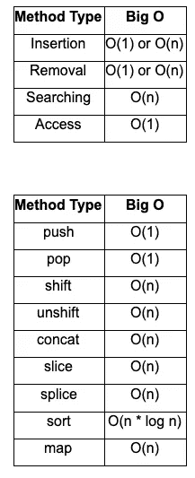

# 大 O 符号

> 原文：<https://medium.datadriveninvestor.com/big-o-notation-14fa1e4538a1?source=collection_archive---------2----------------------->

## 数组及其内置方法


Photo by [Oliver Schwendener](https://unsplash.com/@oliverschwendener?utm_source=medium&utm_medium=referral) on [Unsplash](https://unsplash.com?utm_source=medium&utm_medium=referral)

在我以前的大 O 符号博客中，我们讨论了[时间](https://medium.com/swlh/big-o-notation-128b7b8051c9)和[空间](https://medium.com/@sedlacek1991/big-o-notation-8a0a28f00813)复杂性和[物体](https://sedlacek1991.medium.com/big-o-notation-6b19d3f03f7f)。现在我们来看看大 O，以及它与数组及其内置方法的关系。

数组是一种有序的数据结构，可用于存储任何类型的数据。或者，用更专业的术语来说，“当我们用编程语言初始化一个数组时，该语言为你的数组分配内存空间，然后将那个起始变量指向内存中的那个地址。然后程序为每个元素分配固定数量的内存”(Learn)。下面是一个简单的多数据类型数组的例子。

```
**const** array = [ "a", {}, 7, [], false]
```

就大 O 而言，当我们需要快速访问元素时，数组是有利的。在上面的例子中，我们可以通过索引来访问每个元素；array[0] = "a "，array[4] = false。因为元素是有索引的，所以我们的计算机知道元素的确切位置，并且可以直接找到元素。此外，对于访问方法，具有 2 个元素或 2，000 个元素的数组具有相同的时间复杂度 O(1)。

在某些插入或移除方法中，数组也可以很快。这些类型的方法要么有 O(1)，要么有 O(n)。不同之处在于元素在数组中的插入或移除位置。如果从数组末尾插入或移除元素，这些方法的值为 O(1 ),因为只有最后一个索引元素受到影响。但是，如果从数组的开头插入或移除元素，所有元素都会受到影响。例如，如果我们将一个元素添加到数组的开头，则添加的元素将占据索引 0，而之前位于索引 0 的元素现在位于索引 1，依此类推。因为操作的数量随着数组中元素的数量而增长，所以这些方法有一个 O(n)。

最后，数组有一个 O(n)用于搜索方法。这是因为搜索方法的最坏情况是检查数组中的每个元素。

[](https://www.datadriveninvestor.com/2020/07/23/learn-data-science-in-a-flash/) [## 一瞬间学会数据科学！？数据驱动的投资者

### 在我之前的职业生涯中，我是一名训练有素的古典钢琴家。还记得那些声称你可以…

www.datadriveninvestor.com](https://www.datadriveninvestor.com/2020/07/23/learn-data-science-in-a-flash/) 

**数组内置方法**

数组有许多不同的内置方法，但是我们在这里要看的方法是 push、pop、shift、unshift、concat、slice、splice、sort 和 map。

前两种方法 push 和 pop 涉及在数组末尾添加或移除元素。正如我们前面提到的，这些类型的方法有一个 O(1 ),因为它们只影响数组的最后一个元素。

移位和取消移位，包括从数组的开头添加或删除。如前所述，这些方法的运行时间随着输入或 O(n)而增长，因为它们影响数组中的所有索引。

与移位和取消移位类似，串联、切片和拼接都有一个 O(n)。Concat 用于将两个或多个数组组合成一个新数组。此外，随着您正在组合的每个数组中的输入数量的增长，运行时间也以线性方式增长。Slice 涉及到复制一个数组，并且运行时间随着输入以线性方式增长。Splice 是一种“通过删除现有元素和/或添加新元素来更改数组内容”的方法(MDN)。虽然 splice 可以从数组中的任何位置删除/添加元素，但它有一个 O(n ),因为在最坏的情况下，所有数组输入都会受到影响。

排序方法的 O(n * log n)比 O(n)更差。这是因为排序方法需要在元素之间进行比较，并且元素可能需要被访问多次。

我们将讨论的数组的最后一个内置方法是 map。这个方法有一个 O(n)并且通过创建“…一个新的数组，该数组填充了在调用数组中的每个元素上调用一个提供的函数的结果”(MDN)。这个函数有 O(n)的原因是因为它必须与数组中的每个元素至少交互一次。因此，数组的大小直接影响运行时间。

下面是这篇博客中讨论的方法类型和内置方法的总结，以及它们与大 O 符号的关系。



Summary Table based on lecture material presented in Colt Steele’s Udemy Course

感谢您花时间通过大 O 符号的视角来了解更多关于数组的知识。这是我的大 O 符号系列的最后一篇博客，我希望你现在理解了大 O 符号的重要性，并能在你编写和解释代码时应用它。

**资源**

斯蒂尔，加州(未注明)。 *JavaScript 算法和数据结构大师班*。在线课程。

下面的数组。(未注明)。检索于 2020 年 10 月 30 日，发自 https://learn.co/lessons/arrays-underneath

" Array.prototype.splice()。" *MDN Web Docs* ，developer . Mozilla . org/en-US/Docs/Web/JavaScript/Reference/Global _ Objects/Array/splice。

" Array.prototype.map()" *MDN Web Docs* ，developer . Mozilla . org/en-US/Docs/Web/JavaScript/Reference/Global _ Objects/Array/map。

## 访问专家视图— [订阅 DDI 英特尔](https://datadriveninvestor.com/ddi-intel)