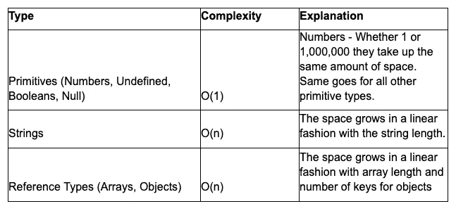

# 大 O 符号

> 原文：<https://medium.datadriveninvestor.com/big-o-notation-8a0a28f00813?source=collection_archive---------1----------------------->

## 空间复杂性概述


Photo by [Amine Ounnas](https://unsplash.com/@amine_ounnas?utm_source=medium&utm_medium=referral) on [Unsplash](https://unsplash.com?utm_source=medium&utm_medium=referral)

大 O 符号为软件工程师提供了一种讨论算法和它们如何执行的方式。大 O 符号允许以一种简化的方式来回答这个问题；哪种解决方案会使计算机运行得更快？哪个使用的计算机内存最少？这两个问题分别属于两种不同的大 O 符号复杂度，时间复杂度和空间复杂度。本博客将重点讨论计算机内存的第二个问题，这属于空间复杂性的范畴。如果你对时间复杂性不熟悉，我推荐你先阅读我之前的博文。

**什么是空间复杂性？**

空间复杂度被定义为，“…一个算法需要的工作存储量的度量。这意味着在最坏的情况下，算法中的任何一点都需要多少内存。与时间复杂性一样，我们最关心的是空间需求如何增长，用[Big-O]术语来说，随着输入问题的大小 N 的增长”([里斯贝克](https://courses.cs.northwestern.edu/311/html/space-complexity.html#:~:text=Space%20complexity%20is%20a%20measure,of%20the%20input%20problem%20grows.))。

作为软件工程师，我们可能希望编写针对空间复杂度而不是时间复杂度进行优化的算法，因为可能会有重大的权衡。为了说明我们的算法占用了多少计算机内存，我们不包括输入占用的计算机内存，而是计算，“……为了运行我们算法中的代码，我们需要分配多少额外的内存？”(斯蒂尔)。

当试图确定一个算法的空间复杂度时，我们可以使用下表作为我们的指南。



Summary Table based on lecture material presented in Colt Steele’s Udemy Course

接下来，我们将看看不同类型的大 O 符号复杂性，并为每种复杂性提供一个示例算法。

**O(1)**

从我们对时间复杂性的讨论中，我们确定 O(1)意味着一个算法有一个恒定的运行时间。类似地，当算法的空间复杂度为 O(1)时，意味着我们的算法具有恒定的空间。在下面的例子中，我们有一个函数可以打印从 1 到 n 的数字。

```
**function** printNumbers(n) {
   **for** (let i = 1; i <= n; i++){
      console.log(i);
   }
}printNumbers(3)**Output:** 1
2
3
```

在上面的例子中，我们没有计算输入 n，所以唯一占用空间的是变量 I。因为 I 变量是一个原始类型 number，所以它有一个 O(1)的常量空间。此外，虽然时间复杂度为 O(n ),因为运行时间随着 n 以线性方式增加，但是空间复杂度仅为 O(1 ),因为在循环中，I 的值只是从一个数字增加到下一个数字。

**O(n)**

O(n)表示算法的空间复杂度是线性的。也就是说，随着变量的增长，空间复杂度也以 1:1 的方式增长。从我们的汇总表中，我们可以看到字符串、数组和对象的空间复杂度为 O(n)。让我们看一个例子，我们接受一个数组，创建一个新数组，其中每个元素都比初始输入数组中的元素少 1。

```
**function** subtractOne(array) {
   **let** newArray = [];
   **for**( let i = 0; i < array.length; i++) {
      newArray.push(array[i] -1);  
   }
   **return** newArray
}subtractOne([2,3,4])**Output**: [1,2,3]
```

查看上面的算法，有几个不同的项具有空间复杂度。newArray 和 I 的变量声明最初都有 O(1)；但是，使这个算法的空间复杂度为 O(n)的行是 newArray.push(array[i] -1)。这一行为输入数组中的每个元素将一个元素推入我们的 newArray 变量。因此，空间随着 n 的增加而增加，这意味着变量以线性方式或 O(n)增加。

感谢您花时间学习更多关于大 O 符号和空间复杂性的知识。请关注下一篇博客，在那里我们将讨论对象及其方法。

**资源**

斯蒂尔，加州(未注明)。 *JavaScript 算法和数据结构大师班*。在线课程。

克里斯·里斯贝克。courses.cs.northwestern.edu/311/html/space-complexity.html.西北大学， *EECS 311:空间复杂性*

“大 O 批注:面试蛋糕。”*面试蛋糕:编程面试问题及技巧*，[www . Interview Cake . com/article/Java/big-o-notation-time-and-space-complexity。](http://www.interviewcake.com/article/java/big-o-notation-time-and-space-complexity.)