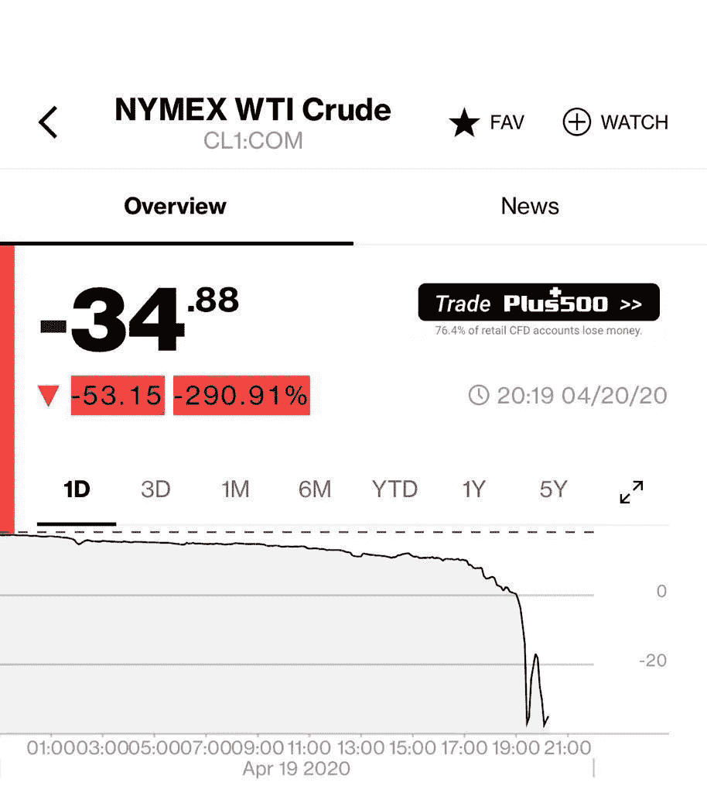

# 大型石油公司正在消亡

> 原文：<https://medium.datadriveninvestor.com/big-oil-is-withering-away-b6e3c5670d40?source=collection_archive---------22----------------------->

## “价格将不得不上涨”是唯一的选择

Last gasp. (Source: The Economist, February 9th, 2019)

自救是一个包罗万象的术语，上市公司(尤其是大宗商品公司)用它来安抚投资者，让他们相信他们并不完全受制于大宗商品价格。例如，如果油价从每桶 100 美元涨到 40 美元/桶，这并不意味着利润会相应减少。大量不必要的中层管理人员被削减，运营被精简，无利可图的油田被闲置，钻井合同被取消等等。

然而，自救只能在不危及生命和其他不可协商的巨额石油红利的情况下进行。随着新冠肺炎继续蚕食需求，两者都受到了债务的支撑——庞大的石油债务与资本比率略高于 40%。就背景而言，这一比例低于 40%，自 2008 年以来低至 20%。简而言之，大型石油公司试图通过借贷摆脱由 Covid 引发的经济放缓。在这方面，他们并不孤单。

 [## 对有商业头脑的投资者有用的行为经济学概念|数据驱动的投资者

### 在美国企业界，高斯统计，对我们周围世界的确定性解释，以及理性…

www.datadriveninvestor.com](https://www.datadriveninvestor.com/2020/07/09/helpful-behavioral-economics-concepts-for-the-business-minded/) 

然而，石油的未来前景并不特别光明。没错，新兴市场将继续增长，并以创纪录的速度大量消耗石油产品，但世界大部分地区已经得出结论，在石油消费方面，不能一切照旧。大宗商品领域的一句老话是，“低油价的解药是低油价”，这句话在很多方面都是正确的。传统上，这意味着低油价将赶走“流氓”和“机会主义”的生产，这些生产通常在繁荣时期上线。随着“供应反应”的实现，价格将回到“正常”的更高水平。

没有什么比美国的页岩油更能代表这一逻辑了。生产的繁荣发生在石油(和商品)价格高企的时期。然而，在 2014/15 年之后，沙特人第二次尝试将页岩重新开采到地下，可能已经成功了。长达 10 年的债务驱动的德克萨斯页岩油气生产狂潮，以及从北达科他州到蒙大拿州的其他页岩油气生产，可能终于要结束了。4 月， [WTI 房价甚至出现了负增长](https://medium.com/datadriveninvestor/no-bids-mental-c09c3ce38d27)。从逻辑上来说，一旦过剩供应被剔除，价格应该会开始攀升。

然而，由于需求停滞在多年来的低点，更高的价格不可能在一夜之间实现。供应方面的反应是脆弱的——通常由沙特阿拉伯承保。王储 MBS 和俄罗斯总统普京之间的联盟需要保持。

> 所有这一切都是在拐弯抹角地说，大型石油公司和其他大型石油生产商已经没有杠杆可拉了。他们需要等待更高的油价。仅仅最后一句话就表明它们已经变得无关紧要了。

在将近一个世纪的时间里，世界消耗了所有主要产油国能够开采的石油。高管和投资者都收到了丰厚的支票。然而，他们的衰落已经开始了。随着可再生能源和电池技术的飞跃发展，对石油产品的需求可能再也不会像以前一样了。投资者已经开始向大型石油公司施压，如果不是抛弃的话。标价超过 300 亿美元的项目正在被注销或价值受损。

埃克森美孚是这种下滑的先锋。几乎是天生的，在削减资本支出和采用新技术方面，它们总是落后于大型石油竞争对手。一年前，他们计划在 2021 年投入 350 亿美元用于资本支出。现在——他们计划花费不到这个数字的一半。它们目前的市值仅为 1370 亿美元。他们昨天还解雇了 14000 名员工。他们的高层管理人员也是支持石油时代呼声最高的人。在目前的油价下，他们无法支付资本支出和股息。

> 难怪他们的首席财务官会说，“价格将不得不上涨”，然后是一个更可怕的预测，“该行业对供应的投资不足，以至于未来短缺不可避免，这意味着价格上涨”。

在当英国石油公司、道达尔公司和壳牌公司等竞争对手咬紧牙关，开始从石油大国向能源大国转型的时候，埃克森美孚仍然希望油价上涨。从 2020 年开始，最大的希望可能是加速向清洁能源和可持续生活的转变。这种转变还需要一些“大石油时代”的坏守门人靠边站。

对投资者来说，行业的绝唱通常是有利可图的。如果他们能够足够在意，在面临越来越大的压力时保持投资。想想大型烟草公司。埃克森美孚可能明天宣布“绿色支点”，但驾驶巴士的投资者可能只是耸耸肩，竖起一个写着“巴士已满”的牌子。

— — — — — — — — — — — — — — — — — — — — — — — — — — — —

[*意大利隐现如山的债务*](https://medium.com/datadriveninvestor/italys-looming-mountain-of-debt-2e715915b19f)

[*不要再称之为衰退了——这是‘大封锁’萧条*](/datadriveninvestor/stop-calling-it-a-recession-this-is-the-great-lockdown-depression-2877616977ed)

[*【无人出价，精神失常】*](/datadriveninvestor/no-bids-mental-c09c3ce38d27)

)(我)(们)(都)(不)(知)(道)(,)(我)(们)(还)(不)(知)(道)(,)(我)(们)(还)(不)(知)(道)(,)(我)(们)(还)(不)(知)(道)(,)(我)(们)(还)(不)(知)(道)(,)(我)(们)(还)(不)(知)(道)(,)(我)(们)(还)(不)(知)(道)(。 )(我)(们)(都)(不)(知)(道)(,)(我)(们)(还)(不)(知)(道)(,)(我)(们)(还)(不)(知)(道)(,)(我)(们)(还)(不)(知)(道)(,)(我)(们)(还)(不)(知)(道)(,)(我)(们)(还)(不)(知)(道)(,)(我)(们)(还)(不)(知)(道)(,)(我)(们)(还)(不)(知)(道)(,)(我)(们)(还)(不)(知)(道)(。 )(我)(们)(都)(不)(知)(道)(,)(我)(们)(还)(不)(知)(道)(,)(我)(们)(还)(不)(知)(道)(,)(我)(们)(还)(不)(知)(道)(,)(我)(们)(还)(不)(知)(道)(,)(我)(们)(还)(不)(知)(道)(,)(我)(们)(还)(不)(知)(道)(,)(我)(们)(还)(不)(知)(道)(。 )(我)(们)(都)(不)(知)(道)(,)(我)(们)(还)(不)(知)(道)(,)(我)(们)(还)(不)(知)(道)(,)(我)(们)(还)(不)(知)(道)(,)(我)(们)(还)(不)(知)(道)(,)(我)(们)(还)(不)(知)(道)(,)(我)(们)(还)(不)(知)(道)(,)(我)(们)(还)(不)(知)(道)(。

## 访问专家视图— [订阅 DDI 英特尔](https://datadriveninvestor.com/ddi-intel)