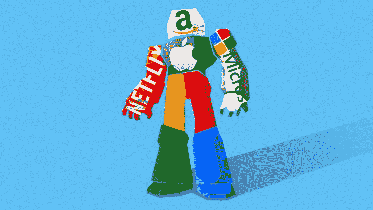

# 你认为大型科技股被高估了？再想想！

> 原文：<https://medium.datadriveninvestor.com/big-tech-is-overvalued-you-reckon-think-again-16bde1eaaced?source=collection_archive---------9----------------------->

投资者一直在担心大型科技公司的估值水平已经达到令人眩晕的高度。这是前所未有的。

Big Tech figurative illustration from [VoxPol](https://www.voxpol.eu/how-big-tech-designs-its-own-rules-of-ethics-to-avoid-scrutiny-and-accountability/)

脸书、苹果、亚马逊、微软、谷歌、网飞、特斯拉的股票见证了散户投资者的抢购热潮。

传统的估值模型并不是为评估这样的商业模式而设计的。目前的估值方法没有准备好计算一个行业的价值，并认为 90%的价值被一家公司捕获。市盈率高得离谱。

这种蜂拥现象可以被视为非理性的投资繁荣和疯狂的狂热。然而，这与大型科技公司良好的未来前景不谋而合。我们通常对即将发生的事情没有心理准备。

我们将见证一种“科技乌托邦”式的经济，其特征是一些超级大的科技公司控制了整个经济领域，如通信、教育、旅游、银行、零售、娱乐、交通等。

# 需要考虑的四个关键问题

1.  **产业内整合** —从赢家通吃到赢家通吃。大型科技公司一直在赢家通吃的领域里竞争。这种情况正在改变。大型科技股资产负债表上不断增长的现金储备所推动的进一步整合，正在将这些领域转变为赢家通吃的领域。赢家通过杀死或收购其他企业(要么加入我们，要么去死)来赢得一切。大竞争对手被杀死，老的小竞争对手被压扁，新的创新竞争对手被收购。反垄断法无法挽救这些被垄断的经济空间，因为潜在的经济学规定并宣告了赢家通吃的存在，例如社交媒体空间中的网络效应。
2.  **行业整合** —几个行业正在被大科技公司整合合并成一个产品。
3.  **商业模式** —可扩展性。与传统商业模式不同，科技公司的商业模式在构建时考虑了可扩展性。从一开始，它们就应该快速扩展。闪电战。这意味着他们可以快速完成上述整合。
4.  规模——太大而不能倒，说到底，这些庞然大物将会太大而不能倒。如果你认为一些银行太大而不能倒闭，那就等着看技术男孩们完全接管整个行业吧。上面提到的整合和可扩展性将导致大的科技公司大到不能倒。一家公司的失败等同于整个行业的失败。

 [## 技术是市场的领头羊|数据驱动的投资者

### 大量的首次公开募股，中国做他们自己的事，微软政府的灾难应对，以及抖音的民谣…

www.datadriveninvestor.com](https://www.datadriveninvestor.com/2020/08/28/tech-is-the-market-top-dog/) 

让我们来看看大型科技巨头的未来。

F **acebook** —内置网络效应接近 30 亿。就功能和技术而言，即使是更好的平台也无法骗走这数十亿美元，因为这是用户网络的所在地，Instagram 和 WhatsApp 也是如此。

用户带来广告费，广告费带来买断竞争的力量。脸书收购了 Instagram 和 WhatsApp。他们可以通过在首轮融资阶段资助所需领域的一批初创公司，来收购任何其他他们想要的初创公司。无论哪家公司在这个领域取得成功，他们都将牢牢控制。反垄断法并不禁止大型科技公司投资初创公司。

脸书是一个规模很重要的完美例子。脸书-WhatsApp-Instagram 这三者定义了 Youtube 和 Twitter 之外的大多数人的社交媒体。

A **pple —** 正在走下坡路，没有网络效应，也没有任何保护自己免受崩溃和攻击的东西，但有钱买断竞争对手。苹果正面临激烈的全球竞争。它看起来不会赢，即使是对小米，更不用说华为和三星了。由于狂热，投资者仍在涌入那家没有前途的公司。它只是一家品牌形象良好的电脑电子产品制造商。它将会像诺基亚和黑莓，或者像松下和富士这样的昔日巨头一样消亡。

A**mazon**——是零售。这是无与伦比的，不败的。它也会杀死沃尔玛和小型夫妻店零售企业。它还会扼杀购物中心和小型在线零售商。它将在未来几年主导零售业。

它的规模经济和配送效率将无与伦比。该公司可以在价格上胜过任何人，无论是第三方产品的佣金还是自有产品。你认为美国零售业现在有多少价值，到 2030 年又会有多少价值？

10 年前，经济学家很快提到，在某个时候，一家公司会遭遇规模不经济。虽然对于通用电气(General Electric)等老一代企业来说，这通常是正确的，但大型科技公司正在挑战这一“原则”,它们将自己的活动组织成大大小小的混合体，从而在两端收获效率，避免规模不经济。亚马逊和履行中心都是如此。

微软(icrosoft)——在个人电脑过时之前，它不会很快消失(这将会发生，但不会很快)。即使 android 发布了个人计算版本，全球数十亿人对微软产品的技术投入也意味着人们不会轻易转换，就像删除你的脸书账户或卸载 Whatsapp 以支持 Telegram 有多难一样。

个人电脑操作系统战争已经结束。微软赢了。一切都结束了。微软只有在个人计算消亡的时候才会消亡。随着苹果和它那些对用户不友好的产品一起慢慢死去，微软将会得到更大的一块蛋糕。赢家拿走所有。5G 将导致更多的视频通信和更少的个人计算使用，但不会立即导致微软产品的死亡。

et flix——它变得如此之大，以至于它的竞争对手都在缩小规模。这就像尤塞恩·博尔特在 200 米奥运会比赛中扩大领先优势一样。差距不断加大。

规模本身将决定产品供应的数量及其产生的成本。越大越好。卓越的网飞个性化算法将杀死所有试图骗走一些消费者的利基市场。

网飞将吸收的最后一大块是体育直播。5G 的广泛推广和网飞体育直播的增加将杀死 ESPN、多选择、天空、英国电信和任何一个在你的地区受欢迎的球员。

网飞已经准备好成为这场竞技场上的赢家。胜算不大。而且是赢者通吃的游戏。所以，当你以前瞻性的眼光来评估网飞时，你必须总结 ESPN、天空、多选等公司当前的总市值。而且不仅仅是 Hulu 和 HBO 这样的流媒体公司。

概括来说，网飞将 1)占领整个流媒体行业，2)占领和吸收其他非流媒体行业，如有线电视。无论谁将成为赢家(目前网飞的胜算更大)，其未来价值都是两个或更多行业的价值。

G 是一个巨人。它是一只野兽。比许多国家都大。它拥有并控制着互联网搜索引擎。它是一个动词和一个名词。谷歌广告是一台印钞机。随着人们花越来越多的时间上网，谷歌的广告收入份额也在增加。

搜索引擎和浏览器的战争已经结束。谷歌赢了；所有的竞争都被打败了。一些顽固的人还没有被埋葬。在不再需要搜索引擎之前，谷歌的地位不会受到挑战，但这不会很快发生。

YouTube 是视频内容和广告领域的王者。Android 赢得了智能手机、平板电脑和家庭设备的操作系统战争。最后一战已经结束，在操作系统本身不再重要之前，这个领域不会再有大决战。

如果谷歌冒险进入银行业，它将变得超级大，因为没有更好的最高级。

T **埃斯拉**——是王储。汽车制造商宝座的明显继承人。它准备占领汽车行业。丰田、奔驰、通用、福特等。最终会在反抗后死去。随着人们要求移动即服务，而不是汽车作为一种产品，汽车行业将发生变化。特斯拉可能会提供这种机动性。

汽车制造业正在经历一场巨大的变革。未来由**自动驾驶电动汽车**定义。过去的时代是由**内燃人类驾驶的交通工具**定义的。

在不久的将来上路的汽车(可能比现在少)将由一个超级大制造商制造。在移动即服务模式下，拥有、维护和驾驶个人车辆的成本将高于使用所提供的移动服务的成本。拥有一辆汽车将是一笔荒唐的开支。这将是超级富豪的专属领地。人类司机也可能被法律禁止在公共道路上驾驶。

移动即服务将摧毁汽车品牌忠诚度和汽车制造业的分裂。这只是一场成本控制的游戏。特斯拉在这一领域遥遥领先。它可能是第一个规模化的，因此也是第一个降低成本的，然后是赢家通吃。

特斯拉的估值并不局限于纳入整个未来汽车制造业。它还将交通作为一项服务，因为特斯拉可能会在不久的将来进入优步的地盘。

据说未来是不确定的，但正如我们所说的，这些科技巨头正在定义未来。他们有大批的极客在忙着创造未来，并真的把它编码成现实。

再见。

**访问专家视图—** [**订阅 DDI 英特尔**](https://datadriveninvestor.com/ddi-intel)