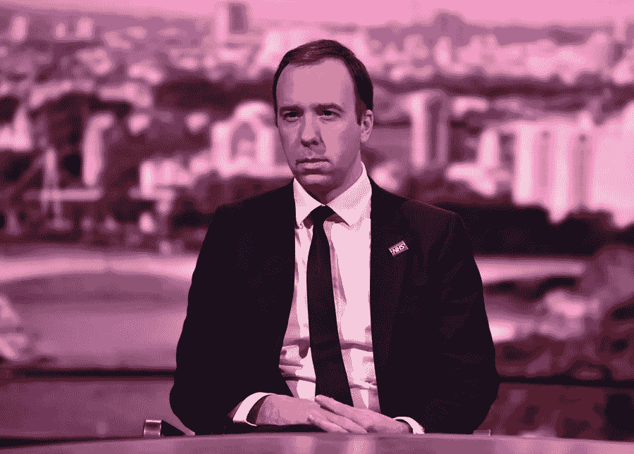
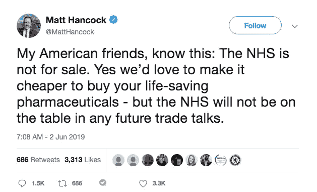
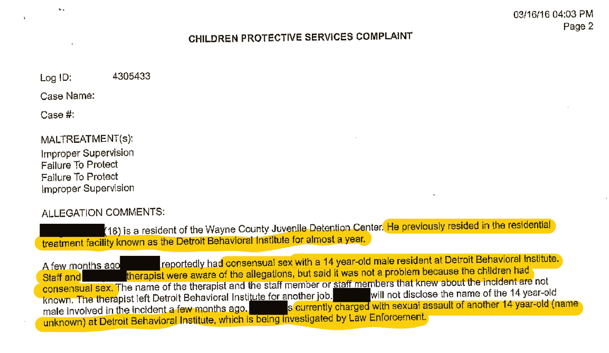
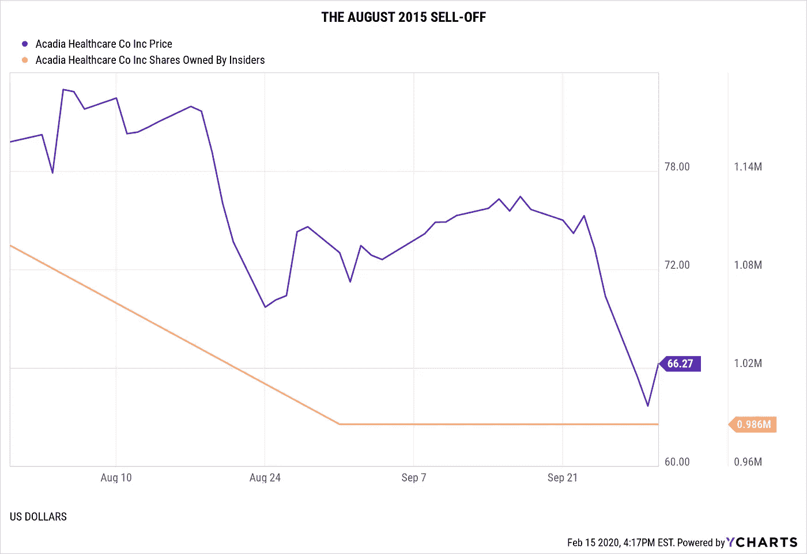
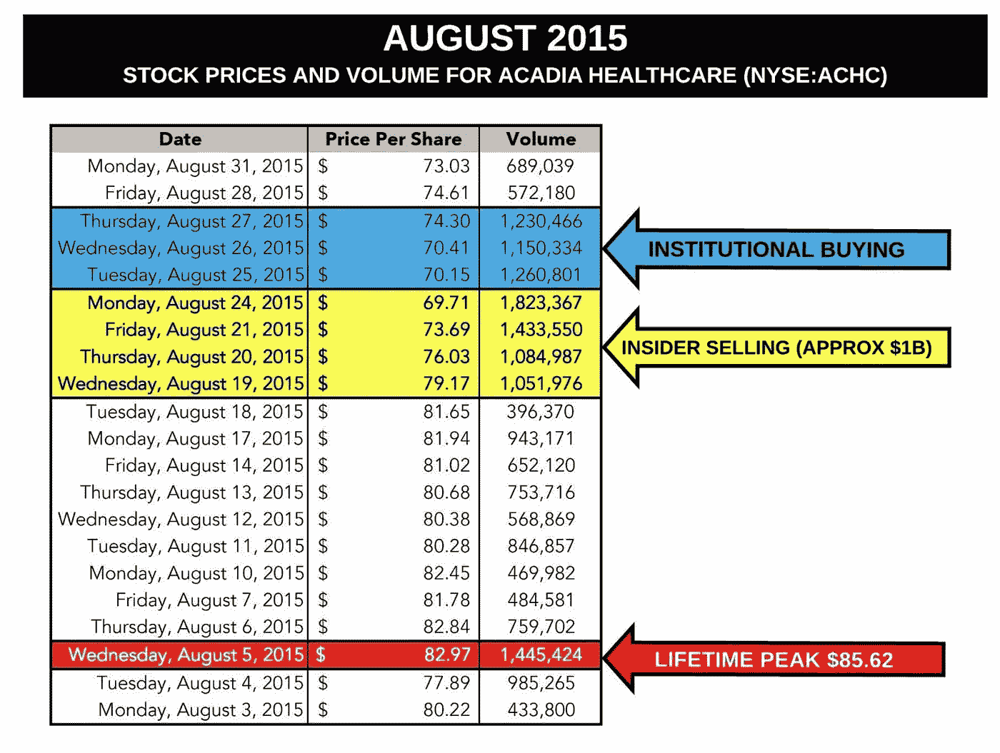
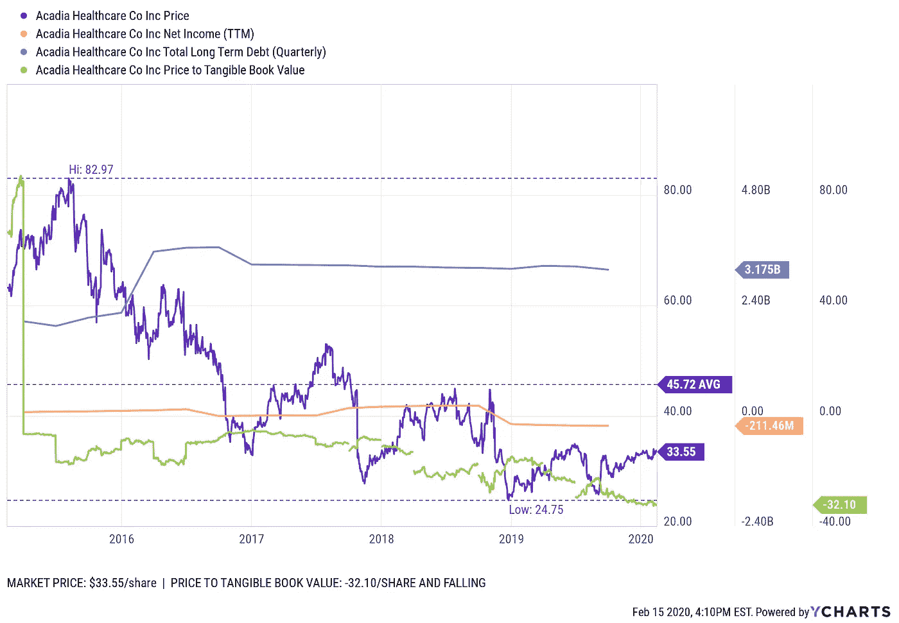

# 英国政治家在帮助孤僻自闭症患者方面的“屡次失败”可能是美国医疗保健公司的救命稻草

> 原文：<https://medium.datadriveninvestor.com/big-u-s-mental-healthcare-providers-are-sole-beneficiary-of-british-health-secretarys-repeated-8606fb886d5b?source=collection_archive---------3----------------------->

British NHS Secretary Matt Hancock: [Source: Pharmacy.biz](https://www.pharmacy.biz/wp-content/uploads/sites/1/2019/01/matt-hancock.jpg).

## 马特·汉考克在 2019 年表示，NHS“不出售”给美国——然而，最近的报道表明，他可能已经出售了它…

上周三，也就是 2 月 12 日，英国媒体 iNews [报道](https://inews.co.uk/news/health/matt-hancock-failures-autism-care-legal-challenge-1494887)“卫生大臣 Matt Hancock 因‘屡次未能’给予有学习障碍和自闭症的人适当的便利而面临法律诉讼。”

2019 年 11 月 9 日，在经历了一年半的可识别的公众愤怒之后，汉考克(担任卫生和社会关怀国务卿)道歉*和*保证对自闭症儿童和成人的长期隔离进行深入调查。那次公众愤怒的焦点是一位名叫“贝瑟尼”的 18 岁自闭症女性，她(当时)被一家美国公司监管——总部位于美国田纳西州纳什维尔，上市公司为**阿卡迪亚医疗保健公司(** [**纳斯达克:ACHC**](https://finance.yahoo.com/quote/ACHC/) **)。**

 [## 大笔资金和尖端技术:人工智能/人工智能投资将如何革新医疗保健…

### 在过去几年人工智能(AI)和机器学习(ML)的显著发展中…

www.datadriveninvestor.com](https://www.datadriveninvestor.com/2018/03/22/big-money-and-cutting-edge-technology-how-investment-in-ai-ml-will-revolutionize-the-healthcare-industry/) 

可证实的对病人的虐待，在许多情况下[被归类为“摇钱树”，](https://seekingalpha.com/article/4228230-kids-cash-cows-abuses-u-k-mental-health-centers-including-acadias)这种做法促使一名记者在电视直播中点名要求汉考克采取行动。她还报告说，阿卡迪亚承认“把(贝瑟尼的)护理搞错了。”

**A clip of Hancock’s 11/9/2019 Interview. Source: Skynews/Youtube.**

汉考克信守诺言释放了贝瑟尼。现在，英国监察机构说“时间到了”，并威胁要执行“训令”,这将加快这个大约 2000 人的群体的解放。在 2019 年 11 月 1 日的一份报告中，一个议会联合委员会[将同一批人列为国民医疗服务体系(“NHS”)侵犯人权行为的受害者。](https://publications.parliament.uk/pa/jt201919/jtselect/jtrights/121/121.pdf)

阿卡迪亚在英国的设施占其总收入的 35%，其中 90.6%直接来自 NHS，这也是英国的“单一支付者”医疗保健系统。

与他声称(通过 twitter，见下文)NHS 是“非卖品”给他的“美国朋友”相反，交易似乎已经发生了。现在，汉考克和阿卡迪亚都处于更加危险的境地。

Source: [Twitter](https://twitter.com/MattHancock/status/1135186444752957441?s=20).

去年五月，[在“战略选择”的明显伪装下，](https://www.bizjournals.com/nashville/news/2019/05/30/ceo-says-acadia-is-looking-to-sell-its-u-k.html) Acadia 领导层表示希望出售他们在英国的全部业务，在当地(大部分)称为 **The Priory Group。**

几乎没有关于*实际*买家的确凿报道浮出水面。

*(从 2011 年到 2015 年，物质使用障碍收入和“零利率政策”(ZIRP)帮助 Acadia 从一个小型供应商(拥有大约 12 家医院)转变为拥有 580 多家设施的全球企业集团。那笔收入* [*从此就消退了*](https://www.forbes.com/sites/forbesfinancecouncil/2018/06/08/leveraging-an-american-epidemic/#500eaad81193) *。)*

## 图斯

根据英国精神卫生法，评估和治疗单位(ATUs)旨在稳定和评估高危患者，通常最多持续 12 周。然而，任何患者的诊断都可能导致长期甚至极端的结果。ATU 的补偿，每周为美国公司净赚大约 20，000.00 美元**，利润异常丰厚。如此有利可图，报告称它们经常导致故意的错误分类和误诊。'**

**根据《每日邮报》的一篇文章，“难以置信的是，这些病人在 ATUs 的平均住院时间是五年半。”伊莎贝尔·加内特的儿子“马修的情况”的平均费用是每周 13，000 英镑，当搬到私人住宅时，价格水平从每年 416，000 英镑到 83，000 英镑不等。根据“杰里米”的说法，NHS 每年支付超过 75 万英镑，因为现金拮据的地方市政当局将病人转移到 NHS 买单的住院设施。**

## **《杰里米和贝瑟尼》**

**可以说，在这些[众多不可数的故事](https://www.parliament.uk/business/committees/committees-a-z/joint-select/human-rights-committee/inquiries/parliament-2017/detention-children-learning-disabilities-autism-inquiry-17-19/publications/)中，最引人注目的要么是“杰里米”和他的女儿“贝瑟尼”的故事，要么是 2019 年 5 月在 UHS 的 whorton Hall**(也属于一家美国公司:Universal Health Services(**[**Nasdaq:UHS)**](https://finance.yahoo.com/quote/uhs?ltr=1))的[BBC 卧底报告](https://www.bbc.com/news/health-48369500)中描述的恐怖。虽然后者不言自明，但杰里米通过在 Twitter 上发起了一场宣传活动，并掀起了巨大的波澜。**

****A February 12, 2020 tweet by “Jeremy”, who is still advocating following Bethany’s release.****

**一月份，我前往英国伯明翰，第二次采访杰里米。他声称他的女儿经历了近三年的完全隔离，其中大部分是在圣安德鲁医院，一家与国民保健系统签约的私立医院。 ***《伯大尼的孤独》的结尾*却发生在阿卡迪亚医疗保健**的监护中。当然，也是阿卡迪亚在 2018 年 12 月杰瑞米向议会作证[后](https://metro.co.uk/2018/12/14/dad-fights-nhs-locking-autistic-daughter-12ft-cell-8228183/)[第一次显示](https://seekingalpha.com/article/4228230-kids-cash-cows-abuses-u-k-mental-health-centers-including-acadias)后果的两天后解雇了他们的前任首席执行官。**

**在一份面向阿卡迪亚导演里夫·瓦乌德和首席执行官黛布拉·奥斯坦恩的声明中，贝丝被嘲笑的父亲说:**

> **"用一些你可怕的利润，出去给自己买一些人性."**

**像贝瑟尼一样，成千上万的其他父母和监护人也报告了他们孩子的隐居生活。[已经证明](http://data.parliament.uk/writtenevidence/committeeevidence.svc/evidencedocument/human-rights-committee/the-detention-of-young-people-with-learning-disabilities-and-autism/written/96010.html)大多数极端案例的时间跨度不会超过五年。这大约是 UHS 和阿卡迪亚医疗保健公司进入市场的时间。2014 年，UHS 以 2 亿英镑收购了小天鹅，并从那里开始扩大业务。另一方面，阿卡迪亚悄悄进入，承担了巨额新债务，为 2016 年以 20 亿美元(11.5 亿英镑)收购小修道院集团提供资金。**

## **利润高于病人**

**在 Acadia 收购 Priory Group 的同时，他们的内部人士正在抛售股票，这一过程始于 2015 年 8 月。同月，另一家美国医疗保健提供商 AAC Holdings(2019 年从纽约证券交易所退市)被控谋杀。事后看来，没有导致定罪的谋杀起诉是黑天鹅事件，暴露了源于 2008 年通过的美国[立法](https://www.cms.gov/CCIIO/Programs-and-Initiatives/Other-Insurance-Protections/mhpaea_factsheet)的重大欺诈和滥用，该立法要求保险公司为这些疾病支付费用；所以很多治疗方法都是未经证实的，成本很高。尽管如此，美国保险公司和政府必须给予精神健康状况同等水平的财政支持，就像他们给予需要治疗断腿的病人一样。这招致了大量的欺诈。在 AAC holdings 的案例中，他们的大部分价值来自尿检的超额收费，从而导致公司价值崩溃。**

## **阿卡迪亚不寻求救赎**

**在美国，Acadia Healthcare 尚未公开回应关于其旗舰中心发生内幕交易或 T2 失踪教师/两个孩子的母亲的指控。他们还没有承认关于[性侵儿童](https://www.kob.com/albuquerque-news/multiple-lawsuits-claim-physical-and-sexual-abuse-at-desert-hills-acadia-healthcare/5293333/) *和* [弱势成年人](https://www.chicagotribune.com/news/ct-met-timberline-knolls-lawsuits-20190404-story.html)的指控。然而，在底特律一家机构的 [CPS 报告中，现场级别的工作人员告诉官员，他们照顾的两名 14 岁儿童之间的性行为“是可以的，因为这是两厢情愿的性行为。”是的…](https://static.seekingalpha.com/uploads/2019/4/12/48928155-1555061354928263_origin.png) [发生了](https://seekingalpha.com/article/4254480-acadia-healthcares-motor-city-mayhem-documents-reveal-troubling-connection-trio-of-detroit)(见下文)。**

****

**CPS Report from Detroit Behavioral Institute. [Source: Seekingalpha.com](https://seekingalpha.com/article/4254480-acadia-healthcares-motor-city-mayhem-documents-reveal-troubling-connection-trio-of-detroit).**

**2019 年初，阿卡迪亚医疗保健公司(Acadia Healthcare)旗下的一家美国急性精神病医院的一名前官员站了出来。消息来源声称，无证移民儿童被关在一个设施中长达 6 个月，没有学校，每天花费州纳税人 650 美元。**

## **从里到外。**

****

****In August 2015, the ownership, including Waud, started to run.****

**至于[股票抛售](https://www.axios.com/acadia-healthcare-debt-executive-stock-sales-6abb6438-1d02-4072-a1e8-39615213f085.html)，Acadia 内部人士(即董事、官员和董事会成员)在 2015 年 8 月不到一周的时间里抛售了约 7.7 亿英镑(约 10 亿美元)，甚至在与 Priory 的交易谈判期间还在继续这样做。到 2018 年，他们已经将其从 30%下降到不到 2%。直到 2020 年，内部人士仍在继续抛售他们的股票。**

****

**在 Acadia 的信贷义务中也持有大量股份的大银行很快全部买下(价格略低)。值得称赞的是，拖欠 3000 名在押儿童的债务在经济上或道德上都不是一个好主意——这是阿卡迪亚的一个担忧，证据如下:**

*   **银行业投资了大约 30 亿美元的债务**
*   **利率不是上升就是持平的事实**
*   **Acadia 的最低库存现金(近年来徘徊在 4000 万至 8000 万美元左右)**
*   **与医疗保健以外的公司相比，他们的应收账款可以说是无法收回的，但同样容易被利用。**

## **阿卡迪亚 2019 财年花卉指南**

**[Acadia 2019 年第三季度财报](https://www.fool.com/earnings/call-transcripts/2019/11/06/acadia-healthcare-co-inc-achc-q3-2019-earnings-cal.aspx)未能达到每股收益(0.52 美元对 0.56 美元)和营收(7.7725 亿美元对 7.9039 亿美元)的预期。Acadia 在美国的机构由 223 家行为医疗机构和 9，300 张床位组成，第三季度收入为 5.094 亿美元。Acadia 在英国的设施包括 365 家行为保健机构和 8，700 张床位，收入为 2.679 亿美元，低于同一季度的 2.723 亿美元同比收入。英国的收入占总收入的 35 %,其中 90.6%来自单一支付者 NHS。尽管 2019 年第三季度 NHS 的比率增长了 2.7%，据称“相同设施”的收入增长了 4%，但住院天数减少了负 1.1%，入院率下降了负 1.5%，导致英国收入在截至 2019 年 9 月 30 日的三个月内同比下降了负 1.1%，九个月内下降了 1.9%。英国的收入轨迹正在下降。Acadia 发布了 2019 财年的下行指引，不包括非经常性项目，每股收益为 2.00 美元至 2.05 美元，而标准普尔资本智商共识为 2.15 美元&，2019 财年收入为 31.00 亿美元至 31.25 亿美元，而标准普尔资本智商共识为 31.4 亿美元&。他们将短缺归咎于飓风和加州野火的持续影响，导致五个设施临时关闭，造成 900 万美元的收入短缺，估计总收入影响为 1500 万美元。更重大的威胁是 2019 年最后几个月发生的事情。**

****

**Acadia’s TTM net income, share value, and book value has dwindled as their liabilities stay flat. Source: YCharts.**

## **通过截肢提高股东价值？**

**在 2019 年第三季度的财报电话会议上，首席执行官黛布拉·奥斯特恩(Debra Osteen)证实了 Acadia“探索出售整个英国业务”的意图，并预计“在明年年初征求对英国业务的投标”，并指出该公司将在 12 月英国大选后参与。大卫·杜克沃斯在电话会议上再次强调。“我们的目标是考虑出售整个英国业务。”。分析师没有问的是，他们为什么如此热衷于出售英国业务的“整体”？一般的答案是提高股东价值，但是卸载超过 50%的总设施和床位(占总收入的 35 %)如何“提高”股东价值呢？这听起来更像是截肢，而不是策略。或者，英国的行动是一个定时炸弹，截肢是防止传染扩散到美国行动的唯一措施。**

**这种全身性的毒药已经被感染到几乎一年都没有人服用了。**

## **汉考克的强行出手可能会触发定时炸弹**

**Jeremy 报告说，NHS 正在为这些人寻找更合适的安置点，他的女儿为大规模解放开创了先例，这可能会结束阿卡迪亚的所有 ATU 收入。虽然还不清楚 ATUs 给阿卡迪亚带来了多少收入，但可怕的做法和不恰当的录取确实说明了问题。**

**然而，除此之外，仅出售英国业务仍将导致阿卡迪亚股票的估值降低。对一项由活跃的股市支持的交易的猜测是支撑股价的原因。**

**这也将使 Acadia 陷入困境，只剩下[非常可疑的](https://seekingalpha.com/article/4267108-following-doj-fraud-settlement-revelations-from-careful-look-acadia-healthcares-earnings)美国本土收入，他们原本希望通过前往英国来抵消这些收入。**

**四年后，[的情况变得更糟了](https://seekingalpha.com/article/4249835-summary-update-scary-findings-from-now-18-month-investigation-acadia-healthcare)——具体表现为罚款、报销调整、[强制关闭](https://www.bizjournals.com/nashville/news/2019/04/08/acadia-facility-shuttered-amid-allegations.html)、账单调查、诉讼和监管变化，这些都不利于找到收入。**

**因此，对于那些想知道阿卡迪亚将会如何发展的投资者来说，他们应该密切关注汉考克的变化。阿卡迪亚的整个命运可能掌握在被迫扮演锅的汉考克手中。“称壶为‘黑’。”"**

***(Acadia 2019 年第四季度财报发布定于 2020 年 2 月 27 日。他们的主席里夫·瓦乌德(Reeve Waud)和首席执行官黛布拉·奥斯特恩(Debra Osteen)都没有回应置评请求。)***