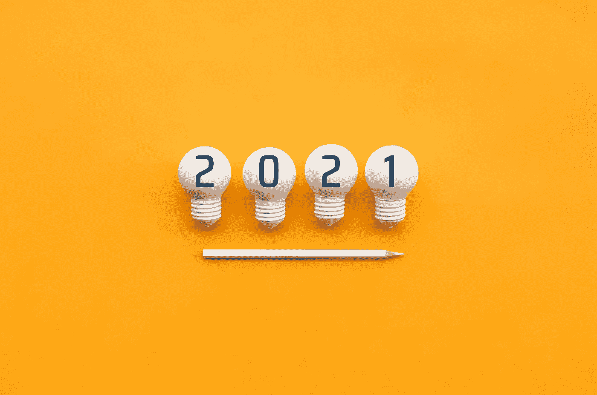
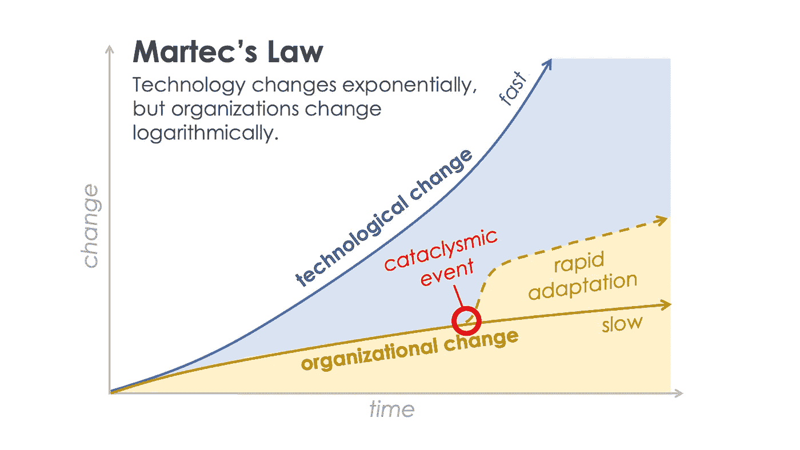
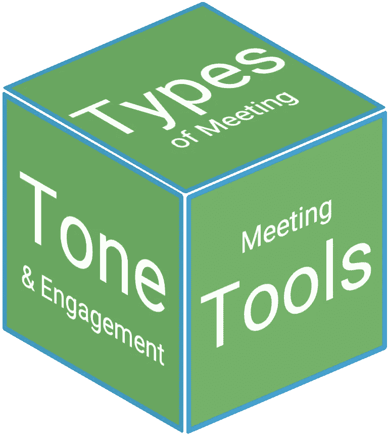

# #BigIdeas2021:从敏捷加速到开放精神健康

> 原文：<https://medium.datadriveninvestor.com/bigideas2021-from-agile-acceleration-to-opening-up-about-mental-health-79a3595bb436?source=collection_archive---------43----------------------->

Photo [195658075](https://www.dreamstime.com/creativity-nspiration-ideas-concepts-lightbulb-pencil-color-background-business-inspiration-image195658075) © [HAKINMHAN](https://www.dreamstime.com/hakinmhan_info) | [Dreamstime.com](https://www.dreamstime.com/photos-images/2021-big-ideas.html)

作为一名英国 X-er 一代，我很幸运没有经历过战争(在我的幸福列表中排名很高)，然而 2020 年将成为我一生中最具挑战性的一年。这也是我最好的生活和学习的地方。

受 LinkedIn 的#BigIdeas2021 的启发，以下是我对未来 12 个月的大想法。

# 1.敏捷加速之年

我们到处都能看到指数增长。这是在 R 数[坏]但也是在技术进步[好]。如果说 2020 年教会了我们什么，那就是变化是唯一不变的。2021 年的下一件大事是变革正在加速。

因此，在技术变革(指数型)和我们作为人类的变革能力(线性型，问问 Charles Darwin 就知道了)之间会有持续的分歧，这意味着[如果我们要创造繁荣的企业，我们需要从根本上改变我们与技术的关系](https://chiefmartec.com/2020/08/bending-martecs-law-2020-taught-us-agile-thought/)。

A revision of Martec’s law, by [Scott Brinker](https://www.linkedin.com/in/sjbrinker/) of [chiefmartec.com](https://chiefmartec.com/2020/08/bending-martecs-law-2020-taught-us-agile-thought/)

这对技术来说是一个惊人的机会，可以处理所有不需要我们(人工智能)来做的事情，所以我们可以专注于成为更好的人(情商)。在这个星球上，我们人类比以往任何时候都需要更多，繁荣的商业有许多方面都依赖于情商和人际关系:例如[改变、成长、领导](https://www.positivemomentum.com/)。

阅读更多信息:

*   [当#backtobetter 需要#bebold 时](https://julianmarch.medium.com/when-backtobetter-needs-bebold-5accd92f917)
*   [辉瑞/BioNTech 疫苗的敏捷加速经验](https://julianmarch.medium.com/v-day-5-lessons-in-digital-acceleration-5f09c49b9194)
*   [尽快开始行动](https://julianmarch.medium.com/5-truths-of-doing-250515d0012b)
*   [5 种远程原型制作方式](https://julianmarch.medium.com/5-truths-of-doing-250515d0012b)
*   [不是下一次正常，是现在正常](https://julianmarch.medium.com/its-not-new-normal-or-next-normal-it-s-now-normal-a3d08b0a24d6)

# 2.讲故事自有它的价值

今年，我从从事蓝筹股媒体业务 23 年的公司转向了独立咨询公司，因为我意识到，彻底改变了媒体行业的所有变革原则和范式，都非常适用于所有类型的相邻行业。

变革领导力盒子中最重要的工具之一就是讲故事。你可以拥有世界上所有的技术，但如果你不能把人带在身边，你的企业就不会转型。

毫不讽刺的是，将 ITV 新闻转变为永不停息的数字服务的秘诀是一小时又一小时地向 ITV 董事会、13 个不同新闻编辑室的记者以及他们的广大观众讲述故事，阐明叙事。

如今，掌控自己的故事讲述是每个企业的天赋，无论是对内还是对外，正式还是非正式，面向大群体还是一对一。随着劳动力越来越分散，我们需要在沟通方式上变得富有想象力。

我在 2020 年之前从未听说过 Zoom，现在它几乎是每天的主食，与 Teams、Bluejeans、GotoWebinar、Meet 甚至 [mmhmm](https://www.mmhmm.app/) 并列。

2021 年的领导人需要在她的工具包中有各种各样的讲故事工具，如果不能熟练地运用它们，就像给秘书口述一封信一样，很快变得不合时宜。

[视频:提升您的网络研讨会水平！]

# 3.成功混合工作的关键——价值观

最成功应对 2020 年挑战的企业不仅敏捷、数字化加速，而且忠于自己的价值观。

技术几乎可以促进任何工作方式——不幸的是，像全球疫情这样的灾难性事件表明这是可能的，这就是为什么我们在 9 个月内看到的数字加速比之前 5 年还要多。

混合工作(远程办公和办公室办公的结合)将会继续存在。我知道谷歌已经告诉他们的员工在 2022 年中期之前不要指望完全回到办公室。

2020 年，越来越多的组织将适应一个混合的世界，这需要一个重新调整的领导层；超适应，超连接和超可见[但不是超活跃，头脑]。

The 3Ts model for leading in a hybrid world

我开发了这个 3Ts 模型(左图),以帮助组织了解他们需要如何适应混合世界中的通信。

“工作空间”现在已经超越了办公室的四面墙，延伸到了我们的客厅、餐桌和花园办公室。

我希望在 2021 年，物业团队能够与技术、人员和文化领域的同事更加紧密地合作，利用强大的公司价值观来构建工作空间的未来。

# 4.对多样性和包容性采取行动

疫情在加速 2020 年关于多样性和包容性的讨论中发挥了作用，T2 通过 BAME 裔 COVID 患者死亡率的增加扩大了种族不平等，T4 给黑人的命也是命的抗议增加了新的紧迫性。

2021 年是言辞需要转化为更广泛行动的一年——每天生活和呼吸着多样性和包容性。

这篇来自民主党战略家保罗·贝加拉的观点文章分析了乔·拜登的内阁选择，指出了关键的一点，即多样性不是为了代表而代表(这是装饰性的，没有什么比这更侮辱人的了)，而是从尽可能广泛的人才库和最广泛的生活经验和思维方式中汲取人才。

疫情和洛克德斯促使我们更加关注身边的人，并意识到通过照顾每个人，我们可以让自己的生活变得更好。让这成为 2020 年的积极遗产。

[La Piazza Group](https://www.lapiazzagroup.com/) ，我与[Fru HAZ litt](https://www.linkedin.com/in/fru-hazlitt-7951ab14/)&[Alessandra crave tto](https://www.linkedin.com/in/alessandra-cravetto-49794119/)共同创立的意大利影响力营销机构，今年推出了 [Colory*](https://www.instagram.com/colory.it/) ，其使命是提升和激励意大利有色人种，并促进意大利迄今为止基本上被忽视的人才、想法和创造力。

我们还将 GRLS.it 纳入我们的阵营——一个女性企业家的平台。

今年，我和我的一些积极动力伙伴成为了 https://www.generation-success.com/的导师

# 5.给予精神健康和身体健康同样的关注

2020 年是我从精疲力竭中恢复过来的一年。这是我第一次把它写下来。

这很好地说明了我的观点。我毫不犹豫地告诉人们我的手腕在滑雪板上骨折了，甚至告诉他们一年后我的手肘在滑雪板上又骨折了。我现在已经放弃滑雪了。]

围绕心理健康的讨论已经激增，但在我们像对待身体健康一样认真对待心理健康之前，还有一段路要走。

我现在说是因为看到身边的朋友都在经历和我类似的经历。很容易相信你是唯一一个过得艰难的人，因为很少有人会承认自己的弱点。对我来说，最重要的突破时刻之一是意识到不好也可以。我们是群居动物，我们需要彼此，当我们能够奉献自己时，每个人都会受益。

我非常感谢我的妻子、我的密友(你知道你是谁)以及[迷幻](https://www.psychedglobal.com/team/ben-mckie)的[本·麦基](https://www.linkedin.com/in/ben-j-mckie-6595643/)和[综合职业](https://integralcareer.co.uk/about/)的[格温多林·帕金](https://www.linkedin.com/in/gwendolyn-parkin-2254688a/)在我 2020 年的个人旅程中给予我的帮助。当你重建时，你会变得更强大。[我认为适用于灵魂和手腕&肘部]

*   对自己感到自在。不要试图成为你不是的人。
*   每个人都有惊人的优势和天赋，建立你的公式，利用它们茁壮成长。
*   工作可以有多种形式。
*   和你的朋友聊聊。互相照顾。
*   出去。

祝大家 2021 年快乐健康。

*最初发表于*[*https://www.linkedin.com*](https://www.linkedin.com/pulse/bigideas2021-from-agile-acceleration-opening-up-mental-julian-march/?published=t&trackingId=FLfy%2BkiJagpctT3cJKRFYg%3D%3D)*。*