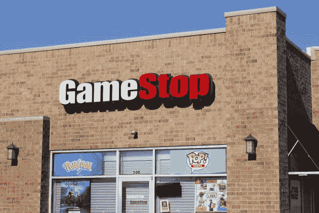

# 亿万富翁在 Reddit 上锻造

> 原文：<https://medium.datadriveninvestor.com/billionaires-are-forged-on-reddit-44ba6c8c797e?source=collection_archive---------33----------------------->

## 华尔街 bets boyz

## 从超级富豪那里拿过来，贴在富人身上。

Link to [source](https://www.geekwire.com/2020/gamestop-microsoft-team-sell-xbox-access-5k-gamestop-retail-locations/)

Reddit 上华尔街赌注的 BoyZ 帮最近玩了看不见的手。

“看不见的手”一词是由经济学大师亚当·斯密在其著作《道德情操论》中提出的。

这个概念描述了一种未知的力量，这种力量创造了供需平衡，满足了交易双方。

2021 年 1 月，这个给自己制定了“道德准则”去抢劫富有的对冲基金并把它给贫穷的散户投资者的团体，重新创造了“看不见的手”。

如今，将市场拉向自然平衡点的不再是神秘的力量，而是 Reddit group w/wallstreetbets。

一群男孩和女孩在封锁期间感到无聊，需要一些现实生活中的娱乐。

这是一个简单而基本的策略，也是沃伦·巴菲特推荐的:

> 买一只股票，永远持有。

这个小组没有推荐其他的东西——以或多或少粗鲁的语气。

除此之外，他们目前向 Gamestop 和 AME 娱乐公司以及黑莓和诺基亚推荐这种策略。

所有股票卖空报价非常高的公司。

当人群涌入这种股票并买入持有时，价格就会上涨，对冲基金必须平仓。

但你真的成为了穷人散户的富人吗？

嗯，是的，今天我在网上读到，在 Reddit 的帮助下，一个新的亿万富翁在魔多的矿井中诞生了…咳咳……华尔街下注。

# 瑞安·科恩是谁？

《新闻周刊》喊出了一个我今天在网上看到的名字，他在上周四一夜之间赚了 30 亿美元，成为最新的亿万富翁。

事实上，这是我有生以来第一次真正的一夜成名。

想象一下，在你睡觉之前，你是一个贫穷的零售商，当你醒来时，你的银行账户上多了 30 亿美元。

这就是瑞安·科恩的遭遇。那他是谁？

## Chewy.com

嗯，实际上，他并不是一夜成名的。在动物世界里，他是埃隆·马斯克和杰夫·贝索斯的结合体。

2011 年，他和一个朋友创建了 Chewy.com——一个在互联网上出售动物食品和玩具的网站。

他将公司建成了一个庞大的企业，2017 年被 PetSmart 以 30 亿美元收购。

瑞安套现数亿美元，成为千万富翁。还不错——但还不是亿万富翁。

## 苹果和富国银行。

瑞安·科恩没有买一座岛屿和一艘游艇——嗯，我真的不知道，但写下假装我知道的句子很有趣。

我能研究的是我在 2017 年读到的他荒谬的投资策略。

雷伊·达里奥非常喜欢分散投资，与管理方舟基金的凯西·伍兹相似。

瑞安玩着他的投资游戏，用不同的方式利用他和 chewy.com 一起赚来的财富。2017 年，他将所有资金都配置在了两只股票上。

*   苹果和
*   富国银行

嗯，一个冒险的游戏。

2017 年苹果 40 美元左右，现在 130 以上。三年内三倍的回报——从几亿到十亿左右。

互联网的消息来源对此并不清楚。

要是我当初跟着瑞安投资苹果，而不是押注于 Wirecard 就好了。其中一家公司现在已经破产了。

# 真相大白了

今天是我的个人启示日。瑞安不仅投资了两只股票。

有一个隐藏的和秘密的第三个，没有人谈论它，直到今天。

我很确定你已经猜到了。是的，他投资帝国中的第三家公司是

> Gamestop

早在 2020 年 8 月，当美国证券交易委员会(SEC)迫使他披露自己的立场时，世界就已经知道了他的举动。

瑞安拥有 900 万股 GameStop 股票。

# 暴露的弱点

11 月，他写了一封[公开信](http://Ryan posted a public letter to GameStop's board of directors)给 Gamestop 的管理层，信中他指出了商业模式的弱点。

显然，Gamestop 仍然是一家零售商——自从 1999 年这家零售连锁店被称为 Gamestop 以来，它的商业模式是一样的。

在新千年开始之前的这一年，互联网年轻而狂野。下载速度非常慢。

但这是第一次，来自世界各地的游戏玩家可以联合起来一起玩游戏，不管他们住在哪里。这是许多大型在线角色扮演游戏和射击游戏的诞生。

我喜欢那些让书呆子重新社交的日子。不再独自玩游戏了。

这些游戏是在 Gamestop 等商店购买的。

自 2008 年以来，流媒体正在兴起，索尼、微软、苹果或任天堂等公司直接向客户销售。2020 年，数字游戏销售额首次高于实体游戏销售额。

瑞安不喜欢这样，并建议换档。

这一评论和向正确方向的推进让该股在 11 月份首次飙升。

# Reddit wallstreetbets 介入了。

但这还不够。在几个月的时间里，该股在小组中被推荐，对价格没有严重影响。

我真的无法追溯华尔街的卖空者风暴的开始，但可以肯定的是，在 1 月份，基调发生了变化

> 买入并持有——让我们把卖空者赶出股票

Reddit 用户发现 Gamestop 上的短报价达到了荒谬的 150%的历史最高水平。

对冲基金坚信 Gamestops 商业模式的死亡。

Reddit 上的千禧一代宣布了他们对这些对冲基金的个人战争

> 以将基金推向破产为乐

在小组中，我读到的引文将最近的事件与 40 年代的 D 日进行了比较，并提出了这个问题。

> 当你的孙辈问你在 2021 年做了什么时，当许多小手对抗几只大手时，你想告诉他们什么？

# 对瑞安·科恩净资产的影响

这一策略似乎奏效了。1 月 28 日，Gamestop 的价格涨到了 483 美元。

当然，帝国试图反击，Robinhood 等应用的交易冻结使价格暴跌回到每股 200 至 300 美元之间。

瑞安·科恩斯 900 万股 GameStop 股票的价值为

> 43 亿美元，最高价为 483 美元

当我写这篇文章时，它们的价值仍然是 240 美元，净资产至少有 20 亿美元。

鉴于投资期不到 6 个月，这是一个非常好的发展。

有趣的是，越来越多的散户投资者进入市场，影响了市场动态。

我确实认为这是一件好事，因为创造持久财富的唯一地方是股票市场。

买入并持有。

我是各行业公司的执行官、顾问和教练。我专攻企业发展和金融。从种子轮到 IPO 级别。我从 2006 年开始关注生命科学。

**查看** [**我的其他简介**](https://linktr.ee/soschner) **或报名** [**我的每周简讯**](https://mailchi.mp/5a50875fb5ea/newsletter) **。**

# **读者:**

 [## 几乎一夜之间赚了 30 亿美元的 GameStop 投资者

### 在 Reddit 上组织起来的小型私人投资者和富有的对冲基金老板之间正在进行一场股市拉锯战…

www.newsweek.com](https://www.newsweek.com/who-ryan-cohen-gamestop-investor-3-billion-overnight-1565095)  [## GameStop

### GameStop Corp .是一家美国视频游戏、消费电子产品和游戏商品零售商。该公司是…

en.wikipedia.org](https://en.wikipedia.org/wiki/GameStop)  [## 见见 Ryan Cohen，他在 GameStop 股价 8 美元时买了 900 万股

### 你可能已经听说了一点 GameStop 本周经历的疯狂股市上涨。如果你…

www.celebritynetworth.com](https://www.celebritynetworth.com/articles/billionaire-news/meet-ryan-cohen-the-guy-who-bought-9-million-shares-of-gamestop-when-the-stock-was-at-8/)