# Binance.com vs binance . SG

> 原文：<https://medium.datadriveninvestor.com/binance-com-vs-binance-sg-1fc1f93cf461?source=collection_archive---------0----------------------->

## 新加坡投资者

## Binance.com 和币安 sg 的利与弊，以及如何从你的账户中提款。

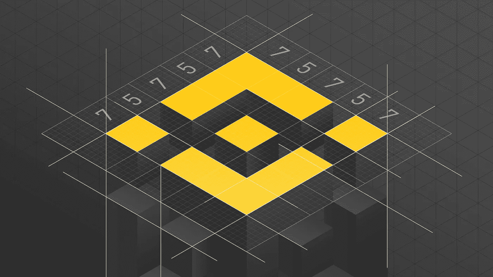

Binance logo (Image on [https://www.binance.com/en/blog/312529121515560960/The-LastMinute-Genesis-of-the-Binance-DEX-Logo](https://www.binance.com/en/blog/312529121515560960/The-LastMinute-Genesis-of-the-Binance-DEX-Logo))

# 介绍

随着比特币在昨日的牛市中首次突破 5 万美元，以及在 GME 股市的背景下，Reddit 交易员试图击败 Melvin Capital 等大型对冲基金。有大量年轻投资者涌入，他们愿意尝试风险更高的投资产品，由于 Dogecoin 的人气突然飙升，他们自然会被加密货币吸引。

我坚信要做自己的研究，而不是仅仅依赖一个来源作为真理。

这本指南是我作为一个新加坡人对现有产品的研究。

我会提供一个 TLDR；比较，并通过对 Binance.sg 和 Binance.sg 进行并排比较来深入了解一些要点。有关 Binance.sg 产品的更多信息，请访问[此处](/binance-for-the-lazy-d74016bf7fd9)！

# 我该选哪个？

TL；速度三角形定位法(dead reckoning)

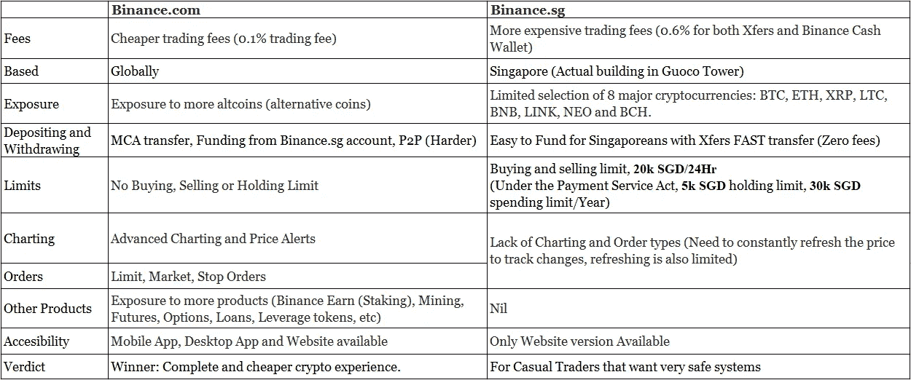

# 你有什么看法？

Binance.com 是更好的选择，因为它以更低的成本和更少的监管提供了更多的功能。因此，投入更多资金和撤出资金肯定是值得的。(我将在我的**常见问题**中讨论这个问题)

为了更安全的长期持有，我更喜欢使用 Binance.sg 来存储和忘记。值得注意的是，较低的收费和较少的监管并不总是更好。鉴于[罗宾汉交易暂停](https://www.marketwatch.com/story/lawsuits-against-robinhood-in-the-gamestop-saga-are-getting-their-day-in-court-but-theres-one-big-snag-11618806321)，当有大量资金悬而未决时，你会想要一个相当安全可靠的系统，而不是一个随时可能崩溃的系统。为了更大的利润，安全经常被忽视，然而能够以更高的管理费的形式获得内心的平静是有价值的。

Binance.sg 的一个隐藏的好处是它能够控制价格。由于在你点击“购买[硬币]”和“继续”之前，Binance.sg 会保留一分钟的价格，只要你在这一分钟之前完成购买，你就可以监控你的 Binance.sg 账户上的价格，并进行有利的交易。此外，在新的支付服务法案(PS 法案)下受到新加坡金融管理局的监管，我觉得在 Binance.sg 中存储我的硬币更安全。但是，随着 PS 法案的变化，较大的投资者可能会感到受到 5k 持有限制和 30k 年度支出限制的限制。因此，Binance.sg 可能更适合那些不想涉足游戏的投资者。

如果您确实打算创建一个 Binance.com 账户，您可以使用我的推荐代码从您的交易费用中获得 10%的回扣(减少 0.1% → 0.09%):

binance . com:[https://www.binance.me/en/register?ref=ZLPPE0WW](https://www.binance.me/en/register?ref=ZLPPE0WW)binance . SG:[https://www.binance.sg/en/register?ref=35002741](https://www.binance.sg/en/register?ref=35002741)

# 常见问题解答

# 我如何为我的 Binance.com 账户提供资金？

当试图在 Binance.com 用 Visa/Mastercard 购买 Crypto 时，它会给你一个提示，说这是一个对 DBS/POSB 无效的银行。(2021 年 2 月 18 日)

有三种方式为您的 Binance.sg 账户提供资金:
非本地:DBS 多币种账户(MCA)(最便宜也最容易)
非本地:来自 Binance.sg 账户的资金(更便宜)
本地:P2P(点对点)交易(最贵但最快的解决方案)(由于[Binance.com 新加坡当局的禁令而更新](https://www.businesstimes.com.sg/banking-finance/mas-bans-binancecom-from-unlicensed-payment-services-red-flags-it-with-investor) : P2P 现在不适用于 SGD)

## 通过 DBS MCA 账户融资

首先，设置你的 DBS MCA 账户，链接[这里](https://www.dbs.com.sg/personal/deposits/savings-accounts/my-account)。(3-6 个工作日内处理完毕)

转到→存款→菲亚特→美元→银门银行(SWIFT) →输入您希望注资的金额。

Deposit Fiat USD (image from [https://www.binance.com/en/my/wallet/account/main/deposit/fiat/USD](https://www.binance.com/en/my/wallet/account/main/deposit/fiat/USD))

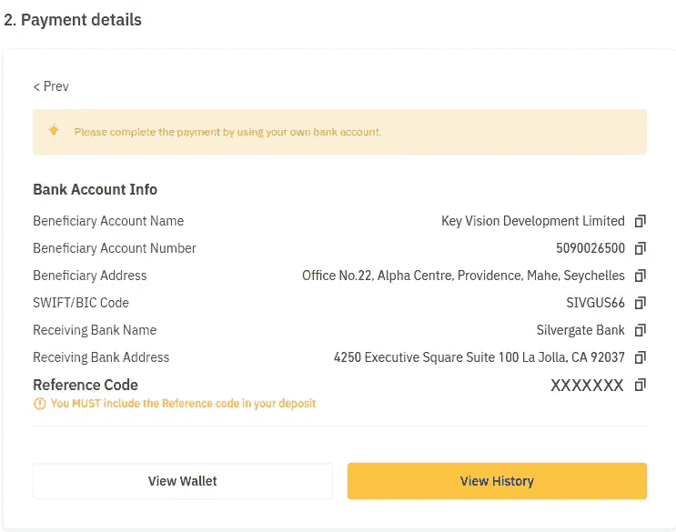

Payment details (image from [https://www.binance.com/en/my/wallet/account/main/deposit/fiat/USD](https://www.binance.com/en/my/wallet/account/main/deposit/fiat/USD))

遵循本[实用指南](https://www.sgcrypto.info/2020/12/29/dbs-binance/)从 DBS iBanking 进行海外转账。

## 对于 DBS 电话应用程序:

立即转到→支付和转账→海外→添加收款人

收款人名称:凯视发展有限公司

收款人账户℞:5090026500

收件人地址:塞舌尔马和普罗维登斯阿尔法中心 22 号办公室

美国的其他银行:输入 Swift 代码:SIVGUS66

一旦完成。点击“关键视觉发展有限公司”。

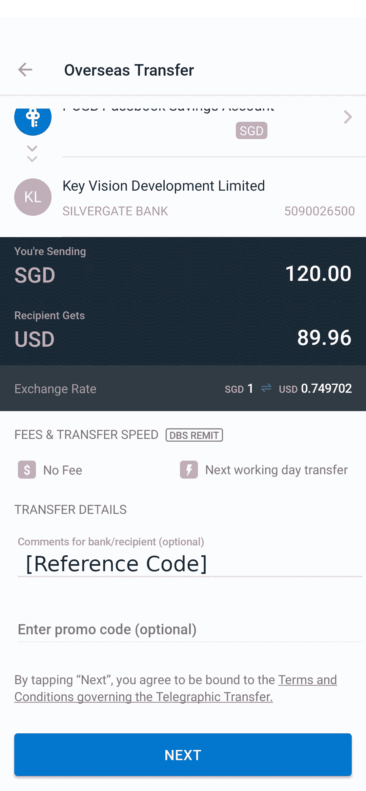

Image by Author

重要的是要认识到，尽管币安和星展都说不收任何费用，但星展有固定的汇率，这可能会导致不利的交易。因此，记下你因汇率而“损失”的金额。

## 来自 Binance.sg 的资助

基本想法很简单。

1.  通过 xfers 为您的 Binance.sg 帐户提供资金
2.  购买一枚取款费低的硬币(我会使用 LTC，其取款费为 0.001 LTC，最低为 0.0018)
3.  将长期贷款转到你的 Binance.com 账户
4.  出售 LTC 以获得稳定的货币，如 BUSD、USDC 或 USDT

这里有一篇文章谈到了这一点。我将在**解释为什么会出现这种情况。撤销怎么样？**和**费用呢？**。

## 为您的帐户提供资金的本地方式

进入→购买密码→选择菲亚特:新币→ P2P 交易→ USDT

我们将使用 USDT(或系绳)，这是目前 P2P 交易平台中的最佳选择，因为 BUSD(币安美元)似乎不可用，并且用新加坡元进行比特币交易似乎处于高溢价状态。然而，USDT 有一些过去的坏名声，因此你可能想以 1%的交易费为代价，用 USDT 换 BUSD 以获得安全。

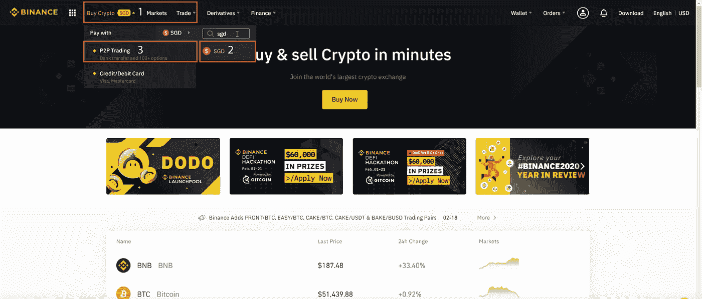

Image by Author

2 分钟视频: [P2P 流程](https://www.youtube.com/watch?v=LfTYugR00tI&ab_channel=Binance)。

## 关于 P2P 流程的建议

1.尝试寻找最低汇率的交易者，快速搜索谷歌可以让你看到价格是否过高。[https://www.coingecko.com/en/coins/tether/sgd](https://www.coingecko.com/en/coins/tether/sgd)

2.尽量让高完成率高订单的交易者万无一失。有一个币安认证的徽章，可以很容易地从普通用户中识别出商家(有经验的，经常交易的人)。

3.确保你想买的数量在最低限额以上。

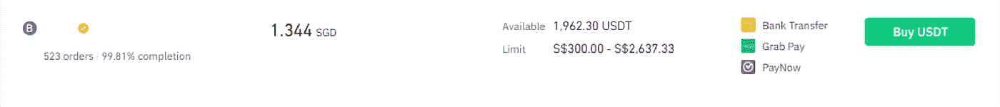

Image by Author

4.一旦交易者将 USDT 转账给你，确保从你的 P2P 钱包转账到你的现货钱包(加密现货交易是买入一种加密货币，卖出另一种加密货币，即 BTC/USDT)。

5.现在你有资金了，可以开始交易了。

**总结** : Binance.sg 的零成本资助在资助的难易程度上胜出。

# 撤回怎么办？

binance.com 的另一个大问题是。既然没有好办法直接从 Binance.com 撤军，那么一个好办法就是:

1.  兑换成低取款费的硬币(LTC 有 0.001 LTC 取款费，最低 0.0018)
2.  将您的硬币转移到 Binance.sg 帐户(该地址是您的 Binance.sg LTC 存款地址)(如果使用 LTC:请确保仅使用 LTC 网络进行转移)
3.  从 Binance.sg 出售您的硬币(0.6%的费用)
4.  从你的 xfers 账户中提款(零费用)。

## 为什么不像通过 MCA 账户存款一样取款呢？

问题是 Binance.com 的美元法定取款费是 30 美元。因此这是可能的，但代价很大。

另一种未经检验的方法是利用 P2P 交易卖出新加坡元。理论上这是最低的费用，因为 Binance.com 对 P2P 交易收取 0 美元佣金，事实上，你甚至可以通过加价来赚取。不过这种方式比较麻烦。

对于 **Binance.sg，**在平台上出售你的硬币(0.6%的费用)后，从 xfers 简单的零费用取款就可以让你把钱存入银行。

# **费用呢？**

## Binance.sg

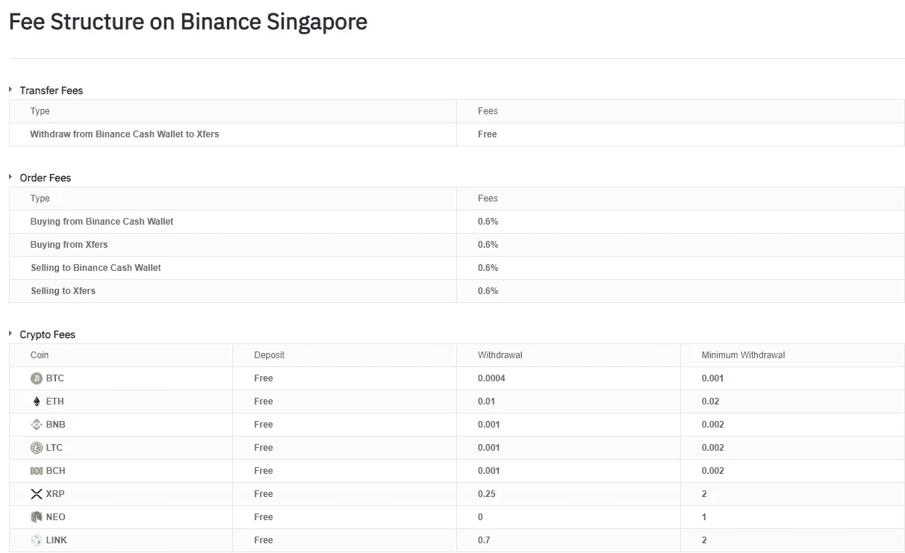

Fee Structure on Binance.sg (image on [https://www.binance.sg/en/fees](https://www.binance.sg/en/fees))

**在 Binance.sg** 上，收费很清楚。与 Xfers 之间不收取存款或取款费用，与加密货币相关的交易费和转账费为 0.6%。这就是为什么比特币转账很贵。如图所示，当前汇率为 0.0004 比特币* 68，899.73 新币= 27.56 新币。

因此，不要让较低的小数点欺骗了你。

我上面说的那篇文章，建议用 LTC 转账到你的 binance.com 账户，因为提款率是 0.001 * 304.89 新币= 0.30 美元。LTC 可能是一个更好的解决方案，但不要忘记购买任何硬币的 0.6%的费用。

## Binance.com

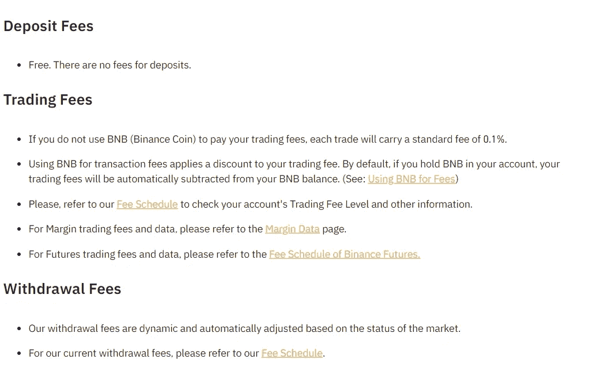

Fees on Binance.com (image on [binance.com/en/support/articles/115000429332-Fee-Structure-on-Binance](https://www.binance.com/en/support/articles/115000429332-Fee-Structure-on-Binance))

## 提款费用(续)

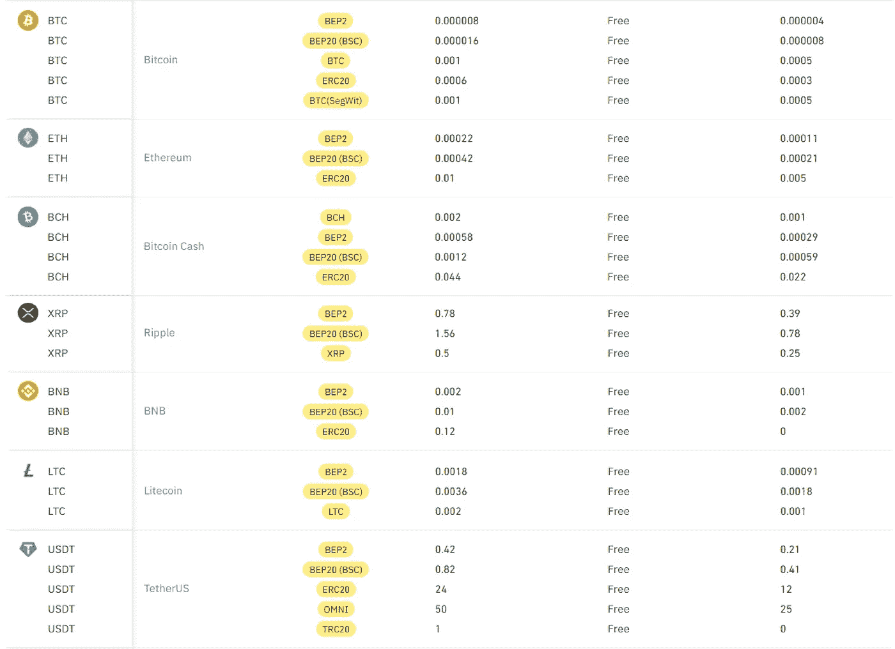

Deposit and Withdrawal Fees (Image on [https://www.binance.com/en/fee/depositFee](https://www.binance.com/en/fee/depositFee))

**在 Binance.com，**我们对任何硬币都有免费存款和 0.1%的标准交易费，但是，如果你使用币安硬币，交易费有 25%的折扣，这意味着你将为任何硬币支付 0.75%的费用。
点击[此处](https://www.binance.com/en/fee/depositFee)查看完整的费用列表。

**总结**:如果你对比一下 Binance.sg 和 Binance.sg 的价格，你会发现 Binance.sg 的交易和提现费用更便宜。

点击[此处](https://www.binance.com/en/fee/depositFee)查看所有 Binance.com 提款价格。

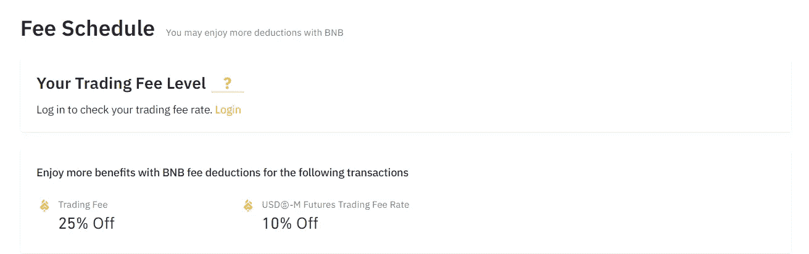

Fee schedule (image on [https://www.binance.com/en/fee/schedule](https://www.binance.com/en/fee/schedule))

实际上有一个基于交易硬币数量的 VIP 等级系统，这被称为费用表。然而，由于第一层是> 50 BTC，我将假设我们大多数人将在 25%的最低层。

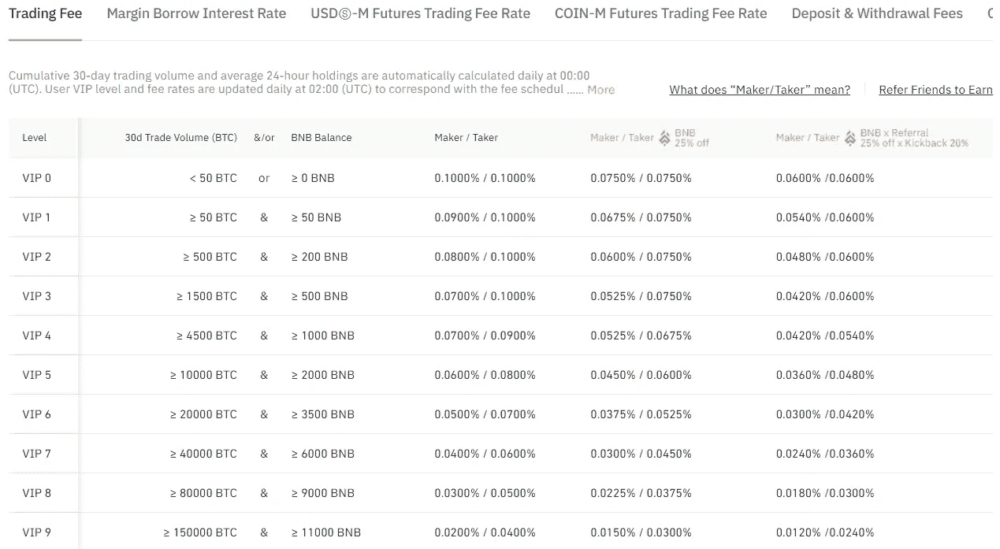

Fee schedule (image on [https://www.binance.com/en/fee/schedule](https://www.binance.com/en/fee/schedule))

# 更少的山寨币？

Altcoins 是比特币之后创造的任何加密货币。

就交易量而言，Binance.com 是世界上最大的加密货币交易所，旗下拥有无数加密货币。

## Binance.com

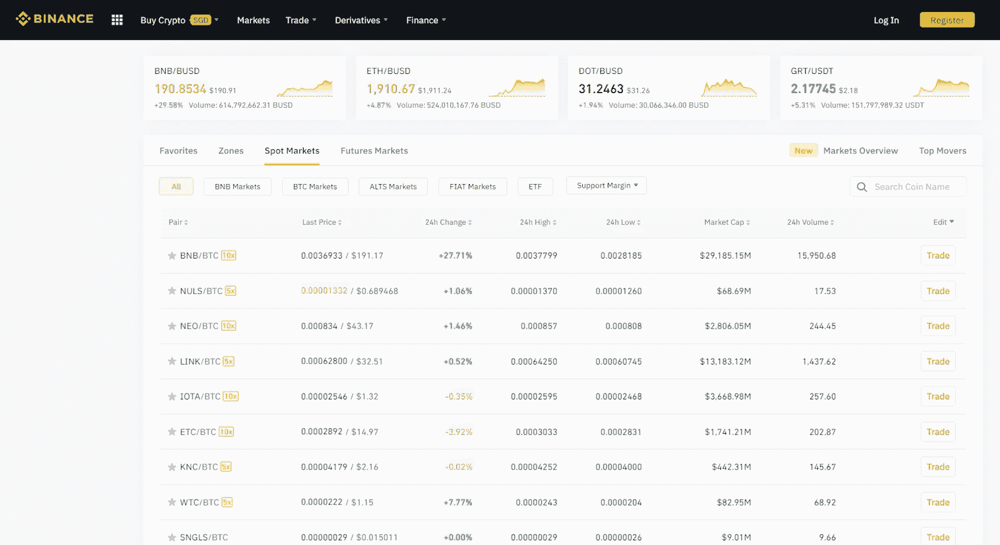

Spots on Binance.com market (image on [https://www.binance.com/en/markets](https://www.binance.com/en/markets))

## Binance.sg

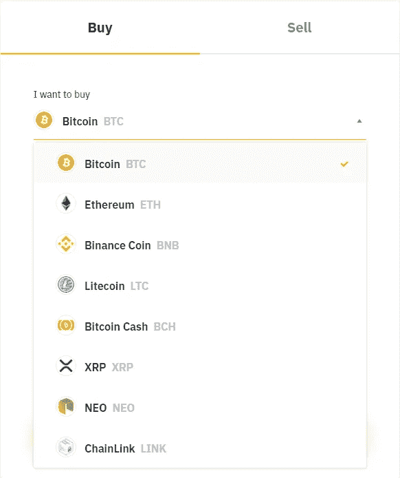

Coins on Binance.sg (image on [https://www.binance.sg/en](https://www.binance.sg/en))

与 Binance.sg 相比，Binance.sg 的可用替代硬币可能会相形见绌，但是，看看可用加密货币的列表，就会看到交易量最大的几个硬币，如 BTC、瑞士联邦理工学院、LTC、XRP。

Binance.com**有 100 多个不同的硬币，而 Binance.sg 有 8 个。**

****Binance.com**在**提供的山寨币**方面是明显的赢家。**

# **图表和订单类型？**

## **Binance.com**

## **皈依者**

**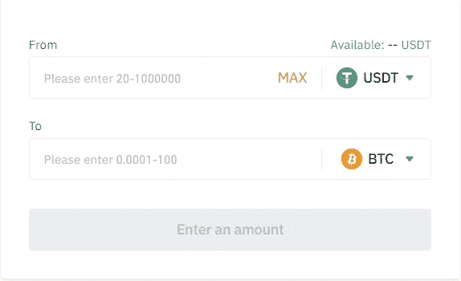**

**Convert mode (Image on [https://www.binance.com/en/convert](https://www.binance.com/en/convert))**

## **基本布局**

**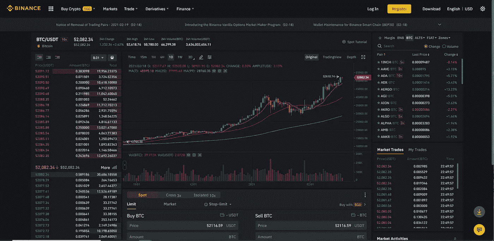**

**Basic layout mode (Image on [https://www.binance.com/en/trade/BTC_USDT?layout=basic](https://www.binance.com/en/trade/BTC_USDT?layout=basic))**

## **专业布局**

**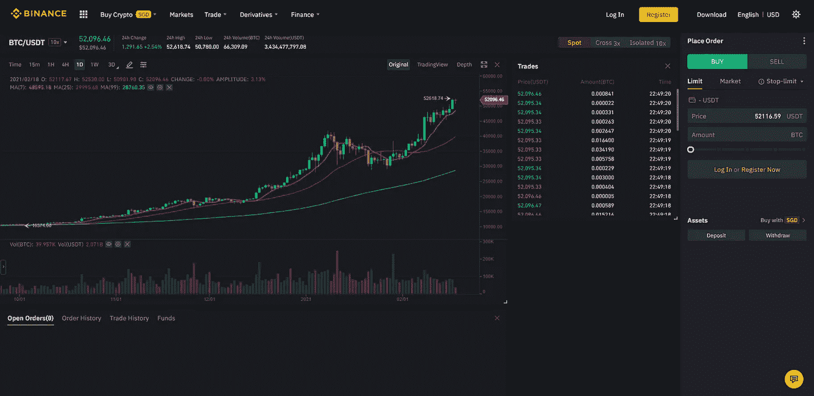**

**Pro Layout mode (Image on [https://www.binance.com/en/trade/BTC_USDT?layout=pro](https://www.binance.com/en/trade/BTC_USDT?layout=pro))**

## **Binance.sg**

****

**Buy and Sell on Binance.sg (Image on [https://www.binance.sg/en/trade](https://www.binance.sg/en/trade))**

****Binance.sg** ，只有一个买卖页面，而**Binance.com**有一个简单交易的转换模式，类似于 Binance.sg 的，它允许你预览 5s 的转换，而 Binance.sg 允许一整分钟的转换。这可能有助于监控市场变化。**

**注意: **Binance.sg** 通过按下“Max”按钮或键入新值，你可以刷新页面的最大次数，如果你在短时间内刷新了大约 10-15 次，它将迫使你等待整整一分钟来刷新价格。因此，**不要垃圾邮件**的刷新按钮！**

**只有购买和出售是 Binance.sg 最令人失望的部分，因为缺乏图表，订购类型和比特币的转换严重限制了 Binance.sg 的用户。我希望未来的更新可以让 Binance.sg 成为一个更可行的现货加密货币交易所。**

**【Binance.com 的**在**交易资源**方面明显是赢家。****

# **结论**

**我喜欢这两个平台，因为它们迎合了我的不同需求。然而，我更倾向于用 Binance.com，他更熟悉看图表。此外，不同的移动和桌面应用程序更方便，真正增加了体验。**

**我希望看到更多对 Binance.sg 的更新，至少有和 Binance.sg 一样的制图功能。然而，由于新加坡实施的严格限制，Binance.sg 似乎对大型游戏投资者没有吸引力。**

**我希望这个指南对你有用，因为看 binance.com 对我来说是一次令人畏惧和困惑的经历。**

**有关[Binance.com 产品](/binance-for-the-lazy-d74016bf7fd9)的更多信息。交易愉快！**

****引荐在此快速参考:** (10%回扣)binance . com:[https://www.binance.cc/en/register?ref=ZLPPE0WW](https://www.binance.me/en/register?ref=ZLPPE0WW)
binance . SG:[https://www.binance.sg/en/register?ref=35002741](https://www.binance.sg/en/register?ref=35002741)**

**想支持我就去看看吧！**

** [## 加入 Medium 支持我！

### 作为一个媒体会员，你的会员费的一部分会给你阅读的作家，你可以完全接触到每一个故事…

cawin-chan.medium.com](https://cawin-chan.medium.com/membership)  [## 夏季优惠:72 折购买 NordVPN 的 2 年计划！NordVPN

### 抓住交易 30 天退款保证在一个帐户下获得我们最好的安全工具和功能。你的安全感…

go.nordvpn.net](https://go.nordvpn.net/aff_c?offer_id=15&aff_id=55242&url_id=902) 

**相关文章—**

 [## 币安概述

### 轻松游览币安的小贴士和技巧

medium.datadriveninvestor.com](/binance-for-the-lazy-d74016bf7fd9) 

**参考资料:** [坦克劳迪亚的文章](http://tanclaudia.medium.com/how-to-transfer-money-from-binance-sg-to-binance-international-5c8c6e4ee136)
[星展外汇页面](https://www.dbs.com.sg/personal/rates-online/foreign-currency-foreign-exchange.page)
[Sgcryto:将星展汇往币安](https://www.sgcrypto.info/2020/12/29/dbs-binance/)
[Binance.sg 费用](https://www.binance.sg/en/fees)
[Binance.com 费用](http://binance.com/en/support/articles/115000429332-Fee-Structure-on-Binance)
P2P 视频—[youtube.com/watch?v=LfTYugR00tI&ab _ channel =币安](https://www.youtube.com/watch?v=LfTYugR00tI&ab_channel=Binance)
Binance 地址—[sgpbusiness.com/company/Binance-Asia-Services-Pte-Ltd](https://www.sgpbusiness.com/company/Binance-Asia-Services-Pte-Ltd)
P2P 常见问题**