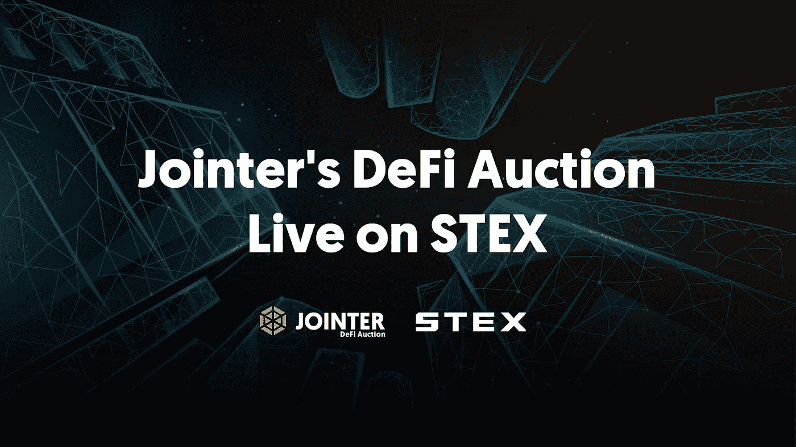
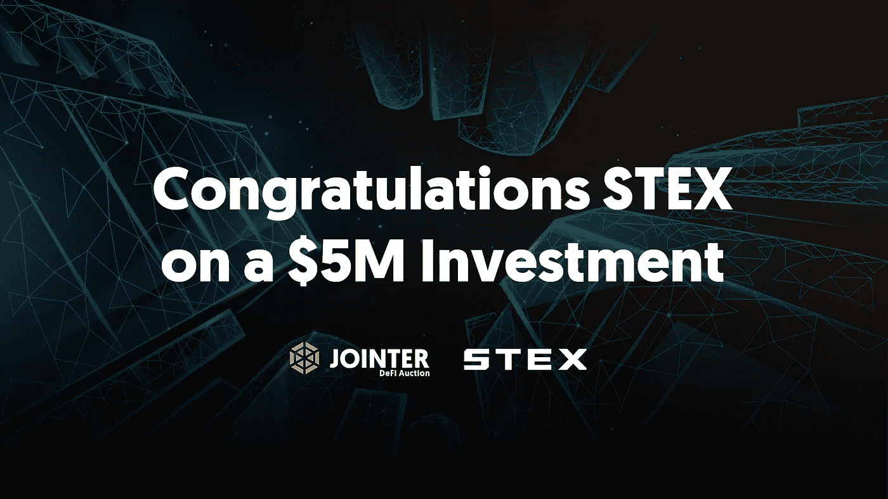
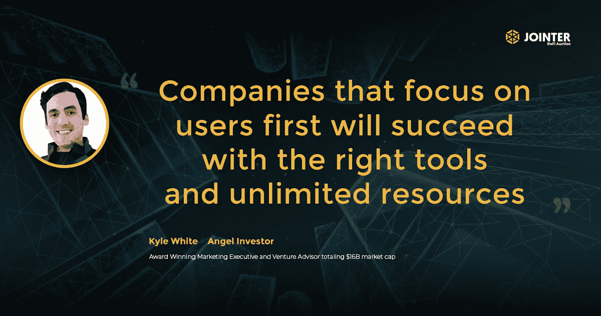

# 币安智能链项目向 STEX 交易所投资 500 万美元

> 原文：<https://medium.datadriveninvestor.com/binance-smart-chain-project-invests-5m-in-stex-exchange-dedc4d6a0380?source=collection_archive---------22----------------------->

**全球首个商业地产 DeFi 拍卖会将在 STEX 举行并获得支持**

[Jointer](https://www.jointer.io/) ，商业房地产投资和辛迪加的未来，宣布将向 STEX 投资 500 万美元，该交易所是受监管的爱沙尼亚交易所，由菲亚特控股，100%的投资者将资金存入 SAFU，估值为 1 亿美元。此次战略投资将从 2020 年 10 月 27 日开始增加一个新的一级发行选项以及二级交易。

Jointer 是卡耐基梅隆大学美中创新与创业协会最具潜力企业奖的获得者，在通过每日 DeFi 拍卖成功增长两个月后，宣布在 STEX 的投资。自推出以来，JNTR 令牌增长了 44.84 倍，价格从未下跌，这表明智能合约构建的金融工程正在发挥作用。

这项投资为 STEX 提供了进一步扩展其产品和服务的机会，包括分散金融(DeFi)dapp，重点关注安全性、社区和提供最佳用户体验。战略投资包括两个核心主题:

*   提供扩展:Jointer 将授权 STEX 通过资本和技术投资和发展来扩展产品。Jointer 将把他们的日常拍卖带给 STEX 的 30 万活跃用户，这将提供 JNTR 旗舰流动性桥梁的主要访问权。通过拍卖购买的好处包括 90%的下行保护和 JNTR 投资者的日常博弈理论激励。
*   参与拍卖允许用户下注他们的 JNTR，赚取额外的 52% APY。
*   社区扩张:Jointer 和 STEX 都专注于社区第一，花了数年时间开发面向他们服务的用户社区。通过采取服务第一的方法，Jointer 和 STEX 社区的结合将创建一个跨越所有网络和几乎全世界每个国家的超过 750，000 强的纽带。

在 jointer.stex.com 现场拍卖

STEX 首席执行官 VK 讨论了成功的估值和资本注入，

“用户希望我们提供最新的解决方案，让他们的加密资产为他们服务。当然，他们总是希望我们确保这些解决方案是真实和安全的。将这两种需求结合在一起是目前正在发生的事情。”

自 2018 年更名以来，STEX 交易所一直在持续增长。他们在欧盟范围内获得了提供虚拟货币服务的许可，并获得了 FINCEN 的批准。

Jointer 天使投资人凯尔·怀特(Kyle White)在分析了 Jointer 和 STEX 的社区和资源之间的协同作用后，主导了两家公司之间的融资谈判。他回忆起一月份这个过程的开始时说，

“当我第一次偶然发现 STEX 时，他们专注于为用户提供出色而安全的体验，这一点很明显。以用户为中心的公司将会凭借合适的工具和无限的资源获得成功。幸运的是，对于我们和加密社区来说，STEX 几年来一直在做正确的事情，他们正处于资本和资源可以为他们带来指数增长的阶段。”

Jointer 的拍卖将继续每日动态提供，STEX 用户可以直接从他们的钱包参与。每一天都有一个目标和尽可能多的贡献。通过为拍卖的每一天设定目标，Jointer 能够为投资者提供额外的激励，通过双重奖金结构超越每日目标，允许大投资者和小投资者都有机会从每日成功中受益，一个奖金作为团队解锁，一个作为个人解锁。因为也有一个捐款的最高限额，投资者必须在当天的供应量卖出之前迅速行动。

一旦拍卖达到 100%以上，团体奖金允许每个人从更大的 JNTR 折扣中受益。个人奖金通过提供激励每日领先投资者的乘数，使该轮的大贡献者受益。奖金不设上限，但不能超过 150%的每日供款上限，因此在每日供应有限的情况下，鼓励投资者尽早参与。

拍卖中的投资包括 90%的下跌保护，允许投资者将资本风险降至最低，同时仍能从任何潜在的上涨中受益。下行保护合约将智能合约中 90%的投资和代币锁定一年。一年后，90%的投资将自动发放给合资者，资产将发放给投资者。在年底前的任何时候，投资者可以选择放弃保护或取消投资，并收回 90%的投资

“我们很高兴能够进一步分享我们简化所有人的房地产投资和银团贷款的愿景。Jointer 的首席执行官 Jude Regev Jointer 说:“这是将 Jointer 推向更广泛市场的一步，Jointer 准备永远改变分散的金融和商业房地产收购。对于用户来说，大规模采用需要如此简单。”

现在，投资者可以访问 STEX，并直接从他们的 STEX 钱包参与到世界上第一个商业房地产 DeFi 岛。

欲了解更多信息，请访问 [Jointer 网站](https://jointer.io/)的现场拍卖

**关于接头人**

Jointer.io 是一个基于分散自治组织(DAO)的分散金融(DeFi)和房地产技术(PropTech ),在加州硅谷和以色列特拉维夫拥有超过 4000 亿美元市值的团队经验。Jointer 是一家屡获殊荣的公司，包括 2018 年在 4000 家创业公司和 196 个国家之间的全球竞争中获得 100 万美元的“世界最佳创业公司”奖，2019 年在斯坦福大学获得由谷歌、软银、贝恩资本、汤森路透、斯坦福天使、宝马、安德森、NEA 和其他顶级风险投资基金组成的小组颁发的破坏性创业奖，以及 Disruptor Daily“房地产区块链”Disruptor 奖的第一名，以及卡耐基梅隆大学最有前途的风险投资更多信息，请访问 [Jointer](https://www.jointer.io/) 。超正析象管

推特:【https://twitter.com/DeFiAuctions 

www.facebook.com/groups/jointer.io/[脸书](http://www.facebook.com/groups/jointer.io/)

领英:[https://www.linkedin.com/groups/79765/](https://www.linkedin.com/groups/79765/)

**关于 STEX**

STEX 在全球拥有超过 300，000 名用户，是一个强大的加密货币交易所，可以通过一个快速、便捷的平台以低竞争力的价格轻松购买、出售和投资数字货币。用户可以从 400 多个交易对中进行选择，用信用卡或银行卡购买密码，并在移动设备上轻刷几下就可以在菲亚特与密码或密码与菲亚特之间进行交易。STEX 成立于爱沙尼亚，符合欧盟对加密货币交易的所有规定。关于 STEX 及其合作伙伴的更多信息，

**访问:** 网站:[https://www.STEX.com](https://www.stex.com/)

推特:[https://twitter.com/StexExchangeR](https://twitter.com/StexExchangeR)

https://www.facebook.com/stex.exchanger/

insta gram:[https://www.instagram.com/stex.crypto/](https://www.instagram.com/stex.crypto/)

电报:【https://t.me/stexcomtg 