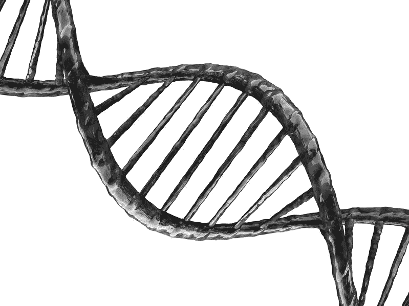

# 生物数据存储:未来的存储介质

> 原文：<https://medium.datadriveninvestor.com/biological-data-storage-the-storage-medium-of-the-future-62303add8028?source=collection_archive---------2----------------------->

## 世界第一:网飞系列成功储存在 DNA 中

Image licensed to author

技术与生物科学的融合并不是一个新现象；在最近的历史中，技术在推动生物科学的根本性突破方面发挥了举足轻重的作用，这样的例子不胜枚举。

我想到了三个显著的进步:

## [神经链接](https://neuralink.com/applications/)

这是特斯拉创始人埃隆·马斯克(Elon Musk)的心血结晶，是一种植入人类头骨并能与大脑沟通的生物医学设备。

> 我们技术的最初目标将是帮助瘫痪的人通过控制电脑和移动设备重新获得独立。NeuralLink.com
> T3

如果你没有看过，将 NeuralLink 设备插入猪体内的现场演示(他们向观众保证他们对这些动物的福利有多重要)，是一个迷人的，如果不是有点令人不安的观看。

## 磁共振成像(MRI)

发展于 20 世纪 70 年代末的核磁共振成像技术彻底改变了人体的内部图像。近年来，图像处理软件的进步将 MRI 推向了新的极限，包括对肺功能成像的能力(以前用 MRI 是不可能的)，产生更高分辨率的图像，以及减少扫描时间。

 [## 磁共振成像技术的新进展

### 磁共振成像(MRI)技术的最新进展是在软件方面，使更快的…

www.itnonline.com](https://www.itnonline.com/article/recent-advances-mri-technology) 

## 模拟蛋白质折叠

谷歌旗下的人工智能公司 DeepMind 因成为第一家开发出能够在古代棋盘游戏围棋中击败人类冠军的人工智能的公司而闻名。

现在，DeepMind 的一个代号为 **AlphaFold，**的部门正在开发突破性的人工智能，以解决模拟蛋白质折叠的复杂问题。

> 科学家们长期以来一直对确定蛋白质的结构感兴趣，因为蛋白质的形式被认为决定了它的功能。一旦了解了蛋白质的形状，就可以猜测它在细胞中的作用，科学家可以开发出利用蛋白质独特形状的药物。
> **Deepmind.com**

通过了解蛋白质折叠，研究人员可以了解复杂的生物系统，包括细胞、组织和有机体。

 [## AlphaFold:利用人工智能进行科学发现

### 在我们今天发表在《自然》杂志上的研究中，我们展示了人工智能研究如何推动和加速…

deepmind.com](https://deepmind.com/blog/article/AlphaFold-Using-AI-for-scientific-discovery) 

# 现在看来，是回报的时候了

投资者、未来学家、技术专家注意了:一个新的现象正在出现，我认为这标志着这种伙伴关系的根本性转变:

> 有史以来第一次，生物科学正在帮助技术本身进步。

怎么会？在一个有点意想不到的地方；数据存储。

## 使用 DNA 的生物数据存储

这个迅速发展的技术领域引人注目地被称为“物的 DNA(DoT)”，它使用 DNA 序列来保存数据。DNA 的潜在存储密度比当前的主流存储介质(如固态驱动器)大几个数量级。

## 网飞在你口袋里

1**兆字节** (1MB)是你应该习惯于在你电脑上的日常文件中看到的数据量。

一 **Petabyte** (1PB) 就是十亿兆。

从某种意义上来说，据估计整个网飞目录目前大约有 90pb。

现在，想象一下，如果你可以随身携带网飞目录，比如安装在你的智能手机上。交通部正在使这成为现实。

正如这篇哈佛论文所指出的，DNA 的理论最大数据存储量是每克 455 艾字节。

一**千兆字节**等于**1000 千兆字节**。所以…

**1g**的 DNA 存储(理论上)可以存储**5055 部 Netflix**。哇哦。

## 将网飞季节储存在 DNA 中

这可能不是整个网飞的备份目录，但今年 8 月的这条推文标志着 DNA 存储进化的一个重要里程碑:

没错，网飞剧集《生物黑客》中的一集，通过 DNA 链序列被存储和回忆。

# 为什么生物储存是更好的选择

总之归结为两个因素:**存储密度**和**耐久性**。

从这份 [ETH 官方新闻稿](https://www.businesswire.com/news/home/20200820005290/en/)中，Emily M. Leproust 博士(Twist Biosciences 首席执行官兼联合创始人)解释道:

> “DNA 是一种令人难以置信的分子，就其本质而言，它可以提供数千年的超高密度存储。事实上，人体所有细胞中包含的 DNA 可以存储 21 世纪迄今为止创作的所有电影 30 亿次以上。事实上，这说明了将生物学和技术结合在一起创造合成(惰性)DNA 的魔力。”

## 对未来的洞察(嗯，从 2002 年到现在)

为了进一步帮助读者理解我所说的密度，让我回忆一下 2002 年我攻读计算机科学学位期间的一次演讲。事情是这样的:

> “今天的数据存储，通常是物理硬盘驱动器，使用存储在驱动器内的磁盘上的 0 和 1。一个重要的研究领域是生物储存；也就是说，使用生物材料来保存数据。
> 
> 研究人员估计，这种生物存储介质**的 **1Kg** 足以存储人类曾经书写、口头或以其他方式记录的所有信息。”**

## 存储预测，还是存储虚构？

我的大学讲师有多接近现实？

我们已经探索了理论上最大的 DNA 存储容量。 **455** **每克兆字节**。

因此，1 千克 DNA 可以存储 455，000 艾字节，相当于:

**每千克 455 兆字节**

为了客观地看待这个数字，全球最大的存储制造商之一希捷科技(Seagate Technology)预测:

> “全球数据空间将从 2019 年的 45 兆字节增长到 2025 年的 175 兆字节。”

哇，也许我的大学讲师终究是对的。

## DNA 储存的持久性

除了密度，作为存储介质的第二个优势是其耐用性。我必须承认，当我想到 DNA 是“脆弱的”时，我非常惊讶。但是如果你想想，科学家已经能够从化石中提取完整的 DNA，可以追溯到几百万年前。我无法想象埋在海底的固态硬盘也是如此。

另一件要注意的事情是，现代固态硬盘只有 10 年或更短的有限寿命；事实上，多伦多大学对谷歌数据中心进行的一项为期 6 年的研究发现，固态硬盘的使用寿命甚至比这还要短。

# DNA 储存的投资者

这可能不足为奇，但微软大力支持这项新兴技术。虽然他们的技术似乎稍微落后于 ETH(基于成功存储和调用的数据量)，但正如本新闻稿所示，他们正在继续投资开发。

## 微软新闻稿，2019 年 3 月 21 日

 [## 微软、UW 首次展示全自动 DNA 数据存储

### 来自微软和华盛顿大学的研究人员展示了第一个全自动系统来存储…

news.microsoft.com](https://news.microsoft.com/innovation-stories/hello-data-dna-storage/) 

> 来自微软和华盛顿大学的研究人员展示了第一个全自动系统，用于存储和检索人造 DNA 中的数据——这是将该技术从研究实验室转移到商业数据中心的关键一步。
> 
> DNA 可以在比数据中心今天使用的空间小几个数量级的空间中存储数字信息。这是一个很有前途的解决方案，用于存储世界上每天产生的爆炸式增长的数据，从商业记录和可爱的动物视频到医学扫描和来自外太空的图像。

在这篇新闻稿中，他们还尝试并量化了这种存储介质的潜力:

> [DNA 储存]..可以将目前存储在仓库大小的数据中心中的所有信息放入大约一个棋盘游戏骰子大小的空间中。

# DoT 的下一步是什么？

研究仍在继续。2020 年 6 月，北卡罗来纳州立大学的这篇研究论文已经勾勒出了一个

> "..DNA 数据存储系统的全新方法，使用户能够在不破坏数据文件的情况下读取或修改数据文件，并使系统更容易扩大到实际应用。”

 [## DNA 数据存储的新方法使系统更加动态、可扩展

### 北卡罗来纳州立大学的研究人员开发了一种全新的 DNA 数据存储方法…

www.sciencedaily.com](https://www.sciencedaily.com/releases/2020/06/200612111427.htm) 

然而，研究人员仍然需要突破一些障碍。一个是读/写操作的成本限制:大约每 MB 数据写 3500 美元，读它 1000 美元。另一个是这些读/写操作比传统媒体慢(来源于 [DNA 作为数字信息存储设备:希望还是炒作](https://www.ncbi.nlm.nih.gov/pmc/articles/PMC5935598/)？).

这项技术多久会成为主流还不得而知。但是以我们的数据产量增长的速度来看，最好是越快越好。