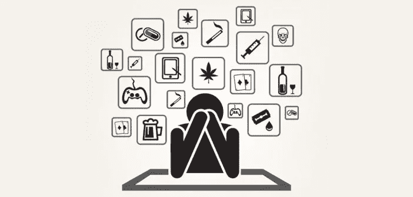

# 成瘾生物学

> 原文：<https://medium.datadriveninvestor.com/biology-of-addiction-4b2ed616527?source=collection_archive---------9----------------------->

> "上瘾始于希望“外面”的东西能立刻填补内心的空虚。"让·基尔伯恩(公共演讲人)

你开始做某件事完全是出于好奇或作为一种探索行为。最初，你开始使用的物质或你进行的活动或你开始亲近的人给了你一些快乐。从事其中任何一项后，你都会有一种非常好的感觉。它们开始经常出现在你的脑海中。你开始更多地考虑你从他们那里得到的感觉。后来，同样剂量的物质或同样持续时间的活动或与人相处的同样时间都不足以给人这种感觉。你需要更多，才能从中获得更多。最后，你开始到达一个点，似乎不可能从你的生活中去掉那个物质或活动或人。所有人类都会以这样或那样的方式到达这一点。让我们检查一下这是什么。

# **奖励系统**

我们的大脑有一个奖励系统，激励我们去做对自己有益的事情。当有人玩他们最喜欢的运动，或当有人开始一个他们渴望开始的新项目，当有人吃了一顿美味和令人满意的菜，或有人喜欢在完成这些锻炼后锻炼，他们会有一种良好的感觉。他们被鼓励多做这项活动。我们的大脑希望我们更多地做自己喜欢的事情，而不只是坐着。因此，每当我们发现一个爱好或一件我们喜欢做的事情，大脑就会把它视为我们生活的一部分，激励我们生活下去。大脑试图给我们一种活动，让我们保持参与和动力。猜猜如果有人什么都不做或者对什么都不感兴趣会发生什么。这个人没有活下去的动力，在一些极端的情况下，这些人会考虑结束生命。一些问题出现在他们的脑海中，比如“我为什么活着”，“我为什么要活着”，“我应该为谁活着”。正如你所知，我们的大脑是为了生存而生的，它希望我们继续活着。每当它发现任何吸引我们或让我们感兴趣的事情，当我们一次又一次地做这些事情时，它就开始用良好的感觉来奖励我们。此外，它鼓励我们更经常、更多地做这件事。让我们看看它是如何奖励的。

# **多巴胺**

多巴胺是一种激素，也是一种神经递质。当多巴胺释放时，我们会有一种特别的、兴奋的感觉，或者我们所说的兴奋感。多巴胺负责让我们兴奋。当我们做我们喜欢的事情时，我们的大脑发现这是一种让我们对生活保持兴趣的活动，并产生多巴胺。当多巴胺释放时，我们会有好的感觉或者兴奋。后来，当我们想到这种特殊活动后的良好感觉时，多巴胺就会释放出来。当我们期待奖赏时，多巴胺开始释放。这鼓励我们为了获得那种特殊的感觉而去做这个活动。活动结束后，我们会得到奖励。然后再后来，当你习惯了这种活动，多巴胺停止释放。我们的大脑不仅想让我们保持动力，还想让我们有创造力，想让我们探索，想让我们探索。所以它没有开始奖励日常工作。当我们做那些几乎没有不确定性的活动时，或者当我们在那些特定的活动中带来微小的变化时，它会给我们带来回报。这可能会持续更长的时间，或者以更高的强度，或者以不同的方式。通过这种方式，我们开始以更长的时间、更高的强度或不同的方式进行特定的活动。现在…这样不好吗？

 [## 导致颠覆性趋势的客户行为|数据驱动的投资者

### 随着世界从第四次工业革命中获益，颠覆性技术也在演变成…

www.datadriveninvestor.com](https://www.datadriveninvestor.com/2020/09/04/customer-behavior-leading-to-disruptive-trends/) 

# **激情**

当我们做的活动是积极的，对我们有益的，而不是伤害我们或具有破坏性的，当我们被奖励系统鼓励去做更多的事情时，这是好的。当我们做我们喜欢的事情，并因此获得良好的感觉，并且这件事情是好的，对我们有益，不会伤害或摧毁我们，我们把这件事情称为我们的激情。这是人类文明的原因，也是人类取得各种成就的原因:科学发现、先进技术、创新等等。没有多巴胺和奖励系统，就没有激情，没有激情，所有这些文明和成就都不会实现。

# **景点**

我们也可以对一个人充满热情。当我们开始对一个人产生激情时，我们称之为吸引力。我们的大脑会奖励我们和这个人一起度过的时间或做的活动。多巴胺和奖励系统也负责吸引和爱，从而确保人类物种的生存。因为吸引力是对一个人充满热情，这可能有利于我们建立良好的关系，所以吸引力也是好的。现在我们明白了多巴胺和奖赏系统不仅对我们有益，而且是必要的。那么，它们什么时候开始变坏？

# **上瘾**

根据美国精神病学协会的说法，成瘾是一种复杂的情况，是一种大脑疾病，表现为强迫性物质使用，尽管后果有害。

当我们做我们喜欢的事情，这件事可能对我们有益，也可能无益，但它会更多地伤害或摧毁我们，当我们的奖励系统鼓励我们越来越多地做这些有害的活动，这就是上瘾。我们可能在某个时候意识到这种行为正在伤害我们，但是我们无法摆脱它。令人上瘾的活动实际上劫持了我们的大脑，让我们相信这种特定的活动对我们有好处。因此，即使我们意识到它是有害的，我们的大脑也认为它是有益的。它可以是无法控制的饮酒、吸毒、赌博、沉迷于电子游戏或任何对我们有害无益的事情。

赌博非常擅长让我们上瘾。因为你得到了金钱上的回报和身体本身的回报，而且因为它包含了很多关于未来的不确定性，不管钱是会损失还是会翻倍或三倍。我们开始想如果我赢了呢？这种预期导致我们进行更多的赌博，冒更大的风险。但当我们沉迷于赌博时，它会在经济上摧毁我们，即使我们意识到我们在输钱，我们的大脑也会鼓励我们进行更多的赌博，给我们带来希望，我们可能会赢，我们可能会夺回所有失去的东西。

# **老鼠研究**

[北卡罗来纳大学的](https://www.scientificamerican.com/article/rat-studies-elucidate-the/) [Paul Phillips](https://faculty.washington.edu/pemp/) 和他的同事进行了一项研究，他们在老鼠身上接上电极来记录多巴胺水平。[对可卡因上瘾的老鼠被引入并训练它们按下一个杠杆，通过手术过程中的设置将可卡因注射到老鼠体内](http://www.mind.ilstu.edu/curriculum/virtual_cocaine_lab/student_cocaine_dopamine_script.pdf)。他们发现，上瘾的老鼠在走向操纵杆时，多巴胺出现峰值。当老鼠接近控制杆时，多巴胺水平下降，但当它们按下控制杆时，多巴胺水平再次上升。这项研究表明，在老鼠对可卡因上瘾后，只要想想这种活动就会让它们的多巴胺上升，它们就会被鼓励越来越多地这样做。这同样适用于人类和成瘾活动。

上瘾、激情和吸引都来自同一个过程，那就是身体的奖励系统。虽然激情和吸引力是好的，但上瘾是坏的，因为上瘾会越来越多地鼓励我们做有害的活动。

现在...为什么我们会选择上瘾的活动，而现在已经有更好的有益的活动可以诱导多巴胺。

(下周将继续)

# **参考文献**

1.  [https://www . scientific American . com/article/rat-studies-undifest-the/](https://www.scientificamerican.com/article/rat-studies-elucidate-the/)
2.  【https://faculty.washington.edu/pemp/ 
3.  [http://www . mind . ils tu . edu/curriculum/virtual _ cocaine _ lab/student _ cocaine _ dopamine _ script . pdf](http://www.mind.ilstu.edu/curriculum/virtual_cocaine_lab/student_cocaine_dopamine_script.pdf)

**访问专家视图—** [**订阅 DDI 英特尔**](https://datadriveninvestor.com/ddi-intel)