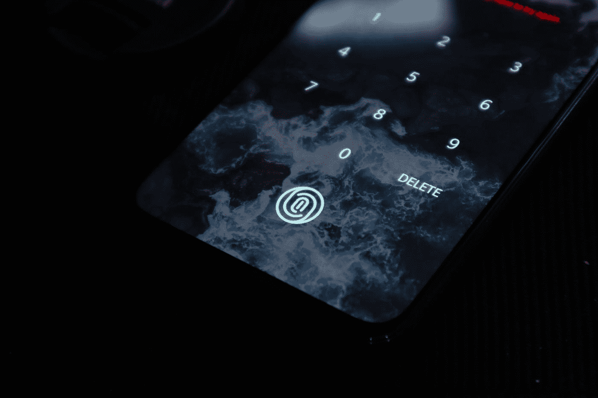
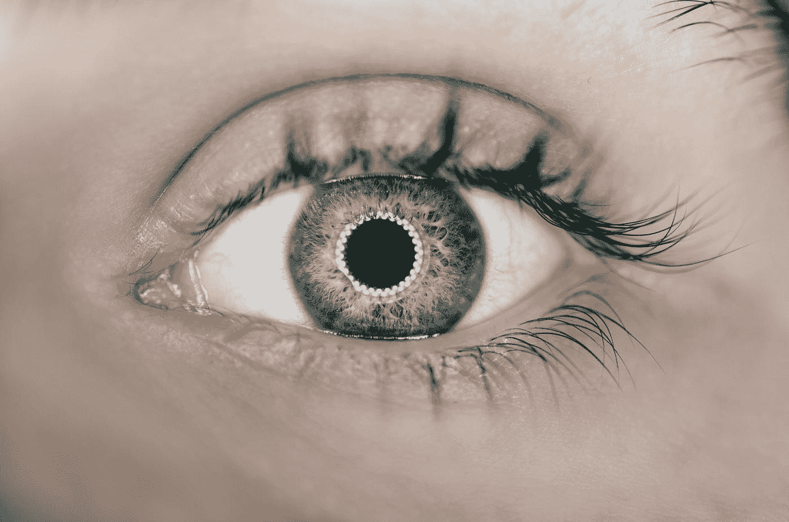
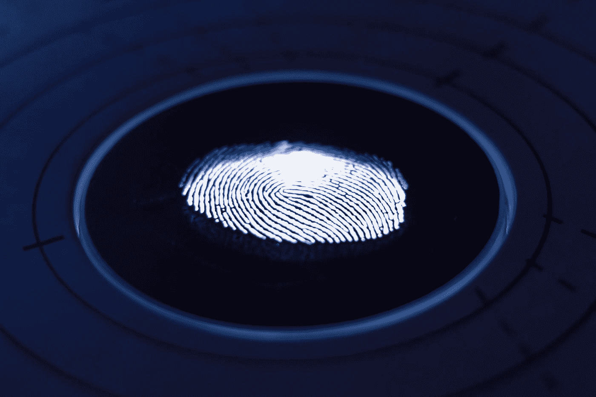

# 用于认证安全和隐私含义的生物测定学

> 原文：<https://medium.datadriveninvestor.com/biometrics-for-authentication-security-and-privacy-implications-5d59317ff18e?source=collection_archive---------5----------------------->

## 生物识别是一个不断发展的领域，生物识别系统越来越多地用于各种环境中。生物识别技术正在被引入，变得比传统形式的识别和认证更加安全、高效和可靠。

Photo by [Lukenn Sabellano](https://unsplash.com/@luferlex?utm_source=medium&utm_medium=referral) on [Unsplash](https://unsplash.com?utm_source=medium&utm_medium=referral)

这些生物特征数据对每个人来说都是独一无二的，因此与个人的身份密切相关。生物识别技术通过消除与忘记密码相关的问题和消除由被盗 pin 和密码引起的常见安全漏洞，有可能用于验证用户的身份和认证。然而，隐私可能会成为一个问题，尤其是在生物认证和身份管理系统的环境中。

生物识别是物理、行为和人类特征，可用于识别一个人的身份，以允许他们访问系统、设备或数据。这些标识符对每个人来说都是独一无二的，可以组合使用以确保更高的识别准确性。然而，一旦生物特征数据被收集和存储，这些信息就可以被第三方访问。还没有制定统一的标准来管理这些数据，但它们可能会引起隐私和安全问题。

Photo by [Arteum.ro](https://unsplash.com/@arteum?utm_source=medium&utm_medium=referral) on [Unsplash](https://unsplash.com?utm_source=medium&utm_medium=referral)

关键问题是生物认证技术引发的隐私和安全问题，以及如果生物数据遭到破坏，就没有办法挽回损失的事实。这个问题对于使用生物识别技术进行身份识别和刑事调查的政府机构有着重要的意义。如果你泄露了你的密码，只需更改它，但是如果你扫描了你的指纹、耳朵或虹膜，你就只能用它了。

如果您担心您的生物特征数据的安全性，您可以不提供这些数据。你可以改变你使用的生物特征，例如，不使用面部识别软件，而是使用安全模式。当您选择使用生物识别技术时，这不仅仅是关于安全性，也是关于对隐私的影响。

 [## 人们对隐私的不理解是什么？数据驱动的投资者

### 你知道那种感觉。无论是访问应用程序、订阅还是你最喜欢的运动鞋。你按下…

www.datadriveninvestor.com](https://www.datadriveninvestor.com/2019/04/11/privacy-and-convenience/) 

常识性的安全准则可能在保护您的隐私方面发挥作用，但不是唯一的。

一个方向是解决与生物认证相关的隐私问题，下面我们简要概述用于实现隐私保护认证的方法，并强调每种方法的主要优点和缺点。大多数现有的在认证中保护隐私的方法集中在存储和传输原始生物模板的修改版本，以避免损害数据库。

虽然生物散列提供了低错误率，同时保证了快速认证阶段，但是由于缺乏安全性和隐私性，它也容易受到多重攻击。

生物特征数据的静态性质使其容易受到基于身份的威胁，如身份盗窃和身份欺诈。生物识别技术捕捉一个单一的、独一无二的、永远不会被改变的身份，就像一个代码或一个加密密钥。通过访问生物特征数据，黑客可以轻松窃取某人的身份，并使用或操纵可能对他们的生活有害的私人信息。

与生物特征数据相关的安全问题集中在如何收集、存储、处理、传输和检索敏感信息。

一个隐私友好的原则是使用生物信息进行验证，而不是识别。一个人通过出示身份证件来声称自己的身份，当进行验证时，该声称用与存储在智能卡上的指纹图像相匹配的指纹图像来验证。这种私人生物统计系统的例子有指纹扫描仪、面部识别系统、视网膜 ID 卡或虹膜识别软件。

这需要识别新出现的生物特征样本以及先前记录和存储的样本。新获得的生物特征样本与先前记录或存储的样本相匹配。

尽管丢失或替换生物识别数据几乎是不可能的，但问题仍然是生物识别技术是否已经得到充分证明，并准备好在全球实施。

Photo by [George Prentzas](https://unsplash.com/@georgeprentzas?utm_source=medium&utm_medium=referral) on [Unsplash](https://unsplash.com?utm_source=medium&utm_medium=referral)

尽管快速发展的生物识别技术似乎提供了一种急需的身份识别和认证解决方案，但其使用引发了安全问题。这就给我们带来了一个问题，即已开发的生物识别系统是可以成为其自身认证系统的一部分，还是只能成为身份识别系统的一部分。指纹识别、面部和步态识别、视网膜和虹膜扫描、声音签名和手形生物识别等新技术的发展可能会对人类社会产生深远的影响。

正如在一些国家一样，生物识别技术现在被用来检查一个人是否是他或她所声称的那个人，发现未知人的身份，以及检查观察名单上的人。虽然生物识别是人类不可或缺的一部分，但他们感到越来越有必要取代传统的身份识别形式，如指纹、虹膜扫描。基于身体特征的人数正在快速增长，并被移动生物识别、多模式生物识别、基于云的生物识别、垂直专业生物识别、生物识别单点登录(SSO)技术和其他类型的认证系统的使用所取代。

## **引用来源**

*   [https://us . Norton . com/internet security-IOT-biometrics-how-do-they-work-they-safe . html](https://us.norton.com/internetsecurity-iot-biometrics-how-do-they-work-are-they-safe.html)
*   [https://www . csoonline . com/article/3339565/what-is biometrics-and-why-collecting-biometric-data-is-risky . html](https://www.csoonline.com/article/3339565/what-is-biometrics-and-why-collecting-biometric-data-is-risky.html)
*   [https://www . cpomagazine . com/data-privacy/the-fear-of-biometric-technology-in-todays-digital-world/](https://www.cpomagazine.com/data-privacy/the-fear-of-biometric-technology-in-todays-digital-world/)
*   [https://www . Forbes . com/sites/cognitive world/2019/03/09/hacking-our-identity-the-emerging-threats-from-biometric-technology/](https://www.forbes.com/sites/cognitiveworld/2019/03/09/hacking-our-identity-the-emerging-threats-from-biometric-technology/)
*   [https://www . dark reading . com/endpoint/biometrics-are-coming-and-so-are-security-concerns/a/d-id/1331536](https://www.darkreading.com/endpoint/biometrics-are-coming-and-so-are-security-concerns/a/d-id/1331536)
*   [https://www.hindawi.com/journals/scn/2017/7129505/](https://www.hindawi.com/journals/scn/2017/7129505/)
*   [https://www . priv . GC . ca/en/privacy-topics/health-genetic-and-other-body-information/GD _ bio _ 2011 02/](https://www.priv.gc.ca/en/privacy-topics/health-genetic-and-other-body-information/gd_bio_201102/)
*   [https://medium . com/var-city-uw/biometrics-ethical-implications-of-future-authentic ation-systems-b0ac 833 b 53 a 7](https://medium.com/var-city-uw/biometrics-ethical-implications-of-future-authentication-systems-b0ac833b53a7)

**访问专家视图—** [**订阅 DDI 英特尔**](https://datadriveninvestor.com/ddi-intel)