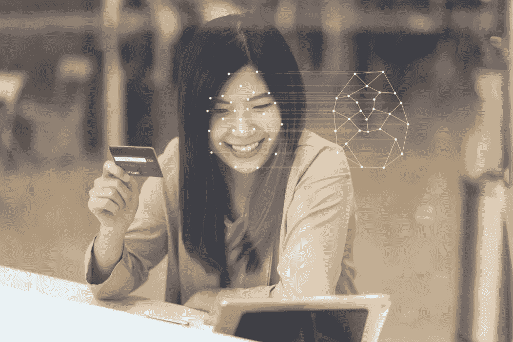

# 生物识别成功:通过面部活性检测提高安全性和用户体验

> 原文：<https://medium.datadriveninvestor.com/biometrics-success-improving-security-and-user-experience-with-facial-liveness-detection-20e8ee8bbbe6?source=collection_archive---------4----------------------->

多层次的企业，无论是小型、中型还是大型企业，都希望加强业务实践，从而为改善用户体验做出贡献。在漩涡中，平衡安全性和用户体验是一个挑战。由于数字世界容易遭受网络攻击和恶意在线活动，企业迫切需要考虑数字安全方法。值得注意的是，大多数网络犯罪都是由于对在线用户帐户的不加控制的访问而发生的。这些未经授权的实体从事可疑的活动和交易。这种欺诈活动表明，企业需要在线身份验证来打击不良行为者，并保持平台的合法性。

传统的用户身份验证机制不再持续，因为骗子已经找到了绕过这种身份验证方法的方法。欺诈者使用凭据填充和恶意可执行注入技术，接管用户帐户，窃取用户身份，并在线进行洗钱活动。生物认证是当今最常用的客户识别方法，它基于独特的生物特征(如指纹扫描、虹膜/视网膜扫描、面部识别和语音声学)实时识别和验证客户。

 [## 2019 年即将改变世界的技术|数据驱动的投资者

### 很难想象一项技术会像去年的区块链一样受到如此多的关注，但是……

www.datadriveninvestor.com](https://www.datadriveninvestor.com/2019/01/17/the-technologies-poised-to-change-the-world-in-2019/) 

在所有生物识别技术中，由于多种原因，面部特征已经成为最受欢迎的。[面部识别系统](https://shuftipro.com/face-verification)现已嵌入智能手机，为在线用户账户提供无处不在的可访问性，并使在线活动更加安全。带人脸验证的生物认证就像自拍一样简单。GooglePay 现在推出了面部识别功能，以确保安全的在线支付。

在注册账户时，一个人根据实时捕捉的面部特征进行注册，并存储在机密数据库中。为了进行每一笔交易，通过实时捕捉面部并将其与存储的信息进行匹配来验证面部生物特征。在数据库中，面部生物特征信息以数学等式/公式的形式存储。

# **面部识别系统面临的挑战**

随着面部识别技术的使用开始渗透到每个工业领域，欺诈者开始利用系统中的漏洞来绕过在线面部识别系统。一开始，面部识别系统能够成功地匹配面部特征，但无法区分现场拍摄的照片和上传的照片。欺诈者通过展示真人的打印或 PS 照片绕过系统，面部识别系统宣布该照片为授权用户。这些被称为欺骗攻击，使用模拟工具执行。这是面部识别系统面临的主要挑战，答案是活体检测。

## **常见的欺骗攻击**

以下是面部识别系统容易遭受的一些常见欺骗攻击:

*   **照片或视频攻击**

欺诈者通过谷歌搜索真人的照片来访问在线用户账户。利用这张照片，一个真实人物的在线社交媒体账户被黑了。

*   **深度伪造或合成视频**

欺诈者捕捉视频或照片，使用动画软件伪造它们，以这种方式编辑它们，以描绘一个正在点头的人的真实版本。

*   **三维模型/遮罩**

欺诈者创建人脸的 3D 模型，并模仿它们，使它们看起来像出现在在线面部识别系统中的真人。

# **活体检测——面部欺骗的终极解决方案**

技术世界正以更快的速度发展。使用人工智能技术和算法，生物识别系统变得越来越强大和有效，足以对抗欺诈技术。[活体检测](https://shuftipro.com/blogs/liveness-detection-apt-answer-facial-spoof-attacks)是面部识别系统中的一项特殊功能，可确保身份认证时个人的实际存在。在这个过程中，人的微小面部运动被识别。

## **执行活性检测的方法**

有两种执行面部活性检测的基本方法:

**主动活性检测**

这是目前可用的生物认证系统中采用的常用方法。在主动活体检测中，用户被要求移动头部、微笑或眨眼，以表明在验证时，它存在于那里。该系统将任务随机化，以避免欺诈者使用正在执行系统所要求的动作的用户的合成视频。人工智能技术对这些系统进行编程，使它们能够成功检测用户上传的图像或视频中的欺骗元素。

**被动活性检测**

在这种方法中，用户不需要额外的努力。在这种方法中，被动活性检测不要求用户执行某些动作或微小的移动，而是无形地验证用户，并且不提供任何可以帮助研究用户的动作以实时创建 AI 模型来检测是否存在一些欺骗元素的方法。

# **面部生物识别正在渗透到各个行业**

便利性和在线安全性的平衡——是在线行业面临的一个挑战。在线用户要求在网站上获得更好的用户友好体验。在线账户集成了用户认证方法，现在被面部识别形式的[生物认证系统](https://shuftipro.com/blogs/biometric-authentication)所取代。提供在线支付设施的企业现在正在利用基于人工智能技术的人脸识别来帮助打击对机密用户账户的未经授权的访问。此外，没有人可以忽视强大的人脸验证系统，它只需几秒钟就可以验证用户的面部。

据估计，到 2023 年，生物识别技术的渗透率将达到 111 亿美元。通过利用人工智能和机器学习等强大的技术，面部识别系统的方法的效率和安全性将不断提高。该系统将在面部识别过程中提供精确的结果。通过将生物认证系统与在线系统集成，可以确保银行业中的用户认证和 KYC 程序。