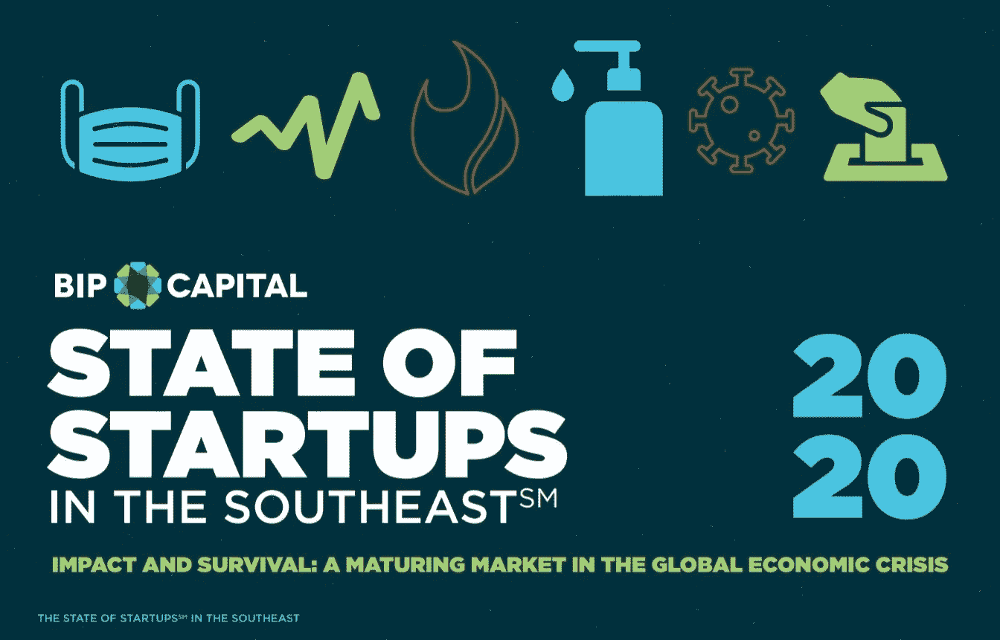

# BIP 资本在《东南报告》中发布 2020 年创业公司状况

> 原文：<https://medium.datadriveninvestor.com/bip-capital-releases-2020-the-state-of-startups-sm-in-the-southeast-report-a17439b101fc?source=collection_archive---------36----------------------->

# *第四份年度报告显示市场持续成熟；自 2015 年以来，东南部的初创公司获得了 345 亿美元的投资*

在这独特而充满挑战的一年的第四季度，我们很自豪能够提供我们的第四个年度****东南部创业公司(SM)电子书，该书概述了该地区的风险投资和创业生态系统。今年的报告深入研究了从 2015 年 1 月 1 日到 2020 年 6 月 30 日的五年半时间里美国东南部的创业活动。不出所料，该书主要关注全球新冠肺炎疫情如何影响东南部的创业投资市场。****

**虽然去年的报告发现，东南部的成熟率实际上超过了主要创新中心的成熟率，但我们想知道，鉴于疫情和 2020 年的经济，这种趋势是否会持续下去。**

** [## 创业公司的顾问？与他们合作的 4 种最佳方式|数据驱动型投资者

### 顾名思义，顾问能给你的建议对一个人来说是成功还是失败的关键

www.datadriveninvestor.com](https://www.datadriveninvestor.com/2020/09/27/advisors-in-your-startup-4-ways-to-best-work-with-them/) 

我们的研究揭示:尽管我们看到由于疫情，该地区在 3 月份的交易数量和部署的美元数量都出现了快速下滑，但我们目睹的同比大幅下降似乎已经开始复苏，并在 2020 年下半年恢复势头。基于这些发现，我们认为东南部的市场成熟是持久的，并已做好准备走出当前的危机。总体而言，一些人对好消息表示欢迎。

2020 年报告中其他值得注意的观察结果:

*   随着机构资本继续表现出对私募市场敞口的日益浓厚的兴趣，投资者已变得更加关注将更大的资金投入到一批更具管理性的公司中。
*   东南部之前已经筹集了一轮资金的公司现在获得了 71%的交易量(高于 2015 年的 64%左右)，随着疫情的持续，这一比例预计还会上升。
*   在过去几个季度中，后续投资者的参与速度加快，而同期初创公司首次投资者的数量急剧下降。

以下是各州的其他一些观察结果:

*   阿拉巴马州对医疗保健 IT 和 SaaS 的兴趣似乎越来越大，2019 年的投资额是 2018 年的四倍多。
*   金融科技超过 SaaS，成为佐治亚州最大的投资领域，仅 2019 年就投资了近 7 亿美元，比 2018 年增长了两倍多。
*   消费产品已经超越医疗保健 IT 成为南卡罗来纳州最活跃的行业，在五年内达成了 101 笔交易，总价值达 1.17 亿美元。2020 年，该行业已经完成了四笔交易，总价值为 1420 万美元。

毫无疑问，我们正处于一个不确定的时代。然而，东南部创业生态系统的成熟允许在面对逆境时做出坚定的反应。我们已经开始从疫情最糟糕的情况中复苏，尽管 2020 年的事件永远重塑了我们，但我们预计东南部的创业公司状况将继续改善。

我们邀请您阅读**东南地区初创公司(SM)状况**报告 [**此处**](https://www.bip-capital.com/the-state-of-startups-2020) 以更深入地挖掘这些数字，并阅读更多关于我们在未来几个月可能预期的显著趋势的信息。(例如，我们预计在 2020 年下半年到 2021 年，将会有极具吸引力的投资机会，尤其是在规模较小的几轮融资中。)一如既往，我们欢迎您的任何反馈或问题。

请把今年的报告告诉你的朋友和同事。我们对区域投资社区的了解和理解越多，我们就能更好地合作，巩固东南部作为全国风险资本投资中心的地位。

*本文原载于作者的* [*博客*](https://www.bip-capital.com/blog/2020/10/bip-capitals-2020-the-state-of-startupssm-in-the-southeast-ebook-is-here) *上，经允许转载。*

## 访问专家视图— [订阅 DDI 英特尔](https://datadriveninvestor.com/ddi-intel)**